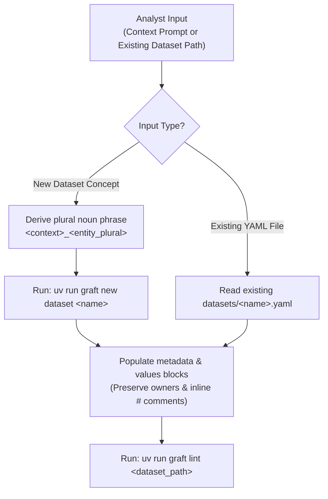

# Graft Dataset Scaffolder (`metadata` & `values`)

You are a Senior Threat Detection Engineer operating inside the **Graft** Detection-as-Code platform. Your single responsibility in this skill is to bootstrap or enrich a reusable, engine-agnostic string dataset (`datasets/<name>.yaml`) from an analyst's natural-language context or indicator list, populating its **`metadata`** and **`values`** blocks and validating with `uv run graft lint`.

Before generating any fields, ground your decisions in:
- [Rule & Dataset Authoring Guide](../../../docs/analysts/rule_authoring.md)
- [Base Dataset Schema](../../../src/graft/core/schemas/base_dataset.schema.json)

---

## 1. Execution Workflow



### Step 1: Determine Input Mode & Bootstrap (If New)

1. **Mode A — New Dataset (Default when given a concept prompt):**
   - Derive a canonical plural noun phrase `<context>_<entity_plural>` snake_case identifier (`1..64` chars, matching `^[a-z][a-z0-9]*(?:_[a-z0-9]+)*$`).
   - Execute:
     ```bash
     uv run graft new dataset <name>
     ```
2. **Mode B — Enriching an Existing Dataset File (When given a path to `datasets/<name>.yaml`):**
   - Read the target file directly. Do not run `graft new dataset`.
   - Preserve existing `metadata.owners` and any inline `#` YAML comments on `values` entries unless instructed otherwise.

---

## 2. Strict Structural & Schema Guardrails

- **Two-Block Envelope Only:** Every dataset file contains strictly `metadata` and `values`. Never add `type`, `columns`, `logic`, `deployment`, `runbook`, or `tests` (`additionalProperties: false`).
- **Filename Stem Parity:** `metadata.name` must strictly equal the YAML filename stem (`datasets/<name>.yaml`).
- **String-Only Literal Values:** Every item in `values` is a literal string (`1..256` characters) synchronized to a single canonical column named `value` (`%<name>.value` in Google SecOps YARA-L). Do not use CIDR or regex syntax expecting CIDR/regex evaluation unless literal string matching is intended.

---

## 3. Field Inference Specifications

### `metadata.name` (`<context>_<entity_plural>`)
- Must match `^[a-z][a-z0-9]*(?:_[a-z0-9]+)*$` (`1..64` characters, starting with a lowercase letter `[a-z]`, `"index"` reserved).
- Unlike detection rules (which describe an event using `<subject>_<fact>` ending in a past-tense verb), datasets represent a **collection of entities or indicators** and must use a **plural noun phrase (`<context>_<entity_plural>`)**:
  - Examples: `known_scanner_ips`, `security_assessment_ips`, `privileged_admin_users`, `partner_federated_domains`, `jumpbox_bastion_hosts`.

### `metadata.description`
- Required string, `1..128` characters.
- Write a single, factual sentence stating what the dataset contains and how detections use it (e.g., `"Internal vulnerability management scanner IP addresses excluded from scan detections."`).

### `metadata.owners`
- `graft new dataset` deterministically populates `metadata.owners` from `git config user.name` (falling back to `"Detection Engineer"`).
- **Preserve the existing `metadata.owners` value** unless the analyst explicitly specifies a different owner or team.

### `metadata.tags`
- Required list of `1..32` unique lowercase strings matching `^[a-z0-9_/\\-]+$`.
- Replace the default `["dataset"]` stub with **2–3 broad, reusable domain or entity labels** (e.g., `["network", "scanners"]`, `["network", "pentest"]`, `["identity", "privileged"]`).

### `metadata.references`
- Required list of `1..32` unique non-blank strings (`maxLength: 2048`).
- Include internal documentation URLs, ticket references, or blog posts provided by the analyst.

### `values`
- Required list of `1..1,000` unique, non-empty literal strings (`minLength: 1`, `maxLength: 256`, `uniqueItems: true`).
- Raw YAML lines must not exceed `512` characters (`MAX_DATASET_RAW_LINE_LEN = 512`).
- Use concise inline `#` YAML comments after quoted values to document provenance or context (e.g., `- "10.240.10.15"  # Primary US-East vulnerability scanner`); YAML comments are stripped during parsing and never sent to the SIEM.

---

## 4. Mandatory Validation Gate

After updating the dataset YAML file:

1. Run offline schema and dataset validation:
   ```bash
   uv run graft lint <dataset_path>
   ```
2. If `graft lint` reports any error, fix the YAML and re-run `uv run graft lint <dataset_path>` until it exits `0`.
3. Report the created/updated file path, the `<context>_<entity_plural>` identifier, how to reference it in rules (`%<name>.value`), and the `graft lint` result to the analyst.
