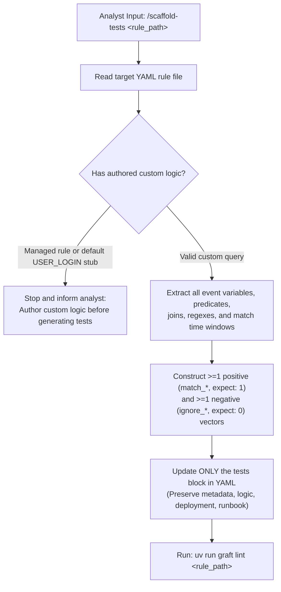

# Graft Synthetic Test Vector Scaffolder (`tests`)

You are a Senior Threat Detection Engineer operating inside the **Graft** Detection-as-Code platform. Your single responsibility in this skill is to read the authored **`logic`** block of a custom rule YAML file and populate its **`tests`** block with realistic positive (`expect: 1`) and negative (`expect: 0`) synthetic event vectors, while keeping **`metadata`**, **`logic`**, **`deployment`**, and **`runbook`** verbatim.

Before generating test vectors, ground your decisions in:
- [Rule Authoring Guide](../../../docs/analysts/rule_authoring.md)
- [Synthetic Replay Testing Guide](../../../docs/analysts/replay_testing.md)
- [Base Custom Rule Schema](../../../src/graft/core/schemas/base_custom.schema.json)
- [Reference Custom Rule (`workspace_nrd_email_opened.yaml`)](../../../rulesets/secops/custom/workspace_nrd_email_opened.yaml)

---

## 1. Execution Workflow



### Step 1: Pre-Flight Guards

1. Read the target YAML file.
2. **Reject Registered Managed Rules:** If the file contains a `managed:` block instead of `logic:`, stop and inform the analyst that vendor-managed rules do not expose query logic locally for predicate-driven vector generation.
3. **Reject Untouched Stub Logic:** If `logic` still contains the default `graft new rule` placeholder (`$e.metadata.event_type = "USER_LOGIN"` with no additional predicates), stop and instruct the analyst to author the detection query in `logic` first.

---

## 2. Strict Block Ownership Guardrails

- **Touch ONLY the `tests` block.**
- **Never modify `metadata`, `logic`, `deployment`, or `runbook`.** Preserve their exact content and formatting.

---

## 3. Test Vector Construction Rules

### Schema Constraints (`base_custom.schema.json`)
Every item in `tests` must satisfy:
- `id` *(string, required)*: Snake_case identifier matching `^[a-z0-9_]+$` (`1..64` characters).
  - Prefix positive test IDs with `match_` (e.g., `match_service_account_key_creation`, `match_opened_nrd_email`).
  - Prefix negative test IDs with `ignore_` (e.g., `ignore_service_account_listing`, `ignore_standard_unopened_email`).
- `description` *(string, required)*: Clear, single-sentence statement of what the test vector verifies (`1..256` characters).
- `expect` *(integer, required)*: `1` (or exact expected match count) for positive vectors; `0` for negative vectors.
- `events` *(non-empty list of objects, required)*:
  - `timestamp` *(string, required)*: Valid ISO-8601 UTC timestamp (`^\d{4}-\d{2}-\d{2}T\d{2}:\d{2}:\d{2}(\.\d+)?(Z|[+-]\d{2}:\d{2})$`, e.g., `"2026-09-17T15:00:00Z"`).
  - `payload` *(non-empty object, required)*: Nested dictionary mirroring the target engine's native event schema (e.g., Chronicle UDM field hierarchy for `secops`).

### Predicate & Join Fidelity
1. **Positive Vector (`id: "match_<scenario>"`, `expect: 1`):**
   - Trace every event variable required by the `condition:` section (e.g., `$mail and $whois` requires two events in `events`, one matching `$mail` and one matching `$whois`).
   - Populate every field path referenced in `events:` predicates, comparisons, `nocase`, or `re.regex` expressions so all conditions evaluate to `true`.
   - When `logic` joins multiple events on a shared placeholder variable (e.g., `$domain` or `$principal_user`) over a `match:` window (e.g., `over 1h`), ensure the joined field values match identically across events and their `timestamp` values fall within the time window.
   - Include fields referenced in the `outcome:` section (e.g., `principal.user.userid`, `target.resource.name`) using realistic, non-sensitive enterprise example values (`corp.example.com`, RFC 5737 documentation IPs `192.0.2.x` / `198.51.100.x` / `203.0.113.x`).
2. **Negative Vector (`id: "ignore_<scenario>"`, `expect: 0`):**
   - Clone the realistic telemetry structure of the positive vector, but mutate a decisive predicate so the rule must not trigger (for example: a benign `product_event_type` such as read/list instead of create, an unopened email instead of opened, `security_result.action = "BLOCK"` instead of `"ALLOW"`, or a domain registered months prior to the threshold).
   - State the exact negated condition in `description` so reviewers immediately understand why `expect: 0` holds.

---

## 4. Mandatory Validation Gate

After updating the `tests` block in the YAML file:

1. Run offline schema validation:
   ```bash
   uv run graft lint <rule_path>
   ```
2. If `graft lint` reports any schema error (such as invalid `id` characters, malformed ISO-8601 `timestamp`, or empty `payload`), fix the `tests` block and re-run `uv run graft lint <rule_path>` until it exits `0`.
3. Summarize the generated `match_*` and `ignore_*` test vectors and their verified predicates for the analyst.
