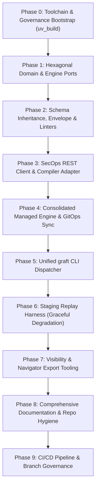

# GRAFT: Master Architectural Blueprint & Implementation Plan

> **Extensible Detection-as-Code Platform for Enterprise SecOps**  
> **Status:** Final Architectural Specification (Approved)  
> **Lead Architect:** Joe Lopes | **Target Engine:** Google SecOps (Chronicle) & Extensible SIEM Adapters  
> **Engineering Discipline:** Strict TDD, Hexagonal Architecture, Stdlib-First, Graceful Verification Gates

---

## 1. Executive Summary & Foundational Grounding

**Graft** is an enterprise-grade Detection-as-Code (DaC) platform engineered to treat threat detection engineering with the same rigor, determinism, and quality controls as mission-critical systems software.

Graft rejects common industry anti-patterns: fragmented detection logic stored directly in web consoles, untested query edits, rubber-stamp code reviews, and brittle, monolithic automation scripts. Instead, Graft establishes a clean Hexagonal (Ports & Adapters) architecture separating engine-agnostic domain logic from SIEM/EDR implementations, manages custom and vendor-managed rulesets under a unified GitOps lifecycle, and enforces automated verification gates—including schema validation, MITRE ATT&CK STIX alignment, pre-merge API dry runs, and staging replay testing against dedicated infrastructure.

### Grounding Literature & Core Theses
The design of Graft is directly grounded in nine foundational architectural works:
1. **Joe Lopes — *Detection-as-Code, Then What?***: Detection logic alone is not a rule; it is merely one component of a 5-block envelope (`metadata`, `logic`, `deployment`, `runbook`, `tests`). Schema validation must be decoupled from application code. Avoid data duplication by leveraging VCS for blame and timestamps. Co-locate incident response runbooks directly within detection artifacts. Value realization comes from operational visibility (CSV/Git blame catalogs) and ATT&CK coverage matrices, not raw rule counts.
2. **NVISO DaC Part 1 (Introduction & Lifecycle)**: Standardizes the detection engineering lifecycle into iterative software sprints: requirements, development, verification, deployment, monitoring, and tuning.
3. **NVISO DaC Part 2 (Repository Structure & Branching)**: Establishes a monorepo topology with strict directory separation between core tooling, rule envelopes, schemas, and fixtures. Enforces trunk-based development with short-lived feature branches.
4. **NVISO DaC Part 3 (Validation & Quality Gates)**: Defines a multi-tier testing pyramid: static schema validation, offline syntax checking, STIX taxonomy verification, and automated dynamic replay testing.
5. **NVISO DaC Part 4 (Documentation as Code)**: Treats operational documentation as a build artifact, automatically deriving threat coverage, triage playbooks, and compliance catalogs from declarative envelopes.
6. **NVISO DaC Part 5 (Versioning & Semantic Releases)**: Applies Semantic Versioning (SemVer) to rulesets, tracking breaking changes in logic/contracts (Major), new detections (Minor), and tuning/runbook adjustments (Patch).
7. **NVISO DaC Part 6 (CI/CD Deployment & State Management)**: Formulates state synchronization using GitOps plan/apply principles, eliminating manual out-of-band console drift.
8. **NVISO DaC Part 7 (Monitoring & Health Metrics)**: Closes the telemetry feedback loop post-deployment, tracking rule execution health, error rates, and alert volumes.
9. **NVISO DaC Part 8 (Tuning & Feedback Loops)**: Manages rule exclusions and threshold adjustments declaratively in code with structured review histories.

---

## 2. Core Architectural Decisions (Decision Matrix)

| Domain | Architectural Decision | Grounded Technical Rationale |
| :--- | :--- | :--- |
| **Packaging & Build** | Single package `src/` layout (`src/graft/{core,adapters,cli}`) built natively with **`uv_build`** via `uv` (`pyproject.toml`, `uv.lock`). `hatchling` is omitted. | `uv_build` is built directly into `uv`, eliminating third-party build-backend dependencies while maintaining standard PEP 517/621 compliance, editable installs, and console scripts. |
| **Python Target & Typing** | Target **Python >=3.13** with full static strictness (`mypy --strict`, zero untyped definitions, disallowing `Any`). Fully forwards-compatible with Python 3.14+. | Operates natively on workstation Python 3.13 without forcing auxiliary toolchain downloads, while remaining fully ready for Python 3.14 features. Strict typing catches nullability and structural bugs at compile time. |
| **Code Hygiene & Linters** | Ruff ruleset: `E, F, B, I, UP, S, RUF, SIM, T20`. Stray `print` calls banned in production source. Placed strictly in `[dependency-groups.dev]`. | Enforces clean CLI output (preserves structured JSON/stdout) and modern idioms. Zero runtime weight. |
| **Code Commenting** | **Strictly context-only.** Comments only added to explain *why*, non-obvious constraints, or security rationale. Obvious comments, dead code, and signature repetition banned. | Eliminates code noise, improves readability, and keeps source code tight and disciplined. |
| **Testing Conventions** | Strict TDD (Red-Green-Refactor). Partitioned test suites: `tests/unit/`, `tests/adapters/`, `tests/integration/` with `@pytest.mark.integration` and `@pytest.mark.replay`. | Local unit tests run in <1 second with 100% mock isolation. Live API calls require explicit opt-in (`--run-integration`). |
| **Architecture Pattern** | Hexagonal / Ports & Adapters. `src/graft/core/` is 100% engine-agnostic. Adapters (`src/graft/adapters/<engine>/`) carry the full burden of fetching, preparing, and transforming engine data for core. | Core remains completely decoupled from cloud SDKs, HTTP clients, and SIEM idiosyncrasies. New engines (Splunk, Elastic, Sentinel) plug in as discrete adapters. |
| **Interface Design** | Granular `typing.Protocol` ports (`RuleCompilerPort`, `RuleDeployerPort`, `ManagedEnginePort`, `ReplayHarnessPort`). | Adheres to Interface Segregation Principle (ISP). Core services consume only required capabilities without rigid base-class inheritance. |
| **Domain Modeling** | Standard library `@dataclass(frozen=True)` for domain entities in `src/graft/core/models/`. | Pure, lightweight, immutable, and zero external framework overhead in core. |
| **Schema Inheritance** | Base schema template (`schemas/base_rule.schema.json`) extended per engine (`schemas/secops_custom.schema.json`) via JSON Schema `$ref` and `allOf`. | Standardizes core blocks (`metadata`, `runbook`, `logic`) while allowing engine-specific variations for `deployment` and `tests`. Every YAML file in the repo has a dedicated schema. |
| **Repository Taxonomy** | Universal agnostic structure: `rulesets/<engine>/custom/` (organization-authored 5-block envelope rules), `rulesets/<engine>/managed.yaml` (vendor-managed content state), and `rulesets/<engine>/_archived/` (decommissioned rules). | Replaces vendor-specific jargon ("curated") or misleading terms ("default") with an enterprise standard applicable to SecOps, Splunk ESCU, and Elastic Prebuilt Rules. |
| **Managed State Format** | Single consolidated manifest (`rulesets/secops/managed.yaml`) capturing all Google Curated Rule Sets (`PRECISE` and `BROAD` deployments: `enabled`, `alerting`) and exclusions. | Google SecOps manages curated rules at the RuleSet level with only 2 deployments per set. A single declarative manifest eliminates hundreds of fragmented files, optimizes Git diffs, and prevents merge conflicts. |
| **Managed Sync Model** | GitOps Plan/Apply semantics (`diff`, `apply`, `pull`). | Treats Git as single source of truth. Prevents accidental destruction of emergency console modifications while highlighting upstream Google releases. |
| **CLI Framework** | Standard library `argparse` with hierarchical subparsers. | Zero third-party CLI dependencies. Fast invocation, standard flags, and predictable subcommands (`graft [core]` and `graft secops [engine]`). |
| **Replay Execution** | Staging tenant execution with **graceful degradation**: if rule defines tests but staging environment is absent, emit warning and proceed with exit code 0. | Eliminates hard blockers for environments without staging instances, while supporting `--require-staging` for strict CI pipelines. Completely prevents production alert pollution. |
| **Documentation & Repo Hygiene** | First-class docs (`README.md`, `quickstart.md`, `architecture.md`, `adapters/secops.md`, runbooks) plus repository governance (`CODEOWNERS`, `SECURITY.md`, `CONTRIBUTING.md`, `dependabot.yml`). | Treats operational runbooks, developer guides, and open-source security controls as vital engineering assets. |
| **Dependency Policy** | **Stdlib Always**. Zero dependencies added without explicit authorization. Runtime limited to `pyyaml` (YAML I/O) and `jsonschema` (RFC validation). | Solves problems with standard libraries first. Dev tools (`pytest`, `mypy`, `ruff`) isolated to development environments. |

---

## 3. Strict Dependency Ledger

In strict accordance with the **Stdlib-First Policy**, all capabilities will use Python standard libraries unless explicitly authorized below:

### Approved Runtime Dependencies
1. `pyyaml` (or `ruamel.yaml`): Required because Python has no built-in YAML parser/emitter. Essential for reading and writing 5-block rule envelopes and managed manifests.
2. `jsonschema`: Required for RFC-compliant validation of `schemas/*.schema.json`. Implementing a custom Draft 2020-12 validator in stdlib would require thousands of lines of fragile code.

### Approved Development / Build Dependencies
1. `uv_build`: Native build backend for `uv`.
2. `pytest`, `pytest-cov`: Test harness and coverage tracking (dev-group only).
3. `mypy`: Strict static type checker (dev-group only).
4. `ruff`: High-performance linter and formatter (dev-group only).

### Standard Library Implementations (No Third-Party Packages Allowed)
- **CLI Routing:** `argparse` (Standard library)
- **HTTP / SecOps API Client:** `urllib.request`, `urllib.error`, `json` (Standard library)
- **Domain Models:** `dataclasses` (Standard library)
- **Interfaces / Contracts:** `typing.Protocol` (Standard library)
- **Process Execution / Git:** `subprocess` (Standard library)
- **Data Hashing & IDs:** `hashlib`, `uuid` (Standard library)
- **File Operations:** `pathlib` (Standard library)
- **CSV Export:** `csv` (Standard library)

---

## 4. Repository & Package Layout

```text
graft/
├── .github/
│   ├── dependabot.yml                 # Automated dependency & action updates
│   ├── pull_request_template.md       # PR template with checklist
│   ├── ISSUE_TEMPLATE/                # Bug report and rule proposal templates
│   └── workflows/
│       ├── pr-validation.yml          # Offline lint + dry-run + optional staging replay
│       └── deploy-production.yml      # Production deploy + metadata export
├── .gitignore
├── AGENTS.md                          # Pair-programming, TDD, and commit rules for AI agents
├── CONTRIBUTING.md                    # Engineering contribution guidelines
├── LICENSE                            # Apache 2.0
├── README.md                          # Platform documentation & overview (WIP banner)
├── SECURITY.md                        # Vulnerability disclosure policy
├── pyproject.toml                     # uv_build backend, dependencies, ruff/mypy configs
├── uv.lock
├── docs/                              # Persona-Driven Documentation Hub
│   ├── README.md                      # Master Documentation Hub & Journey Routing
│   ├── architecture.md                # System Design & Architecture Reference
│   ├── analysts/                      # Detection Engineer / Analyst Track
│   │   ├── README.md                  # Analyst Overview & Daily Lifecycle
│   │   ├── recipes.md                 # Detection Recipes Cookbook (CRUD, Testing, Runbooks)
│   │   ├── rule_authoring.md          # 5-Block Envelope Specification
│   │   ├── replay_testing.md          # Synthetic Replay Testing Guide
│   │   └── visibility_and_matrix.md   # ATT&CK Navigator & Catalog Generation
│   ├── operators/                     # Platform & SecOps Engineer Track
│   │   ├── README.md                  # Operations Lifecycle Overview
│   │   ├── adoption.md                # 3-Epoch Brownfield Ingestion & Cutover
│   │   ├── gitops_reconciliation.md   # Scoped vs. Full Catalog Reconciliation
│   │   ├── cicd_and_infrastructure.md # WIF OIDC Setup & Pipeline Automation
│   │   └── security.md                # Zero-Trust Security & Staging Isolation
│   ├── developers/                    # Core Developer Track
│   │   ├── README.md                  # Developer Onboarding & Environment Setup
│   │   ├── framework.md               # Pluggable Engine Adapter Framework & Protocols
│   │   ├── extending_engines.md       # Building New Engines Tutorial (graft new engine)
│   │   └── quality_and_standards.md   # Strict Stdlib-First Discipline, TDD & Commits
│   └── engines/
│       ├── README.md                  # Engine Taxonomy & Capabilities Routing
│       └── secops.md                  # Google SecOps Engine Reference Guide
├── schemas/
│   ├── base_rule.schema.json          # Engine-agnostic 5-block base envelope schema
│   ├── secops_custom.schema.json      # Google SecOps custom rule extension (UDM test vectors, deployment)
│   ├── secops_managed.schema.json     # Consolidated SecOps managed detections schema
│   └── exclusion.schema.json          # Curated exclusion schema
├── src/
│   └── graft/
│       ├── __init__.py
│       ├── core/                      # Engine-Agnostic Core Domain
│       │   ├── __init__.py
│       │   ├── models/                # Frozen Dataclass Domain Entities
│       │   │   ├── __init__.py
│       │   │   ├── rule.py            # RuleEnvelope, RuleMetadata, Runbook, TestVector, TestExpectation
│       │   │   ├── managed.py         # ManagedRuleSet, ManagedDeployment, ManagedExclusion, ManagedState
│       │   │   └── compiler.py        # CompilationResult, CompilationDiagnostic
│       │   ├── ports/                 # Typing Protocols (Hexagonal Interfaces)
│       │   │   ├── __init__.py
│       │   │   ├── compiler.py        # RuleCompilerPort
│       │   │   ├── deployer.py        # RuleDeployerPort
│       │   │   ├── managed.py         # ManagedEnginePort
│       │   │   └── replay.py          # ReplayHarnessPort
│       │   ├── validation/            # Offline Validation Engines
│       │   │   ├── __init__.py
│       │   │   ├── schema_validator.py# JSON Schema validation wrapper
│       │   │   └── mitre_validator.py # Pinned STIX ATT&CK validator
│       │   ├── loader.py              # YAML Rule Parser & Serializer
│       │   ├── reconciler.py          # Managed & Custom State Diff / Plan Generator
│       │   ├── exporter.py            # CSV / JSON ruleset catalog builder (with Git blame)
│       │   └── navigator.py           # MITRE ATT&CK Navigator v4.5 Layer generator
│       ├── engines/                   # Concrete Engine Implementations
│       │   ├── __init__.py
│       │   └── secops/                # Google SecOps Adapter (Carries API/UDM burden)
│       │       ├── __init__.py
│       │       ├── client.py          # Stdlib urllib REST client for Chronicle v1alpha
│       │       ├── auth.py            # GCP Token / SA Impersonation Resolver
│       │       ├── compiler.py        # verifyRuleText implementation
│       │       ├── deployer.py        # Custom rule CRUD & live deployment
│       │       ├── managed.py         # CuratedRuleSets API sync & exclusion mapping
│       │       └── replay.py          # Synthetic UDM ingestion & evaluation harness
│       ├── cli/                       # Driving Adapter: Unified CLI
│       │   ├── __init__.py
│       │   ├── main.py                # Top-level argparse router
│       │   ├── commands_core.py       # graft lint, graft export, graft update-mitre
│       │   └── commands_secops.py     # graft secops verify, test, diff, apply, managed, pull
│       └── data/                      # Bundled Static Assets
│           └── mitre_attack.json      # Pre-indexed MITRE Enterprise ATT&CK matrix
├── rulesets/
│   └── secops/
│       ├── _archived/                 # Decommissioned rules preserved for audit history
│       ├── custom/                    # 5-Block Custom YARA-L Rules
│       │   └── *.yaml
│       └── managed.yaml               # Single Consolidated Curated RuleSets Manifest
└── tests/
    ├── conftest.py                    # Shared pytest fixtures and CLI runner helpers
    ├── unit/                          # 100% Mocked, Sub-Second Unit Tests
    │   ├── core/
    │   └── cli/
    ├── engines/                       # Mock-Transport Contract Tests
    │   └── secops/
    └── integration/                   # Live API Tests (Gated by --run-integration)
        └── secops/
```

---

## 5. Cross-Session Execution Protocol (Working with Gemini)

To guarantee state preservation, eliminate hallucination, and prevent context saturation across large projects, **each phase is strictly executed in an independent, fresh Gemini session**.

### Progress Tracker

| Phase | Title | Status | Commit Hash | Completed At | Next Step Prompt |
| :---: | :--- | :---: | :---: | :---: | :--- |
| **0** | Stack & Tooling Bootstrap | `[x]` | `9179ca3` | 2026-09-17 11:24 UTC | Section 6.1 |
| **1** | Hexagonal Domain & Engine Ports | `[x]` | `54c7812` | 2026-09-17 11:37 UTC | Section 6.2 |
| **2** | Schema Inheritance, Envelope & Linters | `[x]` | `e33e6d4` | 2026-09-17 14:39 UTC | Section 6.4 |
| **3** | SecOps REST Client & Compiler Adapter | `[x]` | `608ca22` | 2026-09-17 15:18 UTC | Section 6.5 |
| **4** | Consolidated Managed Engine & GitOps Sync | `[x]` | `037e1f6` | 2026-09-17 15:40 UTC | Section 6.6 |
| **5** | Unified `graft` CLI Dispatcher | `[x]` | `384bba7` | 2026-09-17 17:21 UTC | Section 6.7 |
| **6** | Staging Replay Harness (Graceful Degradation) | `[x]` | `12e1dfa` | 2026-09-17 18:21 UTC | Section 6.8 |
| **7** | Visibility & Value Tooling | `[x]` | `9953dac` | 2026-09-17 19:29 UTC | Section 6.9 |
| **8** | Comprehensive Documentation & Repo Hygiene | `[x]` | `5bf68bf` | 2026-09-17 19:57 UTC | Section 6.10 |
| **9** | CI/CD Pipeline & Branch Governance | `[x]` | `1109fe8` | 2026-09-18 11:54 UTC | All Phases Complete (v1.0.0) |

### Post-v1.0.0 Refinements & Platform Enhancements

| Enhancement / Milestone | Status | Description | Reference |
| :--- | :---: | :--- | :--- |
| **SecOps Reverse Sync (`pull`)** | `[x]` | Reverse-synchronize custom rules and managed curated state from live SIEM | `graft secops pull`, `docs/adoption.md` |
| **Engine Adoption & Ingestion Protocol** | `[x]` | Formal 3-epoch lifecycle documentation (discovery -> enrich -> Git SoT) | `docs/adoption.md` |
| **CI Workflow Path Filtering** | `[x]` | Restrict CI pipelines to functional code; skip docs/assets runs | `.github/workflows/` |
| **Documentation & Didactic Overhaul** | `[x]` | Expand CLI reference, add realistic outputs, 100% link & list validation | `docs/`, `README.md` |
| **Pluggable Engine Adapter Framework** | `[x]` | Encapsulated engine modules, dynamic manifest discovery, and capabilities-driven CLI routing | `src/graft/engines/`, `docs/architecture.md` |
| **Documentation Persona Reorganization** | `[x]` | 3-track persona documentation (analysts, operators, developers), framework spec, recipes cookbook | `docs/`, `README.md` |
| **Scoped CI Verification & E2E GitOps Live Validation** | `[x]` | Scoped diff compiler pre-merge dry-runs, fault tolerance docs, and live production reconciliation validation | `.github/workflows/`, `docs/operators/gitops_reconciliation.md` |
| **YARA-L Synthesis & Identity Convergence** | `[x]` | Preserve Graft metadata.id in SecOps meta.id, 2-space logic indentation, dedented deconstruction, and semantic deconstruction equivalence | `src/graft/engines/secops/`, `docs/engines/secops.md` |
| **Rule Content Review & Deprecation of Status** | `[x]` | Concise rule descriptions, MITRE deduplication, unwrap runbook context, and complete removal of metadata.status | `rulesets/`, `src/graft/core/models/`, `src/graft/core/schemas/` |
| **Core Schema Packaging & Unified Test Hierarchy** | `[x]` | Relocate core schemas to `src/graft/core/schemas/` and consolidate engine tests under `tests/engines/<engine>/` | `src/graft/core/schemas/`, `tests/engines/` |
| **Ruleset Taxonomy & Underscore Exclusion** | `[x]` | Migrate `rules/` -> `rulesets/`, standardize `_archived/`, ignore any `_<folder>` under rulesets | Commit `7774444`, `docs/analysts/rule_authoring.md` |
| **Lifecycle & Rigor Indicators for Catalog Export** | `[x]` | Add `created_at`, `last_modified_at`, `review_count`, `contributor_count`, `has_tests`, `test_event_count`, `has_runbook` to CSV/JSON/MD exports | Commit `8a9d6ce`, `src/graft/core/catalog.py` |
| **ATT&CK v19.2 & Unified Catalog/Matrix Exports** | `[x]` | Upgraded ATT&CK to v19.2, tri-state engine deployment status, unified TA:T mappings, Navigator tactic scoping, multi-engine layer colors, and gap analysis docs | Commit `a978d05`, `docs/analysts/recipes.md` |

---

### Start-of-Session Routine (Agent Boots Up)
1. **Read `GRAFT_MASTER_PLAN.md`:** Check the Progress Tracker above. Identify the first phase marked `[ ]`.
2. **Read `AGENTS.md`:** Re-ground in operating directives, stdlib constraints, commenting rules, and TDD discipline.
3. **Inspect Repository Baseline:** Run `git status`, `git log -n 3`, and `uv run pytest` to ensure a clean, green baseline before writing code.
4. **Design Alignment & Scrutiny:** Present detailed structural designs, schema field names, API signatures, and data contracts to the user for review and critique. Discuss naming, trade-offs, and ergonomics, and obtain alignment before writing any implementation code.
5. **Execute Target Phase via TDD:** Implement the agreed design using strict Red-Green-Refactor TDD. Never implement code belonging to future phases.

### End-of-Session Routine (Handoff to Next Session)
1. **Verify All Quality Gates:**
   - `uv run pytest tests/unit tests/adapters` (100% passing).
   - `uv run ruff check .` (0 errors, no stray prints).
   - `uv run ruff format --check .` (0 formatting errors).
   - `uv run mypy --strict src tests` (0 type errors).
2. **Update Progress Tracker:** Mark the completed phase as `[x]`, fill in the commit hash and timestamp in the table above.
3. **Commit the Phase:** Create a scoped commit: `<scope>: <description>` (e.g. `core: implement hexagonal ports and domain models`).
4. **Push to Remote:** Run `git push origin <current-branch>` to ensure all verified progress is stored remotely.
5. **Handoff Report:** Report what was built, what was tested, confirm remote push, and output the exact Kickstart Prompt for the next phase.

---

## 6. Phased Implementation Roadmap



---

### 6.1 Phase 0: Stack & Tooling Bootstrap

#### 1. Scope, Architectural Goals & Technical Boundaries
- Configure the Python development environment using `uv`.
- Define `pyproject.toml` targeting Python >=3.13 with native **`uv_build`** backend (`build-backend = "uv_build"`, `requires = ["uv_build>=0.12.7,<0.13.0"]`). `hatchling` is completely omitted.
- Configure development dependency group `[dependency-groups.dev]` (`pytest`, `pytest-cov`, `mypy`, `ruff`). Runtime dependencies remain strictly empty for this phase.
- Enforce strict static analysis rules: `mypy --strict` with zero untyped definitions; Ruff ruleset (`E, F, B, I, UP, S, RUF, SIM, T20`) disallowing stray `print` statements in production source.
- Align with `docs/adapters/secops.md`: establish the environment variable configuration schema for dual-tenant coordinates (Staging vs. Production).
- Validate that `AGENTS.md` and `README.md` are present and adhered to.

#### 2. TDD Test Plan & Exit Criteria
- **Test Plan:**
  - Setup a baseline smoke test in `tests/test_bootstrap.py` validating that pytest runs, catches assertion failures, and reports execution time.
  - Add linter and type-checking verification tests.
- **Exit Criteria:**
  - `uv sync` builds clean lockfile `uv.lock`.
  - `pytest` executes and passes cleanly.
  - `ruff check .` returns 0 errors/warnings.
  - `mypy --strict src tests` returns 0 type errors.
  - Remote push executed successfully: `git push origin <branch>`.

#### 3. Session Kickstart Prompt (Phase 0)
```markdown
We are initiating Phase 0 of the Graft platform: Stack & Tooling Bootstrap.
Follow the Master Architecture Blueprint in GRAFT_MASTER_PLAN.md, directives in AGENTS.md, and prerequisites in docs/adapters/secops.md.

Objectives:
1. Initialize the Python >=3.13 project using `uv` with native `uv_build` backend in `pyproject.toml`. Do NOT use hatchling.
2. Add dev dependencies in `[dependency-groups.dev]`: pytest, pytest-cov, mypy, ruff. Keep runtime dependencies empty.
3. Configure `ruff` with rules E, F, B, I, UP, S, RUF, SIM, T20 (disallowing print).
4. Configure `mypy` in strict mode (disallow untyped defs, no implicit optionals).
5. Configure `pytest` with markers: integration, replay.
6. Verify with `uv sync`, `ruff check .`, `mypy`, and `pytest`.
7. Commit changes (`chore: bootstrap tooling and project configuration`), push to remote (`git push origin <branch>`), update the Progress Tracker to [x], and report.

Do not write application code yet. Stop when Phase 0 exit criteria are satisfied.
```

---

### 6.2 Phase 1: Hexagonal Domain & Engine Ports

#### 1. Scope, Architectural Goals & Technical Boundaries
- Establish the core directory layout (`src/graft/core/`, `src/graft/adapters/secops/`, `src/graft/cli/`).
- Implement core domain models in `src/graft/core/models/` using immutable standard library `@dataclass(frozen=True)`:
  - `RuleEnvelope`: Base 5-block container (`metadata`, `logic`, `deployment`, `runbook`, `tests`).
  - `RuleMetadata`: `id` (UUID), `name` (technical SIEM identifier), `description`, `status` (`testing`, `production`, `deprecated`), `priority` (optional: `info`, `low`, `medium`, `high`, `critical`), `authors`, `mitre` (`dict[str, tuple[str, ...]]`), `tags`, `references`.
  - `BaseDeploymentConfig`: Extensible deployment parameters (`enabled`, `alerting`).
  - `Runbook`: Operational triage instructions (`context`, `triage`, `response`).
  - `TestVector`, `TestEvent`, `TestExpectation`: Deterministic synthetic test vectors with unique `id`, `description`, `events`, and assertion expectations (`expect: { alerts: <int> }`).
  - `ManagedRuleSet`, `ManagedDeployment`, `ManagedExclusion`, `ManagedState`: Domain representations for vendor-managed rule sets (`PRECISE` and `BROAD` deployments: `enabled`, `alerting`) and declarative exclusions.
- Implement engine port interfaces in `src/graft/core/ports/` using `typing.Protocol`:
  - `RuleCompilerPort`: `verify_syntax(rule_text: str) -> CompilationResult`.
  - `RuleDeployerPort`: Custom rule CRUD and deployment synchronization.
  - `ManagedEnginePort`: Introspection, state fetching, precision toggling, and exclusion management for vendor-managed content.
  - `ReplayHarnessPort`: Test vector execution and assertion verification with graceful warning fallback.

#### 2. TDD Test Plan & Exit Criteria
- **Test Plan:**
  - `tests/unit/core/test_models.py`: Test dataclass immutability (mutations must raise `FrozenInstanceError`), equality, default values, and hashability.
  - `tests/unit/core/test_ports.py`: Verify that structural subtyping (`typing.Protocol`) allows mock classes to satisfy ports without inheriting from base classes, and rejects invalid implementations under `mypy --strict`.
- **Exit Criteria:**
  - 100% test pass rate in `tests/unit/core/`.
  - Strict type checking passes with zero errors.
  - Zero third-party imports in `src/graft/core/models/` and `src/graft/core/ports/`.
  - Remote push executed successfully: `git push origin <branch>`.

#### 3. Session Kickstart Prompt (Phase 1)
```markdown
We are initiating Phase 1 of Graft: Hexagonal Domain & Engine Ports.
Follow the Master Architecture Blueprint in GRAFT_MASTER_PLAN.md and the directives in AGENTS.md.

Objectives:
1. Check repository baseline: `git status`, `git log -n 3`, `uv run pytest`.
2. Create directory structure under `src/graft/core/` and `src/graft/adapters/`.
3. Write TDD tests first in `tests/unit/core/test_models.py` and `tests/unit/core/test_ports.py`.
4. Implement core domain entities in `src/graft/core/models/` using `@dataclass(frozen=True)` (RuleEnvelope, RuleMetadata, BaseDeploymentConfig, Runbook, TestVector, TestEvent, TestExpectation, ManagedRuleSet, ManagedDeployment, ManagedExclusion, ManagedState).
5. Implement hexagonal ports in `src/graft/core/ports/` using `typing.Protocol` (RuleCompilerPort, RuleDeployerPort, ManagedEnginePort, ReplayHarnessPort).
6. Ensure zero external dependencies are imported. Everything must use Python stdlib.
7. Verify with `pytest tests/unit`, `mypy --strict`, and `ruff check`.
8. Commit changes (`core: implement domain models and hexagonal ports`), push to remote (`git push origin <branch>`), update Progress Tracker to [x], and report.

Stop when Phase 1 exit criteria are satisfied.
```

---

### 6.3 Phase 2: Schema Inheritance, Envelope & Offline Linters

#### 1. Scope, Architectural Goals & Technical Boundaries
- Author the base Draft 2020-12 JSON Schema in `schemas/base_rule.schema.json`:
  - Defines common blocks: `metadata` (`id`, `name`, `description`, `status`, `priority`, `authors`, `mitre` mapping tactic slug to technique IDs `^T\d{4}(\.\d{3})?$`, `tags`, `references`), `logic` (string), and `runbook` (`context`, `triage`, `response`).
- Author engine-extended schema in `schemas/secops_custom.schema.json`:
  - Inherits `base_rule.schema.json` using `allOf: [{"$ref": "base_rule.schema.json"}, ...]` and defines Google SecOps-specific `deployment` (`enabled`, `alerting`, `run_frequency`).
- Author managed detections schema in `schemas/secops_managed.schema.json` to validate the consolidated `rulesets/secops/managed.yaml` manifest.
- Implement `src/graft/core/loader.py`: Safe parsing of YAML rule envelopes into `RuleEnvelope` domain objects.
- Implement `src/graft/core/validation/schema_validator.py`: Wrapper around `jsonschema` supporting schema inheritance and clear error reporting with line/path attribution.
- Implement `src/graft/core/validation/mitre_validator.py`: 100% offline validator verifying Technique existence and Technique-to-Tactic relationships against bundled `src/graft/data/mitre_attack.json`.

#### 2. TDD Test Plan & Exit Criteria
- **Test Plan:**
  - `tests/unit/core/test_loader.py`: Test loading valid 5-block YAML, catching corrupted YAML, and domain transformation.
  - `tests/unit/core/test_schema_validation.py`: Test base vs extended schema inheritance, positive rules, missing blocks, illegal fields, and regex violations.
  - `tests/unit/core/test_mitre_validation.py`: Test valid mappings, invalid Technique IDs (`T9999`), and legitimate techniques mapped to incorrect tactics.
- **Exit Criteria:**
  - All unit tests pass in <500ms without network calls.
  - Base and extended schemas validate against JSON Schema Draft 2020-12 meta-schema.
  - Reference custom rules in `rulesets/secops/custom/` and reference managed manifest in `rulesets/secops/managed.yaml` validate cleanly.
  - Remote push executed successfully: `git push origin <branch>`.

#### 3. Session Kickstart Prompt (Phase 2)
```markdown
We are initiating Phase 2 of Graft: Schema Inheritance, Envelope & Offline Linters.
Follow the Master Architecture Blueprint in GRAFT_MASTER_PLAN.md and the directives in AGENTS.md.

Dependencies to install (approved): `pyyaml`, `jsonschema`.

Objectives:
1. Check repository baseline: `git status`, `git log -n 3`, `uv run pytest`.
2. Write failing TDD tests first in `tests/unit/core/test_loader.py`, `tests/unit/core/test_schema_validation.py`, and `tests/unit/core/test_mitre_validation.py`.
3. Author base template `schemas/base_rule.schema.json` and engine extension `schemas/secops_custom.schema.json` using JSON Schema `$ref` and `allOf`.
4. Author `schemas/secops_managed.schema.json` for consolidated managed manifest validation.
5. Bundle pre-indexed MITRE ATT&CK Enterprise data in `src/graft/data/mitre_attack.json`.
6. Implement `src/graft/core/loader.py` for safe YAML loading.
7. Implement `src/graft/core/validation/schema_validator.py` and `src/graft/core/validation/mitre_validator.py`.
8. Create valid reference artifacts in `rulesets/secops/custom/` and `rulesets/secops/managed.yaml`.
9. Verify with `pytest`, `mypy --strict`, and `ruff check`.
10. Commit changes (`schemas: implement base and secops rule schemas with offline validators`), push to remote (`git push origin <branch>`), update Progress Tracker to [x], and report.

Stop when Phase 2 exit criteria are satisfied.
```

---

### 6.4 Phase 3: SecOps REST Client & Compiler Adapter

#### 1. Scope, Architectural Goals & Technical Boundaries
- Implement Google Cloud authentication resolver in `src/graft/adapters/secops/auth.py` using standard library `urllib.request` and `subprocess`:
  - Retrieves OAuth2 access tokens via `gcloud auth print-access-token` (with optional service account impersonation) or reads `GRAFT_TOKEN`.
- Implement Chronicle API v1alpha REST client in `src/graft/adapters/secops/client.py`:
  - Pure stdlib `urllib.request` client.
  - Handles retries on HTTP 429/503 with exponential backoff, error payload extraction, and timeout management.
  - Supports multi-tenant configuration profiles (`staging` vs `production`) reading coordinates from `docs/adapters/secops.md`.
- Implement `SecOpsCompilerAdapter` in `src/graft/adapters/secops/compiler.py` satisfying `RuleCompilerPort`:
  - Executes pre-merge dry-run compilation against `POST :verifyRuleText`.
- Implement `SecOpsDeployerAdapter` in `src/graft/adapters/secops/deployer.py` satisfying `RuleDeployerPort`:
  - Custom rule CRUD: list rules, create rule, update rule, enable/disable rule, delete rule.

#### 2. TDD Test Plan & Exit Criteria
- **Test Plan:**
  - `tests/adapters/secops/test_auth.py`: Mock `subprocess` and environment variables to verify token retrieval and header construction.
  - `tests/adapters/secops/test_client.py`: Mock `urllib.request.urlopen` to test successful JSON responses, HTTP error handling, and retry backoff.
  - `tests/adapters/secops/test_compiler.py`: Mock `verifyRuleText` endpoint responses (success and syntax compilation errors with line numbers).
  - `tests/adapters/secops/test_deployer.py`: Mock CRUD REST operations.
  - `tests/integration/secops/test_live_compiler.py`: Live integration test (marked `@pytest.mark.integration`) executing `verifyRuleText` against the dedicated staging SecOps tenant.
- **Exit Criteria:**
  - 100% of unit and mock-adapter tests pass offline in <1 second.
  - Live dry-run integration test succeeds against staging tenant when `--run-integration` is passed.
  - Zero third-party HTTP libraries imported.
  - Remote push executed successfully: `git push origin <branch>`.

#### 3. Session Kickstart Prompt (Phase 3)
```markdown
We are initiating Phase 3 of Graft: SecOps REST Client & Compiler Adapter.
Follow the Master Architecture Blueprint in GRAFT_MASTER_PLAN.md, directives in AGENTS.md, and coordinates in docs/adapters/secops.md.
Remember: Use standard library `urllib.request` for all HTTP calls. No external HTTP libraries.

Objectives:
1. Check repository baseline: `git status`, `git log -n 3`, `uv run pytest`.
2. Write failing tests first in `tests/adapters/secops/test_auth.py`, `tests/adapters/secops/test_client.py`, and `tests/adapters/secops/test_compiler.py` using mock HTTP responses.
3. Implement auth resolver in `src/graft/adapters/secops/auth.py` supporting `GRAFT_TOKEN` and `gcloud auth print-access-token` with service account impersonation.
4. Implement Chronicle v1alpha REST client in `src/graft/adapters/secops/client.py` using stdlib `urllib.request`.
5. Implement `RuleCompilerPort` via `verifyRuleText` in `src/graft/adapters/secops/compiler.py`.
6. Implement `RuleDeployerPort` CRUD in `src/graft/adapters/secops/deployer.py`.
7. Add live integration test in `tests/integration/secops/test_live_compiler.py` marked with `@pytest.mark.integration`.
8. Verify with `pytest tests/unit tests/adapters`, `mypy --strict`, and `ruff check`.
9. Commit changes (`secops: implement Chronicle v1alpha client and verifyRuleText compiler adapter`), push to remote (`git push origin <branch>`), update Progress Tracker to [x], and report.

Stop when Phase 3 exit criteria are satisfied.
```

---

### 6.5 Phase 4: Consolidated Managed Engine & GitOps Sync

#### 1. Scope, Architectural Goals & Technical Boundaries
- Implement `SecOpsManagedAdapter` in `src/graft/adapters/secops/managed.py` satisfying `ManagedEnginePort`:
  - Introspects live curated rule sets from Chronicle v1alpha API (`curatedRuleSetCategories`, `curatedRuleSets`, `curatedRuleSetDeployments`).
  - Reads and updates deployment configurations (`PRECISE` and `BROAD` deployments: `enabled`, `alerting`).
  - Reads and binds rule exclusions (`RuleExclusion`).
- Implement consolidated manifest reader/writer in `src/graft/adapters/secops/managed_loader.py` for `rulesets/secops/managed.yaml`:
  - Single declarative document capturing all curated rule set deployments and exclusion bindings.
- Implement GitOps reconciliation service in `src/graft/core/reconciler.py`:
  - `diff`: Compares `rulesets/secops/managed.yaml` against live tenant state, producing a structured delta.
  - `apply`: Pushes desired state from Git to tenant.
  - `pull`: Pulls newly released Google curated rule sets and tenant changes into `rulesets/secops/managed.yaml`.

#### 2. TDD Test Plan & Exit Criteria
- **Test Plan:**
  - `tests/unit/core/test_managed_schema.py`: Validate `rulesets/secops/managed.yaml` structure against `schemas/secops_managed.schema.json`.
  - `tests/unit/core/test_reconciler.py`: Test diff algorithms across status toggles (`enabled: true -> false`), precision changes, and exclusion adjustments.
  - `tests/adapters/secops/test_managed_adapter.py`: Mock API responses for curated rule set listing, deployment updates, and exclusion bindings.
- **Exit Criteria:**
  - Reconciler accurately detects drift and outputs clean diffs.
  - Single consolidated manifest completely eliminates file fragmentation.
  - All tests pass offline in <500ms.
  - Remote push executed successfully: `git push origin <branch>`.

#### 3. Session Kickstart Prompt (Phase 4)
```markdown
We are initiating Phase 4 of Graft: Consolidated Managed Engine & GitOps Sync.
Follow the Master Architecture Blueprint in GRAFT_MASTER_PLAN.md and the directives in AGENTS.md.

Objectives:
1. Check repository baseline: `git status`, `git log -n 3`, `uv run pytest`.
2. Write failing tests first in `tests/unit/core/test_managed_schema.py`, `tests/unit/core/test_reconciler.py`, and `tests/adapters/secops/test_managed_adapter.py`.
3. Implement `ManagedEnginePort` in `src/graft/adapters/secops/managed.py` for Google Curated Rule Sets.
4. Implement consolidated loader/serializer for `rulesets/secops/managed.yaml`.
5. Implement GitOps plan/apply reconciler in `src/graft/core/reconciler.py` (`diff`, `apply`, `pull`).
6. Populate reference `rulesets/secops/managed.yaml` with realistic rule sets (Cloud Threats, Linux Threats).
7. Verify with `pytest`, `mypy --strict`, and `ruff check`.
8. Commit changes (`secops: implement consolidated managed rule sets adapter and GitOps reconciler`), push to remote (`git push origin <branch>`), update Progress Tracker to [x], and report.

Stop when Phase 4 exit criteria are satisfied.
```

---

### 6.6 Phase 5: Unified `graft` CLI Dispatcher

#### 1. Scope, Architectural Goals & Technical Boundaries
- Implement command-line interface in `src/graft/cli/main.py` using **only standard library `argparse`**:
  - Global flags: `--verbose`, `--json`, `--env` (`staging` | `production`).
  - Core subcommands:
    - `graft lint`: Validates custom rules and managed manifests against their JSON schemas, validates MITRE ATT&CK STIX mappings, and checks YAML syntax.
    - `graft update-mitre`: Refreshes local pinned STIX attack index from official MITRE source.
    - `graft export metadata`: Outputs ruleset catalog in CSV or JSON.
    - `graft export navigator`: Generates MITRE ATT&CK Navigator v4.5 layer JSON.
  - Engine-scoped subcommands:
    - `graft secops verify`: Local linting + live API dry run (`verifyRuleText`).
    - `graft secops test`: Executes replay test harness with graceful degradation.
    - `graft secops diff`: Computes delta between Git and SecOps tenant (custom rules and managed state).
    - `graft secops apply`: Synchronizes custom rules and applies managed configurations to tenant.
    - `graft secops managed [diff|apply|pull]`: Dedicated lifecycle commands for managed content.
- Configure `console_scripts` entrypoint in `pyproject.toml`: `graft = "graft.cli.main:main"`.
- Exit code contract: `0` = Clean/Success, `1` = Validation/Execution Error, `2` = Diff Detected.

#### 2. TDD Test Plan & Exit Criteria
- **Test Plan:**
  - `tests/unit/cli/test_cli_parsing.py`: Test argument parsing across all command branches and subcommands.
  - `tests/unit/cli/test_cli_execution.py`: Invoke CLI commands via test runner capturing `sys.stdout` and `sys.stderr`, verifying exit codes and `--json` output.
- **Exit Criteria:**
  - `graft --help` renders clean, human-readable documentation for all commands.
  - Zero external CLI libraries (Click, Typer) imported.
  - 100% test coverage across CLI command routers.
  - Remote push executed successfully: `git push origin <branch>`.

#### 3. Session Kickstart Prompt (Phase 5)
```markdown
We are initiating Phase 5 of Graft: Unified `graft` CLI Dispatcher.
Follow the Master Architecture Blueprint in GRAFT_MASTER_PLAN.md and the directives in AGENTS.md.
Remember: Use standard library `argparse` exclusively. Zero third-party CLI packages.

Objectives:
1. Check repository baseline: `git status`, `git log -n 3`, `uv run pytest`.
2. Write failing tests first in `tests/unit/cli/test_cli_parsing.py` and `tests/unit/cli/test_cli_execution.py`.
3. Configure `[project.scripts]` in `pyproject.toml` exposing `graft = "graft.cli.main:main"`.
4. Implement `src/graft/cli/main.py` with hierarchical subparsers.
5. Implement `src/graft/cli/commands_core.py` and `src/graft/cli/commands_secops.py`.
6. Wire up exit codes (0 = pass, 1 = failure, 2 = diff detected).
7. Verify with `pytest tests/unit/cli`, `mypy --strict`, and `ruff check`.
8. Commit changes (`cli: implement unified hierarchical argparse dispatcher and console script`), push to remote (`git push origin <branch>`), update Progress Tracker to [x], and report.

Stop when Phase 5 exit criteria are satisfied.
```

---

### 6.7 Phase 6: Staging Replay Harness (Graceful Degradation)

#### 1. Scope, Architectural Goals & Technical Boundaries
- Implement `SecOpsReplayAdapter` in `src/graft/adapters/secops/replay.py` satisfying `ReplayHarnessPort`:
  - Targets the dedicated staging Google SecOps tenant instance via Chronicle Ingestion and Detection APIs.
  - Deploys test rule to staging instance, ingests inline synthetic UDM test events, evaluates detection results, asserts `match: bool` and variable outcomes, and guarantees cleanup in a `finally:` block.
- **Graceful Degradation Contract:**
  - If a rule defines no `test:` block: skip silently.
  - If a rule defines a `test:` block, but staging coordinates (`GRAFT_STAGING_*`) are absent:
    - Log a clean warning: `[WARNING] Test defined for rule '<rule_id>' but skipped: Staging SecOps tenant is not configured or reachable.`
    - Return exit code **`0`** (proceed without blocking).
  - If `--require-staging` is passed (e.g. in verified CI jobs), convert missing staging configuration into an error (exit code `1`).
- Connect CLI command: `graft secops test [--require-staging] [--changed-only]`.

#### 2. TDD Test Plan & Exit Criteria
- **Test Plan:**
  - `tests/adapters/secops/test_replay_harness.py`: Mock Chronicle Ingestion and Detection APIs to test replay orchestration, assertion validation, and cleanup.
  - `tests/unit/cli/test_replay_graceful_degradation.py`: Verify that missing staging credentials emit a warning and exit with code 0, whereas passing `--require-staging` exits with code 1.
  - `tests/integration/secops/test_live_replay.py`: Live replay integration test against staging tenant (marked `@pytest.mark.replay`).
- **Exit Criteria:**
  - Non-blocking execution verified: rules with tests do not fail developers working locally without staging access.
  - Strict CI mode verified: `--require-staging` enforces staging execution when requested.
  - Zero traffic touches production during testing.
  - Remote push executed successfully: `git push origin <branch>`.

#### 3. Session Kickstart Prompt (Phase 6)
```markdown
We are initiating Phase 6 of Graft: Staging Replay Harness (Graceful Degradation).
Follow the Master Architecture Blueprint in GRAFT_MASTER_PLAN.md and the directives in AGENTS.md.
Remember: Replay tests run against the staging tenant, but MUST gracefully degrade with a warning and exit code 0 if staging is not registered.

Objectives:
1. Check repository baseline: `git status`, `git log -n 3`, `uv run pytest`.
2. Write failing tests first in `tests/adapters/secops/test_replay_harness.py` and `tests/unit/cli/test_replay_graceful_degradation.py`.
3. Implement `ReplayHarnessPort` in `src/graft/adapters/secops/replay.py` using stdlib `urllib.request`.
4. Support inline synthetic UDM event ingestion and assertion verification (`match: bool`, variable bindings).
5. Implement graceful degradation: emit `[WARNING]` and exit code 0 when staging credentials are unset; enforce exit code 1 only when `--require-staging` is passed.
6. Guarantee test rule cleanup in `finally:` blocks.
7. Wire up `graft secops test` in `src/graft/cli/commands_secops.py`.
8. Verify with `pytest`, `mypy --strict`, and `ruff check`.
9. Commit changes (`secops: implement synthetic UDM replay test harness with graceful degradation`), push to remote (`git push origin <branch>`), update Progress Tracker to [x], and report.

Stop when Phase 6 exit criteria are satisfied.
```

---

### 6.8 Phase 7: Visibility & Value Tooling (Metadata & Navigator Export)

#### 1. Scope, Architectural Goals & Technical Boundaries
- Implement ruleset catalog exporter in `src/graft/core/exporter.py`:
  - Parses active custom rules and the consolidated managed manifest.
  - Extracts Git metadata via standard library `subprocess` (`git log -1 --format="%an|%ae|%ad|%H"`): author, last modified date, commit hash, and constructs GitHub PR / commit permalinks.
  - Outputs structured data in CSV (using standard library `csv`) and JSON formats for audit compliance and SOC dashboards.
- Implement ATT&CK Navigator generator in `src/graft/core/navigator.py`:
  - Aggregates all MITRE Technique IDs across active rules.
  - Generates valid MITRE ATT&CK Navigator v4.5 JSON layer specifications with custom color scores, metadata comments, and engine tags.
- Wire up `graft export metadata` and `graft export navigator` subcommands.

#### 2. TDD Test Plan & Exit Criteria
- **Test Plan:**
  - `tests/unit/core/test_exporter.py`: Mock `subprocess.run` git calls and verify CSV and JSON catalog generation, header structure, escaping, and PR links.
  - `tests/unit/core/test_navigator.py`: Verify Navigator layer output against the MITRE ATT&CK Navigator v4.5 schema.
- **Exit Criteria:**
  - Exported CSV opens cleanly without encoding or escaping errors.
  - Exported Navigator JSON loads directly into `https://mitre-attack.github.io/attack-navigator/` without errors.
  - 100% standard library implementation (no `pandas` or external formatting dependencies).
  - Remote push executed successfully: `git push origin <branch>`.

#### 3. Session Kickstart Prompt (Phase 7)
```markdown
We are initiating Phase 7 of Graft: Visibility & Value Tooling.
Follow the Master Architecture Blueprint in GRAFT_MASTER_PLAN.md and the directives in AGENTS.md.
Remember: Use standard library `csv`, `json`, and `subprocess` only.

Objectives:
1. Check repository baseline: `git status`, `git log -n 3`, `uv run pytest`.
2. Write failing tests first in `tests/unit/core/test_exporter.py` and `tests/unit/core/test_navigator.py`.
3. Implement Git blame extraction and ruleset catalog generation in `src/graft/core/exporter.py` (CSV and JSON).
4. Implement MITRE ATT&CK Navigator v4.5 layer generator in `src/graft/core/navigator.py`.
5. Connect CLI commands: `graft export metadata` and `graft export navigator`.
6. Verify generated CSV integrity and validate Navigator JSON structure.
7. Verify with `pytest`, `mypy --strict`, and `ruff check`.
8. Commit changes (`core: implement Git blame ruleset catalog exporter and ATT&CK Navigator layer generator`), push to remote (`git push origin <branch>`), update Progress Tracker to [x], and report.

Stop when Phase 7 exit criteria are satisfied.
```

---

### 6.9 Phase 8: Comprehensive Documentation & Repo Hygiene

#### 1. Scope, Architectural Goals & Technical Boundaries
- Treat documentation and open-source governance as first-class versioned engineering assets:
  - **Root `README.md`:** Overhaul with complete platform overview, architecture diagram, installation with `uv`, and CLI reference.
  - **Developer Onboarding (`docs/quickstart.md`):** Zero-to-hero local setup, virtualenv management, running linters, and submitting first rule PR.
  - **Architecture Deep Dive (`docs/architecture.md`):** Hexagonal ports & adapters contract, how to author a new engine adapter, and schema inheritance mechanics.
  - **Google SecOps Adapter Specification (`docs/adapters/secops.md`):** Document IAM prerequisites, dual-tenant coordinates, API v1alpha endpoints, `verifyRuleText` dry runs, and staging quarantine replay.
  - **Operational Runbooks for Detection Engineers:**
    - `docs/runbooks/authoring-custom-rules.md`: Step-by-step guide to filling the 5-block envelope, YARA-L 2.0 best practices, inline synthetic UDM testing, and triage runbook writing.
    - `docs/runbooks/managing-curated-rules.md`: Working with `rulesets/secops/managed.yaml`, precision modes (`PRECISE` vs `BROAD`), exclusion definitions, and GitOps sync (`diff`, `apply`, `pull`).
    - `docs/runbooks/staging-replay-testing.md`: Running replay tests locally and in CI, interpreting results, and troubleshooting execution delays.
  - **Repository Governance & Security Artifacts:**
    - `.github/CODEOWNERS`: Enforce mandatory peer review by senior Detection Engineers for `rulesets/`, `schemas/`, and `src/graft/core/`.
    - `SECURITY.md`: Vulnerability reporting process and responsible disclosure timeline.
    - `CONTRIBUTING.md`: Contribution guidelines, Scoped Commits convention, and PR lifecycle.
    - `.github/dependabot.yml`: Automated weekly updates for GitHub Actions and dev dependencies.
    - `.github/pull_request_template.md`: Standardized checklist (schema validated, replay executed, tests passing).
    - `.github/ISSUE_TEMPLATE/`: Templates for bug reports and new detection rule proposals.

#### 2. TDD Test Plan & Exit Criteria
- **Test Plan:**
  - Validate all code snippets and commands in documentation via automated markdown testing or verification scripts.
  - Verify all internal markdown links and cross-references resolve.
  - Validate Dependabot YAML and GitHub issue/PR templates using linter.
- **Exit Criteria:**
  - All documentation files created and fully fleshed out with zero placeholders or "TODOs".
  - Clean, professional markdown formatting conforming to GitHub Flavored Markdown.
  - Governance artifacts (`CODEOWNERS`, `SECURITY.md`, `CONTRIBUTING.md`, `dependabot.yml`) configured.
  - Remote push executed successfully: `git push origin <branch>`.

#### 3. Session Kickstart Prompt (Phase 8)
```markdown
We are initiating Phase 8 of Graft: Comprehensive Documentation & Repo Hygiene.
Follow the Master Architecture Blueprint in GRAFT_MASTER_PLAN.md and the directives in AGENTS.md.

Objectives:
1. Check repository baseline: `git status`, `git log -n 3`, `uv run pytest`.
2. Finalize root `README.md` with complete platform documentation, architecture diagram, and CLI reference.
3. Author `docs/quickstart.md` and `docs/architecture.md`.
4. Author `docs/adapters/secops.md` covering IAM, API coordinates, and Chronicle v1alpha endpoints.
5. Author operational runbooks:
   - `docs/runbooks/authoring-custom-rules.md`
   - `docs/runbooks/managing-curated-rules.md`
   - `docs/runbooks/staging-replay-testing.md`
6. Add repository governance artifacts:
   - `.github/CODEOWNERS`
   - `SECURITY.md`
   - `CONTRIBUTING.md`
   - `.github/dependabot.yml`
   - `.github/pull_request_template.md`
7. Verify all markdown links and documentation completeness.
8. Commit changes (`docs: add comprehensive operational runbooks, architecture guides, and repo governance`), push to remote (`git push origin <branch>`), update Progress Tracker to [x], and report.

Stop when Phase 8 exit criteria are satisfied.
```

---

### 6.10 Phase 9: CI/CD Pipeline & Branch Governance

#### 1. Scope, Architectural Goals & Technical Boundaries
- Author GitHub Actions pull-request workflow `.github/workflows/pr-validation.yml`:
  - Step 1: Static checks (`ruff check .`, `ruff format --check .`, `mypy --strict src tests`).
  - Step 2: Unit and schema validation (`pytest tests/unit`, `graft lint`).
  - Step 3: Authenticate to Google Cloud using Workload Identity Federation (WIF) with service account impersonation.
  - Step 4: Staging compiler dry-run (`graft secops verify --env=staging`).
  - Step 5: Staging replay evaluation (`graft secops test --env=staging --changed-only --require-staging`).
  - Step 6: GitOps plan generation (`graft secops diff --env=production`) and post summary table as a PR comment.
- Author GitHub Actions mainline deployment workflow `.github/workflows/deploy-production.yml`:
  - Trigger: Merge to `main`.
  - Re-verify sanity.
  - Deploy custom rules and apply managed configurations to production tenant (`graft secops apply --env=production`).
  - Generate ruleset metadata CSV and ATT&CK Navigator JSON layers, publishing them as GitHub Release assets and GitHub Pages.

#### 2. TDD Test Plan & Exit Criteria
- **Test Plan:**
  - Validate GitHub Actions workflow YAML files using schema checkers.
  - Test PR diff comment generation script using mock diff outputs.
  - Verify branch protection rules and `CODEOWNERS` path matching.
- **Exit Criteria:**
  - Automated PR pipeline executes all gates and blocks merges on syntax or replay assertion failures.
  - Mainline pipeline deploys exclusively after full green checks.
  - Complete zero-touch automation from PR approval to production deployment and audit catalog publication.
  - Remote push executed successfully: `git push origin <branch>`.

#### 3. Session Kickstart Prompt (Phase 9)
```markdown
We are initiating Phase 9 of Graft: CI/CD Pipeline & Branch Governance.
Follow the Master Architecture Blueprint in GRAFT_MASTER_PLAN.md and the directives in AGENTS.md.

Objectives:
1. Check repository baseline: `git status`, `git log -n 3`, `uv run pytest`.
2. Create `.github/workflows/pr-validation.yml` implementing the multi-gate quality pipeline (Ruff, Mypy, Pytest, Graft Lint, Staging Verify, Staging Replay with --require-staging, PR Diff Comment).
3. Create `.github/workflows/deploy-production.yml` implementing production GitOps deployment and metadata asset publishing upon merge to `main`.
4. Run end-to-end verification of workflow schemas.
5. Commit changes (`ci: implement GitHub Actions multi-gate validation and production deployment workflows`), push to remote (`git push origin <branch>`), update Progress Tracker to [x], and report.

Stop when Phase 9 exit criteria are satisfied.
```

---

## 7. Verification Checklist & Definition of Done

For each phase, work is complete **only** when all of the following conditions are met:
1. **Red-Green-Refactor Verified:** Tests written before implementation code; failing state observed and resolved.
2. **Deterministic & Fast:** All unit tests execute in under 1 second without network access.
3. **100% Strict Static Safety:** `mypy --strict src tests` passes with 0 warnings/errors.
4. **Clean Code Hygiene:** `ruff check .` passes with 0 warnings/errors; no stray `print` statements.
5. **Context-Only Comments:** No obvious or redundant comments; only non-obvious rationale and constraints explained.
6. **Stdlib-First Preserved:** No unapproved third-party dependencies added to `pyproject.toml`.
7. **Progress Tracker Updated:** Current phase marked `[x]` with commit hash and timestamp in Section 5.
8. **Scoped Commit Formatted:** Changes committed using `<scope>: <description>` following https://scopedcommits.com/.
9. **Remote Pushed:** Changes pushed to remote repository (`git push origin <branch>`).
10. **Explicit User Review & Handoff:** Phase completion reported to user with summary of changes, test logs, and kickstart prompt for the subsequent phase before proceeding.
