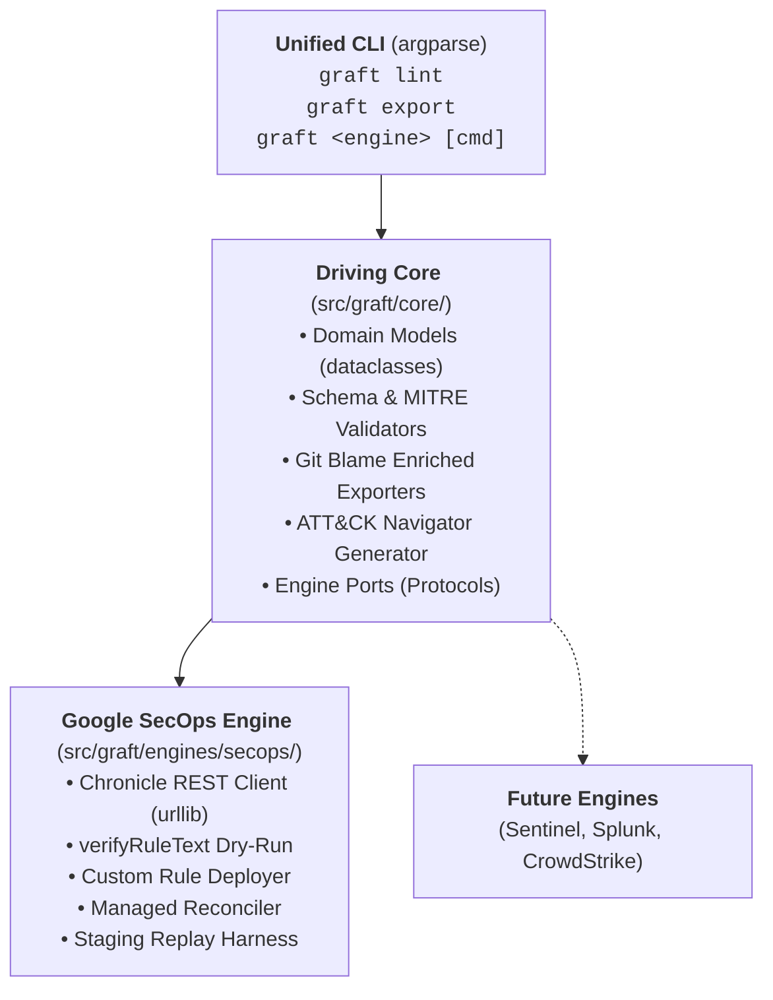

<p align="center">
  
</p>

<h1 align="center">graft</h1>

<p align="center">
  <strong>Write Once, Defend Everywhere.</strong><br>
  <em>An extensible, vendor-agnostic Detection-as-Code (DaC) platform engineered for Google SecOps and modern enterprise security operations.</em>
</p>

<p align="center">
  <a href="GRAFT_MASTER_PLAN.md"></a>
  <a href="LICENSE"></a>
  <a href="https://www.python.org/"></a>
  <a href="https://github.com/astral-sh/ruff"></a>
  <a href="http://mypy-lang.org/"></a>
</p>

> [!WARNING]
> **Public Repository Notice & Operational Boundaries:**
> - **Public Lab Environment:** This public repository (`lopes/graft`) is strictly connected to an isolated lab/demo environment for open-source development and experimentation. It is never connected to production tenants.
> - **Production Repositories Must Be Private:** Any detection engineering team or operator adopting or forking Graft for production use **must maintain their repository in private version control** under strict organizational access controls. While the Graft engine is open-source, version-controlling live production deployment states (`enabled`, `alerting`) or operational exclusions (`findingsRefinements`) in a public repository will leak defensive postures, monitoring coverage blind spots, and internal entity identities (hostnames, IP ranges, usernames, service accounts).
> - **Curated Content Is Public:** The vendor-managed detection catalog metadata tracked in `rules/secops/managed.yaml` (category names, ruleset titles, descriptions, and catalog UUIDs) represents standard vendor content that is **publicly published** in official Google Cloud documentation. See [Google SecOps Curated Detections](https://docs.cloud.google.com/chronicle/docs/detection/curated-detections) and [Review Curated Detection Categories](https://docs.cloud.google.com/chronicle/docs/detection/cloud-threats-category).
> - **Specification & Architecture:** Complete architectural foundations, component specifications, and engineering directives are documented in [GRAFT_MASTER_PLAN.md](GRAFT_MASTER_PLAN.md).

---

## The Philosophy

In horticulture, **grafting** joins a shoot from one plant onto the rootstock of another, enabling distinct varieties to thrive as a single, resilient organism.

**Project Graft** brings this discipline to detection engineering. Security teams often find their threat detection logic fragmented across proprietary rule consoles, incompatible query syntaxes, and siloed pipelines.

Graft acts as the unified trunk:

- **Standardized Core:** Author, document, and test detection rules, metadata, and testing fixtures in a unified, version-controlled repository using a normalized 5-block envelope (`metadata`, `logic`, `deployment`, `runbook`, `tests`).
- **Resilient Branches (Ports & Adapters):** Seamlessly "graft" rules into production engines. Deploy natively into **Google SecOps** using YARA-L 2.0 today, and branch into auxiliary SIEMs, EDRs, or cloud telemetry tomorrow without refactoring engineering workflows.
- **Dual-Track Governance:** Manage bespoke organizational detections (`rules/<engine>/custom/`) side-by-side with vendor-managed detections (`rules/<engine>/managed.yaml`) under GitOps plan/apply reconciliation.
- **Frictionless CI/CD:** Decouple detection authoring from manual UI workflows with automated schema validation, pre-merge API dry runs (`verifyRuleText`), and synthetic replay testing against dedicated staging infrastructure.

---

## Architecture at a Glance

Graft follows strict **Hexagonal Architecture (Ports & Adapters)**:



---

## Choose Your Journey

Graft's documentation is organized around **three core engineering personas**:

| Persona | Focus & Deliverables | Primary Guide |
| :--- | :--- | :--- |
| 🎯 **Detection Engineer / Analyst** | Authors, modifies, lints, tests, and diffs detection rules on a daily basis. Previews pull requests and consults operational runbooks. | **[Analyst Guide](docs/analysts/README.md)**<br/>📖 **[Detection Recipes Cookbook](docs/analysts/recipes.md)** |
| 🛠️ **Platform & SecOps Engineer** | Bootstraps Graft into existing SIEM tenants, configures CI/CD pipelines, handles authentication (WIF/OIDC), and maintains production sync. | **[Operator Guide](docs/operators/README.md)**<br/>🔄 **[Day 0 Ingestion & Reverse Sync](docs/operators/adoption.md)** |
| 💻 **Core Developer** | Fixes bugs in core services, extends port protocols, builds new engine adapters, and enforces software architecture quality gates. | **[Developer Guide](docs/developers/README.md)**<br/>🔌 **[Pluggable Adapter Framework](docs/developers/framework.md)** |

For the complete architectural overview and philosophy, visit the **[Graft Documentation Hub (docs/README.md)](docs/README.md)**.

---

## Quick Start & CLI Reference

### Prerequisites
- **Python >= 3.13**
- **[uv](https://docs.astral.sh/uv/)** (Fast Python package and project manager)
- **Google Cloud SDK (`gcloud`)** with access to a Google SecOps tenant instance (see [docs/engines/secops.md](docs/engines/secops.md))

### Installation & Quality Verification

```bash
# Clone repository
git clone https://github.com/lopes/graft.git
cd graft

# Install virtualenv and dev dependencies
uv sync

# Run static quality gates & test suite
uv run ruff check .
uv run ruff format --check .
uv run mypy --strict src tests
uv run pytest

# Optional: Enable native pre-commit hook (runs fast offline gates on git commit)
git config core.hooksPath .githooks
```

### Brownfield Adoption: Fastest Path (Day 0 Ingestion)

When adopting Graft on an existing SIEM instance, follow the 3-step bootstrap workflow (see [docs/operators/adoption.md](docs/operators/adoption.md) for full architectural specification):

```bash
# 1. Reverse sync existing custom rules & curated content from live tenant
uv run graft secops pull --env production

# 2. Validate all imported envelopes against schemas & MITRE matrix
uv run graft lint

# 3. Commit baseline and declare Git as authoritative Source of Truth
git add rules/
git commit -m "secops: import production detection baseline"
git push origin main
```

### Essential CLI Commands

#### 1. Rule Validation & Taxonomy Linting
```bash
# Lint the entire rules repository offline (<100ms)
graft lint

# Lint a specific rule file
graft lint rules/secops/custom/workspace_nrd_possible_phishing.yaml

# Output structured JSON diagnostics for CI/CD pipelines
graft --json lint
```

#### 2. Rule & Engine Scaffolding
```bash
# Bootstrap a new detection rule (creates 5-block envelope with schema defaults)
graft secops new suspicious_powershell_download
# or using the engine-agnostic router:
graft new rule suspicious_powershell_download --engine secops

# Bootstrap an entirely new detection engine adapter (code, schema, rules, tests)
graft new engine sentinel
```

#### 3. Pre-Merge Verification & Staging Replay Testing
```bash
# Dry-run YARA-L syntax against Google SecOps verifyRuleText (non-destructive)
graft secops verify rules/secops/custom/workspace_nrd_possible_phishing.yaml

# Execute synthetic UDM replay tests in isolated staging quarantine
graft secops test

# Test only rules modified in the current Git branch or working tree
graft secops test --changed-only

# Enforce hard failure if staging credentials are missing (used in strict CI)
graft secops test --require-staging
```

#### 4. GitOps Drift Detection & State Reconciliation
```bash
# Preview changes for rules modified in current branch (Scoped Reconciliation: default)
graft secops diff --env production

# Scan entire tenant catalog for out-of-band console drift (Full Catalog Reconciliation: --all)
graft secops diff --all --env production

# Apply scoped branch changes to tenant (Scoped Reconciliation)
graft secops apply --env production

# Force complete tenant convergence back to Git state, healing any console drift (Full Catalog Reconciliation)
graft secops apply --all --env production

# Target only custom rules or only vendor-managed curated content
graft secops diff --target custom --env production
graft secops apply --target managed --env production
```

#### 5. Reverse Synchronization (Tenant Ingestion)
```bash
# Reverse-sync live tenant custom rules and managed curated manifest into local repo
graft secops pull --env production

# Reverse-sync only custom rules (with overwrite protection or --force)
graft secops pull --target custom --env production --force

# Granular reverse-sync for vendor-curated rule sets only
graft secops managed pull --env production
```

#### 6. Threat Matrix & Visibility Catalogs
```bash
# Render ASCII MITRE ATT&CK coverage table in the terminal
graft export matrix --format table

# Generate official MITRE ATT&CK Navigator v4.5 JSON layer for visual heatmaps
graft export matrix --format navigator --out layers/attack_coverage.json

# Export detection catalog with Git author attribution and deployment metrics
graft export catalog --format markdown --out docs/RULE_CATALOG.md
graft export catalog --format csv --out exports/detection_catalog.csv
graft export catalog --format json
```

---

## Repository Roadmap & Governance

The platform implementation is broken down into 10 TDD-isolated, reviewable phases. Track active progress and phase specifications in **[GRAFT_MASTER_PLAN.md](GRAFT_MASTER_PLAN.md)**.

Operational directives, strict stdlib-first constraints, coding standards, and agent guidelines are documented in **[AGENTS.md](AGENTS.md)**.

---

## License & Disclaimer

### License
This project is licensed under the **Apache License 2.0**. See the [LICENSE](LICENSE) file for full license terms.

### Disclaimer
> [!WARNING]
> Graft is personal research and not an officially supported Google product. All code and configurations are provided as-is without warranty or official SLA.
