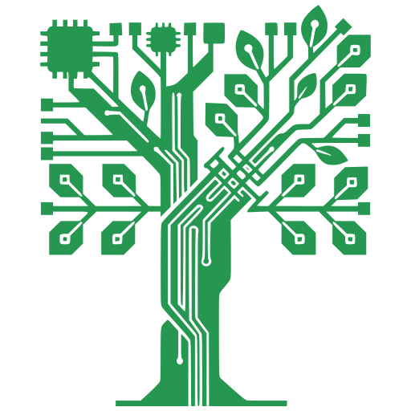
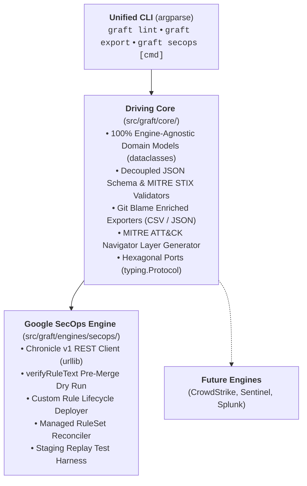

<p align="center">
  
</p>

<h1 align="center">graft</h1>

<p align="center">
  <strong>Write Once, Defend Everywhere.</strong><br>
  <em>An extensible, vendor-agnostic Detection-as-Code (DaC) platform engineered for Google SecOps and modern enterprise security operations.</em>
</p>

<p align="center">
  <a href="GRAFT_MASTER_PLAN.md"></a>
  <a href="LICENSE"></a>
  <a href="https://www.python.org/"></a>
  <a href="https://github.com/astral-sh/ruff"></a>
  <a href="http://mypy-lang.org/"></a>
</p>

> [!WARNING]
> **Public Repository Notice & Operational Boundaries:**
> - **Public Lab Environment:** This public repository (`lopes/graft`) is strictly connected to an isolated lab/demo environment for open-source development and experimentation. It is never connected to production tenants.
> - **Production Repositories Must Be Private:** Any detection engineering team or operator adopting or forking Graft for production use **must maintain their repository in private version control** under strict organizational access controls. While the Graft engine is open-source, version-controlling live production deployment states (`enabled`, `alerting`) or operational exclusions (`findingsRefinements`) in a public repository will leak defensive postures, monitoring coverage blind spots, and internal entity identities (hostnames, IP ranges, usernames, service accounts).
> - **Curated Content Is Public:** The vendor-managed detection catalog metadata tracked in `rules/secops/managed.yaml` (category names, ruleset titles, descriptions, and catalog UUIDs) represents standard vendor content that is **publicly published** in official Google Cloud documentation. See [Google SecOps Curated Detections](https://docs.cloud.google.com/chronicle/docs/detection/curated-detections) and [Review Curated Detection Categories](https://docs.cloud.google.com/chronicle/docs/detection/cloud-threats-category).
> - **Active Engineering:** Graft is under active phased development. Specifications and CLI subcommands are evolving according to [GRAFT_MASTER_PLAN.md](GRAFT_MASTER_PLAN.md).

---

## The Philosophy

In horticulture, **grafting** joins a shoot from one plant onto the rootstock of another, enabling distinct varieties to thrive as a single, resilient organism.

**Project Graft** brings this discipline to detection engineering. Security teams often find their threat detection logic fragmented across proprietary rule consoles, incompatible query syntaxes, and siloed pipelines.

Graft acts as the unified trunk:

- **Standardized Core:** Author, document, and test detection rules, metadata, and testing fixtures in a unified, version-controlled repository using a normalized 5-block envelope (`metadata`, `logic`, `deployment`, `runbook`, `tests`).
- **Resilient Branches (Ports & Adapters):** Seamlessly "graft" rules into production engines. Deploy natively into **Google SecOps** using YARA-L 2.0 today, and branch into auxiliary SIEMs, EDRs, or cloud telemetry tomorrow without refactoring engineering workflows.
- **Dual-Track Governance:** Manage bespoke organizational detections (`rules/<engine>/custom/`) side-by-side with vendor-managed detections (`rules/<engine>/managed.yaml`) under GitOps plan/apply reconciliation.
- **Frictionless CI/CD:** Decouple detection authoring from manual UI workflows with automated schema validation, pre-merge API dry runs (`verifyRuleText`), and synthetic replay testing against dedicated staging infrastructure.

---

## Architecture at a Glance

Graft follows strict **Hexagonal Architecture (Ports & Adapters)**:



---

## Documentation

For full guides and architecture specifications, see the **[Graft Documentation Index (docs/README.md)](docs/README.md)**:

- **[System Architecture](docs/architecture.md):** Hexagonal Ports & Adapters and stdlib runtime policy.
- **[Engine Adoption & Lifecycle Guide](docs/adoption.md):** The 3-epoch lifecycle: brownfield ingestion (`pull`), baseline enrichment, and declaring Git as the authoritative Source of Truth.
- **[Rule Authoring Guide](docs/rule_authoring.md):** 5-block envelope format, YARA-L logic, and runbooks.
- **[GitOps Reconciliation](docs/gitops_reconciliation.md):** Managing vendor-curated content, drift detection (`diff`), and synchronization (`apply`, `pull`).
- **[Synthetic Replay Testing](docs/replay_testing.md):** Dynamic verification using quarantined rules and synthetic UDM event injection.
- **[Visibility, Matrix & Catalogs](docs/visibility_and_matrix.md):** MITRE ATT&CK matrix, Navigator v4 layers, and Git author attribution.
- **[Google SecOps Engine Setup](docs/engines/secops.md):** Credentials, dual-tenant vs single-tenant lab topologies, and API mechanics.
- **[Extending Engines Tutorial](docs/engines/extending_engines.md):** Developer guide to scaffolding and implementing new engine adapters.
- **[Security Architecture](docs/security.md):** Workload Identity Federation, OIDC token exchange, fork isolation, and audit logging.

---

## Quick Start & CLI Reference

### Prerequisites
- **Python >= 3.13**
- **[uv](https://docs.astral.sh/uv/)** (Fast Python package and project manager)
- **Google Cloud SDK (`gcloud`)** with access to a Google SecOps tenant instance (see [docs/engines/secops.md](docs/engines/secops.md))

### Installation & Quality Verification

```bash
# Clone repository
git clone https://github.com/joelopes/graft.git
cd graft

# Install virtualenv and dev dependencies
uv sync

# Run static quality gates & test suite
uv run ruff check .
uv run ruff format --check .
uv run mypy --strict src tests
uv run pytest

# Optional: Enable native pre-commit hook (runs fast offline gates on git commit)
git config core.hooksPath .githooks
```

### Brownfield Adoption: Fastest Path (Day 0 Ingestion)

When adopting Graft on an existing SIEM instance, follow the 3-step bootstrap workflow (see [docs/adoption.md](docs/adoption.md) for full architectural specification):

```bash
# 1. Reverse sync existing custom rules & curated content from live tenant
uv run graft secops pull --env production

# 2. Validate all imported envelopes against schemas & MITRE matrix
uv run graft lint

# 3. Commit baseline and declare Git as authoritative Source of Truth
git add rules/
git commit -m "secops: import production detection baseline"
git push origin main
```

### Essential CLI Commands

```bash
# 1. Offline rule and manifest linting
graft lint
graft lint rules/secops/custom/workspace_nrd_possible_phishing.yaml

# 2. Scaffolding new engines or rules
graft new engine sentinel
graft new rule gcp_cloud_storage_public_bucket --engine secops

# 3. Threat coverage matrix & catalog exports
graft export matrix --format table
graft export matrix --format navigator --out layers/coverage.json
graft export catalog --format markdown
graft export catalog --format csv --out exports/catalog.csv

# 4. Google SecOps pre-merge syntax dry run
graft secops verify rules/secops/custom/workspace_nrd_possible_phishing.yaml

# 5. Synthetic UDM replay testing
graft secops test
graft secops test rules/secops/custom/workspace_nrd_possible_phishing.yaml --require-staging

# 6. GitOps managed curated content reconciliation
graft secops managed diff
graft secops managed apply
graft secops managed pull --out rules/secops/managed.yaml
```

---

## Repository Roadmap & Governance

The platform implementation is broken down into 10 TDD-isolated, reviewable phases. Track active progress and phase specifications in **[GRAFT_MASTER_PLAN.md](GRAFT_MASTER_PLAN.md)**.

Operational directives, strict stdlib-first constraints, coding standards, and agent guidelines are documented in **[AGENTS.md](AGENTS.md)**.

---

## License & Disclaimer

### License
This project is licensed under the **Apache License 2.0**. See the [LICENSE](LICENSE) file for full license terms.

### Disclaimer
> [!WARNING]
> Graft is personal research and not an officially supported Google product. All code and configurations are provided as-is without warranty or official SLA.
