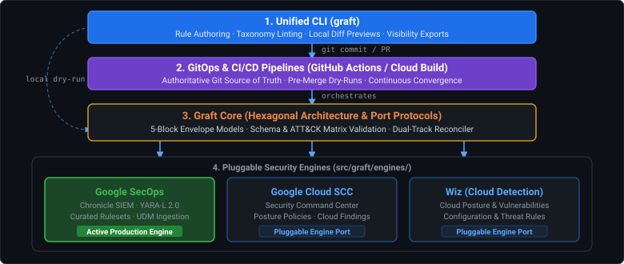
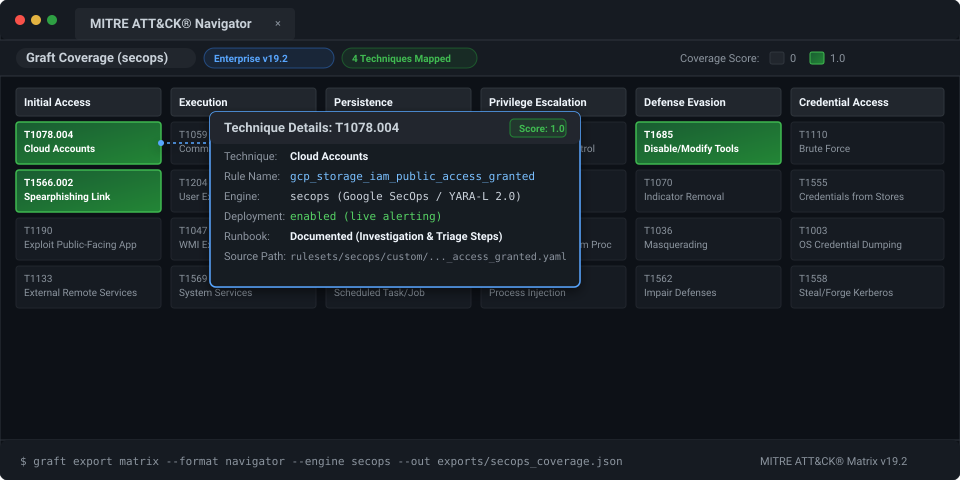

<p align="center">
  
</p>

<h1 align="center">graft</h1>

<p align="center">
  <strong>Write Once, Defend Everywhere.</strong><br>
  <em>An extensible, vendor-agnostic Detection-as-Code (DaC) platform engineered for Google SecOps and modern enterprise security operations.</em>
</p>

<p align="center">
  <a href="docs/README.md"></a>
  <a href="LICENSE"></a>
  <a href="https://www.python.org/"></a>
  <a href="https://github.com/astral-sh/ruff"></a>
  <a href="http://mypy-lang.org/"></a>
</p>

> [!WARNING]
> **Public Repository Notice & Operational Boundaries:**
> - **Public Lab Environment:** This public repository (`lopes/graft`) is strictly connected to an isolated lab/demo environment for open-source development and experimentation. It is never connected to production tenants.
> - **Production Repositories Must Be Private:** Any detection engineering team or operator adopting or forking Graft for production use **must maintain their repository in private version control** under strict organizational access controls. While the Graft engine is open-source, version-controlling live production deployment states (`enabled`, `alerting`) or operational exclusions (`findingsRefinements`) in a public repository will leak defensive postures, monitoring coverage blind spots, and internal entity identities (hostnames, IP ranges, usernames, service accounts).
> - **Curated Content Is Public:** The vendor-managed detection catalog metadata tracked in `rulesets/secops/managed.yaml` (category names, ruleset titles, descriptions, and catalog UUIDs) represents standard vendor content that is **publicly published** in official Google Cloud documentation. See [Google SecOps Curated Detections](https://docs.cloud.google.com/chronicle/docs/detection/curated-detections) and [Review Curated Detection Categories](https://docs.cloud.google.com/chronicle/docs/detection/cloud-threats-category).
> - **Specification & Architecture:** Complete architectural foundations, component specifications, and engineering directives are documented in [docs/README.md](docs/README.md) and [AGENTS.md](AGENTS.md).

---

## The Philosophy

In horticulture, **grafting** joins a shoot from one plant onto the rootstock of another, enabling distinct varieties to thrive as a single, resilient organism.

**Project Graft** brings this discipline to detection engineering. Security teams often find their threat detection logic fragmented across proprietary rule consoles, incompatible query syntaxes, and siloed pipelines.

Graft acts as the unified trunk:

- **Standardized Core:** Author, document, and test detection rules, metadata, and testing fixtures in a unified, version-controlled repository using a normalized 5-block envelope (`metadata`, `logic`, `deployment`, `runbook`, `tests`).
- **Resilient Branches (Ports & Adapters):** Seamlessly "graft" rules into production engines. Deploy natively into **Google SecOps** using YARA-L 2.0 today, and branch into auxiliary SIEMs, EDRs, or cloud telemetry tomorrow without refactoring engineering workflows.
- **Dual-Track Governance:** Manage bespoke organizational detections (`rulesets/<engine>/custom/`) side-by-side with vendor-managed detections (`rulesets/<engine>/managed.yaml`) under GitOps plan/apply reconciliation.
- **Frictionless CI/CD:** Decouple detection authoring from manual UI workflows with automated schema validation, pre-merge API dry runs (`verifyRuleText`), and synthetic replay testing against dedicated staging infrastructure.

---

## Architecture at a Glance

Graft follows strict **Hexagonal Architecture (Ports & Adapters)** structured into four decoupled layers:

<p align="center">
  
</p>

---

## Key Features

### 1. Modular Engine Architecture & Pluggable Adapters
Graft strictly decouples detection engineering logic from downstream SIEM and telemetry platforms using **Hexagonal Architecture (Ports & Adapters)**:
- **Self-Contained Engine Packages:** Every detection engine lives in an isolated directory under `src/graft/engines/<engine>/` housing its concrete API client, deployment adapter, engine-specific Draft 2020-12 schemas, and documentation.
- **Strict Protocol Boundaries:** Engines implement explicit standard library `typing.Protocol` ports (`RuleDeployerPort`, `ManagedEnginePort`, `SyntaxCompilerPort`, `ReplayTestPort`). Core never adapts to an engine; engines adapt to Core.
- **Zero Core Cloud Dependencies:** The core substrate imports zero third-party SIEM SDKs or cloud libraries. It relies strictly on Python standard library modules (`urllib.request`, `dataclasses`, `argparse`, `subprocess`), guaranteeing fast, lightweight, and auditable execution.
- **Engine Scaffolding in Seconds:** Adding a new SIEM target (e.g. Microsoft Sentinel, Splunk ES, Elastic) requires no core refactoring. Running `graft new engine <name>` generates the complete directory structure, schema definitions, unit test scaffolds, and documentation templates instantly.

### 2. Actionable Detection Envelopes & Factual Lifecycle
Detection logic is only as effective as the operational response it enables:
- **Normalized 5-Block Envelope:** Detections are authored in a standardized YAML envelope separating `metadata`, `logic`, `deployment`, `runbook`, and `tests`.
- **Embedded Operational Runbooks:** Every rule embeds actionable triage playbooks directly alongside the detection logic (`investigation_steps`, `triage_commands`, and `response_actions`), eliminating tribal knowledge and context switching for SOC analysts during live incident response.
- **Factual Lifecycle vs. "Maturity Score" Theater:** Graft rejects arbitrary 0–100 maturity guesses and manual status tags that rapidly become stale. Instead, Graft empirically computes factual lifecycle indicators directly from Git version history (first committed timestamp, latest revision timestamp, review commit count, unique author count) combined with active SIEM deployment health.
- **Safe Archival & Zero Blind-Spot Governance:** Retiring a rule is as simple as moving it to `rulesets/<engine>/_archived/`. Graft automatically excludes any underscore-prefixed directory from active sync, matrix exports, and linting, preserving full envelope context and test fixtures for audits without cluttering active deployments.

### 3. Dual-Track GitOps Drift Reconciliation
Modern SIEMs run a combination of bespoke custom rules and vendor-managed curated detections. Graft manages both under unified version control:
- **Custom Rule Synchronization:** Authors maintain declarative custom rules in Git (`rulesets/<engine>/custom/`). Graft calculates precise diffs between local state and live tenant APIs, automating safe creates and updates.
- **Vendor-Managed Curated Content Control:** Manage vendor curated rule sets (`rulesets/<engine>/managed.yaml`) directly in code. Operators can declare precision tiers (`PRECISE` vs `BROAD`), toggle alerting states, and commit declarative rule exclusions (`findingsRefinements`) to suppress benign environmental noise.
- **Dual-Mode Drift Reconciliation:**
  - **Scoped PR Reconciliation (Default):** Evaluates only files modified in the active Git branch against tenant state, enabling lightning-fast pull request validations in CI/CD.
  - **Full Catalog Convergence (`--all`):** Scans the entire tenant catalog to detect and reconcile out-of-band console drift, enforcing Git as the authoritative Source of Truth.
- **Day 0 Brownfield Ingestion:** Teams can adopt Graft on existing SIEM instances in minutes without disruption. Running `graft <engine> pull` reverse-synchronizes live tenant custom rules and curated content into clean Git-managed envelopes.

```bash
$ graft secops diff --env production
=== Custom Rules Diff ===
[+] Custom rule to create: gcp_storage_iam_public_access_granted
[~] Custom rule to update: workspace_nrd_possible_phishing (ID: ru_12345678-abcd-ef01-2345-6789abcdef01)
[?] Untracked custom rule on tenant: legacy_unmanaged_alert (ID: ru_98765432-feee-dcba-0000-111122223333)

=== Google SecOps Managed Content Diff ===
[~] Deployment: ur_cloud_threats (PRECISE) | enabled: False -> True, alerting: False -> True
[+] Exclusion to create: excl_cloud_functions_pipeline_sa
[-] Exclusion to delete: excl_temp_maintenance_window
```

### 4. Threat Visibility, Audit-Ready Catalogs & ATT&CK v19.2 Layers
Bridge the gap between detection engineering code, SOC operations, and leadership reporting:
- **Multi-Format Detection Catalogs:** Export unified catalogs in interactive terminal tables, CSV spreadsheets, Markdown documentation (`docs/RULE_CATALOG.md`), or JSON for ingestion into security data lakes, BigQuery, or BI dashboards.
- **MITRE ATT&CK Enterprise v19.2 Matrix:** Built-in evaluation of tactics and sub-techniques (`TAxxxx:Tyyyy.zzz`) with automated cross-engine technique normalization and coverage analysis.
- **Official Navigator Layer Generation:** Generate color-graded MITRE ATT&CK Navigator v4.5/v5.2 layer files (`exports/secops_coverage.json`) with embedded rule metadata, deployment status, and direct source links for interactive heatmap visualization in the official ATT&CK Navigator.

```bash
$ graft export catalog
Rule Name                              Engine  Status   MITRE ATT&CK                        Reviews  Runbook  Updated             
-------------------------------------  ------  -------  ----------------------------------  -------  -------  --------------------
gcp_iam_service_account_key_create     secops  enabled  TA0003:T1098.001, TA0004:T1098.001  1        yes      2026-09-22T14:01:52Z
gcp_storage_iam_public_access_granted  secops  enabled  TA0001:T1078.004, TA0112:T1685      2        yes      2026-09-22T15:17:52Z
workspace_nrd_possible_phishing        secops  enabled  TA0001:T1566.002                    1        yes      2026-09-22T14:01:52Z
```

<p align="center">
  
</p>

---

## Choose Your Journey

Graft's documentation is organized around **three core engineering personas**:

| Persona | Focus & Deliverables | Primary Guide |
| :--- | :--- | :--- |
| 🎯 **Detection Engineer / Analyst** | Authors, modifies, lints, tests, and diffs detection rules on a daily basis. Previews pull requests and consults operational runbooks. | **[Analyst Guide](docs/analysts/README.md)**<br/>📖 **[Detection Recipes Cookbook](docs/analysts/recipes.md)** |
| 🛠️ **Platform & SecOps Engineer** | Bootstraps Graft into existing SIEM tenants, configures CI/CD pipelines, handles authentication (WIF/OIDC), and maintains production sync. | **[Operator Guide](docs/operators/README.md)**<br/>🔄 **[Day 0 Ingestion & Reverse Sync](docs/operators/adoption.md)** |
| 💻 **Core Developer** | Fixes bugs in core services, extends port protocols, builds new engine adapters, and enforces software architecture quality gates. | **[Developer Guide](docs/developers/README.md)**<br/>🔌 **[Pluggable Adapter Framework](docs/developers/framework.md)** |

For the complete architectural overview and philosophy, visit the **[Graft Documentation Hub (docs/README.md)](docs/README.md)**.

---

## Quick Start & CLI Reference

### Prerequisites
- **Python >= 3.13**
- **[uv](https://docs.astral.sh/uv/)** (Fast Python package and project manager)
- **Google Cloud SDK (`gcloud`)** with access to a Google SecOps tenant instance (see [docs/engines/secops.md](docs/engines/secops.md))

### Installation & Quality Verification

```bash
# Clone repository
git clone https://github.com/lopes/graft.git
cd graft

# Install virtualenv and dev dependencies
uv sync

# Run static quality gates & test suite
uv run ruff check .
uv run ruff format --check .
uv run mypy --strict src tests
uv run pytest

# Optional: Enable native pre-commit hook (runs fast offline gates on git commit)
git config core.hooksPath .githooks
```

### Brownfield Adoption: Fastest Path (Day 0 Ingestion)

When adopting Graft on an existing SIEM instance, follow the 3-step bootstrap workflow (see [docs/operators/adoption.md](docs/operators/adoption.md) for full architectural specification):

```bash
# 1. Reverse sync existing custom rules & curated content from live tenant
uv run graft secops pull --env production

# 2. Validate all imported envelopes against schemas & MITRE matrix
uv run graft lint

# 3. Commit baseline and declare Git as authoritative Source of Truth
git add rulesets/
git commit -m "secops: import production detection baseline"
git push origin main
```

### Essential CLI Commands

#### 1. Rule Validation & Taxonomy Linting
```bash
# Lint the entire rules repository offline (<100ms)
graft lint

# Lint a specific rule file
graft lint rulesets/secops/custom/workspace_nrd_possible_phishing.yaml

# Output structured JSON diagnostics for CI/CD pipelines
graft --json lint
```

#### 2. Rule & Engine Scaffolding
```bash
# Bootstrap a new detection rule (creates 5-block envelope with schema defaults)
graft secops new suspicious_powershell_download
# or using the engine-agnostic router:
graft new rule suspicious_powershell_download --engine secops

# Bootstrap an entirely new detection engine adapter (code, schema, rules, tests)
graft new engine sentinel
```

#### 3. Pre-Merge Verification & Staging Replay Testing
```bash
# Dry-run YARA-L syntax against Google SecOps verifyRuleText (non-destructive)
graft secops verify rulesets/secops/custom/workspace_nrd_possible_phishing.yaml

# Execute synthetic UDM replay tests in isolated staging quarantine
graft secops test

# Test only rules modified in the current Git branch or working tree
graft secops test --changed-only

# Enforce hard failure if staging credentials are missing (used in strict CI)
graft secops test --require-staging
```

#### 4. GitOps Drift Detection & State Reconciliation
```bash
# Preview changes for rules modified in current branch (Scoped Reconciliation: default)
graft secops diff --env production

# Scan entire tenant catalog for out-of-band console drift (Full Catalog Reconciliation: --all)
graft secops diff --all --env production

# Apply scoped branch changes to tenant (Scoped Reconciliation)
graft secops apply --env production

# Force complete tenant convergence back to Git state, healing any console drift (Full Catalog Reconciliation)
graft secops apply --all --env production

# Target only custom rules or only vendor-managed curated content
graft secops diff --target custom --env production
graft secops apply --target managed --env production
```

#### 5. Reverse Synchronization (Tenant Ingestion)
```bash
# Reverse-sync live tenant custom rules and managed curated manifest into local repo
graft secops pull --env production

# Reverse-sync only custom rules (with overwrite protection or --force)
graft secops pull --target custom --env production --force

# Granular reverse-sync for vendor-curated rule sets only
graft secops managed pull --env production
```

#### 6. Threat Matrix & Visibility Catalogs
```bash
# Render on-screen detection catalog table (default format)
graft export catalog

# Filter catalog or matrix by target engine
graft export catalog --engine secops
graft export matrix --format table --engine secops

# Generate official MITRE ATT&CK Enterprise v19.2 Navigator layer (custom color gradient)
graft export matrix --format navigator --engine secops --color "#4285F4" --out exports/secops_coverage.json

# Export detection catalog for audits and documentation pipelines
graft export catalog --format csv --out exports/detection_catalog.csv
graft export catalog --format markdown --out docs/RULE_CATALOG.md
graft export catalog --format json
```

> [!NOTE]
> **Factual Lifecycle Indicators vs. Static "Maturity" Fields:**
> Graft intentionally omits static `metadata.status` or `maturity` fields from rules. In real-world detection engineering, static maturity labels rapidly become stale, creating administrative toil and a false sense of security ("security theater"). Similarly, Graft avoids arbitrary 0–100 synthetic maturity scores.
>
> Instead, `graft export catalog` computes verified, objective indicators directly from version control, the rule envelope, and engine deployment adapters:
> - **VCS Lifecycle:** First committed timestamp (`created_at`) and latest revision timestamp (`last_modified_at`).
> - **Peer Review Scrutiny:** Total git commit count (`review_count`) and unique author count (`contributor_count`).
> - **Operational Context:** Documented operational playbooks (`has_runbook`), unified ATT&CK mappings (`mitre_attack: TAxxxx:Tyyyy.zzz`), and engine-evaluated deployment health (`status: enabled | silent | disabled`).
>
> Operators can pipe these indicators into data pipelines (e.g. BigQuery, Google Sheets, BI dashboards) and combine them with live operational telemetry from the SIEM (alert volume, true-positive precision, mean time to triage) to assess true detection maturity objectively.
>
> **Rule Decommissioning & Archiving:**
> When retiring a rule, prefer moving it to `rulesets/<engine>/_archived/` (e.g. `rulesets/secops/_archived/`) rather than deleting it. Graft automatically excludes any directory or file starting with an underscore (`_`) under a ruleset (e.g. `_archived/`, `_deprecated/`, `_templates/`) from loading, linting, matrix exports, and CI/CD synchronization. This preserves full envelope history, context, and test vectors for audits without cluttering active deployments.

---

## Platform Architecture & Governance

Comprehensive documentation tracks for Detection Engineers, SecOps Operators, and Core Developers are available in the **[Graft Documentation Hub (docs/README.md)](docs/README.md)**.

Operational directives, strict stdlib-first constraints, coding standards, and agent guidelines are documented in **[AGENTS.md](AGENTS.md)**.

---

## License & Disclaimer

### License
This project is licensed under the **Apache License 2.0**. See the [LICENSE](LICENSE) file for full license terms.

### Disclaimer
> [!WARNING]
> Graft is personal research and not an officially supported Google product. All code and configurations are provided as-is without warranty or official SLA.
