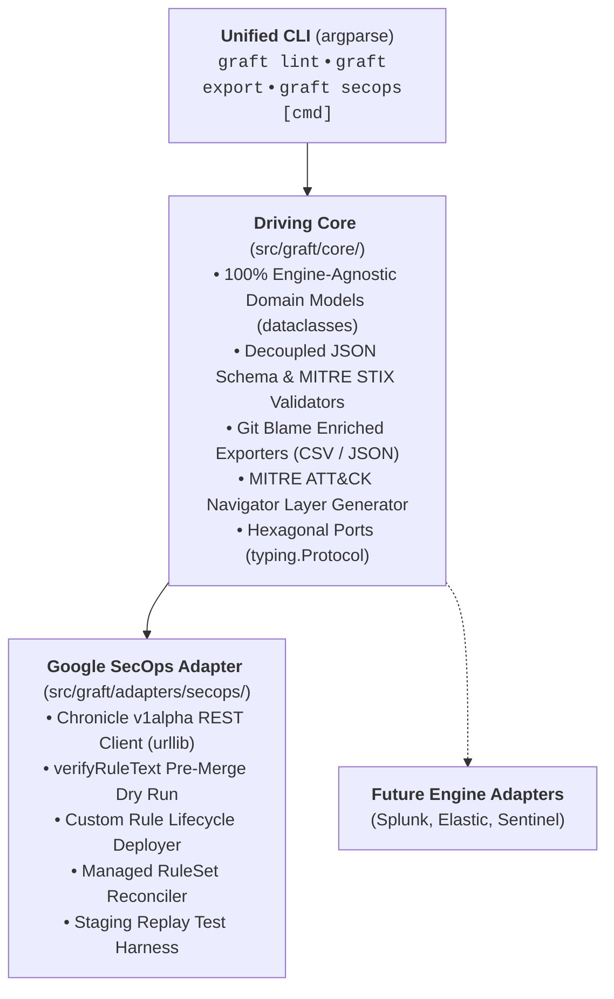

# graft

> **Write Once, Defend Everywhere.**  
> *An extensible, vendor-agnostic Detection-as-Code (DaC) platform engineered for Google SecOps and modern enterprise security operations.*

[](GRAFT_MASTER_PLAN.md)
[](LICENSE)
[](https://www.python.org/)
[](https://github.com/astral-sh/ruff)
[](http://mypy-lang.org/)

> [!CAUTION]
> **Active Engineering & Work in Progress:** Graft is currently under active architecture and phased development. APIs, rule envelope schemas, and CLI subcommands are evolving according to the phased roadmap in [GRAFT_MASTER_PLAN.md](GRAFT_MASTER_PLAN.md).

---

## The Philosophy

In horticulture, **grafting** joins a shoot from one plant onto the rootstock of another, enabling distinct varieties to thrive as a single, resilient organism.

**Project Graft** brings this discipline to detection engineering. Security teams often find their threat detection logic fragmented across proprietary rule consoles, incompatible query syntaxes, and siloed pipelines.

Graft acts as the unified trunk:

- **Standardized Core:** Author, document, and test detection rules, metadata, and testing fixtures in a unified, version-controlled repository using a normalized 5-block envelope (`metadata`, `logic`, `deployment`, `runbook`, `tests`).
- **Resilient Branches (Ports & Adapters):** Seamlessly "graft" rules into production engines. Deploy natively into **Google SecOps** using YARA-L 2.0 today, and branch into auxiliary SIEMs, EDRs, or cloud telemetry tomorrow without refactoring engineering workflows.
- **Dual-Track Governance:** Manage bespoke organizational detections (`rules/<engine>/custom/`) side-by-side with vendor-managed detections (`rules/<engine>/managed.yaml`) under GitOps plan/apply reconciliation.
- **Frictionless CI/CD:** Decouple detection authoring from manual UI workflows with automated schema validation, pre-merge API dry runs (`verifyRuleText`), and synthetic replay testing against dedicated staging infrastructure.

---

## Architecture at a Glance

Graft follows strict **Hexagonal Architecture (Ports & Adapters)**:



---

## Quick Start & Prerequisites

### Prerequisites
- **Python >= 3.13**
- **[uv](https://docs.astral.sh/uv/)** (Fast Python package and project manager)
- **Google Cloud SDK (`gcloud`)** with access to a Google SecOps tenant instance (see [docs/adapters/secops.md](docs/adapters/secops.md))

### Installation & Verification

```bash
# Clone repository
git clone https://github.com/joelopes/graft.git
cd graft

# Install virtualenv and dev dependencies
uv sync

# Run static quality gates
uv run ruff check .
uv run ruff format --check .
uv run mypy --strict src tests

# Run unit tests (<1s execution)
uv run pytest
```

---

## Repository Roadmap & Governance

The platform implementation is broken down into 10 TDD-isolated, reviewable phases. Track active progress and phase specifications in **[GRAFT_MASTER_PLAN.md](GRAFT_MASTER_PLAN.md)**.

Operational directives, strict stdlib-first constraints, coding standards, and agent guidelines are documented in **[AGENTS.md](AGENTS.md)**.

---

## License & Disclaimer

### License
This project is licensed under the **Apache License 2.0**. See the [LICENSE](LICENSE) file for full license terms.

### Disclaimer
> [!WARNING]
> Graft is personal research and not an officially supported Google product. All code and configurations are provided as-is without warranty or official SLA.
