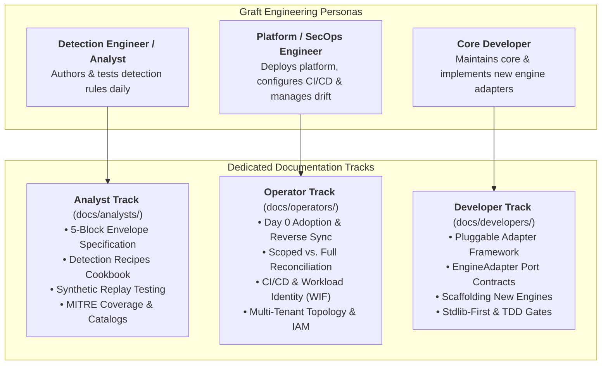

# Graft Documentation Hub

Graft is an extensible, vendor-agnostic Detection-as-Code (DaC) platform engineered around strict **Hexagonal Architecture (Ports & Adapters)** and a **Stdlib-First** runtime discipline.

This documentation hub is structured around **three distinct engineering personas**, ensuring you get immediate, high-signal information relevant to your responsibilities without wading through unrelated platform internals.

---

## The Three Personas

---

## Choose Your Path

| Role | Responsibilities | Primary Documentation |
| :--- | :--- | :--- |
| **Detection Engineer / Analyst** | Authors, modifies, tests, and diffs detection rules on a daily basis. Previews pull requests and consults operational runbooks. | 🎯 **[Analyst Guide](analysts/README.md)** 📖 **[Detection Recipes Cookbook](analysts/recipes.md)** |
| **Platform / SecOps Engineer** | Bootstraps Graft into existing SIEM tenants, configures CI/CD pipelines, handles authentication (WIF/OIDC), and maintains production sync. | 🛠️ **[Operator Guide](operators/README.md)** 🔄 **[Day 0 Adoption & Ingestion](operators/adoption.md)** |
| **Core Developer** | Fixes bugs in core services, extends port protocols, builds new engine adapters, and enforces software architecture quality gates. | 💻 **[Developer Guide](developers/README.md)** 🔌 **[Pluggable Adapter Framework](developers/framework.md)** |

---

## Architectural Foundations

Regardless of your persona, three foundational principles govern the platform:

### 1. Hexagonal Architecture (Ports & Adapters)
- **Driving Core (`src/graft/core/`):** 100% engine-agnostic domain logic. Implements rule parsing, schema validation, STIX MITRE matrices, Git blame extraction, and catalog export. **Zero imports of cloud SDKs or SIEM clients.**
- **Engine Ports (`src/graft/core/ports/`):** Strict `typing.Protocol` interfaces defining granular capabilities ([`RuleCompilerPort`](../src/graft/core/ports/compiler.py), [`RuleDeployerPort`](../src/graft/core/ports/deployer.py), [`ManagedEnginePort`](../src/graft/core/ports/managed.py), [`ReplayHarnessPort`](../src/graft/core/ports/replay.py)) and the composite [`EngineAdapter`](../src/graft/core/ports/engine.py).
- **Driven Engines (`src/graft/engines/`):** Self-contained, encapsulated packages (e.g., `secops`) carrying the full burden of translating external vendor APIs and query syntaxes. Core never adapts to an engine; engines adapt to Core.

### 2. Dual-Track Content Governance
Graft organizes detection content into two separate, version-controlled tracks:
- **Custom Rules (`rules/<engine>/custom/*.yaml`):** Bespoke organizational detections authored in a standardized 5-block envelope (`metadata`, `logic`, `deployment`, `runbook`, `tests`).
- **Managed Vendor Content (`rules/<engine>/managed.yaml`):** Consolidated manifest managing deployment state (`PRECISE` vs. `BROAD`, `enabled`, `alerting`) and active exclusions for vendor-provided rulesets (e.g., Google Curated Rule Sets).

### 3. GitOps Reconciliation Lifecycle
Git is declared the single authoritative Source of Truth for detection state:
- **Scoped Reconciliation (Default):** Restricts diffs and deployments strictly to rules touched in the current Git branch or working tree (`graft <engine> diff / apply`). Keeps PR reviews focused and minimizes blast radius.
- **Full Catalog Reconciliation (`--all`):** Evaluates the entire repository catalog against the live tenant (`graft <engine> diff --all / apply --all`). Automatically detects and heals out-of-band console drift.
