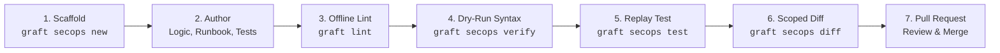

# Detection Engineer & Analyst Guide

Welcome to the **Analyst & Detection Engineer Track**. This guide is engineered for security practitioners who author, tune, test, and maintain threat detection content on a day-to-day basis.

As a detection engineer using Graft, you interact with detections as first-class software artifacts. You author rules in standardized YAML envelopes, test them against synthetic telemetry fixtures, verify syntax against remote SIEM compilers before merging, and preview exact tenant changes in Git pull requests.

---

## The Daily Detection Lifecycle

1. **Scaffold:** Bootstrap a clean 5-block custom rule envelope (`graft <engine> new <rule_name>`) or a 4-block registered managed rule envelope (`graft <engine> new <rule_name> --managed <id>`) with generated UUID and schema defaults.
2. **Author:** Write your detection query (e.g. YARA-L 2.0), populate investigation and response runbooks, map MITRE ATT&CK techniques, and add synthetic test events.
3. **Offline Lint:** Validate your rule locally in sub-seconds against strict JSON Schemas and STIX ATT&CK matrices (`graft lint <path>`).
4. **Dry-Run Syntax:** Submit the rule to the SIEM's remote dry-run compilation API without altering production state (`graft <engine> verify <path>`).
5. **Replay Test:** Execute synthetic telemetry through an isolated staging tenant quarantine to verify positive and negative match assertions (`graft <engine> test <path>`).
6. **Scoped Diff:** Preview the exact change delta against the production tenant for only the rules modified on your branch (`graft <engine> diff`).
7. **Pull Request:** Open a Git pull request. Automated CI/CD gates run linting, syntax verification, and post the Scoped Reconciliation plan as a PR review comment.

---

## Analyst Documentation Index

- **📖 [Detection Recipes Cookbook](recipes.md):** Step-by-step practical recipes for everyday rule management tasks using Google SecOps as the reference implementation.
- **📝 [Rule Authoring Specification](rule_authoring.md):** Complete specification of the 5-block custom rule envelope (`metadata`, `logic`, `deployment`, `runbook`, `tests`), the 4-block registered managed rule envelope (`metadata`, `managed`, `runbook`, `tests`), uniqueness constraints, and YARA-L patterns.
- **🧪 [Synthetic Replay Testing](replay_testing.md):** Guide to crafting synthetic UDM event fixtures, running quarantined tests, and asserting detection outcomes without alert pollution.
- **📊 [Threat Coverage & Catalogs](visibility_and_matrix.md):** Mapping detections to the MITRE ATT&CK matrix, generating ATT&CK Navigator v4.5 heatmaps, and exporting Git blame-attributed rule catalogs.
