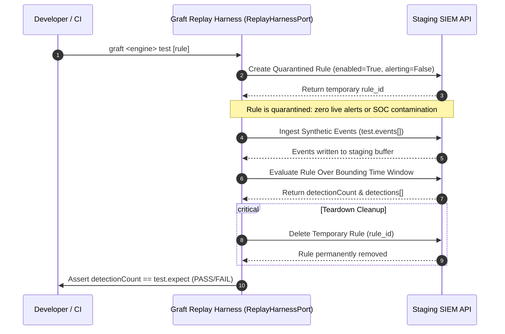

# Synthetic Replay Testing & Quarantine Harness

> [!WARNING]
> **Experimental Capability**
> Synthetic replay testing is currently an experimental capability and architectural specification (`ReplayHarnessPort`). For example, the Google SecOps public REST API does not currently expose synchronous endpoints for in-memory synthetic UDM ingestion or ad-hoc rule execution. The `tests:` block is preserved in the rule envelope schema for design readiness.

Static syntax linting validates query structure, but cannot verify whether complex regular expressions, multi-event time windows, or outcome calculations match true attack patterns. Graft addresses this with an automated **Synthetic Replay Harness** (`ReplayHarnessPort`).

---

## 1. The Replay Testing Lifecycle

When `graft <engine> test` is executed, the engine's replay adapter deploys a temporary quarantine rule, ingests synthetic test events into the staging instance, triggers an ad-hoc evaluation over the test time window, asserts the detection count against `test.expect`, and guarantees teardown cleanup.



---

## 2. Quarantine Safeguards & Production Isolation

To prevent synthetic testing from contaminating production alert queues or skewing SOC metrics, replay adapters enforce three layers of protection:

1. **Explicit Quarantine Configuration:**
   - Temporary rule name: `graft_test_<test_id>_<uuid>`.
   - `alerting = False`: Rule matches never trigger notification pipelines, webhooks, or SOC incident creation.
   - `enabled = True`: Rule is active only for the duration of the isolated evaluation window and deleted immediately afterward.
2. **Scoped Time-Window Evaluation:**
   - Ad-hoc evaluation runs strictly over the bounding timestamp window defined by the synthetic test events (`min(timestamp)` to `max(timestamp)`).
3. **Guaranteed `finally` Cleanup:**
   - Rule deletion is wrapped in a Python `finally:` block. Even if the evaluation API returns an error or times out, the temporary rule is purged.

---

## 3. Environment Topologies: Staging vs. Single-Tenant Guard

### Multi-Tenant Enterprise Topology (Required for Replay Testing)

Staging and Production point to two physically separate SIEM instances:

- `GRAFT_<ENGINE>_STAGING_*` (e.g., `GRAFT_SECOPS_STAGING_*`): Used for synthetic replay testing and pre-merge compiler verification.
- `GRAFT_<ENGINE>_PROD_*` (e.g., `GRAFT_SECOPS_PROD_*`): Production operational environment.

### Single-Tenant Production Guard

Because synthetic replay testing injects test events and creates temporary rules, replay adapters enforce a strict production tenant guard. If staging coordinates are omitted or resolve to the same tenant instance as Production (for example, the same `(project_id, location, instance_id)` in `SecOpsReplayEngine`), Graft refuses to inject synthetic events into Production:

- Without `--require-staging` (default): Emits `[WARNING]` and exits `0` (graceful degradation).
- With `--require-staging`: Emits `[ERROR] Replay tests require a dedicated staging tenant and cannot run against production coordinates` and exits `1`.

---

## 4. CLI Invocations & Selective Testing

```bash
# Run replay tests across all custom rules for an engine (e.g., secops)
graft secops test

# Test only rules modified in the current Git branch or working tree (ideal for fast PRs)
graft secops test --changed-only

# Target a specific rule file
graft secops test rulesets/secops/custom/workspace_nrd_email_opened.yaml

# Enforce hard failure if staging credentials are not configured (required in CI/CD)
graft secops test --require-staging
```

---

## 5. Graceful Degradation in Local & CI Environments

Developers without cloud credentials or working offline must not be blocked from running local test suites. Graft enforces a strict graceful degradation contract:

| Scenario | CLI Invocation | Exit Code | Output Behavior |
| :--- | :--- | :---: | :--- |
| **No tests defined** | `graft <engine> test` | `0` | Skipped silently. |
| **Tests defined, no staging creds** | `graft <engine> test` | `0` | `[WARNING] Skipping replay tests: Staging tenant is not configured.` |
| **Strict CI Gate** | `graft <engine> test --require-staging` | `1` | `[ERROR] Staging credentials missing under --require-staging.` |
| **All assertions match** | `graft <engine> test` | `0` | `[PASS] rule_name :: test_id: Passed` |
| **Detection count mismatch** | `graft <engine> test` | `1` | `[FAIL] rule_name :: test_id: Expected 1, got 0` |

