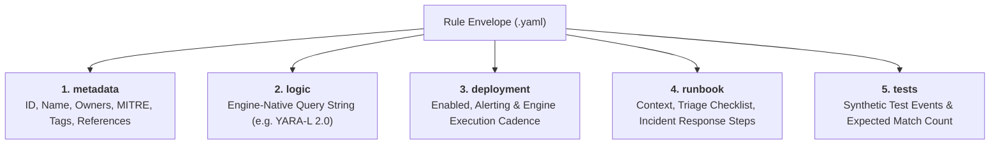
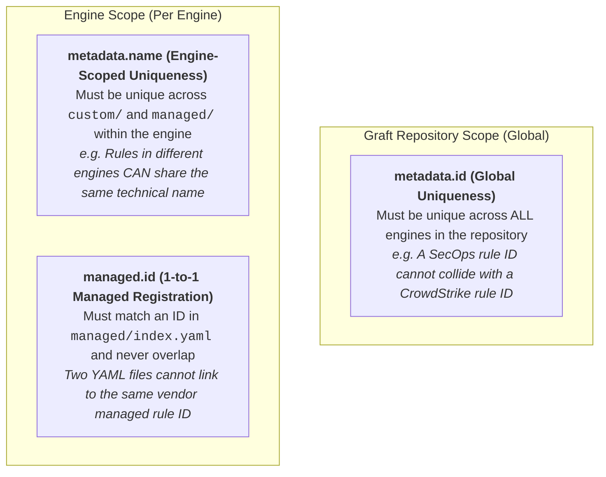
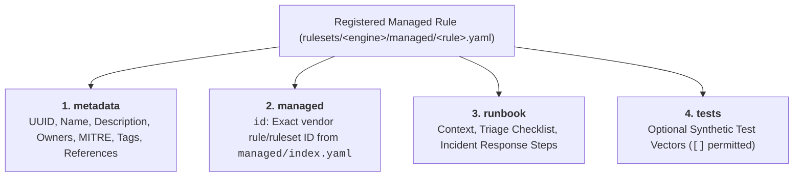

# Detection Rule Authoring Guide

Graft standardizes all custom detection engineering around a declarative **5-Block Envelope** YAML format. Every rule file combines detection logic with metadata, deployment settings, operational runbooks, and synthetic replay test vectors in a single reviewable unit.

---

## 1. The 5-Block Envelope Structure



### Block 1: `metadata`
Core identification, operational ownership, and threat taxonomy mapping. All 7 fields are **required** by the base schema to enforce catalog consistency:

- `id` *(UUID string, required)*: Globally unique identifier (v4 UUID format).
- `name` *(string, required)*: Unique snake_case rule identifier (`^[a-z0-9_]+$`, max 64 chars).
- `description` *(string, required)*: Plain-text explanation of the detection objective (non-blank, max 128 chars).
- `owners` *(list of strings, required, min 1 unique item)*: Teams or individuals operationally accountable for maintaining and tuning the rule (e.g., `Cloud Security Operations`, `Detection Engineering <detection@company.com>`).
- `mitre` *(mapping of tactic to techniques, required, min 1 tactic with min 1 unique technique)*: MITRE ATT&CK Enterprise taxonomy mapping. Must use MITRE's normalized tactic names (lowercase with spaces replaced by dashes, e.g., `initial-access`, `privilege-escalation`, `execution` — see [MITRE Enterprise Tactics](https://attack.mitre.org/tactics/enterprise/)) and real technique IDs (`T1566.002`, `T1098.001`). Validated against the pre-indexed matrix during linting.
- `tags` *(list of strings, required, min 1 unique item)*: Lowercase categorical labels (`^[a-z0-9_/\\-]+$`, e.g., `google_workspace`, `gcp`, `phishing`).
- `references` *(list of strings, required, min 1 unique item)*: Non-blank strings citing threat research URLs, internal design docs, or external/community author attribution.

#### Ownership (`metadata.owners`) vs. Authorship (`git log` & `metadata.references`)
In day-to-day SOC and detection engineering operations, the primary question when a rule misfires, needs tuning, or requires review is **"Who is responsible for maintaining this rule today?"**—not who originally wrote the first draft years ago. For that reason, Graft uses `metadata.owners` to track operational accountability and separates it from historical authorship:

- **Internal Authorship & Contributors:** Since all rules live in Git, the initial author and every subsequent contributor are permanently recorded in version control. `graft export catalog` extracts the initial creator (`author`), creation date (`created_at`), latest revision date (`last_modified_at`), commit count (`review_count`), and unique contributor count (`contributor_count`) automatically via `git log --follow`.
- **External & Community Attribution:** Because `metadata.references` accepts arbitrary non-blank strings (not just URLs), use `references` to credit external threat researchers, blog posts, or upstream community rules (e.g., `"Adapted from Sigma rule by Florian Roth"`, `"https://lopes.id/log/high-fidelity-nrd-detections/"`).

> [!IMPORTANT]
> **Why `priority` and `severity` Are Intentionally Omitted at Detection Time:**
> Hardcoding `priority: high` or `severity: critical` inside static rule YAML files is a widespread industry habit, but **detection authoring time is the wrong lifecycle stage to assign them**:
> - **Priority belongs at Triage time:** Priority dictates *which alert the SOC investigates next* in the queue. That decision depends on runtime environmental context known only when the alert fires—such as target asset criticality, user privilege level, active threat intelligence, or correlated alerts—not a static guess made when the rule was written.
> - **Severity belongs at Response time:** Severity measures the *verified business and operational impact* of a confirmed incident once triage concludes and incident response begins. The exact same detection logic firing on an isolated sandbox VM versus a production domain controller will have completely different incident severities.
>
> If your target engine supports dynamic risk expressions inside the query itself (such as YARA-L's `outcome: $risk_score`), compute context-aware risk dynamically in `logic` rather than hardcoding static `priority` or `severity` labels in `metadata`.

> [!NOTE]
> **Why Static `status` / `maturity` Fields Are Intentionally Omitted:**
> In threat detection engineering, static enum fields like `status: production`, `maturity: mature`, or `lifecycle: testing` inevitably rot. Teams rarely remember to update them when rules evolve, creating administrative toil and a false sense of coverage security ("security theater").
>
> Graft rejects hardcoded maturity labels. Instead, maturity is treated as an **empirical, measurable property** reflected in objective indicators:
> - **VCS Lifecycle & Provenance:** First committer (`author`), first committed date (`created_at`), and latest revision date (`last_modified_at`) normalized to UTC `YYYY-MM-DD`.
> - **Peer Scrutiny:** Total revision history across renames (`review_count`) and breadth of peer review (`contributor_count`).
> - **Operational Ownership & Context:** Accountable rule owners (`owners`) and bus-factor indicator (`owner_count`), unified ATT&CK mappings (`mitre_attack`), and tri-state deployment health (`status: enabled | silent | disabled`).
>
> Graft also deliberately refuses to compute an arbitrary synthetic score (e.g. 0–100) from repo data alone ("no bullshit"). A rule with 10 commits might still produce 10,000 false positives in production. Instead, Graft surfaces these objective indicators via `graft export catalog` so detection engineering teams can join them with external SIEM/SOAR runtime metrics (true-positive rate, precision, alert volume, MTTR) to measure true health.

### Block 2: `logic`
Engine-native detection query string. Each engine adapter compiles and validates this block according to its target query language.
- **Example (Google SecOps):** Contains YARA-L 2.0 sections (`events:`, `match:`, `outcome:`, `condition:`). Graft automatically synthesizes the `rule <name> { meta: ... }` wrapper when sending to Chronicle APIs.

### Block 3: `deployment`
Operational controls governing how the rule runs in the target engine.

- `enabled` *(boolean, required)*: Whether the rule is actively executing against telemetry.
- `alerting` *(boolean, required)*: Whether matches produce SOC alerts or silent detections.
- Engine-specific deployment parameters (for example, `run_frequency: live | hourly | daily | unspecified` in Google SecOps) are validated by the engine's `custom.schema.json`.


### Block 4: `runbook`
Actionable documentation embedded directly alongside detection logic.

- `context` *(string, required)*: Background on the attack technique, adversary objectives, and false positive considerations.
- `triage` *(string, required)*: Step-by-step checklist for the SOC analyst to investigate alerts.
- `response` *(string, required)*: Remediation and containment procedures if malicious activity is confirmed.

### Block 5: `tests`
Synthetic replay test fixtures for automated validation.

> [!NOTE]
> **Experimental Capability:** Synthetic replay tests in rule envelopes are an experimental capability. While schema-validated and parsed by Graft core models, dynamic cloud replay execution requires dedicated staging instances and is subject to SIEM API availability.

- `id` *(string, required)*: Unique test vector identifier (`^[a-z0-9_]+$`).
- `description` *(string, required)*: Objective of this test case.
- `expect` *(integer, required)*: Expected number of detection matches (e.g., `1` for positive tests, `0` for negative tests).
- `events` *(list of objects, required)*: Synthetic event payloads with `timestamp` (ISO 8601) and engine-native event `payload` (e.g. UDM JSON).

---

## 2. Rule Identification & Uniqueness Scoping

To maintain data integrity across multi-engine deployments, audit catalogs, and SIEM migrations, Graft enforces a three-tier uniqueness model:



### 1. Global Scope: `metadata.id`
- **Constraint:** Must be a valid v4 UUID string (`^[0-9a-fA-F]{8}-[0-9a-fA-F]{4}-[0-9a-fA-F]{4}-[0-9a-fA-F]{4}-[0-9a-fA-F]{12}$`) and strictly unique across the entire Graft codebase.
- **Rationale:** The `metadata.id` represents the immutable, canonical identity of the detection concept within the enterprise. It is referenced by audit logs, compliance exports, ATT&CK Navigator heatmaps, and cross-platform SIEM migration tooling. No two rule files in the repository may share an `id`, even if they target completely different detection engines (e.g., Google SecOps vs. CrowdStrike Falcon).

### 2. Engine Scope: `metadata.name`
- **Constraint:** Must be a lowercase alphanumeric snake_case slug (`^[a-z0-9_]+$`, max 64 characters, `"index"` reserved for `managed/index.yaml`) and unique within the target engine (`rulesets/<engine>/custom/` and `rulesets/<engine>/managed/`).
- **Rationale:** The `metadata.name` serves as the native SIEM identifier (such as the YARA-L rule identifier `rule <name> { ... }` in Chronicle or the detection title in other platforms). While two rules in the same engine cannot share a name (which would create an overwrite or catalog collision), rules across different engines **can** share the same `name` (e.g. `rulesets/secops/custom/gcp_iam_service_account_key_create.yaml` and a corresponding `rulesets/crowdstrike/custom/gcp_iam_service_account_key_create.yaml`).

### 3. Engine Scope: `managed.id` (Registered Managed Rules)
- **Constraint:** When registering a vendor-managed rule in `rulesets/<engine>/managed/<rule_name>.yaml`, `managed.id` must match a valid rule/ruleset `id` in `rulesets/<engine>/managed/index.yaml` and be strictly unique (1-to-1) within that engine.
- **Rationale:** Prevents duplicate or conflicting MITRE ATT&CK mappings and runbooks for the same underlying vendor detection.

### 4. Automated Verification
Rule uniqueness is enforced automatically during:
- Local rule linting (`graft lint`).
- Git pre-commit hooks (`.githooks/pre-commit`).
- Pull request CI/CD gates (`.github/workflows/pr-validation.yml`).

---

## 3. Reference Rule Example (Google Workspace)

Below is an authentic reference rule implemented in [`rulesets/secops/custom/workspace_nrd_possible_phishing.yaml`](../../rulesets/secops/custom/workspace_nrd_possible_phishing.yaml):

```yaml
metadata:
  id: "b1d72370-5fa3-4cb8-a579-22a468d6f101"
  name: "workspace_nrd_possible_phishing"
  description: "User opened an email from a domain created within the last 7 days."
  owners:
    - "Joe Lopes <lopes.id>"
    - "Detection Engineering"
  mitre:
    initial-access:
      - "T1566.002"
  tags:
    - "google_workspace"
    - "email"
    - "nrd"
    - "phishing"
    - "whois"
  references:
    - "https://lopes.id/log/high-fidelity-nrd-detections/"
    - "https://support.google.com/a/answer/12384955"

logic: |
  events:
    $mail.metadata.event_type = "EMAIL_TRANSACTION"
    $mail.metadata.product_event_type = "2"
    strings.extract_domain($mail.network.email.from) = $domain

    $whois.graph.entity.domain.name = $domain
    $whois.graph.metadata.entity_type = "DOMAIN_NAME"
    $whois.graph.metadata.vendor_name = "WHOIS"
    $whois.graph.metadata.product_name = "WHOISXMLAPI Simple Whois"
    $whois.graph.metadata.source_type = "GLOBAL_CONTEXT"
    $whois.graph.entity.domain.creation_time.seconds > 0

    // domain was created in the last 7 days: 7 * 24 * 60 * 60 = 604800 seconds
    604800 > timestamp.current_seconds() - $whois.graph.entity.domain.creation_time.seconds

  match:
    $domain over 1h

  outcome:
    $risk_score = 65
    $created_at = array_distinct(timestamp.get_date($whois.graph.entity.domain.creation_time.seconds))
    $sender = array_distinct($mail.network.email.from)
    $recipients = array_distinct($mail.network.email.to)
    $num_messages = count($mail.network.email.mail_id)

  condition:
    $mail and $whois

deployment:
  enabled: true
  alerting: true
  run_frequency: "live"

runbook:
  context: |
    Adversaries frequently register new domains and immediately weaponize them in spear-phishing campaigns before reputation feeds and web categorization tools index them. Correlating Google Workspace message open events with domain registration timestamps isolates zero-day phishing infrastructure.
  triage: |
    1. Identify recipient user account and workstation coordinates.
    2. Review email subject, sender domain WHOIS registrar, and message attachments.
    3. Check if recipient clicked any hyperlinks or submitted credentials.
    4. Search email transaction logs across the organization for other recipients of the same domain.
  response: |
    1. Quarantine the suspicious message across all Workspace inboxes.
    2. Add the sender domain to global perimeter and email blocklists.
    3. If credentials were provided or malicious payload downloaded, initiate host containment and session revocation.

tests:
  - id: "match_opened_nrd_email"
    description: "Triggers when a user opens an email originating from a newly registered domain"
    expect: 1
    events:
      - timestamp: "2026-09-17T14:00:00Z"
        payload:
          metadata:
            event_type: "EMAIL_TRANSACTION"
            product_event_type: "2"
          network:
            email:
              from: "security-update@login-verify-account.top"
              to:
                - "employee@corp.example.com"
              mail_id: "msg-workspace-98214"
      - timestamp: "2026-09-17T14:00:05Z"
        payload:
          graph:
            metadata:
              entity_type: "DOMAIN_NAME"
              vendor_name: "WHOIS"
              product_name: "WHOISXMLAPI Simple Whois"
              source_type: "GLOBAL_CONTEXT"
            entity:
              domain:
                name: "login-verify-account.top"
                creation_time:
                  seconds: 1773700000

  - id: "ignore_standard_unopened_email"
    description: "Verifies no alert triggers when email is received but not opened"
    expect: 0
    events:
      - timestamp: "2026-09-17T14:10:00Z"
        payload:
          metadata:
            event_type: "EMAIL_TRANSACTION"
            product_event_type: "1"
          network:
            email:
              from: "newsletter@trusted-vendor.com"
              to:
                - "employee@corp.example.com"
              mail_id: "msg-workspace-98215"
```

---

## 4. Scaffolding & Offline Validation

### Scaffolding a New Rule

Use `graft secops new` or `graft new rule` to bootstrap a complete 5-block custom rule envelope (or a 4-block registered managed rule envelope via `--managed <id>`) with schema defaults and a unique UUID:

```bash
# Custom rule — SecOps engine shortcut (recommended):
graft secops new gcp_cloud_storage_public_bucket

# Custom rule — Engine-agnostic dispatcher:
graft new rule gcp_cloud_storage_public_bucket --engine secops

# Registered managed rule — Link to an ID from rulesets/secops/managed/index.yaml:
graft secops new gcti_active_breach_network_indicators --managed 433faf9e-4d51-f284-c35b-009528ecff05

# Specify a custom target path:
graft secops new gcp_cloud_storage_public_bucket --out rulesets/secops/custom/tier1/storage.yaml
```

For custom rules, the generated file includes pre-populated runbook sections, deployment defaults (`enabled: false`, `alerting: false`, `run_frequency: "live"`), and a template test fixture.

### Validating Rules Offline

Graft's linter validates JSON Schema constraints, verifies MITRE techniques against the bundled ATT&CK matrix, and cross-checks registered managed rule IDs against `rulesets/<engine>/managed/index.yaml` in milliseconds without network calls:

```bash
# Lint specific rule
graft lint rulesets/secops/custom/workspace_nrd_possible_phishing.yaml

# Lint entire repository
graft lint

# Fail immediately on first error
graft lint --fail-fast

# Output structured JSON diagnostics for CI/CD pipelines
graft --json lint
```

#### Example Linter Output:
```text
[PASS] rulesets/secops/custom/workspace_nrd_possible_phishing.yaml
[PASS] rulesets/secops/custom/gcp_iam_service_account_key_create.yaml
[PASS] rulesets/secops/managed/gcti_active_breach_network_indicators.yaml
[PASS] rulesets/secops/managed/index.yaml
Checked 5 rules across 1 engines. All rules passed validation.
```

When schema constraints or invalid MITRE tactics/techniques are detected:
```text
[FAIL] rulesets/secops/custom/broken_rule.yaml:
  - Schema Error: 'run_frequency' is a required property in 'deployment'
  - MITRE Error: Unknown technique 'T9999.001' under tactic 'initial-access'
Linting failed with 2 error(s).
```

### Optional: Git Pre-Commit Hook

To catch schema violations, invalid YAML, unknown MITRE ATT&CK techniques, and code formatting errors before creating commits, enable the repository's native pre-commit hook:

```bash
git config core.hooksPath .githooks
```

Whenever you run `git commit`, the hook executes `ruff format --check`, `ruff check`, `graft lint`, and `pytest tests/unit` in sub-second time. To disable it at any time:

```bash
git config --unset core.hooksPath
```

---

## 5. Registering Vendor-Managed Rules for Coverage & Runbooks (`rulesets/<engine>/managed/<rule_name>.yaml`)

Security operations teams frequently rely on vendor-managed detections (such as Google Cloud Curated Rule Sets) as an active part of their threat coverage. While `rulesets/<engine>/managed/index.yaml` tracks the engine-specific deployment posture (`PRECISE` vs `BROAD`, `enabled`, `alerting`) and exclusions (`findingsRefinements`), vendor APIs do not store your team's operational ownership, custom SOC triage playbooks, or organization-specific MITRE ATT&CK mappings.

To include vendor-managed rules in MITRE ATT&CK Navigator heatmaps (`graft export matrix`) and governance catalogs (`graft export catalog`), analysts can **optionally register** any managed rule or ruleset from `index.yaml` as a standalone YAML file under `rulesets/<engine>/managed/<rule_name>.yaml`.

### 1. The 4-Block Registered Managed Rule Envelope (`base_managed.schema.json`)

Registered managed rules follow [`base_managed.schema.json`](../../src/graft/core/schemas/base_managed.schema.json), which mirrors the custom rule envelope while replacing `logic` and `deployment` with a `managed` reference block:



- **Why `logic` and `deployment` Are Omitted:** Vendor detection logic is proprietary and black-boxed by the SIEM, and operational activation (`enabled`, `alerting`) is already controlled in `rulesets/<engine>/managed/index.yaml`. Omitting `deployment` from the registered rule file guarantees that `index.yaml` remains the single Source of Truth for deployment status (`enabled | silent | disabled`).
- **Why `tests: []` Is Permitted:** Because analysts cannot inspect or dry-run proprietary vendor query logic locally, `tests` may be an empty list (`[]`) or contain synthetic telemetry vectors for live staging verification.

### 2. How to Find the Managed ID and Register a Rule

1. **Locate the Target ID in `rulesets/<engine>/managed/index.yaml`:**
   Open `rulesets/<engine>/managed/index.yaml` and find the vendor rule or ruleset entry you want to map. Copy its `id` value.
   For example, in [`rulesets/secops/managed/index.yaml`](../../rulesets/secops/managed/index.yaml):
   ```yaml
   categories:
     - name: "Cloud Threats"
       id: "dd01e72c-a66c-c11c-9a59-55b02f1b43b1"
       rulesets:
         - id: "433faf9e-4d51-f284-c35b-009528ecff05"
           name: "GCTI Active Breach Network Indicators"
           deployments:
             - type: PRECISE
               enabled: true
               alerting: true
   ```
   Here, the ruleset ID to use is `433faf9e-4d51-f284-c35b-009528ecff05`.

2. **Scaffold the Registered Managed Rule:**
   Pass `--managed <id>` to `graft <engine> new`:
   ```bash
   graft secops new gcti_active_breach_network_indicators --managed 433faf9e-4d51-f284-c35b-009528ecff05
   ```
   This creates [`rulesets/secops/managed/gcti_active_breach_network_indicators.yaml`](../../rulesets/secops/managed/gcti_active_breach_network_indicators.yaml) with a fresh `metadata.id` UUID and `managed.id: "433faf9e-4d51-f284-c35b-009528ecff05"`.

3. **Document Metadata, MITRE Mappings & Runbook:**
   Fill in `metadata.description`, `owners`, `mitre`, `tags`, `references`, and the SOC `runbook` (`context`, `triage`, `response`).

4. **Validate via `graft lint`:**
   ```bash
   graft lint
   ```
   During linting, Graft automatically verifies:
   - The file conforms to `base_managed.schema.json` and all MITRE ATT&CK techniques are valid.
   - `managed.id` matches an existing entry in `rulesets/<engine>/managed/index.yaml`.
   - No other YAML file in `rulesets/<engine>/managed/` links to the same `managed.id` (strict 1-to-1 mapping).

---

## 6. Decommissioning Rules & Underscore Convention

When a detection is retired, superseded, or taken offline, **do not hard-delete the file**. Deleting rules destroys version history context, runbook guidance, and synthetic test payloads that may be needed for historic incident triage, post-mortems, or compliance audits.

### The `_archived` Standard

Instead, move decommissioned rules into the standardized `_archived/` directory under that ruleset:

```bash
# Decommission a rule by moving it to _archived/
mv rulesets/secops/custom/workspace_nrd_possible_phishing.yaml rulesets/secops/_archived/
git add rulesets/secops/
git commit -m "secops: decommission workspace_nrd_possible_phishing to _archived"
```

### The Underscore (`_`) Exclusion Rule

Graft's rule loader and linter automatically ignore **any directory or file starting with an underscore (`_`)** within `rulesets/<engine>/`. 

This provides operators with flexible organizational options:
- `rulesets/<engine>/_archived/`: Standardized resting place for decommissioned or obsolete rules.
- `rulesets/<engine>/_deprecated/`: Alternative folder for rules pending planned sunset or migration.
- `rulesets/<engine>/_templates/`: Reusable rule scaffolding templates or partial snippets.
- `rulesets/<engine>/_drafts/`: Work-in-progress detection experiments not yet ready for linting or CI/CD gates.

Rules located in underscore-prefixed directories are completely skipped during:
- Rule discovery and loading (`load_rules_for_engine`).
- Schema and MITRE taxonomy linting (`graft lint`).
- Threat coverage matrix generation (`graft export matrix`).
- Visibility catalog exports (`graft export catalog`).
- GitOps reconciliation and deployment (`graft <engine> diff / apply`).

