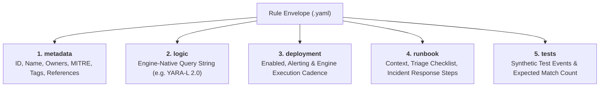
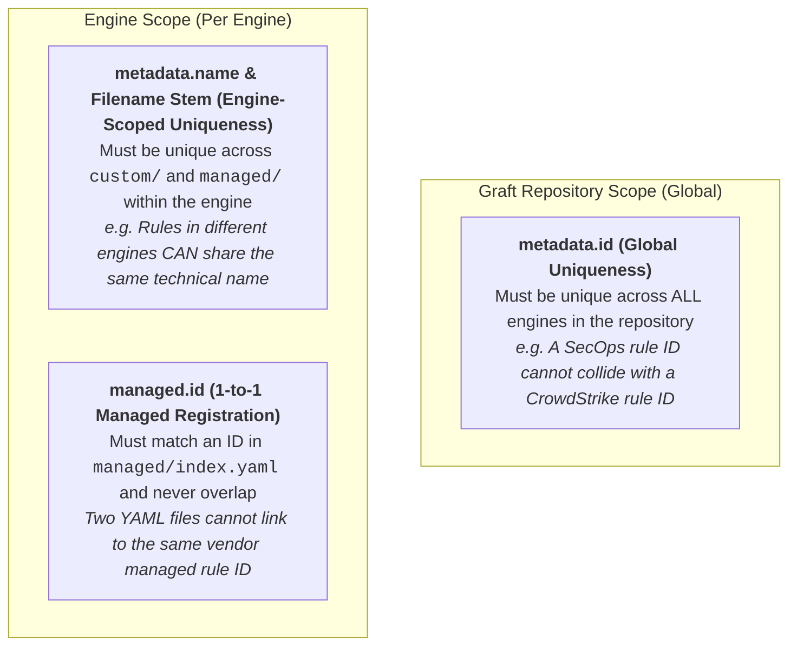
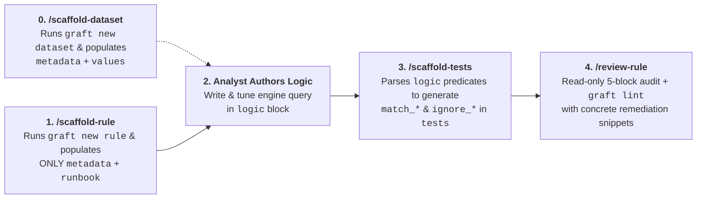
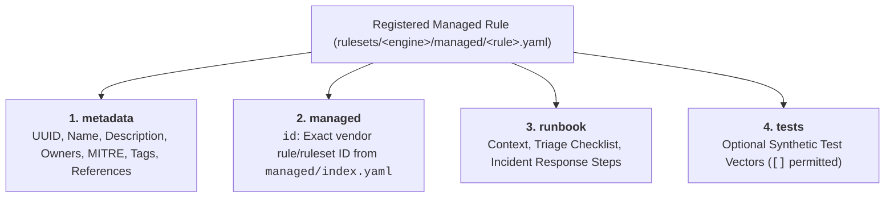
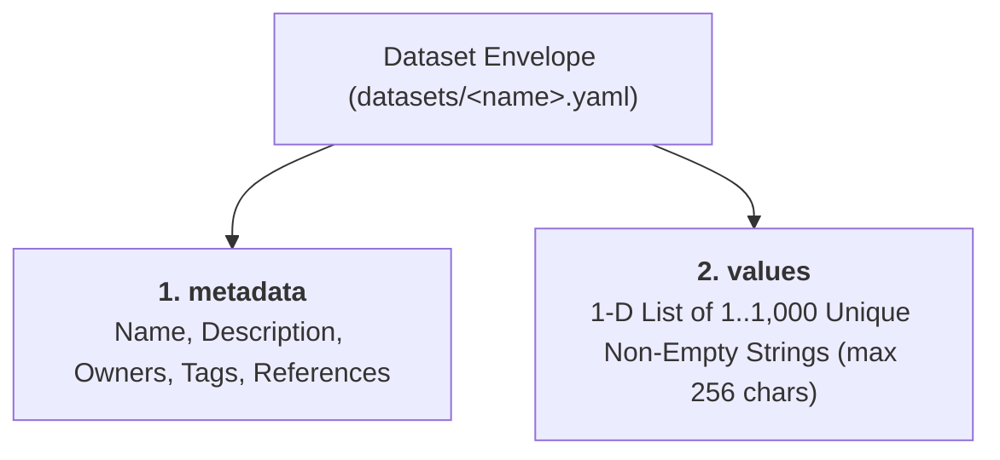

# Detection Rule Authoring Guide

Graft standardizes all custom detection engineering around a declarative **5-Block Envelope** YAML format. Every rule file combines detection logic with metadata, deployment settings, operational runbooks, and synthetic replay test vectors in a single reviewable unit.

---

## 1. The 5-Block Envelope Structure



### Block 1: `metadata`
Core identification, operational ownership, and threat taxonomy mapping. All 7 fields are **required** by the base schema to enforce catalog consistency:

- `id` *(UUID string, required)*: Globally unique identifier (v4 UUID format).
- `name` *(string, required)*: Unique snake_case rule identifier (`^[a-z0-9]+(?:_[a-z0-9]+)*$`, max 64 chars, never starting or ending with `_`, `"index"` reserved) following the `<subject>_<fact>` convention.
- `description` *(string, required)*: Plain-text explanation of the detection objective (non-blank, max 128 chars).
- `owners` *(list of strings, required, min 1 unique item)*: Teams or individuals operationally accountable for maintaining and tuning the rule (e.g., `Cloud Security Operations`, `Detection Engineering <detection@company.com>`).
- `mitre` *(mapping of tactic to techniques, required, min 1 tactic with min 1 unique technique)*: MITRE ATT&CK Enterprise taxonomy mapping. Must use MITRE's normalized tactic names (lowercase with spaces replaced by dashes, e.g., `initial-access`, `privilege-escalation`, `execution` — see [MITRE Enterprise Tactics](https://attack.mitre.org/tactics/enterprise/)) and real technique IDs (`T1566.002`, `T1098.001`). Validated against the pre-indexed matrix during linting.
- `tags` *(list of strings, required, min 1 unique item, max 32)*: Lowercase categorical labels (`^[a-z0-9_/\\-]+$`). Prefer 2–3 broad, reusable platform or telemetry surface labels per rule (e.g., `gcp`, `iam`, `storage`, `workspace`, `email`, `whois`, `gcti`, `network`) so tags aggregate cleanly across the catalog. Avoid one-off rule keywords or duplicating fields already captured elsewhere (`engine`, `rule_type`, or MITRE tactics).
- `references` *(list of strings, required, min 1 unique item)*: Non-blank strings citing threat research URLs, internal design docs, or external/community author attribution.

#### Ownership (`metadata.owners`) vs. Authorship (`git log` & `metadata.references`)
In day-to-day SOC and detection engineering operations, the primary question when a rule misfires, needs tuning, or requires review is **"Who is responsible for maintaining this rule today?"**—not who originally wrote the first draft years ago. For that reason, Graft uses `metadata.owners` to track operational accountability and separates it from historical authorship:

- **Internal Authorship & Contributors:** Since all rules live in Git, the initial author and every subsequent contributor are permanently recorded in version control. `graft export catalog` extracts the initial creator (`author`), creation date (`created_at`), latest revision date (`last_modified_at`), commit count (`review_count`), and unique contributor count (`contributor_count`) automatically via `git log --follow`.
- **External & Community Attribution:** Because `metadata.references` accepts arbitrary non-blank strings (not just URLs), use `references` to credit external threat researchers, blog posts, or upstream community rules (e.g., `"Adapted from Sigma rule by Florian Roth"`, `"https://lopes.id/log/high-fidelity-nrd-detections/"`).

> [!IMPORTANT]
> **Why `priority` and `severity` Are Intentionally Omitted at Detection Time:**
> Hardcoding `priority: high` or `severity: critical` inside static rule YAML files is a widespread industry habit, but **detection authoring time is the wrong lifecycle stage to assign them**:
> - **Priority belongs at Triage time:** Priority dictates *which alert the SOC investigates next* in the queue. That decision depends on runtime environmental context known only when the alert fires—such as target asset criticality, user privilege level, active threat intelligence, or correlated alerts—not a static guess made when the rule was written.
> - **Severity belongs at Response time:** Severity measures the *verified business and operational impact* of a confirmed incident once triage concludes and incident response begins. The exact same detection logic firing on an isolated sandbox VM versus a production domain controller will have completely different incident severities.
>
> If your target engine supports dynamic risk expressions inside the query itself (such as YARA-L's `outcome: $risk_score`), compute context-aware risk dynamically in `logic` rather than hardcoding static `priority` or `severity` labels in `metadata`.

> [!NOTE]
> **Why Static `status` / `maturity` Fields Are Intentionally Omitted:**
> In threat detection engineering, static enum fields like `status: production`, `maturity: mature`, or `lifecycle: testing` inevitably rot. Teams rarely remember to update them when rules evolve, creating administrative toil and a false sense of coverage security ("security theater").
>
> Graft rejects hardcoded maturity labels. Instead, maturity is treated as an **empirical, measurable property** reflected in objective indicators:
> - **VCS Lifecycle & Provenance:** First committer (`author`), first committed date (`created_at`), and latest revision date (`last_modified_at`) normalized to UTC `YYYY-MM-DD`.
> - **Peer Scrutiny:** Total revision history across renames (`review_count`) and breadth of peer review (`contributor_count`).
> - **Operational Ownership & Context:** Accountable rule owners (`owners`) and bus-factor indicator (`owner_count`), unified ATT&CK mappings (`mitre_attack`), and tri-state deployment health (`status: enabled | silent | disabled`).
>
> Graft also deliberately refuses to compute an arbitrary synthetic score (e.g. 0–100) from repo data alone ("no bullshit"). A rule with 10 commits might still produce 10,000 false positives in production. Instead, Graft surfaces these objective indicators via `graft export catalog` so detection engineering teams can join them with external SIEM/SOAR runtime metrics (true-positive rate, precision, alert volume, MTTR) to measure true health.

### Block 2: `logic`
Engine-native detection query string. Each engine adapter compiles and validates this block according to its target query language.
- **Example (Google SecOps):** Contains YARA-L 2.0 sections (`events:`, `match:`, `outcome:`, `condition:`). Graft automatically synthesizes the `rule <name> { meta: ... }` wrapper when sending to Chronicle APIs.

### Block 3: `deployment`
Operational controls governing how the rule runs in the target engine.

- `enabled` *(boolean, required)*: Whether the rule is actively executing against telemetry.
- `alerting` *(boolean, required)*: Whether matches produce SOC alerts or silent detections.
- Engine-specific deployment parameters (for example, `run_frequency: live | hourly | daily | unspecified` in Google SecOps) are validated by the engine's `custom.schema.json`.


### Block 4: `runbook`
Actionable documentation embedded directly alongside detection logic.

- `context` *(string, required)*: Background on the attack technique, adversary objectives, and false positive considerations.
- `triage` *(string, required)*: Step-by-step checklist for the SOC analyst to investigate alerts.
- `response` *(string, required)*: Remediation and containment procedures if malicious activity is confirmed.

### Block 5: `tests`
Synthetic replay test fixtures for automated validation.

> [!NOTE]
> **Experimental Capability:** Synthetic replay tests in rule envelopes are an experimental capability. While schema-validated and parsed by Graft core models, dynamic cloud replay execution requires dedicated staging instances and is subject to SIEM API availability.

- `id` *(string, required)*: Unique test vector identifier (`^[a-z0-9_]+$`).
- `description` *(string, required)*: Objective of this test case.
- `expect` *(integer, required)*: Expected number of detection matches (e.g., `1` for positive tests, `0` for negative tests).
- `events` *(list of objects, required)*: Synthetic event payloads with `timestamp` (ISO 8601) and engine-native event `payload` (e.g. UDM JSON).

---

## 2. Rule Identification, Naming Convention & Uniqueness Scoping

### Rule Naming Convention: `<subject>_<fact>`

Because modern SIEMs correlate telemetry across multiple log sources, entity graphs, and threat intelligence feeds within a single query, prefixing rule names with a rigid log source or broad security domain quickly breaks down. Graft standardizes rule naming around a concise, 2-element **`<subject>_<fact>`** pattern:

1. **`<subject>` (What entity, resource, or artifact was acted upon):**
   - Names the concrete target or artifact at the center of the detection (e.g., `gcp_service_account_key`, `gcp_storage_bucket`, `workspace_nrd_email`, `gcti_breach_network_indicator`, `shimcache`).
2. **`<fact>` (What happened to it, ending in a past-tense verb):**
   - States the observable action or state change that occurred, always finishing with a past-tense verb (e.g., `created`, `public_access_granted`, `opened`, `matched`, `flushed`).

#### Structural Guardrails (Enforced in Code)
Both the rule filename stem (`<stem>.yaml`) and `metadata.name` are enforced by `graft lint`, `graft new`, and the core loader:
- **Character limit:** `1` to `64` characters maximum.
- **Allowed characters & underscore placement:** `^[a-z0-9]+(?:_[a-z0-9]+)*$` — lowercase ASCII letters and digits separated by single underscores (`_`). Names must never start or end with an underscore (`_foo`, `foo_`) and must never contain consecutive underscores (`foo__bar`).
- **Reserved identifier:** `"index"` is prohibited for both filename stems and `metadata.name` (reserved for `rulesets/<engine>/managed/index.yaml`).
- **Filename vs. `metadata.name` decoupling:** By convention (and when scaffolding with `graft new`), a rule's filename stem matches its `metadata.name` (e.g., `workspace_nrd_email_opened.yaml` defines `name: "workspace_nrd_email_opened"`). However, `graft lint` validates them independently and does not require them to match, allowing teams to organize filenames freely if needed while guaranteeing both remain valid and unique per engine.

#### Semantic Guardrails (Authoring Guidelines)
- **Avoid prepositions and connectors:** Strip filler tokens like `_to_`, `_of_`, `_or_`, `_in_`, `_with_`, `_for_`, `_at_`, `_by_`, `_via_`, and `_from_`.
- **Avoid speculative or filler words:** Never include words like `possible`, `suspicious`, `potential`, `activity`, `detected`, `attempt`, `success`, or `alert`. Describe the empirical telemetry fact (`workspace_nrd_email_opened`, not `workspace_nrd_possible_phishing`).
- **Drop redundant product qualifiers:** When the resource is already unambiguous, omit intermediate service labels (`gcp_storage_bucket` instead of `gcp_cloud_storage_iam_bucket`; `gcp_service_account_key` instead of `gcp_iam_service_account_key`).
- **Apply consistently to registered managed rules:** Registered vendor-managed rule envelopes (`rulesets/<engine>/managed/<rule_name>.yaml`) follow the exact same `<subject>_<fact>` naming convention because the vendor's upstream identifier is linked separately via `managed.id`.

#### Examples & Comparison with `chronicle/detection-rules`

| Old Name (`chronicle/detection-rules`) | New Name (`<subject>_<fact>`) | Description |
| :--- | :--- | :--- |
| `google_cloud_service_account_key_created_or_uploaded` | `gcp_service_account_key_created` | User-managed GCP service account key created. |
| `gcp_storage_bucket_opened_to_public` | `gcp_storage_bucket_public_access_granted` | Google Cloud Storage bucket IAM policy modified to grant public access. |
| `whois_recently_created_domain_access` | `workspace_nrd_email_opened` | Google Workspace email opened from a newly registered domain. |
| `gcti_active_breach_network_indicators` *(Curated Ruleset)* | `gcti_breach_network_indicator_matched` | GCTI curated ruleset matching active breach priority network indicators. |
| `windows_application_compatibility_cache_flush_via_rundll32` | `shimcache_flushed` | Windows Application Compatibility Cache (Shimcache) flushed. |
| `windows_Possible_Dcsync_Attempt` | `ad_directory_replication_requested` | Active Directory replication rights requested (DCSync). |
| `Successful_Brute_Force_Attacks_By_User` | `user_login_brute_forced` | Multiple failed logins followed by a successful authentication. |
| `psexec_service_installation_or_execution` | `psexec_service_installed` | PsExec remote service binary installed on host. |

---

### Uniqueness Scoping Model

To maintain data integrity across multi-engine deployments, audit catalogs, and SIEM migrations, Graft enforces a multi-tier uniqueness model:



#### 1. Global Scope: `metadata.id`
- **Constraint:** Must be a valid v4 UUID string (`^[0-9a-fA-F]{8}-[0-9a-fA-F]{4}-[0-9a-fA-F]{4}-[0-9a-fA-F]{4}-[0-9a-fA-F]{12}$`) and strictly unique across the entire Graft codebase.
- **Rationale:** The `metadata.id` represents the immutable, canonical identity of the detection concept within the enterprise. It is referenced by audit logs, compliance exports, ATT&CK Navigator heatmaps, and cross-platform SIEM migration tooling. No two rule files in the repository may share an `id`, even if they target completely different detection engines (e.g., Google SecOps vs. CrowdStrike Falcon).

#### 2. Engine Scope: `metadata.name` & Rule Filename Stem (`<stem>.yaml`)
- **Constraint:** Both `metadata.name` and the YAML filename stem must satisfy `^[a-z0-9]+(?:_[a-z0-9]+)*$` (1–64 characters, `"index"` reserved for `managed/index.yaml`) and be unique across all subdirectories within the target engine (`rulesets/<engine>/custom/` and `rulesets/<engine>/managed/`).
- **Rationale:** The `metadata.name` serves as the native SIEM identifier (such as the YARA-L rule identifier `rule <name> { ... }` in Chronicle or the detection title in other platforms), while engine-scoped filename stem uniqueness prevents ambiguous file collisions across `custom/`, `managed/`, or nested subdirectories. Rules across different engines **can** share the same `name` and filename (e.g. `rulesets/secops/custom/gcp_service_account_key_created.yaml` and a corresponding `rulesets/crowdstrike/custom/gcp_service_account_key_created.yaml`).

#### 3. Engine Scope: `managed.id` (Registered Managed Rules)
- **Constraint:** When registering a vendor-managed rule in `rulesets/<engine>/managed/<rule_name>.yaml`, `managed.id` must match a valid rule/ruleset `id` in `rulesets/<engine>/managed/index.yaml` and be strictly unique (1-to-1) within that engine.
- **Rationale:** Prevents duplicate or conflicting MITRE ATT&CK mappings and runbooks for the same underlying vendor detection.

#### 4. Automated Verification
Rule uniqueness and identifier guardrails are enforced automatically during:
- Local rule linting (`graft lint`).
- Git pre-commit hooks (`.githooks/pre-commit`).
- Pull request CI/CD gates (`.github/workflows/pr-validation.yml`).

---

## 3. Reference Rule Example (Google Workspace)

Below is an authentic reference rule implemented in [`rulesets/secops/custom/workspace_nrd_email_opened.yaml`](../../rulesets/secops/custom/workspace_nrd_email_opened.yaml):

```yaml
metadata:
  id: "b1d72370-5fa3-4cb8-a579-22a468d6f101"
  name: "workspace_nrd_email_opened"
  description: "Google Workspace email opened from a newly registered domain."
  owners:
    - "Joe Lopes"
  mitre:
    initial-access:
      - "T1566.002"
  tags:
    - "workspace"
    - "email"
    - "whois"
  references:
    - "https://lopes.id/log/high-fidelity-nrd-detections/"
    - "https://github.com/chronicle/detection-rules/blob/main/rules/community/threat_intel/whois_recently_created_domain_access.yaral"
    - "https://support.google.com/a/answer/12384955"

logic: |
  events:
    $mail.metadata.log_type = "WORKSPACE_ACTIVITY"
    $mail.metadata.event_type = "EMAIL_TRANSACTION"
    (
      $mail.metadata.product_event_type = "7" or // message opened for the first time
      $mail.metadata.product_event_type = "31"   // message viewed (first and subsequent readings)
    )
    $domain = strings.to_lower(strings.extract_domain($mail.network.email.from))
    $domain != ""

    $whois.graph.entity.domain.name = $domain
    $whois.graph.metadata.entity_type = "DOMAIN_NAME"
    $whois.graph.metadata.vendor_name = "WHOIS"
    $whois.graph.metadata.product_name = "WHOISXMLAPI Simple Whois"
    $whois.graph.metadata.source_type = "GLOBAL_CONTEXT"
    $whois.graph.entity.domain.creation_time.seconds > 0

    // domain was created within 7 days (604800 seconds) prior to the email event
    604800 > $mail.metadata.event_timestamp.seconds - $whois.graph.entity.domain.creation_time.seconds

  match:
    $domain over 1h

  outcome:
    $risk_score = 65
    $created_at = array_distinct(timestamp.get_date($whois.graph.entity.domain.creation_time.seconds))
    $sender = array_distinct($mail.network.email.from)
    $recipients = array_distinct($mail.network.email.to)
    $subjects = array_distinct($mail.network.email.subject)
    $num_messages = count_distinct($mail.network.email.mail_id)
    $num_attachments = array_distinct($mail.additional.fields["num_message_attachments"])
    $dkim = array_distinct($mail.additional.fields["dkim_pass"])
    $spf = array_distinct($mail.additional.fields["spf_pass"])

  condition:
    $mail and $whois

deployment:
  enabled: true
  alerting: true
  run_frequency: "live"

runbook:
  context: "Adversaries frequently register new domains and immediately weaponize them in spear-phishing campaigns before reputation feeds and web categorization tools index them. Correlating Google Workspace message open events with domain registration timestamps isolates zero-day phishing infrastructure."
  triage: |
    1. Identify recipient user account and workstation coordinates.
    2. Review email subject, sender domain WHOIS registrar, SPF/DKIM authentication results, and message attachments.
    3. Check if recipient clicked any hyperlinks or submitted credentials.
    4. Search email transaction logs across the organization for other recipients of the same domain.
  response: |
    1. Quarantine the suspicious message across all Workspace inboxes.
    2. Add the sender domain to global perimeter and email blocklists.
    3. If credentials were provided or malicious payload downloaded, initiate host containment and session revocation.

# EXPERIMENTAL - NOT WORKING
tests:
  - id: "match_opened_nrd_email"
    description: "Triggers when a user opens an email originating from a newly registered domain"
    expect: 1
    events:
      - timestamp: "2026-09-17T14:00:00Z"
        payload:
          metadata:
            log_type: "WORKSPACE_ACTIVITY"
            event_type: "EMAIL_TRANSACTION"
            product_event_type: "7"
          network:
            email:
              from: "security-update@login-verify-account.top"
              to:
                - "employee@corp.example.com"
              subject: "Action Required: Verify Your Workspace Account"
              mail_id: "msg-workspace-98214"
      - timestamp: "2026-09-17T14:00:05Z"
        payload:
          graph:
            metadata:
              entity_type: "DOMAIN_NAME"
              vendor_name: "WHOIS"
              product_name: "WHOISXMLAPI Simple Whois"
              source_type: "GLOBAL_CONTEXT"
            entity:
              domain:
                name: "login-verify-account.top"
                creation_time:
                  seconds: 1789500000

  - id: "ignore_standard_unopened_email"
    description: "Verifies no alert triggers when email is received (product_event_type 2) but not opened"
    expect: 0
    events:
      - timestamp: "2026-09-17T14:10:00Z"
        payload:
          metadata:
            log_type: "WORKSPACE_ACTIVITY"
            event_type: "EMAIL_TRANSACTION"
            product_event_type: "2"
          network:
            email:
              from: "newsletter@trusted-vendor.com"
              to:
                - "employee@corp.example.com"
              subject: "Monthly Product Newsletter"
              mail_id: "msg-workspace-98215"
```

---

## 4. Scaffolding & Offline Validation

### Scaffolding a New Rule or Dataset

Use `graft secops new` or `graft new rule` to bootstrap a complete 5-block custom rule envelope (or a 4-block registered managed rule envelope via `--managed <id>`) with schema defaults and a unique UUID, and `graft new dataset` to bootstrap a 2-block reusable string dataset:

```bash
# Custom rule — SecOps engine shortcut (recommended):
graft secops new gcp_storage_bucket_public_access_granted

# Custom rule — Engine-agnostic dispatcher:
graft new rule gcp_storage_bucket_public_access_granted --engine secops

# Reusable dataset — Engine-agnostic 2-block envelope (datasets/<name>.yaml):
graft new dataset known_scanner_ips

# Registered managed rule — Link to an ID from rulesets/secops/managed/index.yaml:
graft secops new gcti_breach_network_indicator_matched --managed 433faf9e-4d51-f284-c35b-009528ecff05

# Specify a custom target path:
graft secops new gcp_storage_bucket_public_access_granted --out rulesets/secops/custom/tier1/gcp_storage_bucket_public_access_granted.yaml
```

For custom rules, the generated file includes pre-populated runbook sections, deterministic owner attribution from `git config user.name` (falling back to `"Detection Engineer"`), deployment defaults (`enabled: false`, `alerting: false`, `run_frequency: "live"`), and a template test fixture.

### AI-Assisted Rule & Dataset Authoring & Review (`.agents/skills/`)

Graft ships four composable, single-responsibility AI agent skills under [`.agents/skills/`](../../.agents/skills/) that pair LLM reasoning with deterministic CLI guardrails (`graft new dataset`, `graft new rule`, and `graft lint`):



- **[`/scaffold-dataset`](../../.agents/skills/scaffold-dataset/SKILL.md)**: Accepts a natural-language dataset concept (or an existing `datasets/<name>.yaml` path), derives a plural noun phrase `<context>_<entity_plural>` identifier, runs `uv run graft new dataset <name>`, populates `metadata` and `values` (preserving inline `#` comments for contextual traceability), and validates via `uv run graft lint`.
- **[`/scaffold-rule`](../../.agents/skills/scaffold-rule/SKILL.md)**: Accepts a natural-language detection concept (or an existing `.yaml` rule path), derives a `<subject>_<fact>` identifier, runs `uv run graft new rule <name> --engine <engine>` (or `--managed <id>`), and populates **only `metadata` and `runbook`** (preserving the generated UUIDv4, Git owner, `logic`, `deployment`, and `tests`), followed by `uv run graft lint`.
- **[`/scaffold-tests`](../../.agents/skills/scaffold-tests/SKILL.md)**: Reads the authored `logic` block of a custom rule and populates **only the `tests` block** with positive (`id: "match_*"`, `expect: 1`) and negative (`id: "ignore_*"`, `expect: 0`) synthetic event vectors matching the query's predicates, joins, and time windows, followed by `uv run graft lint`.
- **[`/review-rule`](../../.agents/skills/review-rule/SKILL.md)**: Performs a read-only audit of one or more rule files across all 5 blocks against this guide's structural and semantic guardrails (including `%<dataset>.value` cross-checks), running `uv run graft lint` and outputting a `PASS / WARN / FAIL` table with suggested fixes.

### Validating Rules & Datasets Offline

Graft's linter validates JSON Schema constraints, verifies MITRE techniques against the bundled ATT&CK matrix, cross-checks `%<name>.value` dataset references in custom rule logic against `datasets/<name>.yaml`, and verifies registered managed rule IDs against `rulesets/<engine>/managed/index.yaml` in milliseconds without network calls:

```bash
# Lint specific rule or dataset
graft lint rulesets/secops/custom/workspace_nrd_email_opened.yaml
graft lint datasets/known_scanner_ips.yaml

# Lint entire repository (datasets/ + rulesets/)
graft lint

# Fail immediately on first error
graft lint --fail-fast

# Output structured JSON diagnostics for CI/CD pipelines
graft --json lint
```

#### Example Linter Output:
```text
[PASS] datasets/known_scanner_ips.yaml
[PASS] datasets/security_assessment_ips.yaml
[PASS] rulesets/secops/custom/multiple_hosts_scanned.yaml
[PASS] rulesets/secops/custom/multiple_ports_scanned.yaml
[PASS] rulesets/secops/custom/workspace_nrd_email_opened.yaml
[PASS] rulesets/secops/custom/gcp_service_account_key_created.yaml
[PASS] rulesets/secops/managed/gcti_breach_network_indicator_matched.yaml
[PASS] rulesets/secops/managed/index.yaml
Checked 9 files across 1 engines. All files passed validation.
```

When schema constraints or invalid MITRE tactics/techniques are detected:
```text
[FAIL] rulesets/secops/custom/broken_rule.yaml:
  - Schema Error: 'run_frequency' is a required property in 'deployment'
  - MITRE Error: Unknown technique 'T9999.001' under tactic 'initial-access'
Linting failed with 2 error(s).
```

### Optional: Git Pre-Commit Hook

To catch schema violations, invalid YAML, unknown MITRE ATT&CK techniques, and code formatting errors before creating commits, enable the repository's native pre-commit hook:

```bash
git config core.hooksPath .githooks
```

Whenever you run `git commit`, the hook executes `ruff format --check`, `ruff check`, `graft lint`, and `pytest tests/unit` in sub-second time. To disable it at any time:

```bash
git config --unset core.hooksPath
```

---

## 5. Registering Vendor-Managed Rules for Coverage & Runbooks (`rulesets/<engine>/managed/<rule_name>.yaml`)

Security operations teams frequently rely on vendor-managed detections (such as Google Cloud Curated Rule Sets) as an active part of their threat coverage. While `rulesets/<engine>/managed/index.yaml` tracks the engine-specific deployment posture (`PRECISE` vs `BROAD`, `enabled`, `alerting`) and exclusions (`findingsRefinements`), vendor APIs do not store your team's operational ownership, custom SOC triage playbooks, or organization-specific MITRE ATT&CK mappings.

To include vendor-managed rules in MITRE ATT&CK Navigator heatmaps (`graft export matrix`) and governance catalogs (`graft export catalog`), analysts can **optionally register** any managed rule or ruleset from `index.yaml` as a standalone YAML file under `rulesets/<engine>/managed/<rule_name>.yaml`.

### 1. The 4-Block Registered Managed Rule Envelope (`base_managed.schema.json`)

Registered managed rules follow [`base_managed.schema.json`](../../src/graft/core/schemas/base_managed.schema.json), which mirrors the custom rule envelope while replacing `logic` and `deployment` with a `managed` reference block:



- **Why `logic` and `deployment` Are Omitted:** Vendor detection logic is proprietary and black-boxed by the SIEM, and operational activation (`enabled`, `alerting`) is already controlled in `rulesets/<engine>/managed/index.yaml`. Omitting `deployment` from the registered rule file guarantees that `index.yaml` remains the single Source of Truth for deployment status (`enabled | silent | disabled`).
- **Why `tests: []` Is Permitted:** Because analysts cannot inspect or dry-run proprietary vendor query logic locally, `tests` may be an empty list (`[]`) or contain synthetic telemetry vectors for live staging verification.

### 2. How to Find the Managed ID and Register a Rule

1. **Locate the Target ID in `rulesets/<engine>/managed/index.yaml`:**
   Open `rulesets/<engine>/managed/index.yaml` and find the vendor rule or ruleset entry you want to map. Copy its `id` value.
   For example, in [`rulesets/secops/managed/index.yaml`](../../rulesets/secops/managed/index.yaml):
   ```yaml
   categories:
     - name: "Cloud Threats"
       id: "dd01e72c-a66c-c11c-9a59-55b02f1b43b1"
       rulesets:
         - id: "433faf9e-4d51-f284-c35b-009528ecff05"
           name: "GCTI Active Breach Network Indicators"
           deployments:
             - type: PRECISE
               enabled: true
               alerting: true
   ```
   Here, the ruleset ID to use is `433faf9e-4d51-f284-c35b-009528ecff05`.

2. **Scaffold the Registered Managed Rule:**
   Pass `--managed <id>` to `graft <engine> new`:
   ```bash
   graft secops new gcti_breach_network_indicator_matched --managed 433faf9e-4d51-f284-c35b-009528ecff05
   ```
   This creates [`rulesets/secops/managed/gcti_breach_network_indicator_matched.yaml`](../../rulesets/secops/managed/gcti_breach_network_indicator_matched.yaml) with a fresh `metadata.id` UUID and `managed.id: "433faf9e-4d51-f284-c35b-009528ecff05"`.

3. **Document Metadata, MITRE Mappings & Runbook:**
   Fill in `metadata.description`, `owners`, `mitre`, `tags`, `references`, and the SOC `runbook` (`context`, `triage`, `response`).

4. **Validate via `graft lint`:**
   ```bash
   graft lint
   ```
   During linting, Graft automatically verifies:
   - The file conforms to `base_managed.schema.json` and all MITRE ATT&CK techniques are valid.
   - `managed.id` exists in `rulesets/<engine>/managed/index.yaml`.
   - No other YAML file in `rulesets/<engine>/managed/` links to the same `managed.id` (strict 1-to-1 mapping).

---

## 6. Engine-Agnostic Datasets (`datasets/<name>.yaml`)

Detection rules frequently rely on contextual lists—such as authorized vulnerability scanner IPs, security assessment source addresses, VIP accounts, or corporate egress ranges—to suppress benign operational noise or enrich high-priority alerts. Rather than maintaining duplicate lookup tables manually across SIEM consoles, Graft tracks reusable string lists in `datasets/<name>.yaml` as a cross-engine Source of Truth.

### 1. The 2-Block Dataset Envelope (`base_dataset.schema.json`)

Every dataset file in `datasets/<name>.yaml` is validated against [`base_dataset.schema.json`](../../src/graft/core/schemas/base_dataset.schema.json) and consists of two top-level blocks:



- **`metadata`**:
  - `name` *(string, required)*: Snake_case dataset identifier (`^[a-z][a-z0-9]*(?:_[a-z0-9]+)*$`, `1..64` chars, `"index"` reserved). Must start with a lowercase letter (`[a-z]`) for compatibility with SIEM table resource identifiers and **must strictly match the YAML filename stem** (`datasets/<name>.yaml`).
  - `description` *(string, required)*: Plain-text explanation of what the dataset contains (`1..128` chars). Synced directly to the target SIEM table description.
  - `owners` *(list of strings, required, min 1 unique item)*: Teams or individuals accountable for maintaining the list.
  - `tags` *(list of strings, required, 1..32 unique items)*: Lowercase categorical labels (`^[a-z0-9_/\\-]+$`).
  - `references` *(list of strings, required, 1..32 unique items)*: Non-blank strings citing ticket links, internal inventory docs, or runbooks.
- **`values`**:
  - Required 1-D list of `1..1,000` unique, non-empty literal strings (`minLength: 1`, `maxLength: 256`, `uniqueItems: true`).
  - Raw YAML lines inside `datasets/<name>.yaml` may be up to `512` characters long (`MAX_DATASET_RAW_LINE_LEN = 512`) so operators can annotate entries with inline `#` YAML comments (e.g., `- "10.240.10.15"  # Primary US-East Qualys appliance`) without inflating the parsed string sent to the SIEM.
  - **Intentional String-Only Design:** Graft datasets intentionally omit a `type` field (`cidr`, `regex`, multi-column schemas). All values are synchronized as literal strings into a single canonical column named **`value`**. Multi-column CMDB tables or CIDR/regex lookup tables can live directly on the SIEM; Graft's additive coexistence model never flags or deletes unmanaged SIEM tables.

### 2. Dataset Naming Convention: Plural Noun Phrase (`<context>_<entity_plural>`)

While detection rules describe an empirical event and follow `<subject>_<fact>` ending in a past-tense verb (`multiple_hosts_scanned`), a dataset represents a **collection of entities or indicators**. Datasets therefore follow a **plural noun phrase (`<context>_<entity_plural>`)** convention:

| Pattern | Dataset Name (`<context>_<entity_plural>`) | Description |
| :--- | :--- | :--- |
| `<context>_ips` | `known_scanner_ips` | Internal vulnerability management scanner IP addresses. |
| `<context>_ips` | `security_assessment_ips` | Authorized red-team and penetration testing source IP addresses. |
| `<context>_users` | `privileged_admin_users` | Break-glass and tier-0 administrative user identifiers. |
| `<context>_domains` | `partner_federated_domains` | Trusted B2B partner email and authentication domains. |
| `<context>_hosts` | `jumpbox_bastion_hosts` | Authorized administrative jumpbox hostnames. |

### 3. Referencing Datasets in Rules & Offline Cross-Validation (`graft lint`)

In Google SecOps YARA-L 2.0 rules, Graft datasets are synchronized as Data Tables with a single `STRING` column named `value` and referenced using `%<dataset_name>.value`:

```yaml
# datasets/known_scanner_ips.yaml
metadata:
  name: "known_scanner_ips"
  description: "Internal vulnerability management scanner IP addresses excluded from scan detections."
  owners:
    - "Detection Engineering"
  tags:
    - "network"
    - "scanners"
  references:
    - "https://lopes.id/log/detection-rules-netscan-portscan/"

values:
  - "10.240.10.15"  # Primary US-East vulnerability scanner
  - "10.240.10.16"  # Secondary US-West vulnerability scanner
  - "172.16.100.50" # Internal DMZ compliance scanner
```

Referenced inside [`rulesets/secops/custom/multiple_hosts_scanned.yaml`](../../rulesets/secops/custom/multiple_hosts_scanned.yaml):

```yaml
logic: |
  events:
    $net.metadata.event_type = "NETWORK_CONNECTION"
    $net.principal.ip != ""
    $net.target.ip != ""
    not $net.principal.ip in %known_scanner_ips.value
    not $net.principal.ip in %security_assessment_ips.value
    $src_ip = $net.principal.ip
    $dst_ip = $net.target.ip

  match:
    $src_ip over 5m

  outcome:
    $unique_target_ip_count = count_distinct($dst_ip)

  condition:
    $net and $unique_target_ip_count > 10
```

During `graft lint`, Graft cross-validates custom rule logic against all local datasets in `datasets/`:
- **Column Check:** If `<name>` exists in `datasets/<name>.yaml`, any `%<name>` reference in rule logic must access `.value` (`%<name>.value`). Bare `%<name>` or unknown columns (`%<name>.ip`) fail linting immediately.
- **Operator Check:** Because Graft datasets are literal `STRING` lists, referencing a local Graft dataset with `in cidr %<name>...` or `in regex %<name>...` fails linting with a clear diagnostic.
- **Additive Coexistence for Unmanaged SIEM Tables:** If a rule references `%external_cmdb_table.cidr_range` and `external_cmdb_table` is *not* in `datasets/`, `graft lint` passes silently so rules can freely reference complex native SIEM Data Tables managed outside Graft.

---

## 7. Decommissioning Rules & Datasets & Underscore Convention

When a detection rule or dataset is retired, superseded, or taken offline, **do not hard-delete the file**. Deleting artifacts destroys version history context, runbook guidance, and synthetic test payloads that may be needed for historic incident triage, post-mortems, or compliance audits.

### The `_archived` Standard

Instead, move decommissioned rules or datasets into the standardized `_archived/` directory:

```bash
# Decommission a rule by moving it to rulesets/<engine>/_archived/
mv rulesets/secops/custom/workspace_nrd_email_opened.yaml rulesets/secops/_archived/

# Decommission a dataset by moving it to datasets/_archived/
mv datasets/security_assessment_ips.yaml datasets/_archived/
```

### The Underscore (`_`) Exclusion Rule

Graft's loader and linter automatically ignore **any directory or file starting with an underscore (`_`)** within `rulesets/<engine>/` and `datasets/`.

This provides operators with flexible organizational options:
- `rulesets/<engine>/_archived/` & `datasets/_archived/`: Standardized resting places for decommissioned or obsolete rules and datasets.
- `rulesets/<engine>/_deprecated/`: Alternative folder for rules pending planned sunset or migration.
- `rulesets/<engine>/_templates/`: Reusable rule scaffolding templates or partial snippets.
- `rulesets/<engine>/_drafts/`: Work-in-progress detection experiments not yet ready for linting or CI/CD gates.

Artifacts located in underscore-prefixed directories are completely skipped during:
- Rule and dataset discovery and loading (`load_rules_for_engine`, `load_datasets`).
- Schema, MITRE taxonomy, and dataset cross-reference linting (`graft lint`).
- Threat coverage matrix generation (`graft export matrix`).
- Visibility catalog exports (`graft export catalog`).
- GitOps reconciliation and deployment (`graft <engine> diff / apply`).

