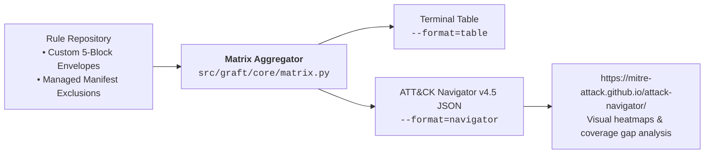

# Visibility, Threat Matrix & Catalog Tooling

Graft turns detection repositories into high-visibility threat coverage assets. Security leadership, SOC managers, and compliance auditors can assess coverage, review authorship, and export catalogs directly from the command line.

---

## 1. MITRE ATT&CK Enterprise v19.2 Matrix & Navigator Export

Graft aggregates technique mappings across all rules (custom detections and vendor-managed content) and generates coverage reporting pinned to MITRE ATT&CK Enterprise v19.2.



### 1. Terminal Table Summary
View an immediate ASCII breakdown of covered techniques, associated tactics, and rule counts:

```bash
graft export matrix --format table
# or filtered by engine:
graft export matrix --format table --engine secops
```

**Example Output:**
```text
MITRE ATT&CK Detection Matrix (Total Rules: 3 | Covered Techniques: 4)
==========================================================================================
Technique ID    Technique Name                   Rules   Rules / Detections
------------------------------------------------------------------------------------------
T1078.004       Cloud Accounts                   1       gcp_storage_iam_public_access...
T1098.001       Additional Cloud Credentials     1       gcp_iam_service_account_key_c...
T1685           Disable or Modify Tools          1       gcp_storage_iam_public_access...
T1566.002       Spearphishing Link               1       workspace_nrd_possible_phishing
------------------------------------------------------------------------------------------
```

### 2. Official ATT&CK Navigator v4.5 Layer Export
Generate JSON layers adhering to the MITRE ATT&CK Navigator specification (version 4.5) with coverage scores, customizable gradient colors, and rich rule annotations:

```bash
# Export unified catalog layer (default greenish gradient: #008744)
graft export matrix --format navigator --out exports/graft_coverage.json

# Export engine-scoped layer with custom gradient color
graft export matrix --format navigator --engine secops --color "#4285F4" --out exports/secops_coverage.json
```

Import `exports/graft_coverage.json` directly into the [MITRE ATT&CK Navigator Web App](https://mitre-attack.github.io/attack-navigator/) to visualize detection coverage heatmaps, identify visibility gaps, and present metrics to stakeholders.

### 3. Multi-Engine Gap Analysis in MITRE Navigator
Operators managing hybrid detection platforms (e.g. Google SecOps and endpoint security) can export distinct layers per engine using `--engine <name>` and `--color <hex>`, then leverage Navigator's layer combination arithmetic for automated gap analysis.

For an in-depth breakdown of Navigator layer expressions and visual gap analysis, see:
👉 **[Gap Analysis with MITRE Navigator](https://lopes.id/log/gap-analysis-mitre-navigator/)**

Each technique in the exported layer is scoped strictly to its tactic shortname (e.g. `initial-access`, `defense-impairment`) with `selectTechniquesAcrossTactics: false`, ensuring scores remain locked to their appropriate tactic column. Combining layers using Navigator's **Create Layer from Other Layers** feature enables:
- **Redundancy Evaluation (`min(a, b)`):** Highlights techniques defended by multiple engines simultaneously.
- **Combined Coverage (`max(a, b)`):** Surfaces the complete detection footprint.
- **Normalized Gap Analysis (`1 + 4 * (1 - (max(a, b) * (1 - min(a, b))))`):** Normalizes coverage to a 1–5 scale where score 1 exposes single-engine dependencies as high-priority blind spots, while score 5 rewards defense-in-depth redundancy.

---

## 2. Git Blame & Author Attribution

Graft tracks the provenance of every detection rule without external Git libraries. Using Python's standard library `subprocess`, the attribution service extracts:

- **Creation Author & Timestamp:** Determined via `git log --diff-filter=A --follow --format=%an|%aI`.
- **Last Modified Author & Timestamp:** Extracted via `git log -n 1 --format=%an|%aI`.
- **Commit Revision Count:** Extracted via `git rev-list --count HEAD`.
- **Contributor Breadth:** Count of distinct Git authors touching the file.
- **Offline / Untracked Fallback:** Automatically falls back to `"Unknown"` and rule YAML metadata if files are uncommitted or executed in environments lacking Git history (e.g. Docker containers).

---

## 3. Rule Catalog Generation

Export comprehensive detection catalogs enriched with deployment status, MITRE ATT&CK associations, and Git author attribution across multiple formats.

### Terminal Table (`--format=table`, Default)
Fast, on-screen inspection without piping to files:

```bash
graft export catalog
```

### Markdown Catalog (`--format=markdown`)
Ideal for automated documentation generation and repository wiki tracking:

```bash
graft export catalog --format=markdown --out docs/RULE_CATALOG.md
```

| Rule Name | Engine | Type | Status | MITRE ATT&CK | Author | Last Updated | Reviews |
| --- | --- | --- | --- | --- | --- | --- | --- |
| `gcp_iam_service_account_key_create` | secops | custom | enabled | TA0003:T1098; TA0003:T1098.001; TA0004:T1078.004 | Cloud Security Operations | 2026-09-17 | 3 |
| `gcp_storage_iam_public_access_granted` | secops | custom | enabled | TA0004:T1078.004; TA0112:T1685 | Cloud Security Operations | 2026-09-17 | 2 |
| `workspace_nrd_possible_phishing` | secops | custom | enabled | TA0001:T1566.002 | Joe Lopes <lopes.id> | 2026-09-17 | 4 |

### CSV Catalog (`--format=csv`)
Generate spreadsheet-ready exports for security audits and reporting pipelines:

```bash
graft export catalog --format=csv --out exports/detection_catalog.csv
```

CSV exports contain 14 normalized fields:
`id, name, engine, rule_type, status, description, mitre_attack, tags, author, created_at, last_modified_at, review_count, contributor_count, has_runbook`.

### JSON Catalog (`--format=json`)
Structured JSON for feeding security data lakes, BigQuery, or internal developer portals:

```bash
graft export catalog --format=json
```
