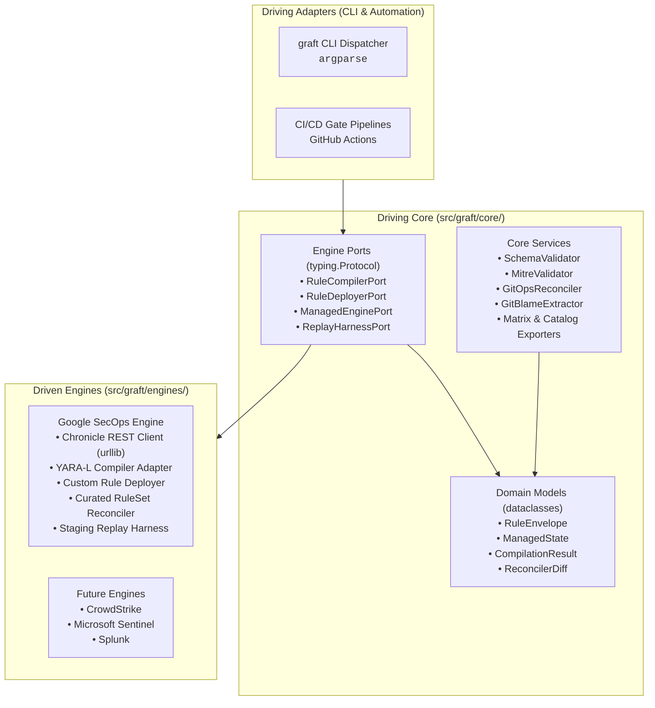
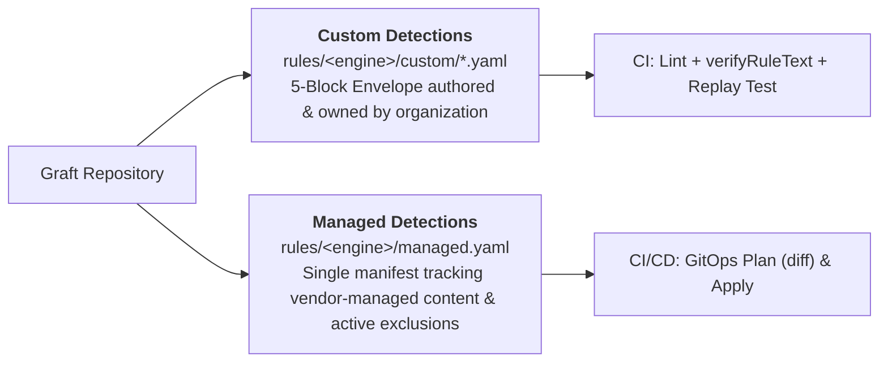
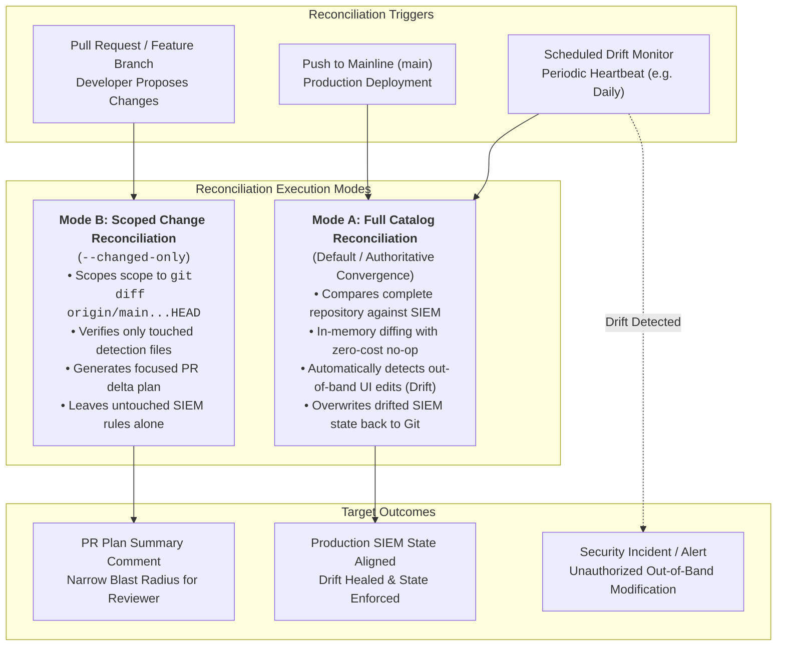

# Graft Architecture & System Design

Graft is an extensible, vendor-agnostic Detection-as-Code (DaC) platform engineered around strict **Hexagonal Architecture (Ports & Adapters)** and a **Stdlib-First** runtime discipline.

---

## 1. Architectural Philosophy: Hexagonal Boundaries

In Graft, detection business logic, domain models, schema validators, and governance tools remain 100% engine-agnostic. The core never adapts to an external SIEM or detection engine; engines adapt to Core via port contracts.

### Layer Responsibilities

- **Driving Adapters (`src/graft/cli/`):** Command-line routing using Python standard library `argparse`. Translates terminal flags into core service calls and dispatches to registered engine commands.
- **Driving Core (`src/graft/core/`):** Pure Python domain logic. Zero imports of cloud SDKs, SIEM client libraries, or HTTP frameworks. Contains domain models, schema validators, STIX MITRE matrices, Git blame extractors, and export generators.
- **Engine Ports (`src/graft/core/ports/`):** Abstract `typing.Protocol` interfaces defining exact capabilities an engine adapter must provide:
  - [`RuleCompilerPort`](file:///usr/local/google/home/joelopes/Projects/graft/src/graft/core/ports/compiler.py): Syntax validation and compilation diagnostics.
  - [`RuleDeployerPort`](file:///usr/local/google/home/joelopes/Projects/graft/src/graft/core/ports/deployer.py): Rule CRUD and live state toggle.
  - [`ManagedEnginePort`](file:///usr/local/google/home/joelopes/Projects/graft/src/graft/core/ports/managed.py): Vendor-managed content synchronization and exclusion management.
  - [`ReplayHarnessPort`](file:///usr/local/google/home/joelopes/Projects/graft/src/graft/core/ports/replay.py): Synthetic event ingestion and quarantined rule evaluation.
- **Driven Engines (`src/graft/engines/`):** Concrete engine adapters implementing port interfaces. Adapters carry the complete burden of translating external vendor APIs, authenticating, and mapping domain envelopes to engine-native formats.

---

## 2. Stdlib-First Runtime Discipline

Graft enforces a strict zero-dependency runtime standard. Third-party dependencies are restricted to:
1. `pyyaml`: YAML parsing and emission.
2. `jsonschema`: JSON Schema Draft 2020-12 validation.

All other capabilities use Python >= 3.13 standard libraries:
- HTTP Client: `urllib.request` and `urllib.error` (no `requests`, no `httpx`).
- CLI Framework: `argparse` (no `click`, no `typer`).
- Data Models: `dataclasses` (no `pydantic` in core).
- VCS & Process Execution: `subprocess` and `shutil`.
- Reporting & Formats: `csv`, `json`, `hashlib`, `uuid`.

---

## 3. Dual-Track Content Governance

Graft organizes detection content into two distinct tracks:

- **Track 1: Custom Rules (`rules/<engine>/custom/*.yaml`):** Bespoke organizational detections packaged in the 5-block envelope (`metadata`, `logic`, `deployment`, `runbook`, `tests`).
- **Track 2: Vendor-Managed Content (`rules/<engine>/managed.yaml`):** Single declarative manifest tracking deployment state (`PRECISE` vs `BROAD`, `enabled`, `alerting`) and active exclusions for vendor-provided rulesets (e.g., Google Curated Rule Sets).

---

## 4. GitOps Reconciliation Framework: Mode A vs. Mode B

Graft is engineered on the principle that **the Git repository is the single authoritative source of truth for detection state**. When a discrepancy exists between what is committed to Git and what is currently active in the SIEM/EDR, Git always wins.

To balance authoritative state convergence against PR safety and blast radius, Graft establishes a formal **dual-mode reconciliation contract** that every engine adapter must implement:

### Mode A: Full Catalog Reconciliation (Authoritative Convergence)

- **Purpose:** Enforces absolute convergence between the Git repository and the production SIEM tenant.
- **When Used:**
  - **Post-Merge Deployments:** Automatically executed on every push to `main` via `deploy-production.yml`.
  - **Scheduled Drift Monitoring:** Executed by periodic automation (e.g. hourly or daily cron) to monitor tenant integrity.
- **Drift Auto-Healing Mechanics:**
  - Graft fetches the current live state of all rules and managed configurations from the target SIEM API.
  - It performs in-memory content and deployment state diffing against the entire local repository inventory.
  - If an analyst, attacker, or automation script modifies a rule out-of-band in the SIEM console (e.g. disables alerting, modifies filter logic, or removes an exclusion):
    1. `diff` flags the rule as drifted (`rules_to_update`).
    2. `apply` automatically issues API update calls (`PATCH`) to overwrite the SIEM state and restore Git's desired state.
- **Zero-Cost No-Op Guarantee:**
  - Even though Graft compares the entire catalog, **it only invokes write APIs for rules that have drifted or changed**.
  - Rules whose live state matches the repository definition trigger zero API requests, minimizing network latency, rate limits, and SIEM revision churn.

### Mode B: Scoped Change Reconciliation (`--changed-only`)

- **Purpose:** Restricts reconciliation to detection files modified within the current working branch or pull request.
- **When Used:**
  - **Pull Request Review & Validation:** Executed during PR validation workflows ([`pr-validation.yml`](file:///usr/local/google/home/joelopes/Projects/graft/.github/workflows/pr-validation.yml)) and local pre-commit checks.
  - **Targeted Operations:** Used by operators executing tactical hotfixes on specific rule files via `--changed-only` or `--files <path>...`.
- **Operational Rationale:**
  - **Narrow Blast Radius:** Prevents a PR targeting rule `A` from inadvertently reverting an active, temporary out-of-band hotfix on rule `B` in the SIEM console.
  - **Review Ergonomics:** The PR plan diff comment displays only the changes introduced by the author's branch, avoiding noise from unrelated tenant drifts.

### Summary Comparison

| Capability | Mode A: Full Reconciliation (Default) | Mode B: Scoped Reconciliation (`--changed-only`) |
| :--- | :--- | :--- |
| **Trigger Pipeline** | `push` to `main`, Scheduled Drift Cron | `pull_request`, local branch checks |
| **Evaluation Scope** | Complete repository catalog (`rules/`) | Modified files in `git diff` against base |
| **Drift Behavior** | Overwrites and heals out-of-band SIEM edits | Ignores untouched drifted rules |
| **API Cost** | 1 read batch + N writes for drifted rules | 1 read batch + N writes for touched rules |
| **Guaranteed State** | Complete SIEM alignment with `main` | Author's changes verified & previewed |

