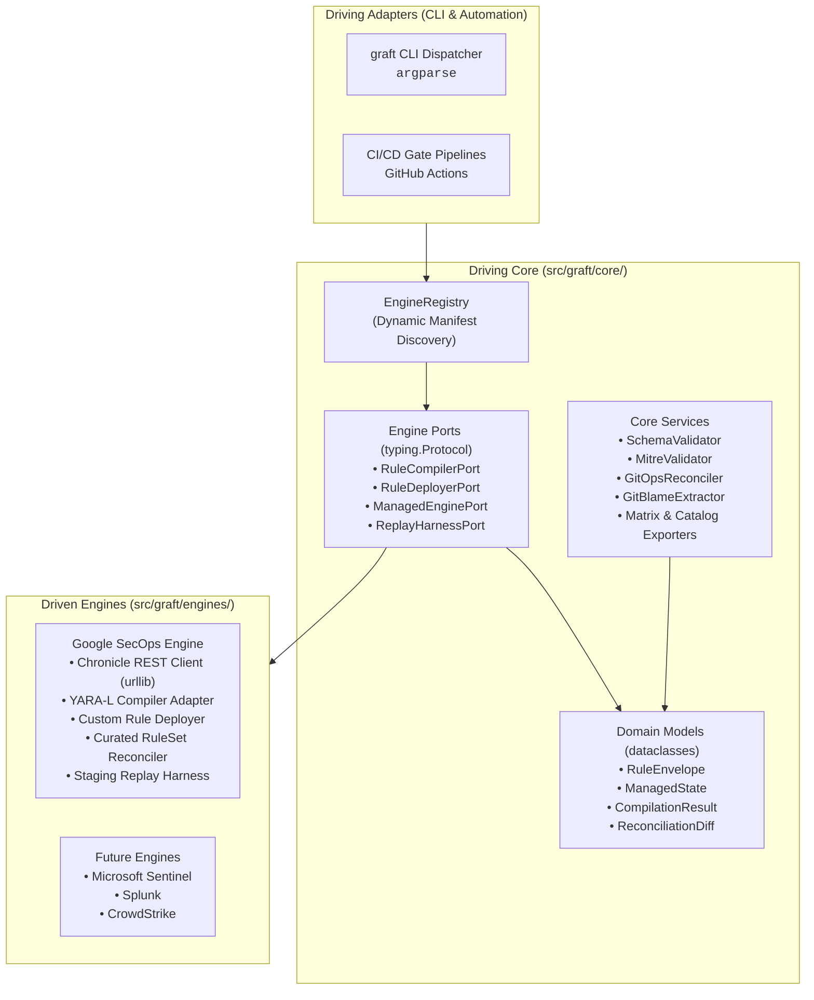
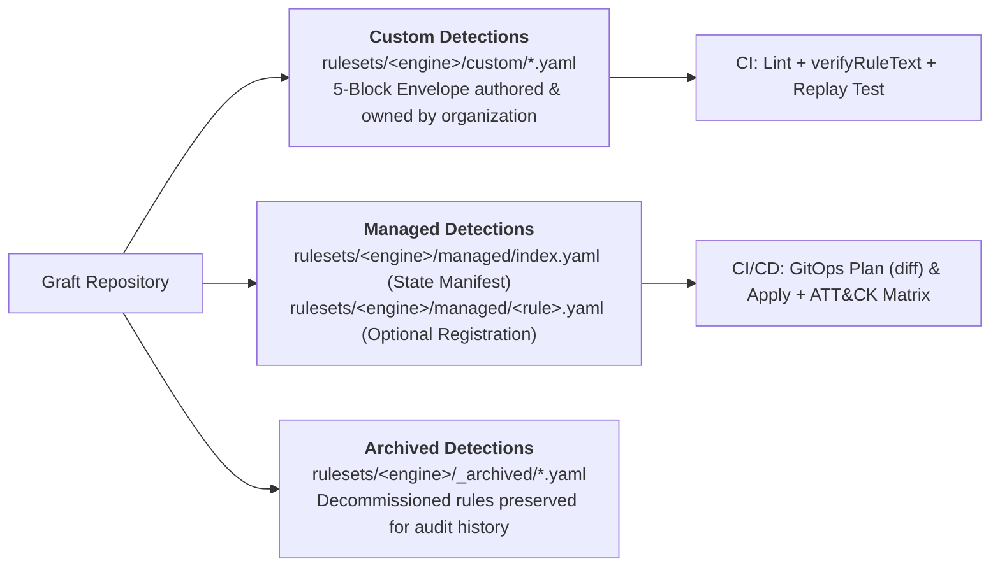

# Graft Architecture & System Design

> **High-Level Architectural Reference & System Topology**  
> **Platform:** Extensible Detection-as-Code (DaC)  
> **Architecture:** Hexagonal Architecture (Ports & Adapters) | **Runtime:** Python >= 3.13 Stdlib-First

---

## 1. Architectural Philosophy: Hexagonal Boundaries

In Graft, detection business logic, domain models, schema validators, and governance tools remain 100% engine-agnostic. The core never adapts to an external SIEM or detection engine; engines adapt to Core via port contracts.

---

## 2. Abstraction Layers & Core Port Protocols

The platform divides into three decoupled layers:

1. **Driving Adapters (`src/graft/cli/`):** Command-line routing using Python standard library `argparse`. Dynamically provisions subcommands based on manifest capabilities.
2. **Driving Core (`src/graft/core/`):** Pure Python domain logic. Zero imports of cloud SDKs, SIEM client libraries, or HTTP frameworks. Declares abstract port contracts via `typing.Protocol`:
   - [`EngineAdapter`](../src/graft/core/ports/engine.py): Composite adapter interface.
   - [`RuleCompilerPort`](../src/graft/core/ports/compiler.py): Syntax validation and compilation diagnostics.
   - [`RuleDeployerPort`](../src/graft/core/ports/deployer.py): Rule CRUD and deployment state toggles.
   - [`ManagedEnginePort`](../src/graft/core/ports/managed.py): Vendor-managed content synchronization and exclusion management.
   - [`ReplayHarnessPort`](../src/graft/core/ports/replay.py): Synthetic event ingestion and quarantined rule evaluation.
3. **Driven Engines (`src/graft/engines/`):** Concrete engine adapters implementing port interfaces. Adapters carry the complete burden of translating external vendor APIs, authenticating, and mapping domain envelopes to engine-native formats.

For a comprehensive technical deep-dive into the framework, protocol signatures, and dynamic discovery, see:
👉 **[Pluggable Engine Adapter Framework](developers/framework.md)**

---

## 3. Dual-Track Content Governance & Ruleset Taxonomy

Graft organizes detection content into two distinct tracks:

- **Track 1: Custom Rules (`rulesets/<engine>/custom/*.yaml`):** Bespoke organizational detections packaged in the 5-block envelope (`metadata`, `logic`, `deployment`, `runbook`, `tests`).
- **Track 2: Vendor-Managed Content (`rulesets/<engine>/managed/`):**
  - `rulesets/<engine>/managed/index.yaml`: Single declarative manifest tracking deployment state (`PRECISE` vs. `BROAD`, `enabled`, `alerting`) and active exclusions for vendor-provided rulesets.
  - `rulesets/<engine>/managed/<rule_name>.yaml`: Optional 4-block registered managed rule envelopes (`metadata`, `managed`, `runbook`, `tests`) linking via `managed.id` to `index.yaml` so vendor coverage is mapped into MITRE ATT&CK matrices and catalogs.
- **Decommissioned Rules (`rulesets/<engine>/_archived/`):** Standard location for retired detections. Any directory or file starting with an underscore (`_`) under a ruleset (e.g. `_archived/`, `_deprecated/`, `_templates/`) is excluded from discovery, linting, matrix generation, and deployment synchronization.
- **Objective Visibility & Rigor (`graft export catalog`):** Rather than tracking subjective or stale `status` and `maturity` fields in rule files, Graft extracts factual VCS and envelope indicators (`created_at`, `last_modified_at`, `review_count`, `contributor_count`, `has_runbook`) and resolves live engine deployment state (`status: enabled | silent | disabled`). Operators combine these with live SIEM performance data to measure true detection quality.

---

## 4. GitOps Reconciliation Lifecycle

Git is declared the single authoritative Source of Truth for detection state:

- **Scoped Reconciliation (Default):** Restricts diffs and deployments strictly to rules modified in the current Git branch or working tree (`graft <engine> diff / apply`). Keeps pull requests focused and minimizes blast radius.
- **Full Catalog Reconciliation (`--all`):** Evaluates the entire repository catalog against the live tenant (`graft <engine> diff --all / apply --all`). Automatically discovers and heals out-of-band console drift.

For full operational reconciliation mechanics, see:
👉 **[GitOps Reconciliation & Detection Synchronization](operators/gitops_reconciliation.md)**

---

## 5. Persona Guides & Navigation

For tailored documentation, explore the dedicated tracks:
- **[Analyst Track (Detection Engineers)](analysts/README.md)** &mdash; Daily rule lifecycle and [Recipes Cookbook](analysts/recipes.md).
- **[Operator Track (Platform Engineers)](operators/README.md)** &mdash; [Adoption Lifecycle](operators/adoption.md), [CI/CD](operators/cicd_and_infrastructure.md), and [Security](operators/security.md).
- **[Developer Track (Core Engineers)](developers/README.md)** &mdash; [Framework](developers/framework.md), [Extending Engines](developers/extending_engines.md), and [Quality Standards](developers/quality_and_standards.md).
