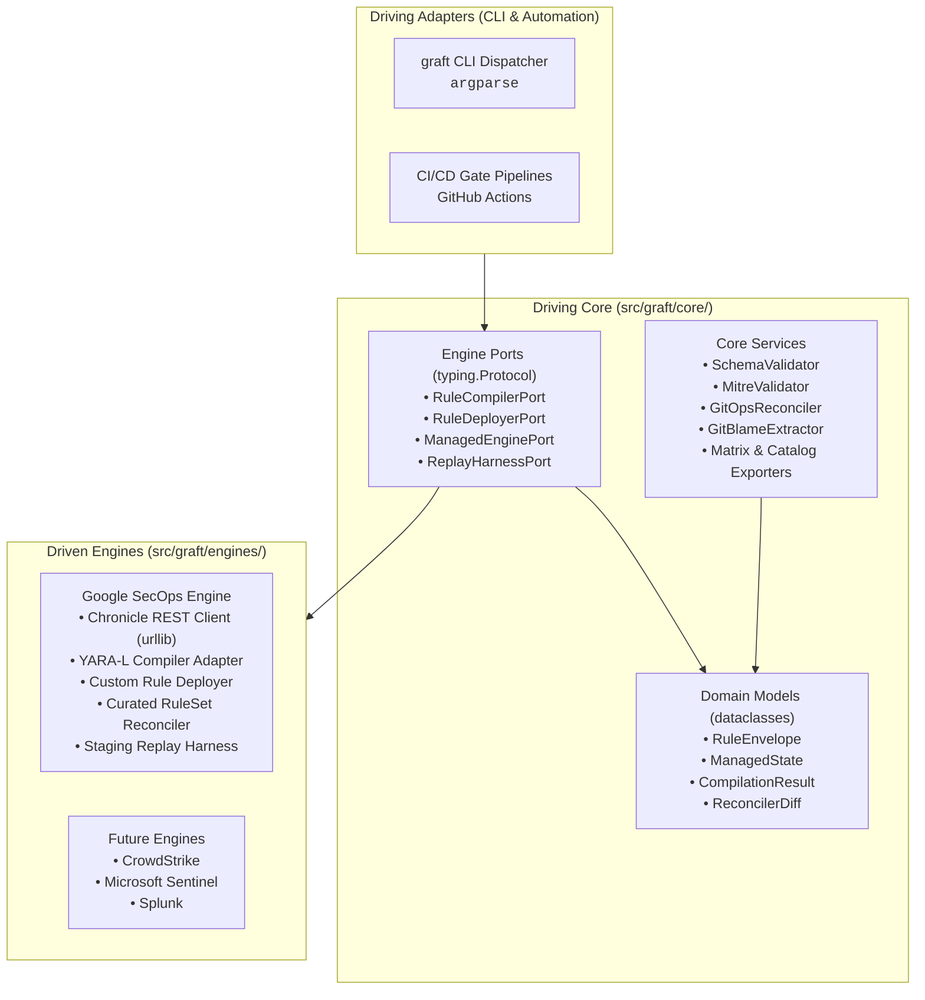
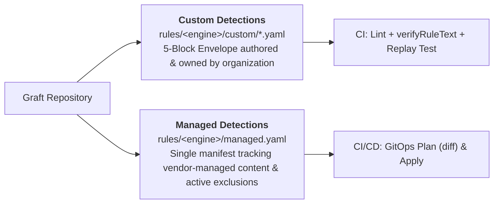

# Graft Architecture & System Design

Graft is an extensible, vendor-agnostic Detection-as-Code (DaC) platform engineered around strict **Hexagonal Architecture (Ports & Adapters)** and a **Stdlib-First** runtime discipline.

---

## 1. Architectural Philosophy: Hexagonal Boundaries

In Graft, detection business logic, domain models, schema validators, and governance tools remain 100% engine-agnostic. The core never adapts to an external SIEM or detection engine; engines adapt to Core via port contracts.

### Layer Responsibilities

- **Driving Adapters (`src/graft/cli/`):** Command-line routing using Python standard library `argparse`. Translates terminal flags into core service calls and dispatches to registered engine commands.
- **Driving Core (`src/graft/core/`):** Pure Python domain logic. Zero imports of cloud SDKs, SIEM client libraries, or HTTP frameworks. Contains domain models, schema validators, STIX MITRE matrices, Git blame extractors, and export generators.
- **Engine Ports (`src/graft/core/ports/`):** Abstract `typing.Protocol` interfaces defining exact capabilities an engine adapter must provide:
  - [`RuleCompilerPort`](file:///usr/local/google/home/joelopes/Projects/graft/src/graft/core/ports/compiler.py): Syntax validation and compilation diagnostics.
  - [`RuleDeployerPort`](file:///usr/local/google/home/joelopes/Projects/graft/src/graft/core/ports/deployer.py): Rule CRUD and live state toggle.
  - [`ManagedEnginePort`](file:///usr/local/google/home/joelopes/Projects/graft/src/graft/core/ports/managed.py): Vendor-managed content synchronization and exclusion management.
  - [`ReplayHarnessPort`](file:///usr/local/google/home/joelopes/Projects/graft/src/graft/core/ports/replay.py): Synthetic event ingestion and quarantined rule evaluation.
- **Driven Engines (`src/graft/engines/`):** Concrete engine adapters implementing port interfaces. Adapters carry the complete burden of translating external vendor APIs, authenticating, and mapping domain envelopes to engine-native formats.

---

## 2. Stdlib-First Runtime Discipline

Graft enforces a strict zero-dependency runtime standard. Third-party dependencies are restricted to:
1. `pyyaml`: YAML parsing and emission.
2. `jsonschema`: JSON Schema Draft 2020-12 validation.

All other capabilities use Python >= 3.13 standard libraries:
- HTTP Client: `urllib.request` and `urllib.error` (no `requests`, no `httpx`).
- CLI Framework: `argparse` (no `click`, no `typer`).
- Data Models: `dataclasses` (no `pydantic` in core).
- VCS & Process Execution: `subprocess` and `shutil`.
- Reporting & Formats: `csv`, `json`, `hashlib`, `uuid`.

---

## 3. Dual-Track Content Governance

Graft organizes detection content into two distinct tracks:

- **Track 1: Custom Rules (`rules/<engine>/custom/*.yaml`):** Bespoke organizational detections packaged in the 5-block envelope (`metadata`, `logic`, `deployment`, `runbook`, `tests`).
- **Track 2: Vendor-Managed Content (`rules/<engine>/managed.yaml`):** Single declarative manifest tracking deployment state (`PRECISE` vs `BROAD`, `enabled`, `alerting`) and active exclusions for vendor-provided rulesets (e.g., Google Curated Rule Sets).
