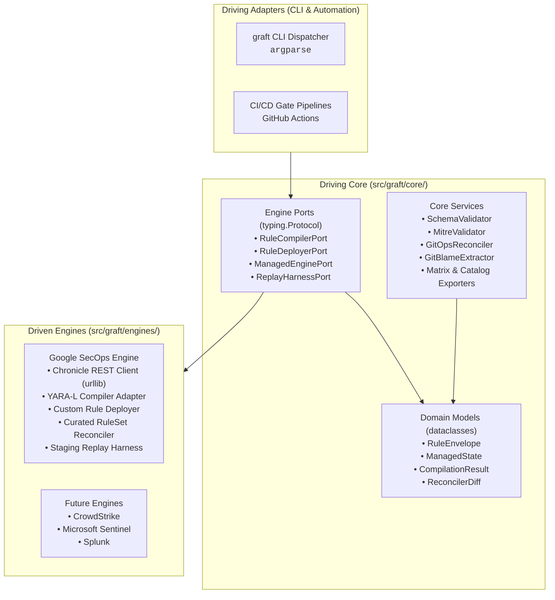
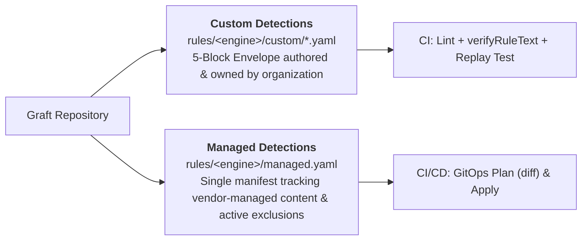
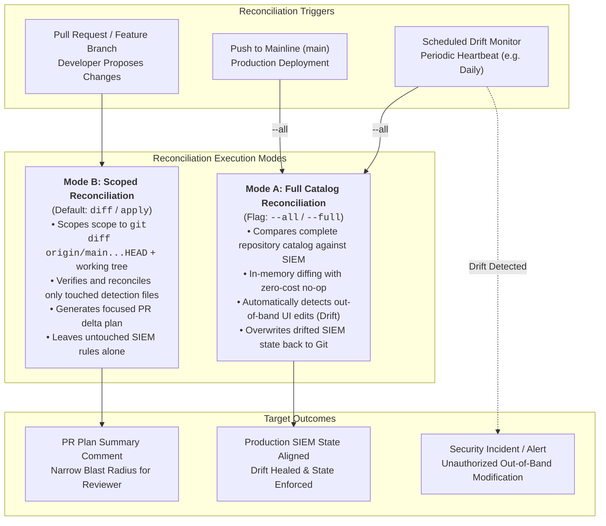
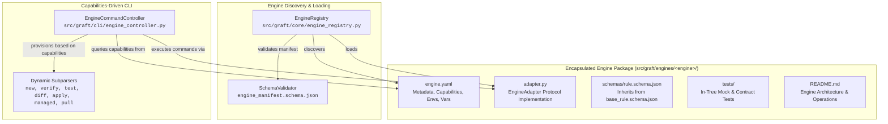

# Graft Architecture & System Design

Graft is an extensible, vendor-agnostic Detection-as-Code (DaC) platform engineered around strict **Hexagonal Architecture (Ports & Adapters)** and a **Stdlib-First** runtime discipline.

---

## 1. Architectural Philosophy: Hexagonal Boundaries

In Graft, detection business logic, domain models, schema validators, and governance tools remain 100% engine-agnostic. The core never adapts to an external SIEM or detection engine; engines adapt to Core via port contracts.



### Layer Responsibilities

- **Driving Adapters (`src/graft/cli/`):** Command-line routing using Python standard library `argparse`. Translates terminal flags into core service calls and dispatches to registered engine commands.
- **Driving Core (`src/graft/core/`):** Pure Python domain logic. Zero imports of cloud SDKs, SIEM client libraries, or HTTP frameworks. Contains domain models, schema validators, STIX MITRE matrices, Git blame extractors, and export generators.
- **Engine Ports (`src/graft/core/ports/`):** Abstract `typing.Protocol` interfaces defining exact capabilities an engine adapter must provide:
  - [`RuleCompilerPort`](file:///usr/local/google/home/joelopes/Projects/graft/src/graft/core/ports/compiler.py): Syntax validation and compilation diagnostics.
  - [`RuleDeployerPort`](file:///usr/local/google/home/joelopes/Projects/graft/src/graft/core/ports/deployer.py): Rule CRUD and live state toggle.
  - [`ManagedEnginePort`](file:///usr/local/google/home/joelopes/Projects/graft/src/graft/core/ports/managed.py): Vendor-managed content synchronization and exclusion management.
  - [`ReplayHarnessPort`](file:///usr/local/google/home/joelopes/Projects/graft/src/graft/core/ports/replay.py): Synthetic event ingestion and quarantined rule evaluation.
- **Driven Engines (`src/graft/engines/`):** Concrete engine adapters implementing port interfaces. Adapters carry the complete burden of translating external vendor APIs, authenticating, and mapping domain envelopes to engine-native formats.

---

## 2. Stdlib-First Runtime Discipline

Graft enforces a strict zero-dependency runtime standard. Third-party dependencies are restricted to:
1. `pyyaml`: YAML parsing and emission.
2. `jsonschema`: JSON Schema Draft 2020-12 validation.

All other capabilities use Python >= 3.13 standard libraries:
- HTTP Client: `urllib.request` and `urllib.error` (no `requests`, no `httpx`).
- CLI Framework: `argparse` (no `click`, no `typer`).
- Data Models: `dataclasses` (no `pydantic` in core).
- VCS & Process Execution: `subprocess` and `shutil`.
- Reporting & Formats: `csv`, `json`, `hashlib`, `uuid`.

---

## 3. Dual-Track Content Governance

Graft organizes detection content into two distinct tracks:



- **Track 1: Custom Rules (`rules/<engine>/custom/*.yaml`):** Bespoke organizational detections packaged in the 5-block envelope (`metadata`, `logic`, `deployment`, `runbook`, `tests`).
- **Track 2: Vendor-Managed Content (`rules/<engine>/managed.yaml`):** Single declarative manifest tracking deployment state (`PRECISE` vs `BROAD`, `enabled`, `alerting`) and active exclusions for vendor-provided rulesets (e.g., Google Curated Rule Sets).

---

## 4. GitOps Reconciliation Framework: Mode A vs. Mode B

Graft is engineered on the principle that **the Git repository is the single authoritative source of truth for detection state**. When a discrepancy exists between what is committed to Git and what is currently active in the SIEM/EDR, Git always wins.

To balance authoritative state convergence against PR safety and blast radius, Graft establishes a formal **dual-mode reconciliation contract** that every engine adapter must implement:



### Mode B: Scoped Reconciliation (Default)

- **Purpose:** Restricts reconciliation strictly to detection files modified within the current working branch, pull request, or uncommitted working tree.
- **Invocation:**
  ```bash
  graft secops diff       # Scoped delta preview
  graft secops apply      # Scoped execution
  ```
- **When Used:**
  - **Local Development:** Default mode for detection engineers authoring or tuning rules.
  - **Pull Request Validation:** Automatically executed in [`pr-validation.yml`](file:///usr/local/google/home/joelopes/Projects/graft/.github/workflows/pr-validation.yml) on every PR update.
- **Operational Rationale:**
  - **Narrow Blast Radius:** Prevents a PR targeting rule `A` from inadvertently reverting an active, temporary out-of-band hotfix on rule `B` in the SIEM console.
  - **Review Ergonomics:** The PR plan diff comment displays only the changes introduced by the author's branch, avoiding noise from unrelated tenant drifts.
- **Behavior on Clean Branches:**
  - If executed when no detection files are modified (e.g. on a clean `main` branch), Graft emits a helpful reminder and cleanly exits:
    ```text
    No detection rules or managed manifests modified in current change scope.
    To scan the entire catalog for tenant drift, run: graft secops diff --all
    ```

### Mode A: Full Catalog Reconciliation (`--all` / `--full`)

- **Purpose:** Enforces absolute convergence between the Git repository and the target SIEM tenant across the entire detection catalog.
- **Invocation:**
  ```bash
  graft secops diff --all       # Full tenant drift detection
  graft secops apply --all      # Full tenant authoritative convergence
  ```
- **When Used:**
  - **Post-Merge Deployments:** Executed on every push to `main` via [`deploy-production.yml`](file:///usr/local/google/home/joelopes/Projects/graft/.github/workflows/deploy-production.yml).
  - **Scheduled Drift Monitoring:** Executed by periodic automation (e.g. hourly or daily cron) to detect unauthorized console changes.
- **Drift Auto-Healing Mechanics:**
  - Graft fetches the live state of all tenant rules and managed configurations.
  - It performs in-memory diffing against the entire local repository inventory.
  - If an analyst, attacker, or external automation modified a rule out-of-band in the SIEM console:
    1. `diff --all` flags the rule as drifted (`rules_to_update`) and untracked rules as unmanaged.
    2. `apply --all` automatically issues API update calls (`PATCH`) to overwrite the SIEM state and restore Git's desired state.
- **Zero-Cost No-Op Guarantee:**
  - Graft only invokes write APIs for rules that have drifted or changed.
  - Rules whose live state matches the repository definition trigger zero write API requests.

### Summary Comparison

| Capability | Mode B: Scoped Reconciliation (Default) | Mode A: Full Reconciliation (`--all`) |
| :--- | :--- | :--- |
| **CLI Invocation** | `graft <engine> diff`<br/>`graft <engine> apply` | `graft <engine> diff --all`<br/>`graft <engine> apply --all` |
| **Trigger Pipeline** | `pull_request`, local branch authoring | `push` to `main`, scheduled drift monitoring |
| **Evaluation Scope** | Modified files in `git diff` + working tree | Complete repository catalog (`rules/`) |
| **Drift Behavior** | Ignores untouched drifted rules | Overwrites and heals out-of-band SIEM edits |
| **API Cost** | 1 read batch + N writes for touched rules | 1 read batch + N writes for drifted rules |
| **Guaranteed State** | Author's changes verified & previewed | Complete SIEM alignment with `main` |

---

## 5. Pluggable Engine Adapter Framework & Encapsulation

Graft features a fully encapsulated, pluggable engine adapter architecture. Rather than scattering engine schemas, CLI commands, documentation, and tests across disparate top-level directories, every engine adapter is packaged as a self-contained module under `src/graft/engines/<engine>/`.



### 1. Autonomous Engine Encapsulation
Every engine adapter contains everything required for its lifecycle:
- **`engine.yaml`:** Declarative manifest defining metadata, capabilities, supported environments, and required/optional environment variables.
- **`adapter.py`:** Primary entrypoint implementing the composite [`EngineAdapter`](file:///usr/local/google/home/joelopes/Projects/graft/src/graft/core/ports/engine.py#L10) protocol. Lazily initializes underlying compilers, deployers, managed adapters, and replay harnesses without synchronous network calls.
- **`schemas/rule.schema.json`:** Engine-specific rule schema extending `base_rule.schema.json`. Discovered dynamically by [`SchemaValidator`](file:///usr/local/google/home/joelopes/Projects/graft/src/graft/core/validation/schema_validator.py).
- **`README.md`:** Authoritative documentation covering engine architecture, credentials, and API reconciliation specifics.
- **`tests/`:** In-tree unit and mock-transport contract tests, automatically executed by `pytest`.

### 2. Capabilities-Driven CLI Dispatch
Core never hardcodes engine commands. Instead, [`EngineCommandController`](file:///usr/local/google/home/joelopes/Projects/graft/src/graft/cli/engine_controller.py) dynamically configures subparsers based on declared manifest capabilities:

| Manifest Capability | CLI Subcommands Provisioned |
| :--- | :--- |
| `custom_rules: true` | `graft <engine> new <rule_name>`, `diff`, `apply`, `pull` |
| `syntax_verification: true` | `graft <engine> verify [paths...]` |
| `managed_rules: true` | `graft <engine> managed <diff\|apply\|pull>` |
| `replay_testing: true` | `graft <engine> test [paths...] [--require-staging]` |

Reserved first-order command names (`lint`, `export`, `update-mitre`, `new`, `help`) are enforced to guarantee unambiguous command routing.


