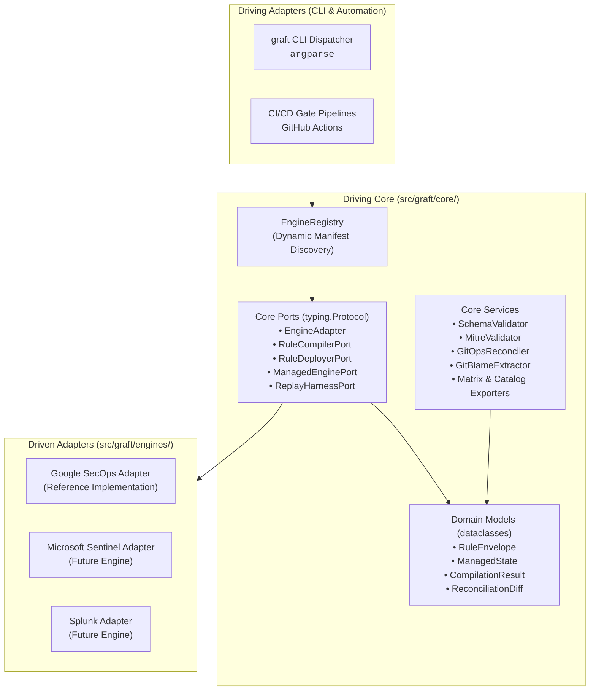

# Core Developer Track

> **The Software Engineering Guide for Extending Graft and Building Engine Adapters**  
> **Target Audience:** Platform Engineers, Backend Developers, SIEM Adapter Integrators  
> **Target Python:** >= 3.13 | **Package Manager:** `uv` (Native `uv_build`)  
> **Engineering Discipline:** Hexagonal Architecture, Strict TDD, Stdlib-First, High Signal-to-Noise

---

## 1. Overview & Developer Responsibilities

The **Core Developer** builds the underlying platform, fixes core bugs, and creates new engine adapters to connect Graft with modern SIEM, EDR, and cloud detection analytics platforms (such as Microsoft Sentinel, Splunk, CrowdStrike, and Elastic).

Graft is engineered around strict **Hexagonal Architecture (Ports & Adapters)**. The Core is 100% engine-agnostic and never imports third-party cloud SDKs or SIEM clients. The entire burden of vendor protocol translation, REST communication, and query formatting is encapsulated within self-contained engine adapters.



---

## 2. Local Development Setup

Graft uses Python 3.13 and `uv` with the native `uv_build` backend.

### 1. Prerequisites
- Python >= 3.13
- `uv` installed (`curl -LsSf https://astral.sh/uv/install.sh | sh` or via system package manager)
- Git

### 2. Environment Initialization
```bash
# Clone the repository
git clone https://github.com/lopes/graft.git
cd graft

# Install all runtime and development dependencies into local virtualenv
uv sync

# Verify that all unit and engine tests pass
uv run pytest
```

### 3. Verification Quality Gates
Before submitting any pull request or committing code, all quality gates must return 0 errors:

```bash
# 1. Formatting check
uv run ruff format --check .

# 2. Strict linter rules (E, F, B, I, UP, S, RUF, SIM, T20)
uv run ruff check .

# 3. Strict static type checking (zero Any leakage)
uv run mypy --strict src tests

# 4. Fast unit and engine test suite (<1s execution)
uv run pytest
```

---

## 3. Developer Guide Directory

| Document | Description |
| :--- | :--- |
| **[Pluggable Engine Adapter Framework](framework.md)** | Deep dive into abstraction layers, protocol interfaces (`typing.Protocol`), Core expectations vs. Adapter responsibilities, custom vs. managed rule optionality, and dynamic discovery. |
| **[Extending Graft: Adding New Engines](extending_engines.md)** | Complete tutorial on scaffolding a new engine adapter with `graft new engine`, implementing ports, registering schemas, and co-locating in-tree tests. |
| **[Engineering Standards & Quality Gates](quality_and_standards.md)** | Engineering rules, the strict stdlib-first discipline, Test-Driven Development (TDD) conventions, and Scoped Commits. |
| **[Google SecOps Engine Reference](../../src/graft/engines/secops/README.md)** | Full architectural and implementation walkthrough of the Google SecOps reference adapter. |
