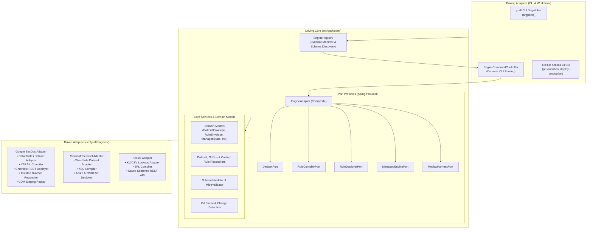
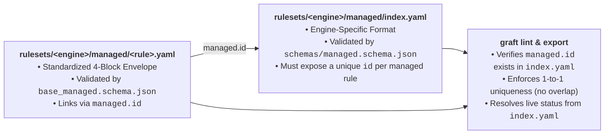
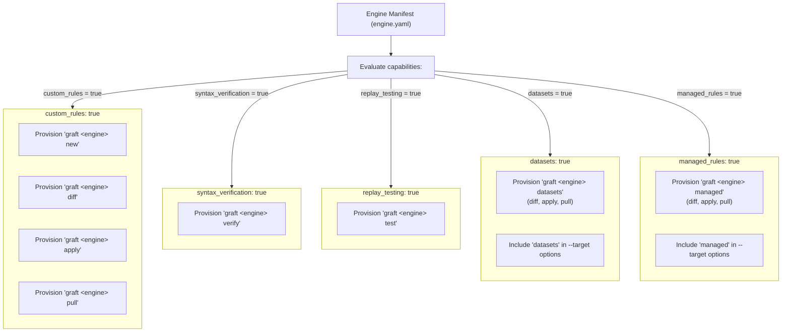

# Pluggable Engine Adapter Framework

> **Architectural Specification, Abstraction Layers, and Protocol Contracts**  
> **Target Audience:** Engine Developers, Core Contributors, Platform Architects  
> **Guiding Paradigm:** Hexagonal Architecture (Ports & Adapters), Strict Protocol Subtyping, Stdlib-First

---

## 1. Architectural Philosophy & Abstraction Layers

Graft is engineered to decouple detection engineering logic, governance, and CI/CD pipelines from the peculiarities of specific SIEM or cloud analytics vendors. 

To achieve this, Graft implements **Hexagonal Architecture (Ports & Adapters)**. The Core domain sits at the center of the hexagon, isolated behind port protocols (`typing.Protocol`). External engines adapt to Core; Core never adapts to an engine.



### The Three Abstraction Layers

1. **Driving Adapters (`src/graft/cli/`):**
   - Implemented using standard library `argparse`.
   - The CLI dispatcher initializes [`EngineRegistry`](../../src/graft/core/engine_registry.py), inspects all discovered engine manifests, and registers CLI subcommands dynamically.
   - Dispatches user requests to [`EngineCommandController`](../../src/graft/cli/engine_controller.py).
2. **Driving Core (`src/graft/core/`):**
   - 100% engine-agnostic domain models (`DatasetEnvelope`, `RuleEnvelope`, `ManagedState`, `TestVector`, `CompilationResult`, `ReconciliationDiff`).
   - Declares the abstract port contracts using Python's `typing.Protocol` with `@runtime_checkable`.
   - Provides reusable business logic: Draft 2020-12 schema validation, STIX MITRE ATT&CK taxonomy validation, dataset cross-reference linting, Git diff/blame resolution, zero-cost state reconciliation, and report generation (ATT&CK Navigator layers, Markdown/CSV catalogs).
   - **Strict Constraint:** Core contains **zero imports** of cloud SDKs, SIEM client libraries, or HTTP clients.
3. **Driven Adapters (`src/graft/engines/<engine>/`):**
   - Concrete implementations of the port protocols.
   - Encapsulates all vendor-specific REST API calls, OAuth2 / Workload Identity Federation authentication, query compilation/deconstruction, dataset synchronization, and synthetic replay execution.
   - Lives in isolated, self-contained packages under `src/graft/engines/`.

---

## 2. Core Expectations vs. Adapter Responsibilities

To maintain strict architectural boundaries, responsibilities are cleanly divided between Core and Adapters:

| Capability / Concern | Handled by Driving Core | Handled by Driven Adapter |
| :--- | :--- | :--- |
| **Rule Representation** | Provides universal `RuleEnvelope` model (5-block custom rules and 4-block registered managed rules) and base JSON schemas (`base_custom.schema.json`, `base_managed.schema.json`). | Maps custom envelope fields (`metadata`, `logic`, `deployment`) to engine-native payload formats, and resolves registered managed rule status from `managed/index.yaml`. |
| **Reusable Datasets & TTL Expiration** | Provides `DatasetEnvelope` model (`datasets/<name>.yaml`), `base_dataset.schema.json` (`0..1,000` strings), UTC `ttl:YYYY-MM-DD` inline comment evaluation, `datasets/_archived/` deprecation (`deprecated=True`, `description="Deprecated on Graft"`), `%<name>.value` rule cross-validation, and additive `DatasetReconciler`. | Implements `DatasetPort` (`list_datasets`, `create_dataset`, `update_dataset`) mapping 1-D string lists to SIEM-native lookup tables (single `STRING` column named `value`), including explicit `0`-row creation and row-clearing logic when all `ttl:` entries expire or a dataset is archived. |
| **Detection Rule Schema** | Loads and validates base envelope structures (`base_custom.schema.json` for `custom/*.yaml`, `base_managed.schema.json` for `managed/<rule>.yaml`, and `base_dataset.schema.json` for `datasets/*.yaml`). | Provides `schemas/custom.schema.json` (extending `base_custom.schema.json`) for custom rules and `schemas/managed.schema.json` for `managed/index.yaml`. |
| **Reconciliation Logic** | Computes diffs, evaluates Scoped vs. Full Catalog scopes, and enforces execution order (`Datasets` $\rightarrow$ `Custom Rules` $\rightarrow$ `Managed Content`). | Executes atomic remote API calls (`create_dataset`, `update_dataset`, `create_rule`, `update_rule`, `set_rule_state`, `set_ruleset_deployment`). |
| **Authentication & HTTP** | Manages environment variable resolution and `.env` loading. | Establishes authenticated sessions (STS/WIF, OAuth2, API tokens) and issues HTTP requests via `urllib.request`. |
| **Syntax Verification** | Orchestrates file discovery and aggregates compiler results. | Invokes the vendor's syntax validation API (e.g., Chronicle `:verifyRuleText` with local dataset placeholder fallback or Azure API syntax check). |
| **Synthetic Replay** | Parses `tests:` block fixtures and evaluates expected match counts. | Pre-syncs referenced local datasets to staging, transports synthetic events to staging quarantine, and executes detection evaluation. |
| **Vendor Managed Content** | Validates `managed/index.yaml` against `schemas/managed.schema.json`, computes exclusion/ruleset diffs, and enforces 1-to-1 `managed.id` uniqueness and existence against `index.yaml`. | Defines the engine-specific `managed/index.yaml` structure with a unique `id` per managed rule/ruleset, interacts with vendor curated rules APIs, and implements `has_managed_rule_id`. |
| **Logging & Diagnostics** | Configures UTC ISO-8601 formatting (`graft.cli`), logs dataset/rule/exclusion CRUD lifecycle (`INFO`), logs failure context (`ERROR`), and emits partial-progress abort summaries (`graft.reconciler`). | Logs HTTP retry backoffs (`WARNING`), multi-step partial mutation warnings (`WARNING`), and low-level API sub-steps (`DEBUG`) under `graft.<engine>.*`; raises exceptions containing HTTP status, vendor status code, method, and endpoint path. |

---

## 3. Protocol Contracts & Method Signatures

Graft uses Python's `typing.Protocol` with structural subtyping (duck typing). Adapters do not need to inherit from concrete base classes; they simply implement the methods defined in `src/graft/core/ports/`.

### 1. Composite Adapter Protocol: `EngineAdapter`
Defined in [`src/graft/core/ports/engine.py`](../../src/graft/core/ports/engine.py):

```python
from pathlib import Path
from typing import Protocol, runtime_checkable

from graft.core.models.managed import ManagedState
from graft.core.models.rule import RuleEnvelope
from graft.core.ports.compiler import RuleCompilerPort
from graft.core.ports.dataset import DatasetPort
from graft.core.ports.deployer import RuleDeployerPort
from graft.core.ports.managed import ManagedEnginePort
from graft.core.ports.replay import ReplayHarnessPort


@runtime_checkable
class EngineAdapter(Protocol):
    def __init__(self, env: str = "production") -> None: ...

    def get_compiler(self) -> RuleCompilerPort | None: ...

    def get_deployer(self) -> RuleDeployerPort | None: ...

    def get_managed(self) -> ManagedEnginePort | None: ...

    def get_replay(self) -> ReplayHarnessPort | None: ...

    def get_dataset(self) -> DatasetPort | None: ...

    def resolve_deployment_status(
        self,
        rule: RuleEnvelope,
        managed_state: ManagedState | None = None,
    ) -> str: ...

    def are_rules_equal(self, desired: RuleEnvelope, remote: RuleEnvelope) -> bool: ...

    def deconstruct_rule(self, remote_rule: RuleEnvelope) -> RuleEnvelope: ...

    def load_managed_manifest(self, path: Path) -> ManagedState | None: ...

    def dump_managed_manifest(self, state: ManagedState, path: Path) -> None: ...

    def has_managed_rule_id(self, managed_id: str, state: ManagedState) -> bool: ...
```

The composite adapter acts as a capabilities factory and lifecycle hook provider:
- **Port Factories (`get_compiler`, `get_deployer`, `get_managed`, `get_replay`, `get_dataset`):** Return the concrete port implementation or `None` when a capability is unsupported.
- **`resolve_deployment_status(rule, managed_state)`:** Translates engine-specific deployment toggles into an engine-agnostic status (`enabled`, `silent`, `disabled`). For custom rules (`rule.is_managed == False`), it inspects `rule.deployment`; for registered managed rules (`rule.is_managed == True`), it resolves the live deployment status from `managed_state` (`rulesets/<engine>/managed/index.yaml`).
- **`are_rules_equal(desired, remote)`:** Compares a desired Git `RuleEnvelope` against a remote tenant `RuleEnvelope` during `diff`/`apply` (defaults to trimmed `logic` comparison; engines that compile metadata into the query payload, such as `SecOpsAdapter`, override this to compare compiled payloads).
- **`deconstruct_rule(remote_rule)`:** Extracts embedded metadata from a raw remote rule during `pull` (defaults to returning `remote_rule` unchanged).
- **`load_managed_manifest(path)` / `dump_managed_manifest(state, path)`:** Parses and serializes `rulesets/<engine>/managed/index.yaml` when `managed_rules: true` (defaults to `None`).
- **`has_managed_rule_id(managed_id, state)`:** Verifies whether a registered managed rule's `managed.id` exists in the parsed `ManagedState` from `rulesets/<engine>/managed/index.yaml`. Used by `graft lint` to enforce referential integrity between `rulesets/<engine>/managed/<rule_name>.yaml` and `index.yaml`.

---

### 2. Dataset Port: `DatasetPort`
Defined in [`src/graft/core/ports/dataset.py`](../../src/graft/core/ports/dataset.py):

```python
from typing import Protocol, runtime_checkable
from graft.core.models.dataset import DatasetEnvelope


@runtime_checkable
class DatasetPort(Protocol):
    def list_datasets(
        self,
        names: tuple[str, ...] | None = None,
    ) -> tuple[DatasetEnvelope, ...]: ...

    def create_dataset(self, dataset: DatasetEnvelope) -> str: ...

    def update_dataset(self, dataset: DatasetEnvelope) -> None: ...
```

Engine adapters implementing `DatasetPort` (`datasets: true` in `engine.yaml`) must adhere to three behavioral guarantees:
1. **Additive Coexistence (No `delete_dataset`):** `DatasetPort` intentionally omits `delete_dataset` so unmanaged SIEM tables are never deleted. When `names` is passed (`diff` / `apply`), query only those named tables (`404` means absent on tenant); when `names is None` (`pull --target datasets`), discover compatible 1-column `STRING` tables (`originalColumn == "value"`, `1..1,000` rows).
2. **Supporting `ttl:YYYY-MM-DD` Expiration & `0`-Row Updates:** Core evaluates inline `# ... ttl:YYYY-MM-DD` comments in UTC (`today_utc > ttl_date`) and strips expired entries before passing `DatasetEnvelope` to `DatasetPort`. When every temporary entry in a dataset expires—or when a dataset is moved to `datasets/_archived/` (`deprecated=True`, `description="Deprecated on Graft"`, `values=()`)—`dataset.values` is an empty tuple `()`. Because many SIEM bulk-replace endpoints reject empty row lists (`requests: []`) with `HTTP 400`, **adapter implementations must explicitly handle `not dataset.values`**:
   - In `create_dataset`: create the table header and skip bulk row population if `not dataset.values`.
   - In `update_dataset`: update the table description and, if `not dataset.values`, explicitly clear existing remote rows (e.g., by listing row IDs and deleting them) so expired `ttl:` suppressions and deprecated datasets are actually purged on the SIEM.
3. **Compiler & Replay Integration:** In `RuleCompilerPort.verify_rule`, substitute a string literal placeholder in memory if a rule references a local `datasets/<name>.yaml` that has not yet been created on the remote tenant. In `ReplayHarnessPort.run_test_vector`, pre-sync referenced local datasets to the staging tenant so replay tests evaluate against the current non-expired values.

---

### 3. Rule Compiler Port: `RuleCompilerPort`
Defined in [`src/graft/core/ports/compiler.py`](../../src/graft/core/ports/compiler.py):

```python
from typing import Protocol
from graft.core.models.compiler import CompilationResult
from graft.core.models.rule import RuleEnvelope


class RuleCompilerPort(Protocol):
    def verify_syntax(self, rule_text: str) -> CompilationResult: ...

    def verify_rule(self, rule: RuleEnvelope) -> CompilationResult: ...
```

The returned [`CompilationResult`](../../src/graft/core/models/compiler.py) is an engine-agnostic dataclass:
```python
@dataclass(frozen=True)
class CompilationResult:
    success: bool
    diagnostics: tuple[CompilationDiagnostic, ...] = ()
    raw_response: dict[str, object] = field(default_factory=dict)
```

---

### 4. Rule Deployer Port: `RuleDeployerPort`
Defined in [`src/graft/core/ports/deployer.py`](../../src/graft/core/ports/deployer.py):

```python
from typing import Protocol
from graft.core.models.rule import RuleEnvelope


class RuleDeployerPort(Protocol):
    def list_rules(self) -> tuple[RuleEnvelope, ...]: ...

    def create_rule(self, rule: RuleEnvelope) -> str: ...

    def update_rule(self, rule: RuleEnvelope) -> None: ...

    def delete_rule(self, rule_id: str) -> None: ...

    def set_rule_state(self, rule_id: str, enabled: bool, alerting: bool) -> None: ...
```

---

### 5. Managed Content Port: `ManagedEnginePort`
Defined in [`src/graft/core/ports/managed.py`](../../src/graft/core/ports/managed.py):

```python
from typing import Protocol
from graft.core.models.managed import ManagedExclusion, ManagedState


class ManagedEnginePort(Protocol):
    def fetch_managed_state(self) -> ManagedState: ...

    def apply_managed_state(self, target_state: ManagedState) -> None: ...

    def set_ruleset_deployment(
        self,
        ruleset_id: str,
        deployment_type: str,
        enabled: bool,
        alerting: bool,
        category: str | None = None,
    ) -> None: ...

    def create_exclusion(self, exclusion: ManagedExclusion) -> str: ...

    def update_exclusion(self, exclusion: ManagedExclusion) -> None: ...

    def delete_exclusion(self, exclusion_id: str) -> None: ...
```

---

### 6. Replay Harness Port: `ReplayHarnessPort`
Defined in [`src/graft/core/ports/replay.py`](../../src/graft/core/ports/replay.py):

```python
from typing import Protocol
from graft.core.models.rule import RuleEnvelope, TestVector


class ReplayHarnessPort(Protocol):
    def run_test_vector(self, rule: RuleEnvelope, vector: TestVector) -> ReplayResult: ...

    def is_available(self) -> bool: ...
```

---

## 4. Custom Rules vs. Managed Rules: Definition, Registration & Adapter Contract

In modern SIEM architectures, detection content falls into two fundamentally distinct categories:

### 1. Definitions

| Concept | Custom Detection Rules | Vendor-Managed Content |
| :--- | :--- | :--- |
| **Ownership** | Authored and maintained 100% by the organization's detection engineers. | Authored and maintained by the SIEM vendor (e.g., Google Cloud Threat Intelligence, Microsoft Threat Experts). |
| **Representation** | Individual 5-block envelope YAML files under `rulesets/<engine>/custom/<rule>.yaml`. | Consolidated state manifest at `rulesets/<engine>/managed/index.yaml` plus optional 4-block registered rule envelopes at `rulesets/<engine>/managed/<rule>.yaml`. |
| **Logic Visibility** | Full query logic (`events`, `match`, `condition`) is authored and visible. | Proprietary vendor logic is black-boxed; operators configure operational parameters in `managed/index.yaml`. |
| **Operator Control** | Complete CRUD control over queries, test vectors, and runbooks. | Toggles precision (`PRECISE` vs `BROAD`), activation, alert generation, customer exclusions in `index.yaml`, and optional MITRE/runbook registration in `managed/<rule>.yaml`. |
| **Engine Port** | Handled via [`RuleDeployerPort`](../../src/graft/core/ports/deployer.py). | Handled via [`ManagedEnginePort`](../../src/graft/core/ports/managed.py) and `EngineAdapter` hooks. |

### 2. Strict Optionality via `capabilities`

Graft recognizes that **not all engines support all capabilities**:
- A traditional log SIEM (e.g., Elasticsearch or Splunk) may only have custom detection queries and no vendor-managed curated rule subscription.
- A managed detection service or posture manager might only expose curated rule packages and customer exclusions without arbitrary query execution.
- Some platforms support reusable lookup datasets, custom rules, and vendor-managed curated content simultaneously (e.g., Google SecOps with Data Tables, YARA-L custom rules, and Google Cloud Curated Rule Sets).

Graft enforces strict optionality. Engines declare their supported feature set in their `engine.yaml` manifest:

```yaml
capabilities:
  custom_rules: true          # Engine supports custom detection rule CRUD
  syntax_verification: true   # Engine supports pre-merge syntax dry-runs
  managed_rules: false        # Engine DOES NOT have vendor-curated content
  replay_testing: false       # Engine DOES NOT have synthetic replay APIs
  datasets: false             # Engine DOES NOT synchronize reusable string datasets
```

### 3. Managed Content Index (`managed/index.yaml`) & Registered Rule Contract (For Engine Programmers)

When an engine supports vendor-managed detections (`managed_rules: true`), Graft separates **engine-specific deployment state** from **engine-agnostic governance and MITRE coverage**:



Engine programmers implementing `managed_rules: true` must adhere to three mandatory architectural contracts:

1. **Engine-Specific `index.yaml` with Mandatory Unique IDs:**
   - The YAML structure of `rulesets/<engine>/managed/index.yaml` (and its schema at `src/graft/engines/<engine>/schemas/managed.schema.json`) depends entirely on the target engine's API (e.g., Google SecOps organizes content into `categories[].rulesets[]` with `PRECISE`/`BROAD` deployments; CrowdStrike or Sentinel use different hierarchy models).
   - **Programmer Responsibility:** Regardless of the vendor's hierarchy, **the engine programmer must ensure every managed rule or ruleset entry in `index.yaml` exposes a stable, unique `id` string**. Detection analysts use this exact `id` when optionally registering a managed rule in `rulesets/<engine>/managed/<rule_name>.yaml` (`managed.id: "<id>"`) to map vendor coverage into MITRE ATT&CK matrices and catalogs.
2. **Referential & 1-to-1 Uniqueness Validation Against `index.yaml`:**
   - **Existence Check (`has_managed_rule_id`):** Programmers must implement `EngineAdapter.has_managed_rule_id(self, managed_id: str, state: ManagedState) -> bool` to check whether `managed_id` exists in the parsed `index.yaml` state. During `graft lint`, Core validates every registered managed rule YAML (`rulesets/<engine>/managed/<rule_name>.yaml`) against `rulesets/<engine>/managed/index.yaml` and rejects any file whose `managed.id` is not present in `index.yaml`.
   - **No Overlapping Registrations (1-to-1 Mapping):** Core's [`RuleUniquenessValidator`](../../src/graft/core/validation/uniqueness_validator.py) enforces strict 1-to-1 uniqueness on `managed.id` within each engine. Two YAML files under `rulesets/<engine>/managed/` can never link to the same managed rule `id` in `index.yaml`.
   - **Reserved Filename (`index`):** The rule name `"index"` is reserved for `index.yaml` and rejected by [`base_managed.schema.json`](../../src/graft/core/schemas/base_managed.schema.json).
3. **Single Source of Truth for Deployment Status (`resolve_deployment_status`):**
   - Registered managed rule files (`managed/<rule_name>.yaml`) contain 4 blocks (`metadata`, `managed`, `runbook`, `tests`) and intentionally omit `logic` and `deployment` to prevent state duplication.
   - Programmers must implement `EngineAdapter.resolve_deployment_status(self, rule: RuleEnvelope, managed_state: ManagedState | None = None) -> str` so that when `rule.is_managed` is `True`, the adapter looks up `rule.managed.id` inside `managed_state` (`index.yaml`) and returns `"enabled"`, `"silent"`, or `"disabled"`.

---

## 5. Capabilities-Driven CLI Provisioning

When Graft boots up, [`EngineRegistry`](../../src/graft/core/engine_registry.py) reads each engine's `engine.yaml`. The CLI controller inspects the declared capabilities and dynamically registers only the subcommands and arguments that the adapter actually supports:



### CLI Dynamic Adaptation Rules:
1. If `custom_rules: true`: Core registers `new`, `diff`, `apply`, and `pull`.
2. If `datasets: true`: Core registers the `datasets` subcommand (`datasets diff`, `datasets apply`, `datasets pull`) and adds `datasets` to `--target` on `diff`, `apply`, and `pull`.
3. If `managed_rules: true`: Core registers the `managed` subcommand (`managed diff`, `managed apply`, `managed pull`) and adds `managed` to `--target` on `diff`, `apply`, and `pull`.
4. If both `datasets: false` and `managed_rules: false`: The `datasets` and `managed` subcommands are omitted from CLI help text, and `--target` on `diff/apply/pull` is locked strictly to `["custom"]`.
5. If `syntax_verification: true`: Core registers the `verify` command.
6. If `replay_testing: true`: Core registers the `test` command.

---

## 6. Dynamic Engine & Schema Discovery

Graft dynamically discovers engines without requiring hardcoded imports in Core:

1. **Manifest Discovery:** At startup, `EngineRegistry._discover()` scans all subdirectories under `src/graft/engines/` for `engine.yaml`.
2. **Manifest Validation:** Every manifest is validated against [`src/graft/core/schemas/engine_manifest.schema.json`](../../src/graft/core/schemas/engine_manifest.schema.json).
3. **Dataset, Rule & Manifest Schema Discovery:** When `graft lint` validates datasets, rules, or manifests, [`SchemaValidator`](../../src/graft/core/validation/schema_validator.py) resolves schemas using a consistent naming convention:
   ```text
   src/graft/core/schemas/base_dataset.schema.json      # Base 2-block reusable string dataset envelope
   src/graft/core/schemas/base_custom.schema.json       # Base 5-block custom rule envelope
   src/graft/core/schemas/base_managed.schema.json      # Base 4-block registered managed rule envelope
   src/graft/engines/<engine>/schemas/custom.schema.json  # Engine custom rule schema (extends base_custom.schema.json)
   src/graft/engines/<engine>/schemas/managed.schema.json # Engine managed/index.yaml schema
   ```
   Core validates `datasets/*.yaml` against `base_dataset.schema.json`, `rulesets/<engine>/custom/*.yaml` against `<engine>/schemas/custom.schema.json`, `rulesets/<engine>/managed/<rule>.yaml` against `base_managed.schema.json`, and `rulesets/<engine>/managed/index.yaml` against `<engine>/schemas/managed.schema.json` without leaking vendor specifics into Core.
4. **Adapter Instantiation:** When an engine command is executed, Core dynamically imports the `adapter_class` declared in the manifest (e.g., `graft.engines.sentinel.adapter:SentinelAdapter`), instantiates it with the target environment (`env="production"`), and verifies that it implements [`EngineAdapter`](../../src/graft/core/ports/engine.py).

---

## 7. Logging & Operational Diagnostics Contract

When a GitOps deployment or verification workflow fails in CI or an operator terminal, logs must immediately answer four operational questions without requiring raw HTTP packet inspection:

1. **When:** Every log record carries an ISO-8601 UTC timestamp (`YYYY-MM-DDTHH:MM:SSZ`) configured on the root logger (`logging.Formatter.converter = time.gmtime`) so terminal and CI output correlates directly with SIEM audit logs.
2. **What:** Core reconcilers ([`src/graft/core/reconciler.py`](../../src/graft/core/reconciler.py)) log the exact rule or exclusion identifier (`name`, `id`) and the attempted mutation (`creating custom rule`, `updating custom rule`, `creating exclusion`, etc.) at `ERROR` level before re-raising.
3. **Where:** Driven adapters format API exceptions with the HTTP status code, canonical vendor status string (e.g., `INVALID_ARGUMENT`, `PERMISSION_DENIED`), HTTP method, and endpoint path:
   ```text
   <Engine> API Error <status_code> (<vendor_status>) on <METHOD> <path>: <message>
   ```
4. **Progress:** When reconciliation aborts mid-batch, `graft.reconciler` emits an `ERROR` summary listing how many mutations succeeded (`applied [...]`), which item failed (`failed [...]`), and which items were not yet reached (`pending [...]`).

### Adapter Logging Rules

Driven adapters must follow four rules to integrate cleanly with Core's diagnostic pipeline:

- **Namespace:** Initialize module loggers under `logging.getLogger("graft.<engine>.<module>")` (e.g., `graft.secops.client`, `graft.secops.deployer`, `graft.secops.managed`).
- **No Duplicate `INFO` CRUD Logs:** Do not log high-level `INFO` messages for rule/exclusion CRUD inside `RuleDeployerPort` or `ManagedEnginePort` methods—`CustomRuleReconciler` and `GitOpsReconciler` already log `INFO` before invoking each port method. Use `logger.debug(...)` inside adapters for sub-step tracing (activated via `graft --verbose`).
- **Transient Retry Warnings (`WARNING`):** When an HTTP client backs off on transient rate limits or service unavailability (`HTTP 429` or `HTTP 503`), emit a `WARNING` log with the status code, HTTP method, endpoint path, backoff delay, and attempt counter.
- **Two-Stage Mutation Warnings (`WARNING`):** Many SIEM APIs split rule or exclusion provisioning across two separate HTTP calls (e.g., `POST /rules` followed by `PATCH /rules/{id}/deployment`). If step 1 succeeds on the tenant and step 2 fails, log a `WARNING` stating that the definition was created or updated on the tenant before the deployment state call failed, then re-raise the exception so Core can log the batch abort summary.

