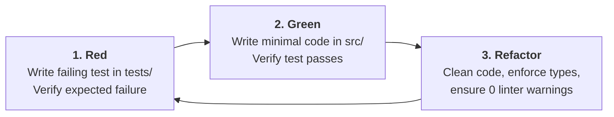

# Engineering Standards & Quality Gates

> **Authoritative Operational Directives & Software Engineering Discipline**  
> **Repository:** `graft` | **Platform:** Extensible Detection-as-Code Platform  
> **Target Python:** >= 3.13 | **Package Manager:** `uv` (Native `uv_build`)  
> **Discipline:** Strict TDD, Hexagonal Architecture, Stdlib-First, High Signal-to-Noise

---

## 1. Core Operating Principles

1. **Direct, Grounded & Brutally Honest:**
   - No sycophancy, no conversational fluff, no false consensus. If an architectural approach or implementation has flaws, identify them upfront.
   - Prefer boring, stable, and simple solutions. Push back on contortions, hacks, and unnecessary abstractions.
2. **Root Cause First:**
   - Investigate before modifying code. Identify verified root causes before proposing patches.
   - Never suppress linter warnings, broad `try/except`, disable tests, or paper over race conditions.
3. **Phased Execution:**
   - Work in discrete, reviewable phases. Never implement code belonging to future phases. Stop at phase boundaries, report completion, and obtain confirmation before continuing.

---

## 2. Strict Stdlib-First Policy

Graft enforces an uncompromising standard: **solve problems using Python standard libraries first**.

### 1. Allowed Runtime Dependencies
Only two third-party runtime dependencies are permitted across the entire codebase:
1. `pyyaml`: Required for YAML envelope parsing and serialization (Python standard library lacks YAML support).
2. `jsonschema`: Required for JSON Schema Draft 2020-12 validation.

### 2. Mandatory Standard Library Replacements
All other functionality must be implemented using Python >= 3.13 standard libraries:
- **HTTP Client:** Use `urllib.request` and `urllib.error` (no `requests`, no `httpx`).
- **CLI Parsing:** Use `argparse` (no `click`, no `typer`).
- **Data Models:** Use `dataclasses` (no `pydantic` in core).
- **VCS & Subprocesses:** Use `subprocess` and `shutil` (no `gitpython`).
- **Data Formats:** Use `json`, `csv`, `hashlib`, `uuid`.

### 3. Isolation of Development Dependencies
Development tools (`pytest`, `mypy`, `ruff`) are isolated strictly to `[dependency-groups.dev]` in `pyproject.toml`. They must never be imported in production source code (`src/graft/`).

---

## 3. Test-Driven Development (TDD) Conventions

Graft enforces strict Red-Green-Refactor test-driven development:



### Partitioned Test Hierarchy

| Test Layer | Directory Location | Execution Speed | Description |
| :--- | :--- | :--- | :--- |
| **Unit Tests** | `tests/unit/` | <1 second total | 100% mock-isolated. Never makes real network or disk calls outside temporary test directories. |
| **Engine Tests** | `tests/engines/<engine>/` | Sub-second | Mock-transport contract tests verifying API payload encoding and protocol conformance. |
| **Integration Tests** | `tests/integration/` | Variable | Live API tests targeting dedicated staging tenants, strictly gated behind `@pytest.mark.integration` and `--run-integration`. |

### Graceful Degradation for Replay Tests
If a detection rule defines a `tests:` block, but staging credentials (`GRAFT_SECOPS_STAGING_*`) are absent from the environment:
- Emit a structured warning: `[WARNING] Replay test skipped: staging credentials not configured`.
- Exit with code `0`. Never break local developer workflows.
- Enforce failure (exit code `1`) only when `--require-staging` is explicitly supplied in CI.

---

## 4. Static Quality Gates & Verification Commands

Before declaring any phase or pull request complete, the following four commands must return **0 errors**:

```bash
# Gate 1: Enforce consistent code formatting
uv run ruff format --check .

# Gate 2: Strict static linter (E, F, B, I, UP, S, RUF, SIM, T20)
uv run ruff check .

# Gate 3: Strict static type checking (zero untyped definitions, zero Any)
uv run mypy --strict src tests

# Gate 4: Fast unit and engine test suite
uv run pytest
```

> [!CAUTION]
> The `T20` linter rule strictly bans `print()` calls in production source code (`src/graft/`). Use `sys.stdout.write()`, `sys.stderr.write()`, or standard library `logging`.

### Logging & Operational Diagnostics Standards

Operational logs are a first-class engineering contract across CLI, Core, and Driven Adapters:
- **UTC Timestamps (`When`):** Root logging formats every line as `%(asctime)s [%(levelname)s] %(message)s` with `datefmt="%Y-%m-%dT%H:%M:%SZ"` and `logging.Formatter.converter = time.gmtime`.
- **Log Level Taxonomy:**
  - `DEBUG`: Low-level adapter sub-steps (e.g., step 1 rule creation vs. step 2 deployment toggle), enabled via `graft --verbose`.
  - `INFO`: High-level rule/exclusion CRUD lifecycle actions emitted by Core reconcilers (`graft.reconciler`) and CLI controllers (`graft.cli`). Adapters must not emit duplicate `INFO` CRUD logs.
  - `WARNING`: Transient HTTP retry backoffs (`429`/`503`), two-stage partial mutation divergence (when step 1 succeeds on the tenant before step 2 fails), and graceful degradation (e.g., skipped staging replay when credentials are absent).
  - `ERROR`: Rule/exclusion failure context (`What`), adapter API error details (`Where`: HTTP status, vendor status code, HTTP method, and endpoint path), and partial-progress batch abort summaries (`Progress`: `X/Y applied [...], 1 failed [...], Z pending [...]`).

---

## 5. Code Commenting Directives (High Signal-to-Noise)

- **Only add comments when strictly necessary to explain *why*, non-obvious constraints, or security rationale.**
- **Strictly Banned:**
  - Zero obvious comments (e.g., `# set name to rule name`, `# loop over rules`, `# return the result`).
  - Zero boilerplate function docstrings repeating type signatures or parameter lists already captured by type hints.
  - Zero commented-out dead code. Delete obsolete code immediately.
  - Zero promotional trailers or LLM signatures (`# Generated by...`, `# Created with AI`).

---

## 6. Documentation, Markdown & Diagram Directives

- **Markdown List Style:** All unordered markdown lists must strictly use hyphens (`-`), never asterisks (`*`).
- **Mermaid Everywhere:** All architectural diagrams, workflows, execution sequences, state machines, and system topologies must be expressed using standard GitHub Markdown Mermaid fenced code blocks (` ```mermaid `).
- **Strictly Banned:**
  - Zero ASCII art box-drawing diagrams in markdown documentation.
  - Zero static binary images for architectural or procedural flows where Mermaid can represent the structure.
- **Mermaid Syntax Standards:**
  - Always quote node labels containing special characters, parentheses, brackets, or code tags (e.g., `ID["Label (Detail)"]`).
  - Use directed flowcharts (`flowchart TD` or `flowchart LR`) with clean semantic naming.

---

## 7. Version Control & Scoped Commits

All commits must follow [Scoped Commits](https://scopedcommits.com/):

```text
<scope>: <description>
```

- **Scope First:** Scope is lowercase and specific to the affected subsystem (e.g., `secops:`, `core:`, `cli:`, `docs:`, `registry:`).
- **Imperative Mood:** One-sentence imperative description explaining the rationale.
- **Banned Prefixes:** Never use generic prefixes like `feat:`, `fix:`, `chore:`, or `update:`.
- **Multi-Area Scopes:** Use comma-separated scopes for multi-area changes (`core,cli: ...`), or `treewide` for repository-wide changes.
- **Clean History:** Never add advertisements or promotional trailers to commit messages.
