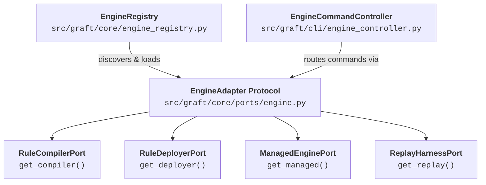

# Extending Graft: Adding New Detection Engines

Graft's hexagonal architecture makes adding support for a new SIEM, EDR, or cloud analytics platform straightforward. Each engine exists as a completely self-contained, encapsulated package under `src/graft/engines/<engine>/` with its own manifest, adapter, schemas, documentation, and in-tree tests.

---

## 1. Automated Scaffolding (`graft new engine`)

To bootstrap an engine, run:

```bash
graft new engine sentinel
```

This single command automatically generates a fully encapsulated engine package:

```text
src/graft/engines/sentinel/
├── __init__.py           # Package entrypoint
├── engine.yaml           # Declarative manifest (conforming to engine_manifest.schema.json)
├── adapter.py            # Primary EngineAdapter protocol implementation
├── config.py             # Credentials and environment coordinate resolution
├── compiler.py           # Syntax verification implementing RuleCompilerPort
├── deployer.py           # Custom rule CRUD implementing RuleDeployerPort
├── README.md             # Engine-specific documentation and usage guides
├── schemas/
│   └── rule.schema.json  # Co-located rule schema inheriting from base_rule.schema.json
└── tests/
    ├── __init__.py
    ├── test_compiler.py  # In-tree compiler unit tests
    └── test_adapter.py   # In-tree adapter protocol conformance tests
```

Additionally, it configures:
- **Rule Directory (`rules/sentinel/custom/`):** Target directory for organizational detection rules.
- **Environment Template (`.env.example`):** Appends namespaced configuration variables (e.g., `GRAFT_SENTINEL_*`).

---

## 2. Engine Manifest (`engine.yaml`)

Every engine must declare an `engine.yaml` manifest at its root. This manifest is validated against `schemas/engine_manifest.schema.json` and discovered dynamically at runtime by [`EngineRegistry`](file:///usr/local/google/home/joelopes/Projects/graft/src/graft/core/engine_registry.py):

```yaml
name: sentinel
display_name: Microsoft Sentinel
description: Microsoft Sentinel Detection Engine Adapter
adapter_class: graft.engines.sentinel.adapter:SentinelAdapter

capabilities:
  custom_rules: true
  syntax_verification: true
  managed_rules: false
  replay_testing: false

environments:
  - staging
  - production

env_vars:
  required:
    - GRAFT_SENTINEL_API_KEY
  optional: []
```

### Manifest Fields
- `name`: Technical engine slug (lowercase `^[a-z0-9_]+$`). Forms the CLI subcommand namespace (e.g. `graft sentinel ...`).
- `display_name`: Human-readable title used in CLI headers, drift diffs, and catalog exports.
- `adapter_class`: Python entrypoint in `<module>:<Class>` format implementing [`EngineAdapter`](file:///usr/local/google/home/joelopes/Projects/graft/src/graft/core/ports/engine.py#L10).
- `capabilities`: Feature flags (`custom_rules`, `syntax_verification`, `managed_rules`, `replay_testing`). Graft's generic CLI controller automatically provisions only the subcommands supported by the engine's capabilities.
- `environments`: Target environment profiles supported (e.g., `staging`, `production`).
- `env_vars`: Explicit manifest of required and optional environment variables.

---

## 3. Implementing the `EngineAdapter` Protocol

Engine integration is governed by the composite [`EngineAdapter`](file:///usr/local/google/home/joelopes/Projects/graft/src/graft/core/ports/engine.py#L10) protocol:



### Granular Port Responsibilities
1. **`RuleCompilerPort` (`get_compiler()`):** Translates rule logic into native vendor queries and executes pre-merge dry-run compilation against the vendor API. Returns structured `CompilationResult`.
2. **`RuleDeployerPort` (`get_deployer()`):** Manages remote custom rule lifecycle: `list_rules()`, `create_rule()`, `update_rule()`, `delete_rule()`, and `set_rule_state()`.
3. **`ManagedEnginePort` (`get_managed()`):** Synchronizes vendor-managed curated content and rule exclusion filters between `rules/<engine>/managed.yaml` and the remote tenant.
4. **`ReplayHarnessPort` (`get_replay()`):** Coordinates synthetic telemetry replay in isolated staging environments with automatic quarantine and cleanup.

---

## 4. Developing with Strict TDD

When implementing an engine adapter:
1. **Never import third-party HTTP clients:** Use `urllib.request` or Python standard libraries.
2. **Co-locate tests inside the engine directory:** Write 100% mock-isolated contract tests in `src/graft/engines/<engine>/tests/`. Pytest automatically discovers tests across both `tests/` and `src/`.
3. **Verify Quality Gates:**
   ```bash
   uv run ruff check .
   uv run ruff format --check .
   uv run mypy --strict src tests
   uv run pytest
   ```
