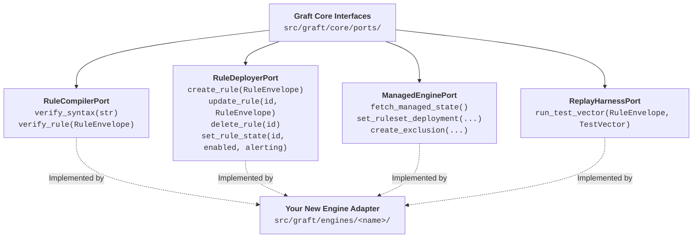

# Extending Graft: Adding New Detection Engines

Graft's hexagonal architecture makes adding support for a new SIEM, EDR, or cloud analytics platform straightforward. This guide walks through scaffolding and implementing a new engine adapter.

---

## 1. Automated Scaffolding (`graft new engine`)

To bootstrap an engine, run:

```bash
graft new engine sentinel
```

This single command automatically generates:
1. **Engine Source (`src/graft/engines/sentinel/`):**
   - `__init__.py`: Package entrypoint.
   - `config.py`: Credentials and environment coordinate resolution.
   - `client.py`: Stdlib REST client for vendor API.
   - `compiler.py`: Syntax verification implementing `RuleCompilerPort`.
   - `deployer.py`: Rule CRUD implementing `RuleDeployerPort`.
   - `managed.py`: Managed state sync implementing `ManagedEnginePort`.
   - `replay.py`: Synthetic test harness implementing `ReplayHarnessPort`.
2. **CLI Engine Command Hook (`src/graft/cli/engines/sentinel.py`):**
   - Registers `graft sentinel ...` subcommands with `argparse`.
3. **Engine Schema (`schemas/sentinel_custom.schema.json`):**
   - Inherits `base_rule.schema.json` via JSON Schema `$ref` and `allOf`.
4. **Rule Directory (`rules/sentinel/custom/` & `rules/sentinel/managed.yaml`):**
   - Directory structure for custom rules and vendor-managed content.
5. **Environment Template (`.env.example`):**
   - Appends a namespaced configuration block (e.g. `GRAFT_SENTINEL_*`).

---

## 2. Implementing the Port Interfaces

Every engine adapter implements one or more interfaces defined in `src/graft/core/ports/`:



### 1. `RuleCompilerPort`
Translates the rule envelope into native vendor syntax and submits it to a pre-merge compilation dry-run endpoint. Returns structured `CompilationResult` with any line/column diagnostics.

### 2. `RuleDeployerPort`
Performs live rule provisioning. Encapsulates vendor-specific API mutations for creating, updating, activating, and deleting detections.

### 3. `ManagedEnginePort`
Translates vendor-curated detection content and exclusion lists between the local `managed.yaml` domain models and the remote vendor state.

### 4. `ReplayHarnessPort`
Coordinates synthetic event injection and quarantined ad-hoc evaluation, ensuring zero live alerts are produced during verification runs.

---

## 3. Developing with Strict TDD

When developing an engine adapter:
1. **Never import third-party HTTP clients:** Use `urllib.request` or standard library tooling.
2. **Mock-transport unit tests:** Write 100% mocked contract tests under `tests/engines/<name>/` using `unittest.mock` to verify payload serialization and error handling.
3. **Verify Quality Gates:**
   ```bash
   uv run ruff check .
   uv run ruff format --check .
   uv run mypy --strict src tests
   uv run pytest tests/engines/<name>/
   ```
