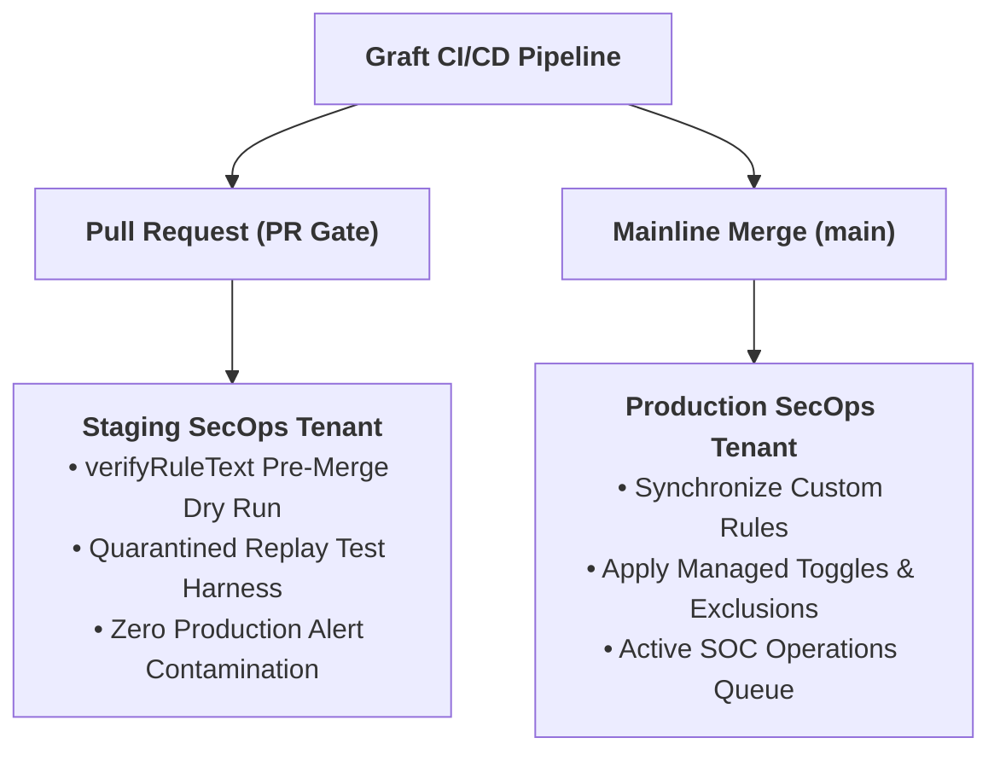
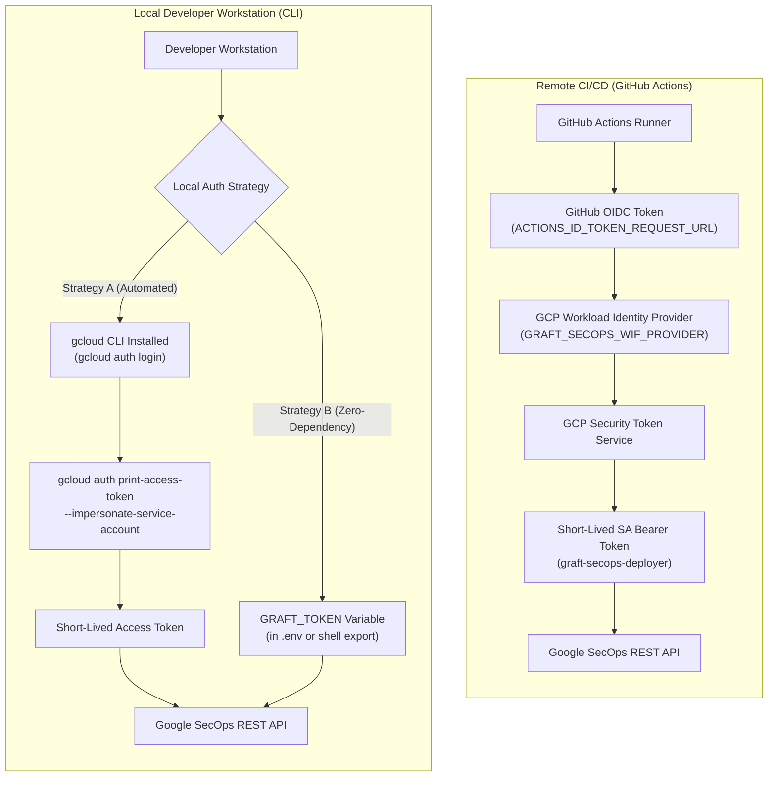

# Google SecOps Environment Setup & CLI Provisioning Guide

This guide is a CLI-driven runbook to prepare Google Cloud Platform (GCP) and Google SecOps (formerly Chronicle) for Graft. Follow these instructions to provision service accounts, configure Workload Identity Federation (WIF) for GitHub Actions, verify permissions with an automated compiler dry-run, and generate all required `.env` and GitHub Actions variables.

---

## 1. Overview & Operator Pre-Flight Summary

Before running any commands, review the infrastructure components that will be provisioned in your GCP project:

### What Will Be Created & Configured

| Component / Resource | Resource Identifier | Purpose & Operational Rationale |
| :--- | :--- | :--- |
| **Chronicle API** | `chronicle.googleapis.com` | Enables programmatic access to rule verification (`:verifyRuleText`), CRUD deployment, curated ruleset management, and synthetic UDM ingestion. |
| **IAM Credentials API** | `iamcredentials.googleapis.com` | Generates short-lived OAuth2 tokens and authorizes service account impersonation without downloading static keys. |
| **Automation Identity** | Service Account: `graft-secops-deployer` | Dedicated identity with `roles/chronicle.editor` granting least-privilege permissions to manage rules and inject test replay events. |
| **Developer Impersonation** | IAM Policy: `roles/iam.serviceAccountTokenCreator` | Permits authorized engineers to impersonate `graft-secops-deployer` locally via `gcloud`, keeping workstations free of static JSON credential files. |
| **Workload Identity Pool** | `graft-pool` | Establishes a trust boundary within GCP for external OpenID Connect (OIDC) authentication. |
| **GitHub OIDC Provider** | `graft-gh-provider` | Exchanges GitHub Actions runner tokens for temporary GCP access tokens, scoped strictly to the `lopes/graft` repository. |
| **Pre-Flight Dry Run** | Non-destructive API test | Submits a lightweight dummy rule to `:verifyRuleText` to prove credentials and routing work before saving. |
| **Environment Export** | `.env` and `gh` CLI commands | Emits copy-pasteable configuration blocks for local CLI development and automated GitHub Actions secret registration. |

### Architectural Topologies

Graft supports two operational topologies:

- **Enterprise Dual-Tenant Topology (Recommended):**
  - **Staging Tenant (CI / Replay Quarantine):** A dedicated, physically isolated Google SecOps instance used by GitHub Actions PR workflows and local developers to dry-run YARA-L rules (`verifyRuleText`) and execute dynamic replay tests with synthetic UDM events without alert contamination.
  - **Production Tenant:** The live operational SOC instance where validated custom rules and managed curated configurations are synchronized upon merge to `main`.
- **Single-Tenant Lab Topology (Sandboxes & Personal Research):**
  - Staging and Production point to the same SecOps instance. Quarantine safeguards ensure test rules do not produce live SOC alerts during replay evaluation.



---

## 2. Authentication Architecture: Local Workstation vs. CI/CD (GitHub Actions)

Graft adheres to a strict **stdlib-first architecture** and intentionally avoids importing proprietary cloud SDKs (such as `google-auth`, `google-cloud-storage`, or `google-api-python-client`) into its runtime source. All HTTP requests route through the Python standard library (`urllib.request`).

Because Google SecOps REST endpoints require an OAuth2 Bearer token (`Authorization: Bearer <token>`), authentication differs based on whether Graft runs in automated CI/CD or on a developer workstation:



### Why Workload Identity Federation (WIF) is CI/CD-Only
Workload Identity Federation requires an OpenID Connect (OIDC) identity provider. In GitHub Actions, each workflow runner receives a cryptographically signed OIDC JWT token issued by GitHub (`https://token.actions.githubusercontent.com`). GCP verifies GitHub's signature, checks repository claim attributes (`assertion.repository == 'owner/repo'`), and mints temporary credentials without storing any static GCP keys in GitHub.

Local developer workstations cannot generate GitHub OIDC tokens. Therefore, WIF cannot be used on local machines.

### Local Workstation Authentication Strategies

#### Strategy A: Google Cloud CLI (`gcloud`) Impersonation (Recommended for Dev Machines)
When `gcloud` is installed on your workstation, Graft's `SecOpsAuthResolver` executes:
```bash
gcloud auth print-access-token --impersonate-service-account=<SA_EMAIL>
```
- **Requirements:** `google-cloud-cli` installed (`sudo apt install -y google-cloud-cli`) and authenticated (`gcloud auth login`).
- **IAM Permission:** Your GCP user account must have `roles/iam.serviceAccountTokenCreator` on the automation service account (configured in Step 4).
- **Advantage:** Completely transparent and automatic; fresh short-lived tokens are minted in the background whenever commands run.

#### Strategy B: Explicit Access Token via `GRAFT_TOKEN` (Zero-Dependency Fallback)
If you do not have `gcloud` installed on your workstation (e.g. corp machines without `google-cloud-cli`, or locked-down environments), you can pass a temporary OAuth2 token directly via the `GRAFT_TOKEN` environment variable:
```bash
export GRAFT_TOKEN="<access_token>"
```
Or place it in your `.env` file:
```bash
GRAFT_TOKEN="<access_token>"
```
- **Generating a Token:** You can generate a token from any environment where you have GCP access (such as Cloud Shell or an authenticated machine) by running:
  ```bash
  gcloud auth print-access-token --impersonate-service-account="${SA_EMAIL}"
  ```
- **Advantage:** Requires zero CLI tools or SDKs installed on your local workstation.
- **Lifetime:** Standard GCP access tokens expire after 1 hour (3600 seconds).

---

## 3. CLI Provisioning & Setup (Step-by-Step)

### Step 1: Obtain Tenant Coordinates from SecOps Web UI (One-Time)

Before opening the GCP Console / Cloud Shell, grab your tenant coordinates from Google SecOps:

1. Open the Google SecOps Web UI (`https://<TENANT>.backstory.chronicle.security/`).
2. Navigate to **Settings** (gear icon) > **SIEM Settings** > **Organization Details**.
3. Record:
   - **Region:** e.g. `us`, `europe-west3`
   - **Customer ID:** UUID format, e.g. `11111111-2222-3333-4444-555555555555`

---

### Step 2: Define All Variables in Cloud Shell

Now switch to Cloud Shell. Export all variables together at the beginning so all subsequent commands execute without leaving Cloud Shell:

```bash
export TARGET_ENV="prod" # or "staging"
export TARGET_ENV_UPPER="$(echo ${TARGET_ENV} | tr '[:lower:]' '[:upper:]')"
export PROJECT_ID="$(gcloud config get-value project)"
export SECOPS_LOCATION="<PASTE_REGION_HERE>"        # Region from SecOps Organization Details
export INSTANCE_ID="<PASTE_CUSTOMER_ID_UUID_HERE>"  # Customer ID UUID from SecOps Organization Details
export REPO_SLUG="<PASTE_REPO_SLUG_HERE>"           # Your GitHub Graft fork
export SA_NAME="graft-secops-deployer"
export SA_EMAIL="${SA_NAME}@${PROJECT_ID}.iam.gserviceaccount.com"
export POOL_NAME="graft-pool"
export PROVIDER_NAME="graft-gh-provider"
```

---

### Step 3: Enable Required GCP APIs

```bash
gcloud services enable \
  chronicle.googleapis.com \
  iamcredentials.googleapis.com \
  --project="${PROJECT_ID}"
```

---

### Step 4: Create Service Account & Grant IAM Permissions

```bash
# 1. Create the automation Service Account
gcloud iam service-accounts create "${SA_NAME}" \
  --project="${PROJECT_ID}" \
  --display-name="Graft SecOps Deployer (${TARGET_ENV})" \
  --description="Detection-as-Code automation identity for Graft"

# 2. Grant least-privilege Chronicle Editor role
gcloud projects add-iam-policy-binding "${PROJECT_ID}" \
  --member="serviceAccount:${SA_EMAIL}" \
  --role="roles/chronicle.editor"

# 3. Authorize local developer impersonation (for local CLI testing)
gcloud iam service-accounts add-iam-policy-binding "${SA_EMAIL}" \
  --project="${PROJECT_ID}" \
  --member="user:$(gcloud config get-value account)" \
  --role="roles/iam.serviceAccountTokenCreator"
```

---

### Step 5: Configure Workload Identity Federation (WIF) for GitHub Actions

```bash
# 1. Create Workload Identity Pool
gcloud iam workload-identity-pools create "${POOL_NAME}" \
  --project="${PROJECT_ID}" \
  --location="global" \
  --display-name="Graft CI/CD Pool"

# 2. Create GitHub OIDC Provider (enforcing repository attribute-condition)
gcloud iam workload-identity-pools providers create-oidc "${PROVIDER_NAME}" \
  --project="${PROJECT_ID}" \
  --location="global" \
  --workload-identity-pool="${POOL_NAME}" \
  --display-name="Graft GitHub Actions Provider" \
  --issuer-uri="https://token.actions.githubusercontent.com" \
  --attribute-mapping="google.subject=assertion.sub,attribute.actor=assertion.actor,attribute.repository=assertion.repository,attribute.repository_owner=assertion.repository_owner" \
  --attribute-condition="assertion.repository == '${REPO_SLUG}'"

# 3. Retrieve numeric Project Number
PROJECT_NUMBER="$(gcloud projects describe ${PROJECT_ID} --format='value(projectNumber)')"

# 4. Authorize repository to impersonate the Service Account
gcloud iam service-accounts add-iam-policy-binding "${SA_EMAIL}" \
  --project="${PROJECT_ID}" \
  --role="roles/iam.workloadIdentityUser" \
  --member="principalSet://iam.googleapis.com/projects/${PROJECT_NUMBER}/locations/global/workloadIdentityPools/${POOL_NAME}/attribute.repository/${REPO_SLUG}"

# 5. Extract full WIF Provider resource path (needed for GRAFT_SECOPS_WIF_PROVIDER)
export WIF_PROVIDER="$(gcloud iam workload-identity-pools providers describe "${PROVIDER_NAME}" \
  --project="${PROJECT_ID}" \
  --location="global" \
  --workload-identity-pool="${POOL_NAME}" \
  --format="value(name)")"
```

---

## 4. Pre-Flight Dry-Run Verification

Test the entire integration chain before saving variables. This generates an impersonated OAuth2 token and tests the Chronicle `v1` `:verifyRuleText` endpoint.

Run with `-i -sS` so HTTP headers and error responses are always visible:

```bash
# 1. Impersonate the Service Account to generate a short-lived access token
TEST_TOKEN="$(gcloud auth print-access-token --impersonate-service-account="${SA_EMAIL}")"

# 2. Build the Chronicle v1 API base endpoint
API_BASE="https://${SECOPS_LOCATION}-chronicle.googleapis.com/v1/projects/${PROJECT_ID}/locations/${SECOPS_LOCATION}/instances/${INSTANCE_ID}"

# 3. Submit a syntax dry-run verification
curl -i -sS -X POST \
  -H "Authorization: Bearer ${TEST_TOKEN}" \
  -H "Content-Type: application/json" \
  "${API_BASE}:verifyRuleText" \
  -d '{
    "ruleText": "rule graft_preflight_check {\n  meta:\n    author = \"Graft\"\n  events:\n    $e.metadata.event_type = \"USER_LOGIN\"\n  condition:\n    $e\n}"
  }'
```

**Expected Response:**

```http
HTTP/2 200
content-type: application/json; charset=UTF-8

{
  "success": true
}
```

---

## 5. Output & Annotate Environment Variables

Once the dry-run passes, run this snippet directly in Cloud Shell to print the unified configuration block on screen:

```bash
TARGET_ENV_UPPER="${TARGET_ENV_UPPER:-PROD}"
cat <<EOF

==============================================================================
 GRAFT UNIFIED CONFIGURATION (${TARGET_ENV_UPPER})
==============================================================================
export GRAFT_SECOPS_${TARGET_ENV_UPPER}_PROJECT="${PROJECT_ID}"
export GRAFT_SECOPS_${TARGET_ENV_UPPER}_LOCATION="${SECOPS_LOCATION}"
export GRAFT_SECOPS_${TARGET_ENV_UPPER}_INSTANCE_ID="${INSTANCE_ID}"
export GRAFT_SECOPS_${TARGET_ENV_UPPER}_SA_EMAIL="${SA_EMAIL}"
export GRAFT_SECOPS_WIF_PROVIDER="${WIF_PROVIDER}"
==============================================================================
EOF
```

> [!IMPORTANT]
> **Action Required: Copy and record these 5 values now.**  
> Your GCP environment and SecOps instance are now fully configured and pre-flight verified. Once you close this Cloud Shell session, these session environment variables will be cleared from terminal memory.
>
> - **Local CLI:** Paste this block directly into your `.env` file at the root of the repository. Locally, Graft authenticates either via `gcloud` impersonation (Strategy A) or via the `GRAFT_TOKEN` environment variable (Strategy B).
> - **GitHub Actions:** In your GitHub repository (**Settings** > **Secrets and variables** > **Actions**), register these same 5 values:
>   - **Secrets (`${{ secrets.* }}`):** `GRAFT_SECOPS_WIF_PROVIDER` and `GRAFT_SECOPS_${TARGET_ENV_UPPER}_SA_EMAIL`
>   - **Variables (`${{ vars.* }}`):** `GRAFT_SECOPS_${TARGET_ENV_UPPER}_PROJECT`, `GRAFT_SECOPS_${TARGET_ENV_UPPER}_LOCATION`, and `GRAFT_SECOPS_${TARGET_ENV_UPPER}_INSTANCE_ID`
>   *(GitHub Actions uses the WIF Provider and SA Email to authenticate automatically via OIDC, eliminating static private keys).*

---

## 6. Reference: Secret & Variable Matrix

All variables and secrets strictly use the unified `GRAFT_SECOPS_` namespace:

### GitHub Secrets (`${{ secrets.* }}`)

| Secret Name | Target Scope | Provisioned By / Description |
| :--- | :---: | :--- |
| `GRAFT_SECOPS_WIF_PROVIDER` | Global / CI | Full WIF provider resource path (`projects/<NUM>/locations/global/workloadIdentityPools/graft-pool/providers/graft-gh-provider`) |
| `GRAFT_SECOPS_STAGING_SA_EMAIL` | Staging (PR) | Staging Service Account email (`graft-secops-deployer@<STAGING_PROJECT>.iam.gserviceaccount.com`) |
| `GRAFT_SECOPS_PROD_SA_EMAIL` | Production (`main`) | Production Service Account email (`graft-secops-deployer@<PROD_PROJECT>.iam.gserviceaccount.com`) |

### GitHub Variables (`${{ vars.* }}`)

| Variable Name | Target Scope | Value Description |
| :--- | :---: | :--- |
| `GRAFT_SECOPS_STAGING_PROJECT` | Staging (PR) | GCP Project ID hosting the Staging SecOps tenant |
| `GRAFT_SECOPS_STAGING_LOCATION` | Staging (PR) | Multi-region location (`us`, `europe-west3`, etc.) |
| `GRAFT_SECOPS_STAGING_INSTANCE_ID` | Staging (PR) | Staging Customer ID (UUID from SecOps Organization Details) |
| `GRAFT_SECOPS_PROD_PROJECT` | Production (`main`) | GCP Project ID hosting the Production SecOps tenant |
| `GRAFT_SECOPS_PROD_LOCATION` | Production (`main`) | Multi-region location (`us`, `europe-west3`, etc.) |
| `GRAFT_SECOPS_PROD_INSTANCE_ID` | Production (`main`) | Production Customer ID (UUID from SecOps Organization Details) |

### Local Workstation Environment Variables (`.env`)

| Variable Name | Target Scope | Description |
| :--- | :---: | :--- |
| `GRAFT_SECOPS_PROD_PROJECT` | Local / Prod | GCP Project ID hosting the Production SecOps tenant |
| `GRAFT_SECOPS_PROD_LOCATION` | Local / Prod | Multi-region location (`us`, `europe-west3`, etc.) |
| `GRAFT_SECOPS_PROD_INSTANCE_ID` | Local / Prod | Production Customer ID UUID |
| `GRAFT_SECOPS_PROD_SA_EMAIL` | Local / Prod | Automation service account email (required when using Strategy A `gcloud` impersonation) |
| `GRAFT_TOKEN` | Local / Any | Direct OAuth2 Bearer token override (Strategy B). When present, bypasses `gcloud` entirely |

> [!NOTE]
> **Single-Tenant Mode:** When operating with a single SecOps instance shared between testing and production, you only need to register the 5 Production items (`GRAFT_SECOPS_PROD_*` and `GRAFT_SECOPS_WIF_PROVIDER`). Graft automatically falls back to the production instance coordinates for PR validation and replay tests when staging variables are not defined.

