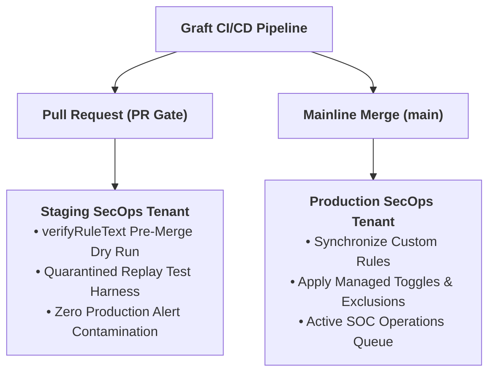

# Google SecOps Environment Setup & CI/CD Prerequisites

This guide details the GCP IAM configuration, dual-tenant topology (Staging vs. Production), instance coordinate extraction, and GitHub Actions CI/CD secret mapping for Graft's Google SecOps target.

---

## 1. Dual-Tenant Topology & Security Architecture

Graft enforces strict physical isolation between CI verification and production detection operations:

- **Staging Tenant (CI / Replay Quarantine):** A dedicated, physically separate Google SecOps instance used by GitHub Actions PR workflows and local developers to dry-run YARA-L rules (`verifyRuleText`) and execute dynamic replay tests with synthetic UDM events.
- **Production Tenant:** The live operational SOC instance where validated custom rules and managed curated configurations are synchronized upon merge to the mainline (`main`) branch.



---

## 2. GCP Identity & IAM Provisioning

Run these commands in both your **Staging** and **Production** GCP projects to provision the deployment service account without exporting static JSON keys.

```bash
export PROJECT_ID="$(gcloud config get-value project)"
export SA_NAME="graft-secops-deployer"
export SA_EMAIL="${SA_NAME}@${PROJECT_ID}.iam.gserviceaccount.com"

# 1. Enable required APIs
gcloud services enable \
  chronicle.googleapis.com \
  iamcredentials.googleapis.com \
  --project="${PROJECT_ID}"

# 2. Create the Graft deployer Service Account
gcloud iam service-accounts create "${SA_NAME}" \
  --project="${PROJECT_ID}" \
  --display-name="Graft SecOps Deployer" \
  --description="Detection-as-Code automation identity for Graft"

# 3. Grant least-privilege rule and ingestion management permissions
gcloud projects add-iam-policy-binding "${PROJECT_ID}" \
  --member="serviceAccount:${SA_EMAIL}" \
  --role="roles/chronicle.editor"

# 4. Authorize local developer accounts to impersonate the SA for testing
gcloud iam service-accounts add-iam-policy-binding "${SA_EMAIL}" \
  --project="${PROJECT_ID}" \
  --member="user:$(gcloud config get-value account)" \
  --role="roles/iam.serviceAccountTokenCreator"
```

---

## 3. Instance Coordinates & Local Environment Variables

Retrieve tenant coordinates from the Google SecOps Web UI for both environments:
1. Open SecOps UI (`https://<TENANT>.backstory.chronicle.security/`).
2. Navigate to **Settings** (gear icon) > **SIEM Settings** > **Organization Details**.
3. Record:
   - **Region** (maps to API `location`, e.g., `us`, `europe-west3`).
   - **Customer ID** (maps to API `instance`, UUID format).

### Local Shell Configuration (`.env` or terminal rc)

Graft namespaces engine credentials with `GRAFT_<ENGINE>_*`, while supporting generic `GRAFT_*` fallbacks:

```bash
# ==============================================================================
# Multi-Tenant Enterprise Topology (Recommended)
# ==============================================================================
# Staging Tenant (Used for graft secops verify & graft secops test)
export GRAFT_SECOPS_STAGING_PROJECT="my-secops-staging-project"
export GRAFT_SECOPS_STAGING_LOCATION="us"
export GRAFT_SECOPS_STAGING_INSTANCE_ID="11111111-2222-3333-4444-555555555555"
export GRAFT_SECOPS_STAGING_SA_EMAIL="graft-secops-deployer@my-secops-staging-project.iam.gserviceaccount.com"

# Production Tenant (Used for graft secops managed diff & apply)
export GRAFT_SECOPS_PROD_PROJECT="my-secops-prod-project"
export GRAFT_SECOPS_PROD_LOCATION="us"
export GRAFT_SECOPS_PROD_INSTANCE_ID="66666666-7777-8888-9999-000000000000"
export GRAFT_SECOPS_PROD_SA_EMAIL="graft-secops-deployer@my-secops-prod-project.iam.gserviceaccount.com"

# ==============================================================================
# Single-Tenant Lab Topology (Sandboxes & Personal Research)
# In lab environments, staging and production can point to the same instance:
# ==============================================================================
# export GRAFT_SECOPS_PROJECT="my-lab-secops-project"
# export GRAFT_SECOPS_LOCATION="us"
# export GRAFT_SECOPS_INSTANCE_ID="11111111-2222-3333-4444-555555555555"
# export GRAFT_SECOPS_SA_EMAIL="graft-deployer@my-lab-secops-project.iam.gserviceaccount.com"
```

---

## 4. CI/CD Secret & Variable Mapping Matrix (GitHub Actions)

When configuring GitHub Actions, authenticate using **Workload Identity Federation (WIF)**. Never store or export static Service Account JSON keys.

### GitHub Repository Secrets & Variables

| Setting Name | Type | Target Environment | Description / Example |
| :--- | :---: | :---: | :--- |
| `GCP_WORKLOAD_IDENTITY_PROVIDER` | Secret | Global / All | `projects/<NUM>/locations/global/workloadIdentityPools/<POOL>/providers/<PROVIDER>` |
| `GCP_STAGING_SERVICE_ACCOUNT` | Secret | Staging (PR) | `graft-secops-deployer@<STAGING_PROJECT>.iam.gserviceaccount.com` |
| `GCP_PROD_SERVICE_ACCOUNT` | Secret | Production (`main`) | `graft-secops-deployer@<PROD_PROJECT>.iam.gserviceaccount.com` |
| `GRAFT_SECOPS_STAGING_PROJECT` | Variable | Staging (PR) | GCP Project ID for Staging |
| `GRAFT_SECOPS_STAGING_LOCATION` | Variable | Staging (PR) | Staging region (`us`, `europe-west3`, etc.) |
| `GRAFT_SECOPS_STAGING_INSTANCE_ID` | Variable | Staging (PR) | Staging Customer ID (UUID) |
| `GRAFT_SECOPS_PROD_PROJECT` | Variable | Production (`main`) | GCP Project ID for Production |
| `GRAFT_SECOPS_PROD_LOCATION` | Variable | Production (`main`) | Production region (`us`, `europe-west3`, etc.) |
| `GRAFT_SECOPS_PROD_INSTANCE_ID` | Variable | Production (`main`) | Production Customer ID (UUID) |

---

## 5. API Verification & Pre-Merge Compiler Check (`verifyRuleText`)

The `verifyRuleText` endpoint performs full syntax compilation and schema verification on the Google SecOps backend without persisting the rule.

```bash
# 1. Generate short-lived token via service account impersonation
GRAFT_TOKEN=$(gcloud auth print-access-token \
  --impersonate-service-account="${GRAFT_STAGING_SA_EMAIL}")

# 2. Build the API base URL
API_BASE="https://${GRAFT_STAGING_LOCATION}-chronicle.googleapis.com/v1alpha/projects/${GRAFT_STAGING_PROJECT}/locations/${GRAFT_STAGING_LOCATION}/instances/${GRAFT_STAGING_INSTANCE_ID}"

# 3. Test compilation dry run
curl -s -X POST \
  -H "Authorization: Bearer ${GRAFT_TOKEN}" \
  -H "Content-Type: application/json" \
  "${API_BASE}:verifyRuleText" \
  -d '{
    "ruleText": "rule graft_syntax_test {\n  meta:\n    author = \"Graft\"\n  events:\n    $e.metadata.event_type = \"USER_LOGIN\"\n  condition:\n    $e\n}"
  }'
```

**Expected Response:**
```json
{
  "success": true
}
```

If compilation fails, SecOps returns structured compilation errors and diagnostics (including line and column numbers), which Graft's compiler adapter captures and surfaces during CI validation.
