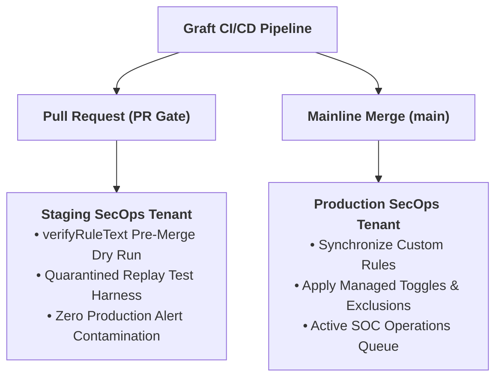
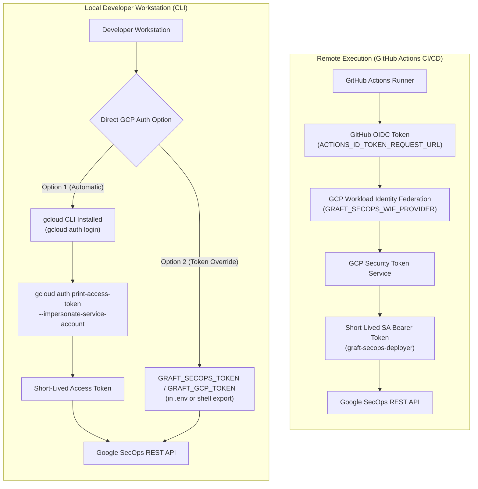
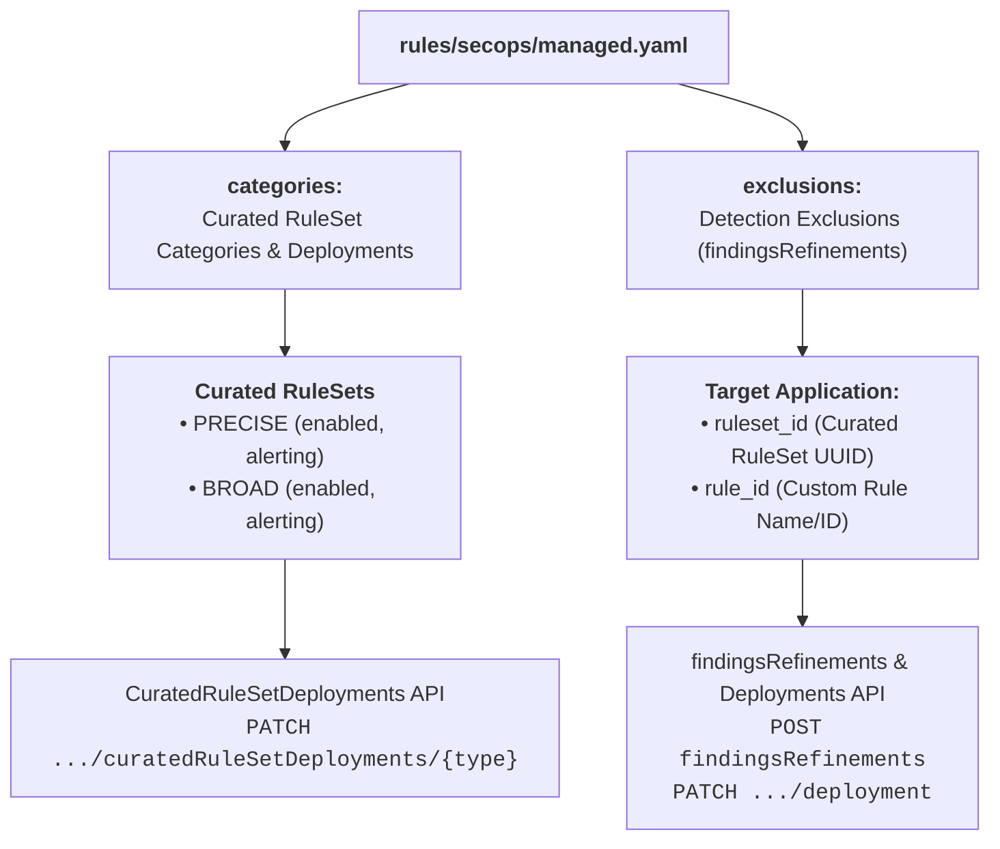
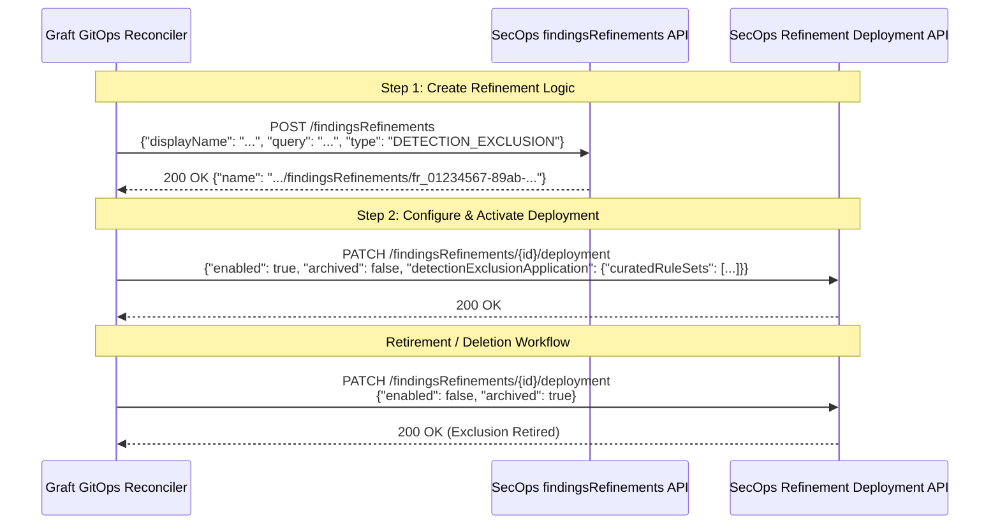
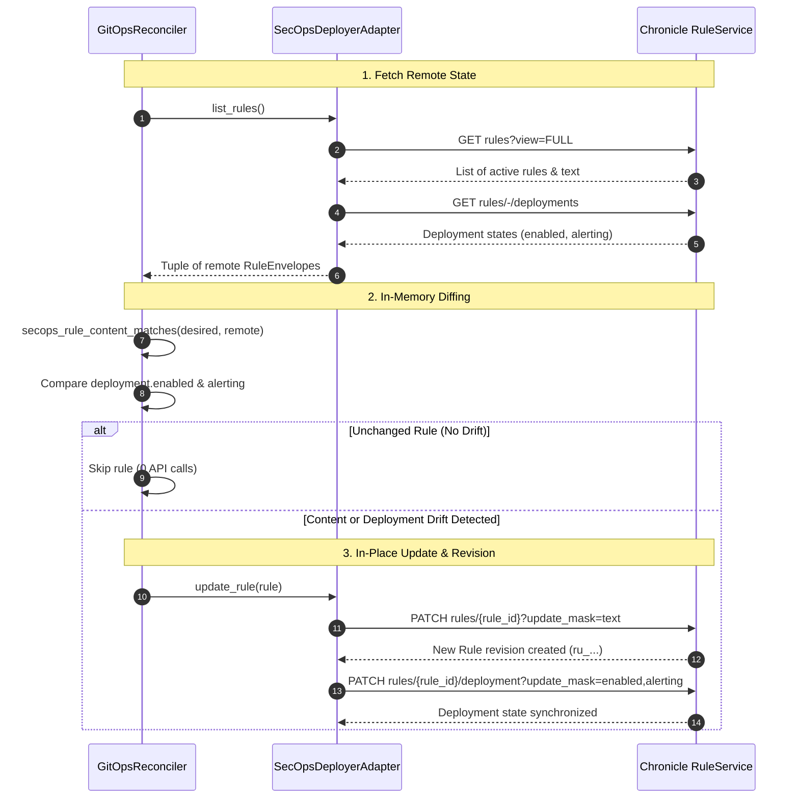

# Google SecOps Environment Setup & CLI Provisioning Guide

This guide is a CLI-driven runbook to prepare Google Cloud Platform (GCP) and Google SecOps (formerly Chronicle) for Graft. Follow these instructions to provision service accounts, configure Workload Identity Federation (WIF) for GitHub Actions, verify permissions with an automated compiler dry-run, and generate all required `.env` and GitHub Actions variables.

---

## 1. Overview & Operator Pre-Flight Summary

Before running any commands, review the infrastructure components that will be provisioned in your GCP project:

### What Will Be Created & Configured

| Component / Resource | Resource Identifier | Purpose & Operational Rationale |
| :--- | :--- | :--- |
| **Chronicle API** | `chronicle.googleapis.com` | Enables programmatic access to rule verification (`:verifyRuleText`), CRUD deployment, curated ruleset management, and synthetic UDM ingestion. |
| **IAM Credentials API** | `iamcredentials.googleapis.com` | Generates short-lived OAuth2 tokens and authorizes service account impersonation without downloading static keys. |
| **Automation Identity** | Service Account: `graft-secops-deployer` | Dedicated identity with `roles/chronicle.editor` granting least-privilege permissions to manage rules and inject test replay events. |
| **Developer Impersonation** | IAM Policy: `roles/iam.serviceAccountTokenCreator` | Permits authorized engineers to impersonate `graft-secops-deployer` locally via `gcloud`, keeping workstations free of static JSON credential files. |
| **Workload Identity Pool** | `graft-pool` | Establishes a trust boundary within GCP for external OpenID Connect (OIDC) authentication. |
| **GitHub OIDC Provider** | `graft-gh-provider` | Exchanges GitHub Actions runner tokens for temporary GCP access tokens, scoped strictly to the `lopes/graft` repository. |
| **Pre-Flight Dry Run** | Non-destructive API test | Submits a lightweight dummy rule to `:verifyRuleText` to prove credentials and routing work before saving. |
| **Environment Export** | `.env` and `gh` CLI commands | Emits copy-pasteable configuration blocks for local CLI development and automated GitHub Actions secret registration. |

### Architectural Topologies

Graft supports two operational topologies:

- **Enterprise Dual-Tenant Topology (Recommended):**
  - **Staging Tenant (CI / Replay Quarantine):** A dedicated, physically isolated Google SecOps instance used by GitHub Actions PR workflows and local developers to dry-run YARA-L rules (`verifyRuleText`) and execute dynamic replay tests with synthetic UDM events without alert contamination.
  - **Production Tenant:** The live operational SOC instance where validated custom rules and managed curated configurations are synchronized upon merge to `main`.
- **Single-Tenant Lab Topology (Sandboxes & Personal Research):**
  - Staging and Production point to the same SecOps instance. Quarantine safeguards ensure test rules do not produce live SOC alerts during replay evaluation.



---

## 2. CLI Provisioning & Setup (Step-by-Step)

### Step 1: Obtain Tenant Coordinates from SecOps Web UI (One-Time)

Before opening the GCP Console / Cloud Shell, grab your tenant coordinates from Google SecOps:

1. Open the Google SecOps Web UI (`https://<TENANT>.backstory.chronicle.security/`).
2. Navigate to **Settings** (gear icon) > **SIEM Settings** > **Organization Details**.
3. Record:
   - **Region:** e.g. `us`, `europe-west3`
   - **Customer ID:** UUID format, e.g. `11111111-2222-3333-4444-555555555555`

---

### Step 2: Define All Variables in Cloud Shell

Now switch to Cloud Shell. Export all variables together at the beginning so all subsequent commands execute without leaving Cloud Shell:

```bash
export TARGET_ENV="prod" # or "staging"
export TARGET_ENV_UPPER="$(echo ${TARGET_ENV} | tr '[:lower:]' '[:upper:]')"
export PROJECT_ID="$(gcloud config get-value project)"
export SECOPS_LOCATION="<PASTE_REGION_HERE>"        # Region from SecOps Organization Details
export INSTANCE_ID="<PASTE_CUSTOMER_ID_UUID_HERE>"  # Customer ID UUID from SecOps Organization Details
export REPO_SLUG="<PASTE_REPO_SLUG_HERE>"           # Your GitHub Graft fork
export SA_NAME="graft-secops-deployer"
export SA_EMAIL="${SA_NAME}@${PROJECT_ID}.iam.gserviceaccount.com"
export POOL_NAME="graft-pool"
export PROVIDER_NAME="graft-gh-provider"
```

---

### Step 3: Enable Required GCP APIs

```bash
gcloud services enable \
  chronicle.googleapis.com \
  iamcredentials.googleapis.com \
  --project="${PROJECT_ID}"
```

---

### Step 4: Create Service Account & Grant IAM Permissions

```bash
# 1. Create the automation Service Account
gcloud iam service-accounts create "${SA_NAME}" \
  --project="${PROJECT_ID}" \
  --display-name="Graft SecOps Deployer (${TARGET_ENV})" \
  --description="Detection-as-Code automation identity for Graft"

# 2. Grant least-privilege Chronicle Editor role
gcloud projects add-iam-policy-binding "${PROJECT_ID}" \
  --member="serviceAccount:${SA_EMAIL}" \
  --role="roles/chronicle.editor"

# 3. Authorize local developer impersonation (for local CLI testing)
gcloud iam service-accounts add-iam-policy-binding "${SA_EMAIL}" \
  --project="${PROJECT_ID}" \
  --member="user:$(gcloud config get-value account)" \
  --role="roles/iam.serviceAccountTokenCreator"
```

---

### Step 5: Configure Workload Identity Federation (WIF) for GitHub Actions

```bash
# 1. Create Workload Identity Pool
gcloud iam workload-identity-pools create "${POOL_NAME}" \
  --project="${PROJECT_ID}" \
  --location="global" \
  --display-name="Graft CI/CD Pool"

# 2. Create GitHub OIDC Provider (enforcing repository attribute-condition)
gcloud iam workload-identity-pools providers create-oidc "${PROVIDER_NAME}" \
  --project="${PROJECT_ID}" \
  --location="global" \
  --workload-identity-pool="${POOL_NAME}" \
  --display-name="Graft GitHub Actions Provider" \
  --issuer-uri="https://token.actions.githubusercontent.com" \
  --attribute-mapping="google.subject=assertion.sub,attribute.actor=assertion.actor,attribute.repository=assertion.repository,attribute.repository_owner=assertion.repository_owner" \
  --attribute-condition="assertion.repository == '${REPO_SLUG}'"

# 3. Retrieve numeric Project Number
PROJECT_NUMBER="$(gcloud projects describe ${PROJECT_ID} --format='value(projectNumber)')"

# 4. Authorize repository to impersonate the Service Account
gcloud iam service-accounts add-iam-policy-binding "${SA_EMAIL}" \
  --project="${PROJECT_ID}" \
  --role="roles/iam.workloadIdentityUser" \
  --member="principalSet://iam.googleapis.com/projects/${PROJECT_NUMBER}/locations/global/workloadIdentityPools/${POOL_NAME}/attribute.repository/${REPO_SLUG}"

# 5. Extract full WIF Provider resource path (needed for GRAFT_SECOPS_WIF_PROVIDER)
export WIF_PROVIDER="$(gcloud iam workload-identity-pools providers describe "${PROVIDER_NAME}" \
  --project="${PROJECT_ID}" \
  --location="global" \
  --workload-identity-pool="${POOL_NAME}" \
  --format="value(name)")"
```

---

## 3. Pre-Flight Dry-Run Verification

Test the entire integration chain before saving variables. This generates an impersonated OAuth2 token and tests the Chronicle `v1` `:verifyRuleText` endpoint.

Run with `-i -sS` so HTTP headers and error responses are always visible:

```bash
# 1. Impersonate the Service Account to generate a short-lived access token
TEST_TOKEN="$(gcloud auth print-access-token --impersonate-service-account="${SA_EMAIL}")"

# 2. Build the Chronicle v1 API base endpoint
API_BASE="https://${SECOPS_LOCATION}-chronicle.googleapis.com/v1/projects/${PROJECT_ID}/locations/${SECOPS_LOCATION}/instances/${INSTANCE_ID}"

# 3. Submit a syntax dry-run verification
curl -i -sS -X POST \
  -H "Authorization: Bearer ${TEST_TOKEN}" \
  -H "Content-Type: application/json" \
  "${API_BASE}:verifyRuleText" \
  -d '{
    "ruleText": "rule graft_preflight_check {\n  meta:\n    author = \"Graft\"\n  events:\n    $e.metadata.event_type = \"USER_LOGIN\"\n  condition:\n    $e\n}"
  }'
```

**Expected Response:**

```http
HTTP/2 200
content-type: application/json; charset=UTF-8

{
  "success": true
}
```

---

## 4. Output & Annotate Environment Variables

Once the dry-run passes, run this snippet directly in Cloud Shell to print the unified configuration block on screen:

```bash
TARGET_ENV_UPPER="${TARGET_ENV_UPPER:-PROD}"
cat <<EOF

==============================================================================
 GRAFT UNIFIED CONFIGURATION (${TARGET_ENV_UPPER})
==============================================================================
export GRAFT_SECOPS_${TARGET_ENV_UPPER}_PROJECT="${PROJECT_ID}"
export GRAFT_SECOPS_${TARGET_ENV_UPPER}_LOCATION="${SECOPS_LOCATION}"
export GRAFT_SECOPS_${TARGET_ENV_UPPER}_INSTANCE_ID="${INSTANCE_ID}"
export GRAFT_SECOPS_${TARGET_ENV_UPPER}_SA_EMAIL="${SA_EMAIL}"
export GRAFT_SECOPS_WIF_PROVIDER="${WIF_PROVIDER}"
==============================================================================
EOF
```

> [!IMPORTANT]
> **Action Required: Copy and record these 5 values now.**  
> Your GCP environment and SecOps instance are now fully configured and pre-flight verified. Once you close this Cloud Shell session, these session environment variables will be cleared from terminal memory.
>
> - **Local CLI:** Paste this block directly into your `.env` file at the root of the repository. Locally, Graft authenticates directly against GCP via `gcloud` impersonation (Option 1) or via `GRAFT_SECOPS_TOKEN` (Option 2).
> - **GitHub Actions:** In your GitHub repository (**Settings** > **Secrets and variables** > **Actions**), register these same 5 values:
>   - **Secrets (`${{ secrets.* }}`):** `GRAFT_SECOPS_WIF_PROVIDER` and `GRAFT_SECOPS_${TARGET_ENV_UPPER}_SA_EMAIL`
>   - **Variables (`${{ vars.* }}`):** `GRAFT_SECOPS_${TARGET_ENV_UPPER}_PROJECT`, `GRAFT_SECOPS_${TARGET_ENV_UPPER}_LOCATION`, and `GRAFT_SECOPS_${TARGET_ENV_UPPER}_INSTANCE_ID`
>   *(GitHub Actions uses the WIF Provider and SA Email to authenticate automatically via OIDC, eliminating static private keys).*

---

## 5. Reference: Secret & Variable Matrix

All variables and secrets strictly use the unified `GRAFT_SECOPS_` namespace:

### GitHub Secrets (`${{ secrets.* }}`)

| Secret Name | Target Scope | Provisioned By / Description |
| :--- | :---: | :--- |
| `GRAFT_SECOPS_WIF_PROVIDER` | Global / CI | Full WIF provider resource path (`projects/<NUM>/locations/global/workloadIdentityPools/graft-pool/providers/graft-gh-provider`) |
| `GRAFT_SECOPS_STAGING_SA_EMAIL` | Staging (PR) | Staging Service Account email (`graft-secops-deployer@<STAGING_PROJECT>.iam.gserviceaccount.com`) |
| `GRAFT_SECOPS_PROD_SA_EMAIL` | Production (`main`) | Production Service Account email (`graft-secops-deployer@<PROD_PROJECT>.iam.gserviceaccount.com`) |

### GitHub Variables (`${{ vars.* }}`)

| Variable Name | Target Scope | Value Description |
| :--- | :---: | :--- |
| `GRAFT_SECOPS_STAGING_PROJECT` | Staging (PR) | GCP Project ID hosting the Staging SecOps tenant |
| `GRAFT_SECOPS_STAGING_LOCATION` | Staging (PR) | Multi-region location (`us`, `europe-west3`, etc.) |
| `GRAFT_SECOPS_STAGING_INSTANCE_ID` | Staging (PR) | Staging Customer ID (UUID from SecOps Organization Details) |
| `GRAFT_SECOPS_PROD_PROJECT` | Production (`main`) | GCP Project ID hosting the Production SecOps tenant |
| `GRAFT_SECOPS_PROD_LOCATION` | Production (`main`) | Multi-region location (`us`, `europe-west3`, etc.) |
| `GRAFT_SECOPS_PROD_INSTANCE_ID` | Production (`main`) | Production Customer ID (UUID from SecOps Organization Details) |

### Local Workstation Environment Variables (`.env`)

| Variable Name | Target Scope | Description |
| :--- | :---: | :--- |
| `GRAFT_SECOPS_PROD_PROJECT` | Local / Prod | GCP Project ID hosting the Production SecOps tenant |
| `GRAFT_SECOPS_PROD_LOCATION` | Local / Prod | Multi-region location (`us`, `europe-west3`, etc.) |
| `GRAFT_SECOPS_PROD_INSTANCE_ID` | Local / Prod | Production Customer ID UUID |
| `GRAFT_SECOPS_PROD_SA_EMAIL` | Local / Prod | Automation service account email (required when using Option 1 `gcloud` impersonation) |
| `GRAFT_SECOPS_TOKEN` | Local / Any | Direct GCP OAuth2 Bearer token override (Option 2). Bypasses `gcloud` entirely |
| `GRAFT_GCP_TOKEN` | Local / Any | Alias fallback for `GRAFT_SECOPS_TOKEN` |
| `GRAFT_GITHUB_TOKEN` | Local / CI | Optional GitHub personal access token for release metadata or PR automation |

> [!NOTE]
> **Single-Tenant Mode:** When operating with a single SecOps instance shared between testing and production, you only need to register the 5 Production items (`GRAFT_SECOPS_PROD_*` and `GRAFT_SECOPS_WIF_PROVIDER`). Graft automatically falls back to the production instance coordinates for PR validation and replay tests when staging variables are not defined.

---

## 6. Authentication Architecture: GitHub Actions (CI/CD) vs. Local Workstation

Graft adheres to a strict **stdlib-first architecture** and intentionally avoids importing 3rd-party GCP SDKs or client libraries (such as `google-auth`, `google-cloud-storage`, or `google-api-python-client`) into its production source code. All HTTP requests route through the Python standard library (`urllib.request`).

Because Google SecOps REST endpoints require a valid OAuth2 Bearer token (`Authorization: Bearer <token>`), authentication must be handled directly with Google Cloud Platform depending on your operational environment:



### 1. Remote CI/CD: Workload Identity Federation (WIF)
In GitHub Actions, each workflow runner receives a cryptographically signed OpenID Connect (OIDC) JWT token issued by GitHub (`https://token.actions.githubusercontent.com`). GCP verifies GitHub's signature, evaluates repository claim conditions (`assertion.repository == 'owner/repo'`), and exchanges it via GCP Security Token Service (STS) for temporary credentials impersonating `graft-secops-deployer`. This eliminates static private keys or long-lived secrets in GitHub.

Because local developer workstations cannot generate GitHub-signed OIDC assertions, WIF is strictly available to GitHub Actions runners.

### 2. Local Workstation: Direct GCP Authentication
Without 3rd-party client libraries, local authentication must be done directly against GCP via one of two options:

#### Option 1: Google Cloud CLI (`gcloud`) Service Account Impersonation (Recommended Best Practice)
When `google-cloud-cli` is installed locally, Graft's `SecOpsAuthResolver` executes:
```bash
gcloud auth print-access-token --impersonate-service-account=<SA_EMAIL>
```
- **How It Works:** When you authenticate once with `gcloud auth login`, GCP issues a long-lived **refresh token** stored securely in your local user profile (`~/.config/gcloud/`).
- **Is It Permanent?** Yes. Unlike access tokens, `gcloud`'s underlying refresh token does not expire after an hour; it remains persistent across terminal sessions (subject only to corporate SSO/Cloud Identity reauth policies, typically 14 to 30 days, or manual revocation). Whenever Graft executes a command, `gcloud` automatically uses the refresh token to call the GCP IAM Credentials API (`generateAccessToken`), minting fresh, short-lived 1-hour access tokens in the background on demand.
- **Why It Is Best Practice:**
  - **Zero Manual Overhead:** You never have to copy-paste tokens or edit `.env` files every hour.
  - **Enhanced Security:** No raw OAuth bearer tokens are saved in plaintext on disk or shell history.
  - **Auditable & Revocable:** Impersonation events are logged in GCP Cloud Audit Logs, and access can be revoked instantly in IAM.
- **Practicality Caveat:** While architecturally best-practice, Option 1 requires `gcloud` installed locally on the developer workstation and requires the user to hold `roles/iam.serviceAccountTokenCreator` on the automation service account. On locked-down corporate workstations, minimal Docker containers, or environments where installing external CLIs is restricted, this can be cumbersome.

#### Option 2: Explicit GCP Bearer Token (`GRAFT_SECOPS_TOKEN` or `GRAFT_GCP_TOKEN`) (Fast Fallback)
If `gcloud` is not installed on your local machine (e.g. minimal environments, remote jumpboxes, or quick ad-hoc operations), you can pass an impersonated token directly via the environment or `.env` file:
```bash
export GRAFT_SECOPS_TOKEN="<access_token>"
# or inside .env:
GRAFT_SECOPS_TOKEN="<access_token>"
```
- **How to Generate:** Run the impersonation command in Google Cloud Shell or any machine with `gcloud` access:
  ```bash
  gcloud auth print-access-token --impersonate-service-account="${SA_EMAIL}"
  ```
- **Ephemerality Warning:** Raw OAuth 2.0 access tokens (`ya29...`) are **strictly ephemeral** and expire after **1 hour (3,600 seconds)**. Once expired, API requests will immediately fail with `401 Unauthorized` (`Request had invalid authentication credentials`). You must re-run `gcloud auth print-access-token` and paste the new token into `.env`.
- **When to Use:** Ideal for rapid verification, temporary operator sessions, or lightweight environments where installing the full Google Cloud SDK is impractical.

### 3. Token Grammar Reference
To avoid credential ambiguity across multiple platforms and engines, Graft enforces consistent token naming conventions:
- **`GRAFT_GITHUB_TOKEN`:** Personal access token for GitHub operations (fetching repository metadata, release tracking, or PR automation).
- **`GRAFT_SECOPS_TOKEN`** (or **`GRAFT_GCP_TOKEN`**): Dedicated GCP OAuth2 bearer token for Google SecOps REST APIs.

---

## 7. Google Curated Rule Sets & Managed Manifest (`rules/secops/managed.yaml`)

Google SecOps provides Curated Rule Sets—vendor-managed detection packages maintained by Google Cloud Threat Intelligence (GCTI). Graft manages the entire curated content lifecycle declaratively through a single consolidated manifest: [`rules/secops/managed.yaml`](file:///usr/local/google/home/joelopes/Projects/graft/rules/secops/managed.yaml).



### Hierarchy & Deployment Precision

Google SecOps organizes curated detections in a 3-tier hierarchy:
1. **Category:** High-level threat vertical (e.g. *Cloud Threats*, *Linux Threats*, *Windows Threats*). Each category has a UUID.
2. **Curated Rule Set:** A functional grouping of detection rules (e.g. *Malware Signals - Suspicious Execution*). Each ruleset has a UUID.
3. **Deployments:** Every curated ruleset provides two operational deployment models:
   - **`PRECISE`:** Strict, high-confidence detection logic tailored to produce actionable, high-fidelity SOC alerts with minimal false positives. Google strongly recommends enabling `PRECISE` first.
   - **`BROAD`:** Heuristic, exploratory detection logic designed for comprehensive threat hunting and broader behavioral visibility. Often run with `alerting: false` to avoid alert fatigue.

### Managed Manifest Format

The manifest [`rules/secops/managed.yaml`](file:///usr/local/google/home/joelopes/Projects/graft/rules/secops/managed.yaml) adheres to [`src/graft/engines/secops/schemas/managed.schema.json`](file:///usr/local/google/home/joelopes/Projects/graft/src/graft/engines/secops/schemas/managed.schema.json):

```yaml
categories:
  - name: "Linux Threats"
    id: "a5366ed8-3746-2423-a972-98535279f96a"
    rulesets:
      - id: "1c4ab1f6-d801-d6a9-1177-3ec3dd5bcbe9"
        name: "Malware Signals - Suspicious Execution"
        deployments:
          - type: PRECISE
            enabled: true
            alerting: false
          - type: BROAD
            enabled: false
            alerting: false

exclusions:
  - id: "exclude-backup-automation"
    description: "Exclude authorized overnight backup automation from Suspicious Execution"
    ruleset_id: "1c4ab1f6-d801-d6a9-1177-3ec3dd5bcbe9"
    expression: 'principal.hostname = "backup-server.corp.internal"'
```

---

## 8. Detection Exclusions (`findingsRefinements`) & Operator Runbook

In Google SecOps, detection exceptions are officially termed **Findings Refinements** (`findingsRefinements`). Exclusions allow operators to suppress known benign activity from generating alerts without modifying underlying curated detection logic.

### API Architecture & Protocol Mechanics

Unlike custom rules, exclusions in Google SecOps follow a decoupled, two-stage resource model:



1. **Refinement Definition (`findingsRefinements`):**
   - Holds the human-readable `displayName`, the UDM filter `query`, and the type `DETECTION_EXCLUSION`.
   - The SecOps API generates an immutable UUID resource name: `projects/{project}/locations/{location}/instances/{instance}/findingsRefinements/{fr_uuid}`.
2. **Refinement Deployment (`findingsRefinements/{id}/deployment`):**
   - Governs execution state: `enabled` (boolean) and `archived` (boolean).
   - Associates the exclusion with target detectors via `detectionExclusionApplication`:
     - `curatedRuleSets`: List of full resource paths to curated rulesets.
     - `rules`: List of full resource paths to custom detection rules.
3. **Retirement Semantics (No Hard DELETE):**
   - The Google SecOps API does not support HTTP `DELETE /findingsRefinements/{id}`.
   - To safely retire an exclusion, Graft patches the deployment sub-resource with `{"enabled": false, "archived": true}`. Archived exclusions are ignored during synchronization, preventing stale exclusions from remaining active.
4. **Idempotent Reconciliation:**
   - In `managed.yaml`, operators assign a human-readable `id` slug (e.g. `exclude-ansible-runner`).
   - When synchronizing, Graft matches exclusions by `id` first, and falls back to `description` (`displayName`). This ensures seamless reconciliation even after SecOps assigns an internal `fr_{uuid}`.

### Exclusion Expression Grammar (UDM Syntax)

Exclusion queries evaluate against Unified Data Model (UDM) fields. Unlike YARA-L rule bodies, exclusion queries **do not use event variable prefixes** (never prefix with `$e.` or `$u.`):

| Target Filter | Valid Expression Syntax |
| :--- | :--- |
| **Hostname** | `principal.hostname = "authorized-host.corp.internal"` |
| **User ID** | `principal.user.userid = "svc-backup-runner"` |
| **IP Address** | `principal.ip = "10.128.0.50"` |
| **File Path Prefix (Regex)** | `target.file.full_path = /opt\/corp\/tools\/.*/` |
| **Command Line Substring** | `principal.process.command_line = /.*--safe-mode.*/` |
| **Compound AND Condition** | `principal.user.userid = "svc-deployer" and target.process.file.name = "terraform"` |

### Operator Runbook: Creating, Deploying, and Retiring an Exclusion

Follow this step-by-step operational runbook:

#### Step 1: Identify the Target RuleSet
1. Open [`rules/secops/managed.yaml`](file:///usr/local/google/home/joelopes/Projects/graft/rules/secops/managed.yaml).
2. Locate the ruleset where false positives occur (e.g. search for `"Malware Signals - Suspicious Execution"`).
3. Copy its `id` UUID (e.g. `1c4ab1f6-d801-d6a9-1177-3ec3dd5bcbe9`).

#### Step 2: Formulate and Test the UDM Expression
Formulate a precise UDM filter matching the benign activity without broadening scope:
```text
principal.user.userid = "svc-maintenance-runner"
```

#### Step 3: Add to `rules/secops/managed.yaml`
Add the exclusion entry to the `exclusions:` list at the bottom of the file:

```yaml
exclusions:
  - id: "exclude-maintenance-runner-suspicious-exec"
    description: "Exclude maintenance runner from Suspicious Execution"
    ruleset_id: "1c4ab1f6-d801-d6a9-1177-3ec3dd5bcbe9"
    expression: 'principal.user.userid = "svc-maintenance-runner"'
```

#### Step 4: Validate Locally
Run Graft's validation suite:

```bash
# Validate manifest schema conformity
uv run graft lint

# Inspect pending additions against the live SecOps tenant
uv run graft secops diff --target=managed
```

Expected output:
```text
[+] Exclusion to create: exclude-maintenance-runner-suspicious-exec
```

#### Step 5: Merge via PR & Deploy
Open a Pull Request. Once reviewed and merged into `main`:
- The GitHub Actions deploy workflow executes `graft secops apply --target=all --env=production`.
- Graft creates the refinement in SecOps, sets its target curated ruleset, and activates it.
- Within minutes, incoming events matching the expression will be excluded from alert generation.

#### Step 6: Retiring an Exclusion (Rollback / Decommission)
When an exclusion is no longer needed:
1. Delete its entry from the `exclusions:` block in `rules/secops/managed.yaml` (or leave `exclusions: []`).
2. Run `uv run graft lint` and commit:
   ```bash
   git commit -am "secops: rollback test exclusion for suspicious execution curated ruleset"
   ```
3. Push to `main`. During deployment, Graft detects the removed exclusion and automatically disables and archives its deployment in Google SecOps (`enabled: false, archived: true`).

---

## 9. Custom Rule Reconciliation & Revision Tracking Architecture

In Google SecOps, detection rules are versioned resources. Recreating a rule by deleting and re-creating it (`POST rules`) generates a new server-assigned rule ID, resets detection history, breaks SOAR playbooks tied to the original rule identifier, and creates gaps in monitoring coverage.

Graft implements an in-place **Custom Rule Reconciliation Engine** ([`CustomRuleReconciler`](file:///usr/local/google/home/joelopes/Projects/graft/src/graft/core/reconciler.py#L309)) and adapter ([`SecOpsDeployerAdapter`](file:///usr/local/google/home/joelopes/Projects/graft/src/graft/engines/secops/deployer.py#L7)) that updates rule text and deployment states in-place, preserving rule continuity, audit history, and detection timelines.



### Reconciliation Algorithm

The custom rule reconciliation pipeline executes five discrete stages:

#### 1. Inventory & Deployment Aggregation
- **Rule Retrieval:** Fetches full rule text and metadata for all tenant rules via `GET /v1alpha/projects/{project}/locations/{location}/instances/{instance}/rules?view=FULL`.
- **Deployment Binding:** Aggregates live deployment states via `GET /v1alpha/projects/.../rules/-/deployments` to establish the exact `(enabled: bool, alerting: bool)` status for every rule without issuing N sequential requests.

#### 2. Three-Tier Content Normalization & Matching
To prevent spurious diffs caused by whitespace differences, platform line endings, or synthesized metadata headers, [`secops_rule_content_matches`](file:///usr/local/google/home/joelopes/Projects/graft/src/graft/engines/secops/adapter.py#L33) evaluates equivalence across three tiers:

- **Tier 1 (Raw Logic Equivalence):** Compares the normalized rule logic text directly (`\r\n` converted to `\n` and stripped).
- **Tier 2 (Synthesized YARA-L Equivalence):** Compares the remote rule against the locally synthesized YARA-L rule (incorporating standard metadata fields: `meta: id = ...`, `description = ...`).
- **Tier 3 (Semantic Deconstruction Equivalence):** Deconstructs the remote YARA-L rule into domain components to compare normalized logic and verify that metadata fields (`meta.id`, `description`) strictly match the desired Git envelope, eliminating whitespace/formatting drift while ensuring Graft UUIDs are faithfully preserved in SecOps.

#### 3. Deployment State Verification
In addition to YARA-L logic, Graft verifies deployment coordinates:
- `desired.deployment.enabled == remote.deployment.enabled`
- `desired.deployment.alerting == remote.deployment.alerting`

If either content *or* deployment state differs, the rule is scheduled for update in `rules_to_update`.

#### 4. Atomic In-Place Revision Update
When an update is required:
1. **Rule Text Update:** Issues `PATCH /v1alpha/projects/.../rules/{rule_id}?update_mask=text` containing the synthesized YARA-L rule. Google SecOps compiles the new logic, creates a new revision identifier (`ru_<uuid>`), and preserves the primary rule identifier.
2. **Deployment State Update:** Issues `PATCH /v1alpha/projects/.../rules/{rule_id}/deployment?update_mask=enabled,alerting` to enforce desired alert routing.

#### 5. Zero-Cost No-Op Guarantee
If the remote rule's logic and deployment state already match the Git definition:
- No `PATCH` requests are sent.
- Zero revisions are created in Google SecOps.
- The step completes in-memory in sub-second time.

---

### Out-of-Band Drift Detection & Self-Healing

When an operator, security analyst, or external integration modifies a detection directly in the Google SecOps console:

1. **Drift Detection:** Running `graft secops diff --all` (or scheduled drift monitoring) scans the full catalog, detects the discrepancy, and exits with code `2`:
   ```text
   === Custom Rules Diff ===
   Rules to update:
     ~ workspace_nrd_possible_phishing
   ```
   *(Note: Running `graft secops diff` without `--all` operates in Mode B, scoping reconciliation only to locally modified detection files).*

2. **Authoritative Healing:** Running `graft secops apply --all` overwrites the out-of-band edit, reconciling the tenant back to the exact version declared in Git:
   ```text
   Applied custom rules: 0 created, 1 updated.
   ```

---

## 10. Brownfield Engine Onboarding & Reverse Sync (`graft secops pull`)

When deploying Graft into an existing Google SecOps tenant, the SIEM already contains live custom YARA-L rules and active Google Curated Rule Sets.

To bootstrap Graft without manual transcription:

1. **Execute Unified Reverse Sync:**
   ```bash
   uv run graft secops pull --env production
   ```
   This performs a two-track ingestion:
   - **Custom Rules:** Fetches all tenant rules via `GET rules?view=FULL`, decompiles YARA-L headers and metadata, generates standard 5-block envelope YAMLs, and populates `rules/secops/custom/*.yaml`.
   - **Managed Manifest:** Ingests live curated rulesets and exclusions into `rules/secops/managed.yaml`.

2. **Verify & Enrich:**
   ```bash
   uv run graft lint
   ```
   Review imported rules, enrich operational runbooks, and add MITRE ATT&CK technique tags.

3. **Commit & Cutover:**
   ```bash
   git add rules/
   git commit -m "secops: import detection baseline from production tenant"
   git push origin main
   ```
   Merging to `main` completes the cutover, declaring Git as the permanent, authoritative Source of Truth.

For full architectural details, see the **[Engine Adoption & Lifecycle Guide](../operators/adoption.md)**.


