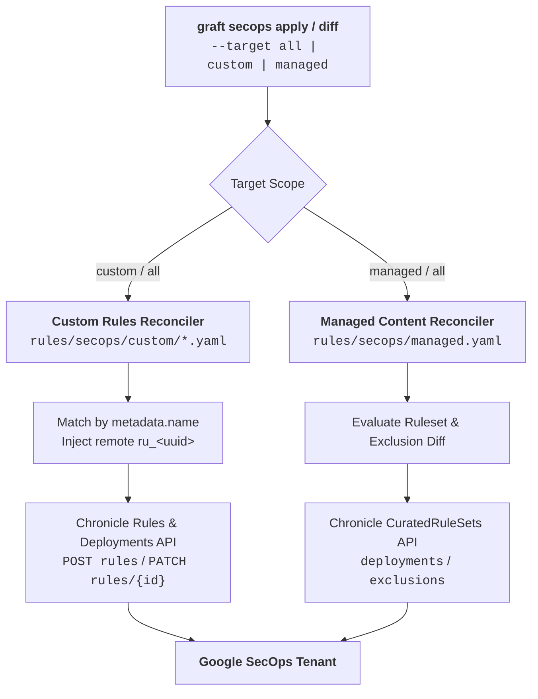

# GitOps Reconciliation & Detection Synchronization

Modern security operations centers rely on both custom organization-owned detections and vendor-managed content (such as Google Cloud Curated Rule Sets). Graft treats all detection artifacts as code under a strict, declarative GitOps reconciliation lifecycle.

---

## 1. Unified Multi-Target Synchronization Model

Graft provides unified synchronization commands for both custom rules and vendor-managed content through the `graft <engine> diff` and `graft <engine> apply` interfaces.



### Supported Scopes (`--target`)
- **`all` (Default):** Reconciles both custom detection rules (`rules/<engine>/custom/`) and vendor-managed content (`rules/<engine>/managed.yaml`).
- **`custom`:** Scopes reconciliation strictly to custom rules owned by your team.
- **`managed`:** Scopes reconciliation strictly to vendor-managed rule sets and exclusions.

---

## 2. Custom Rule Reconciliation Lifecycle

Custom detection rules are authored in 5-block envelope YAML files under `rules/<engine>/custom/`. During reconciliation:

1. **Identity Matching:** Local rules are mapped to tenant rules by `metadata.name` (corresponding to Chronicle `displayName`).
2. **Creations:** Rules declared in Git but absent from the tenant are compiled into YARA-L via `synthesize_yaral_rule` and created via `POST rules`. Their deployment toggles (`enabled`, `alerting`) are set via `PATCH rules/{rule_id}/deployment`.
3. **Updates:** For rules existing in both Git and the tenant:
   - Logic is compared using content-aware comparison (evaluating raw logic and synthesized YARA-L headers).
   - Deployment configuration (`enabled`, `alerting`) is compared against live tenant deployment state.
   - If changes are detected, the remote Chronicle ID (`ru_<uuid>`) is targeted with `PATCH rules/{rule_id}?update_mask=text` and deployment toggles are synchronized.
4. **Untracked Reporting:** Rules existing in the tenant that do not exist in Git are surfaced as `[?] Untracked custom rule on tenant: ...` for situational awareness without destructive auto-deletion.

---

## 3. Vendor-Managed Content Manifest (`rules/<engine>/managed.yaml`)

Vendor-managed content state (Google Cloud Curated Rule Sets) is tracked in a single declarative manifest:

```yaml
version: "1"
engine: "secops"
rulesets:
  - id: "ur_cloud_iam_privilege_escalation"
    name: "Cloud IAM Privilege Escalation"
    category: "Cloud Threats"
    deployment: "PRECISE"
    enabled: true
    alerting: true
    exclusions:
      - id: "ex_backup_service_account"
        name: "Exclude Scheduled Backup SA"
        description: "Prevents alerts from authorized overnight backup automation"
        filter: "principal.user.userid != 'backup-operator@corp-prod.iam.gserviceaccount.com'"
        enabled: true
```

---

## 4. Command Reference & CLI Workflows

### 1. Unified Drift Detection (`graft secops diff`)
Evaluates drift across custom rules and managed content against the live tenant:

```bash
# Compare everything (custom rules + managed manifest)
graft secops diff --env=production

# Compare custom rules only
graft secops diff --target=custom --env=production

# Compare managed manifest only
graft secops diff --target=managed --env=production
```

- **Exit Code 0:** Synchronized. No drift between Git and the tenant.
- **Exit Code 2:** Drift detected. Summary of additions, updates, or untracked rules printed to stdout.
- **Exit Code 1:** Error encountered (network, authentication, or parsing failure).

In CI/CD pull request gates, exit code `2` can be used to notify reviewers of required tenant mutations before merging.

### 2. Unified State Synchronization (`graft secops apply`)
Applies the desired repository state directly to the Google SecOps tenant:

```bash
# Apply everything (custom rules + managed manifest)
graft secops apply --env=production

# Apply custom rules only
graft secops apply --target=custom --env=production

# Apply managed manifest only
graft secops apply --target=managed --env=production
```

### 3. Dedicated Managed Commands (`graft secops managed`)
For granular vendor-managed content operations:

- **Diff:** `graft secops managed diff --env=production`
- **Apply:** `graft secops managed apply --env=production`
- **Pull (Reverse Sync):** Pulls live tenant curated rulesets and active exclusions into the local manifest:
  ```bash
  graft secops managed pull --env=production --out rules/secops/managed.yaml
  ```

