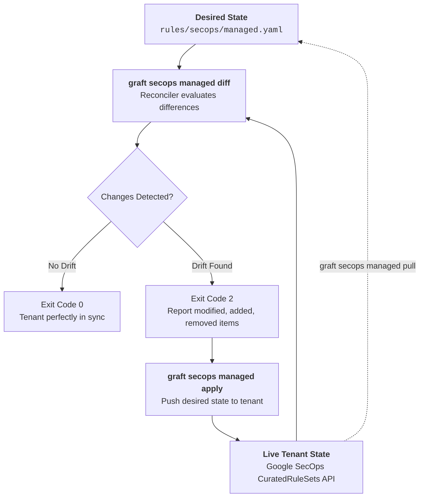

# GitOps Reconciliation & Managed Content Synchronization

Modern security operations centers rely on both custom organization-owned detections and vendor-managed content (such as Google Cloud Curated Rule Sets). Graft treats vendor-managed content as code under a strict GitOps reconciliation lifecycle.

---

## 1. The Single Consolidated Manifest (`rules/<engine>/managed.yaml`)

Rather than maintaining hundreds of sprawling configuration files, all vendor-managed ruleset toggles, precision profiles, and exclusion criteria are version-controlled in a single declarative manifest:

```yaml
version: "1"
engine: "secops"
rulesets:
  - id: "ur_cloud_iam_privilege_escalation"
    name: "Cloud IAM Privilege Escalation"
    category: "Cloud Threats"
    deployment: "PRECISE"
    enabled: true
    alerting: true
    exclusions:
      - id: "ex_backup_service_account"
        name: "Exclude Scheduled Backup SA"
        description: "Prevents alerts from authorized overnight backup automation"
        filter: "principal.user.userid != 'backup-operator@corp-prod.iam.gserviceaccount.com'"
        enabled: true
```

---

## 2. The GitOps Reconciliation Cycle



---

## 3. Command Reference & CLI Workflows

### 1. Drift Detection (`graft secops managed diff`)
Detects differences between the local manifest and the live Google SecOps tenant:

```bash
graft secops managed diff --env=prod
```

- **Exit Code 0:** No drift. Live tenant matches local manifest.
- **Exit Code 2:** Drift detected. Differences in ruleset deployment mode, alerting toggles, or exclusion filters are printed to stdout.
- **Exit Code 1:** Communication or credential failure.

In CI/CD pull request gates, exit code `2` can be used to warn or require approvals before merging content changes.

### 2. Applying Desired State (`graft secops managed apply`)
Orchestrates targeted API updates to align the tenant with the repository manifest:

```bash
graft secops managed apply --env=prod
```

The reconciler executes atomic operations:
1. Reconfigures ruleset deployment state (`PRECISE` vs `BROAD`, `enabled`, `alerting`).
2. Creates newly declared exclusions.
3. Updates modified exclusion filters or descriptions.
4. Deletes exclusions removed from the manifest.
5. Emits structured audit log entries for all tenant modifications.

### 3. Reverse Synchronization (`graft secops managed pull`)
Bootstraps or refreshes the local manifest directly from the live tenant state:

```bash
graft secops managed pull --env=prod --out rules/secops/managed.yaml
```

This command queries all live rulesets and exclusions via the Chronicle API and serializes a clean, formatted YAML manifest.
