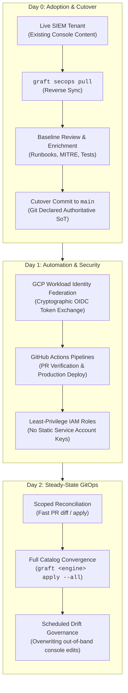

# Platform & SecOps Engineer Track

> **The Operational Guide for Adopting, Deploying, and Maintaining Graft**  
> **Target Audience:** SecOps Engineers, Platform Engineers, Cloud Security Architects, SREs  
> **Core Mission:** Bootstrapping tenants, configuring CI/CD automation, managing GitOps drift, and enforcing zero-trust security.

---

## 1. Overview & Operational Responsibilities

The **Platform & SecOps Engineer** ensures that Graft operates reliably, securely, and authoritatively across the enterprise detection infrastructure. While Detection Engineers focus on authoring and tuning detection logic, the Platform Engineer owns the runtime environment, credentials, synchronization lifecycles, and CI/CD pipelines that bridge Git to live SIEM platforms.

---

## 2. Key Operational Concepts

### 1. Three-Epoch Engine Lifecycle
- **Epoch 1 (Discovery & Reverse Sync):** When bootstrapping an existing SIEM tenant, the SIEM is the temporary initial Source of Truth. Engineers run `graft <engine> pull` to extract live custom rules and managed curated configurations into local YAML artifacts.
- **Epoch 2 (Baseline Enrichment & Validation):** Operators review imported rules, document runbooks, map MITRE ATT&CK techniques, add test vectors, validate via `graft lint`, and commit the baseline to Git.
- **Epoch 3 (Steady-State GitOps):** Git is declared the authoritative Source of Truth. Forward synchronization (`graft <engine> diff/apply`) drives the SIEM. Out-of-band changes made directly in the SIEM console are flagged and healed.

### 2. Reconciliation Modes: Scoped vs. Full Catalog
- **Scoped Reconciliation (Default):** Restricts diffing and deployment strictly to rules and manifests touched in the active Git branch (`HEAD~1` or branch diff). Used in pull request validation to ensure sub-second feedback.
- **Full Catalog Reconciliation (`--all`):** Evaluates every detection rule and managed ruleset across the entire repository against the tenant. Used in mainline deployments and automated cron drift detection to guarantee complete catalog convergence.

### 3. Zero-Trust Security & Identity Federation
- **Zero Static Keys:** Long-lived service account JSON keys are strictly prohibited.
- **Workload Identity Federation (WIF):** GitHub Actions runners exchange short-lived OIDC tokens with Google Cloud STS using strict cryptographic attribute pinning (`assertion.repository == 'lopes/graft'`).
- **Developer Impersonation:** Local developers authenticate via `gcloud auth login` and impersonate a deployment service account using short-lived tokens.

---

## 3. Operations Guide Directory

| Document | Description |
| :--- | :--- |
| **[Engine Adoption & Lifecycle Guide](adoption.md)** | Step-by-step procedure for Day 0 brownfield ingestion (`pull`), baseline enrichment, and declaring Git as the permanent Source of Truth. |
| **[GitOps Reconciliation & Detection Synchronization](gitops_reconciliation.md)** | Deep dive into Scoped vs. Full Catalog reconciliation, zero-cost no-op diffing, untracked rule reporting, and drift remediation. |
| **[CI/CD Automation & Infrastructure](cicd_and_infrastructure.md)** | GitHub Actions pipeline architecture, Workload Identity Federation setup, workflow path filtering, and automated drift monitoring cron jobs. |
| **[Security Architecture & Best Practices](security.md)** | WIF token exchange mechanics, fork isolation defenses, developer impersonation workflows, and Google Cloud audit logging. |
| **[Google SecOps Engine Reference](../../src/graft/engines/secops/README.md)** | Tenant coordinates, environment variables, authentication flags, and API quotas for the Google SecOps adapter. |
