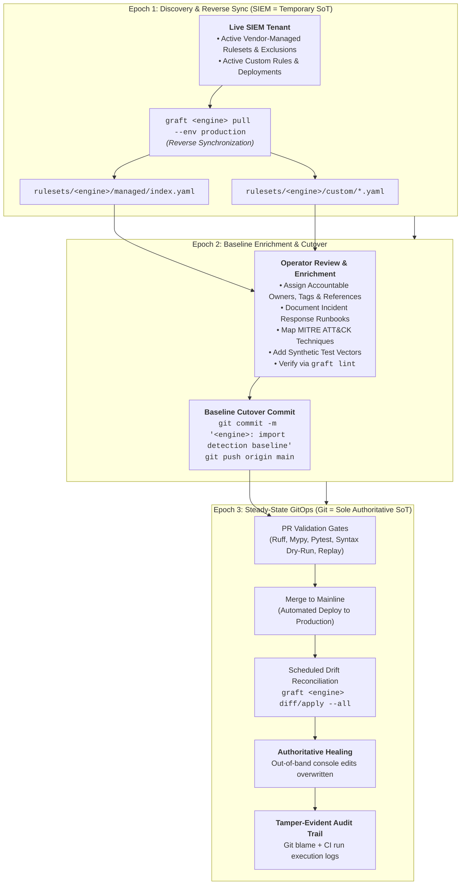
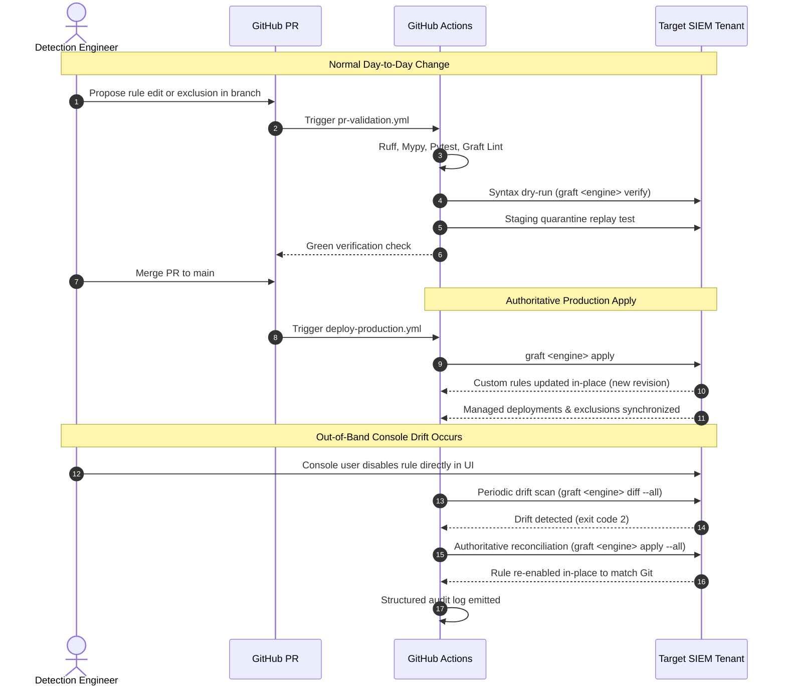

# Engine Adoption & Lifecycle Guide

> **Bootstrapping Detection-as-Code from Live SIEM to Authoritative Source of Truth**  
> **Target Engines:** Google SecOps (Chronicle) & Pluggable SIEM Adapters  
> **Core Concept:** The Brownfield Ingestion, Baseline Enrichment, and Source-of-Truth Cutover Lifecycle

---

## 1. The Brownfield Adoption Challenge

When adopting Detection-as-Code (DaC) in an enterprise, the detection engineering environment is almost never greenfield. The SIEM instance is already live, actively monitoring production telemetry, and populated with:
- **Vendor-Managed Content:** Curated rule sets (e.g., Google Cloud Curated Rule Sets) with operational precision levels (`PRECISE` vs `BROAD`), alert routing, and production tuning exclusions.
- **Custom Detection Rules:** Bespoke organizational detection rules authored directly in the SIEM web console or deployed via legacy scripts.

If an engineering team adopts Graft with an empty repository and immediately declares Git as the authoritative Source of Truth (SoT), running forward synchronization (`graft <engine> apply --all`) would either fail to discover existing rules or risk destructive deletion if automated pruning were enabled.

To solve this, Graft treats an engine's lifecycle not as a static assumption, but as a formal **three-epoch progression**.

---

## 2. The Three-Epoch Engine Lifecycle



---

## 3. Epoch 1: Discovery & Reverse Sync

In Epoch 1, the live SIEM instance is recognized as the **temporary initial Source of Truth**.

### 1. Reverse Synchronization Command

Running `graft <engine> pull` extracts the complete live detection posture from the target tenant (shown below using `secops` as an example):

```bash
# Pull both custom rules and vendor-managed content from production
uv run graft secops pull --env production
```

Alternatively, you can target individual subsystems:

```bash
# Pull custom detection rules only
uv run graft secops pull --target custom --env production --out-dir rulesets/secops/custom

# Pull vendor-managed curated content manifest only
uv run graft secops pull --target managed --env production --out-manifest rulesets/secops/managed/index.yaml

# Opt-in: Pull compatible 1-column STRING Data Tables (originalColumn == "value") into datasets/
uv run graft secops pull --target datasets --env production --out-datasets-dir datasets

# Force overwrite existing local files without confirmation prompts
uv run graft secops pull --env production --force
```

### 2. How Managed Content Is Ingested

When pulling managed content via `ManagedEnginePort.fetch_managed_state()`:
1. Graft queries the engine's vendor-managed ruleset and exclusion APIs.
2. It normalizes category identifiers, deployment states (`enabled`, `alerting`, and engine-specific tiers), and active exclusion filters into a `ManagedState` domain model.
3. It serializes this unified posture into `rulesets/<engine>/managed/index.yaml`, validated against `src/graft/engines/<engine>/schemas/managed.schema.json`.
- **Example (Google SecOps):** Queries Chronicle `curatedRuleSets`, `curatedRuleSetDeployments` (`PRECISE` vs `BROAD`), and `ruleExclusions` (`findingsRefinements`), resolving category UUIDs to display names (e.g., `Cloud Threats`, `Linux Threats`).

### 3. How Custom Rules Are Ingested

When pulling custom rules via `RuleDeployerPort.list_rules()` and `EngineAdapter.deconstruct_rule()`:
1. Graft fetches the active custom rule inventory and deployment states (`enabled`, `alerting`, schedule) from the tenant.
2. The engine adapter's rule deconstructor:
   - Sanitizes rule display names into valid snake_case identifiers matching `^[a-z0-9]+(?:_[a-z0-9]+)*$` (max 64 characters).
   - Normalizes or preserves UUIDs for `metadata.id`.
   - Extracts embedded `id` and `description` metadata while stripping engine-specific wrapper boilerplate so only clean query logic remains in the `logic` block.
   - Leaves `owners: []`, `mitre: {}`, `tags: []`, and `references: []` empty—Graft never guesses operational ownership from legacy inline author strings.
   - **Example (Google SecOps):** [`deconstruct_yaral_rule`](../../src/graft/engines/secops/compiler.py#L59) strips the outer `rule <name> { meta: ... }` wrapper, normalizes `ru_<uuid>` server IDs, and preserves clean YARA-L sections (`events:`, `match:`, `outcome:`, `condition:`).
3. Graft populates default placeholder runbook sections (`context`, `triage`, `response`). Because Graft schemas strictly require non-empty `owners`, `mitre`, `tags`, and `references`, `graft lint` will intentionally flag freshly pulled rules until operators complete Epoch 2 enrichment.
4. Each rule is saved to `rulesets/<engine>/custom/<rule_name>.yaml`. Existing files are protected against accidental overwrites unless `--force` is supplied.

### 4. How Datasets Are Ingested (Opt-In: `--target datasets`)

Because SIEM tenants frequently host large, multi-column CMDB exports or automated threat intelligence feeds that are not managed by Graft, `graft <engine> pull` (`--target all`) intentionally excludes datasets by default.

When an operator explicitly runs `graft <engine> pull --target datasets` (or `graft <engine> datasets pull`):
1. Graft calls `DatasetPort.list_datasets()`, which inspects remote tables and filters strictly for compatible Graft-shaped tables (in Google SecOps: 1-column `STRING` Data Tables whose column is named `value`, with a valid snake_case identifier and `1..1,000` non-empty rows). Incompatible multi-column or oversized tables are skipped with an informational log.
2. Each compatible dataset is written to `datasets/<name>.yaml` with `owners: []`, `tags: []`, and `references: []` ready for Epoch 2 enrichment.

---

## 4. Epoch 2: Baseline Enrichment & Cutover

Imported rules reflect what was running in the SIEM console. However, bare SIEM rules lack accountable ownership metadata, incident response procedures, MITRE ATT&CK taxonomy mappings, and synthetic test vectors.

### 1. Enrichment Checklist

Before committing the baseline to version control, detection engineers review and enrich every pulled envelope so it passes `graft lint`:

- **Ownership, Tags & References:** Assign accountable `owners`, categorical `tags`, and `references` (including any upstream/original author attribution):
  ```yaml
  owners:
    - "Cloud Security Operations"
  tags:
    - "gcp"
    - "iam"
  references:
    - "https://cloud.google.com/iam/docs/creating-managing-service-account-keys"
  ```
- **Runbooks:** Replace default placeholder triage and response playbooks with verified operational steps:
  ```yaml
  runbook:
    context: "Detects unauthorized creation of service account keys in production projects."
    triage: |
      1. Inspect principal email executing the Key creation.
      2. Check whether principal is an authorized Terraform CI/CD pipeline.
      3. Verify project IAM policy binding.
    response: |
      1. Delete unauthorized service account key immediately via gcloud IAM.
      2. Disable compromised user or service account credentials.
  ```
- **MITRE ATT&CK Mappings:** Map tactics and techniques:
  ```yaml
  mitre:
    persistence:
      - "T1098.001"
    privilege-escalation:
      - "T1078.004"
  ```
- **Synthetic Test Vectors (Example: Google SecOps UDM):** Add deterministic test events and expected match counts:
  ```yaml
  tests:
    - id: "match_service_account_key_create"
      description: "Fires when admin_service.CreateServiceAccountKey is invoked"
      expect: 1
      events:
        - timestamp: "2026-09-17T12:00:00Z"
          payload:
            metadata:
              event_type: "USER_RESOURCE_MUTATION"
              product_event_type: "google.iam.admin.v1.CreateServiceAccountKey"
  ```

### 2. Offline Validation

Validate the entire catalog offline against Draft 2020-12 schemas and bundled MITRE ATT&CK data:

```bash
uv run graft lint
```

Ensure all imported custom rules and the managed manifest return `0 errors`.

### 3. The Baseline Cutover Commit

Once validated, commit the baseline to Git:

```bash
git add rulesets/
git commit -m "secops: import initial detection baseline from production tenant"
git push origin main
```

**The Cutover Declaration:** Merging this baseline commit into `main` marks the official cutover point. From this moment onward, **Git is formally declared the sole, authoritative Source of Truth (SoT)**.

---

## 5. Epoch 3: Steady-State GitOps Operations

Once the cutover is complete, the direction of authority permanently reverses: **Git drives the SIEM; the SIEM never drives Git.**



### 1. Drift Governance & Self-Healing Modes

Graft provides two operating modes to manage out-of-band modifications made directly in the SIEM web console:

- **Scoped Reconciliation (Default):**
  Commands like `graft <engine> diff` and `graft <engine> apply` inspect Git diffs (`HEAD~1` or branch diff) and evaluate only rules modified in the current change scope. This keeps daily CI/CD operations fast and lightweight.
- **Full Catalog Reconciliation (`--all`):**
  Running `graft <engine> diff --all` or `graft <engine> apply --all` ignores Git change history and evaluates every single rule and managed deployment against the live tenant:
  - **Drift Discovery:** `graft <engine> diff --all --env production` detects discrepancies and exits with code `2`.
  - **Authoritative Healing:** `graft <engine> apply --all --env production` overwrites any console edits, reconciling the tenant back to the exact version declared in Git.


### 2. Tamper-Evident Audit Trail

Every state change executed by Graft is recorded across two independent audit layers:
1. **Version Control Audit:** Every modification, addition, exclusion, or retirement is backed by a Scoped Commit, reviewer approval, and Git blame history.
2. **Execution Logs:** The CLI emits structured JSON and machine-parseable stdout detailing the exact rule revisions, previous states, and updated states:
   ```json
   {
     "custom": {
       "applied": true,
       "has_changes": true,
       "created": 0,
       "updated": 1
     },
     "managed": {
       "applied": true,
       "has_changes": false
     }
   }
   ```
   In CI/CD pipelines, these logs are retained as immutable build artifacts for compliance and audit requirements.
