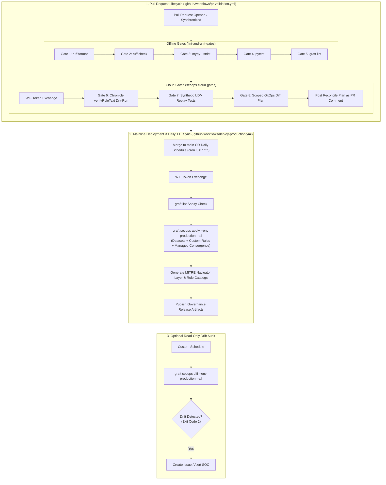

# CI/CD Automation & Infrastructure Guide

> **Automated Detection Delivery, Identity Federation, and Scheduled Drift Remediation**  
> **Target Audience:** Platform Engineers, SecOps Engineers, SREs  
> **CI/CD Platform:** GitHub Actions & Google Cloud Workload Identity Federation (WIF)

---

## 1. Pipeline Architecture & Execution Flow

Graft provides automated continuous integration and continuous deployment pipelines tailored for Detection-as-Code. The pipeline architecture is split into pre-merge pull request validation and post-merge production deployment, supplemented by scheduled drift detection.



---

## 2. Pull Request Validation (`pr-validation.yml`)

The PR validation workflow ensures that no invalid syntax, broken tests, schema non-compliances, or unverified detection logic reaches the `main` branch.

### 1. Offline Gates (`lint-and-unit-gates`)
Runs on standard `ubuntu-latest` without requiring cloud credentials:
- **Gate 1 (Formatting):** `uv run ruff format --check .` enforces uniform style.
- **Gate 2 (Linting):** `uv run ruff check .` verifies code health and catches unused imports or forbidden constructs.
- **Gate 3 (Static Typing):** `uv run mypy --strict src tests` guarantees 100% type safety with zero `Any` leakage.
- **Gate 4 (Unit & Engine Tests):** `uv run pytest` executes all isolated unit tests in sub-seconds.
- **Gate 5 (Rules, Datasets & Schemas):** `uv run graft lint` validates datasets (`datasets/*.yaml`, including `ttl:YYYY-MM-DD` inline comment directives), custom rules (`%<name>.value` cross-references), and managed manifests against Draft 2020-12 schemas and MITRE ATT&CK technique IDs.

### 2. Cloud Gates (`secops-cloud-gates`)
Requires WIF credentials and runs only on trusted internal branches:
- **Gate 6 (Compiler Dry-Run):** `uv run graft secops verify --env staging` invokes Chronicle's `:verifyRuleText` endpoint to ensure YARA-L logic compiles cleanly against the live tenant schema without saving or deploying anything.
- **Gate 7 (Synthetic Replay):** `uv run graft secops test` runs synthetic test fixtures against staging infrastructure (or non-alerting quarantine).
- **Gate 8 (Scoped Reconciliation Diff):** `uv run graft secops diff --env production` computes a Scoped diff of datasets and rules modified in the branch and posts the plan directly to the PR discussion.

---

## 3. Mainline Production Deployment & Daily TTL Sync (`deploy-production.yml`)

When a pull request is merged into `main`—or at `00:00` UTC every day (`schedule: - cron: "0 0 * * *"`)—the deployment workflow executes authoritative forward synchronization:

1. **Full History Checkout:** Checks out with `fetch-depth: 0` so that `src/graft/core/blame.py` can extract accurate Git lifecycle metrics (creation timestamp, last modified timestamp, commit count, and contributor count) to inject into generated catalog metadata.
2. **Offline Sanity Check:** Executes `uv run graft lint` to guarantee repository integrity before touching remote APIs.
3. **WIF Authentication:** Authenticates via GitHub OIDC and assumes the production deployer service account.
4. **Full Catalog Reconciliation:**
   ```bash
   uv run graft secops apply --env production --all
   ```
   Enforces full convergence across reusable datasets (`datasets/*.yaml` and `datasets/_archived/*.yaml`), custom detection rules, and vendor-managed curated content. Running daily at `00:00` UTC guarantees that dataset values whose `ttl:YYYY-MM-DD` expiration date passed the previous UTC day are automatically removed from the SIEM even on days without Git commits, while also healing any out-of-band console drift.
5. **Governance Artifact Generation:**
   ```bash
   mkdir -p exports layers
   uv run graft export matrix --format navigator --out layers/attack_navigator_layer.json
   uv run graft export catalog --format markdown --out exports/ruleset_catalog.md
   uv run graft export catalog --format csv --out exports/ruleset_catalog.csv
   ```
6. **Artifact Archival:** Uploads the generated MITRE ATT&CK Navigator layer and detection catalogs as build artifacts with 90-day retention for compliance auditing.

---

## 4. CI/CD Workflow Path Filtering

To optimize runner efficiency and prevent unnecessary cloud API calls on push/PR events, both workflows enforce strict path filtering:

```yaml
paths:
  - "src/**"
  - "datasets/**"
  - "rulesets/**"
  - "tests/**"
  - "pyproject.toml"
  - "uv.lock"
  - ".github/workflows/deploy-production.yml"
```

### Path Filtering Directives
- **Triggered:** Any commit modifying core platform code (`src/`), reusable datasets (`datasets/`), detection rules (`rulesets/`), test fixtures (`tests/`), dependencies, or workflow definitions triggers full CI/CD execution.
- **Skipped:** Commits modifying exclusively documentation (`docs/`, `*.md`) or static visual assets (`assets/`) intentionally skip workflow execution.

---

## 5. CI/CD Identity Federation & Secrets Architecture

Graft pipelines authenticate to downstream SIEM and cloud APIs using short-lived OpenID Connect (OIDC) federation rather than static API keys or downloaded service account JSON files:

1. **Cryptographic Attribute Pinning:** Configure your cloud or SIEM identity provider (e.g., Google Cloud Workload Identity Federation, AWS IAM OIDC, or Microsoft Entra Workload ID) to trust `https://token.actions.githubusercontent.com` and pin token exchange strictly to your repository claim (`assertion.repository == '<owner>/<repo>'`). Unauthorized forks cannot assume your deployer identity.
2. **Dual-Tenant Staging vs. Production Separation:**
   - **Staging (`GRAFT_<ENGINE>_STAGING_*`):** Used by pull request cloud gates (`graft <engine> verify` and `graft <engine> test`) to validate syntax and run synthetic replay tests in quarantine without polluting production SOC queues.
   - **Production (`GRAFT_<ENGINE>_PROD_*`):** Used by mainline deployment (`graft <engine> apply --env production --all`) and read-only PR diff plans (`graft <engine> diff --env production`).
   - **Single-Tenant Fallback:** When operating a single-tenant sandbox, engines can fall back to `GRAFT_<ENGINE>_PROD_*` coordinates for syntax verification while guarding production from synthetic replay injection.
3. **GitHub Secrets vs. Variables Separation:**
   - **Repository Secrets (`${{ secrets.* }}`):** Store identity federation provider resource paths, deployer service account identifiers, or short-lived token exchange credentials (e.g., `GRAFT_SECOPS_WIF_PROVIDER`, `GRAFT_SECOPS_PROD_SA_EMAIL`).
   - **Repository Variables (`${{ vars.* }}`):** Store non-sensitive tenant routing coordinates (e.g., `GRAFT_<ENGINE>_PROD_*` and `GRAFT_<ENGINE>_STAGING_*`).
4. **Engine-Specific Provisioning Runbooks:**
   - For step-by-step `gcloud` commands to provision Google Cloud Workload Identity Federation, service accounts, and GitHub Actions secrets/variables for Google SecOps, see the **[Google SecOps Engine Setup & Operations Guide](../../src/graft/engines/secops/docs/README.md)**.

---

## 6. Scheduled Drift Governance Workflow

To detect and remediate out-of-band modifications made directly in the SIEM web console, configure a scheduled workflow (e.g., `.github/workflows/drift-reconciliation.yml`):

```yaml
name: Scheduled Drift Governance & Healing

"on":
  schedule:
    # Run nightly at 02:00 UTC
    - cron: "0 2 * * *"
  workflow_dispatch:

permissions:
  contents: read
  id-token: write
  issues: write

jobs:
  detect-and-heal-drift:
    name: Detect & Heal SecOps Tenant Drift
    runs-on: ubuntu-latest
    if: github.repository == 'lopes/graft'
    steps:
      - name: Checkout repository (full history)
        uses: actions/checkout@v7
        with:
          fetch-depth: 0

      - name: Install uv
        uses: astral-sh/setup-uv@v7
        with:
          enable-cache: true

      - name: Set up Python 3.13
        run: uv python install 3.13

      - name: Install dependencies
        run: uv sync --locked

      - name: Authenticate via WIF
        id: auth
        uses: google-github-actions/auth@v3
        with:
          token_format: "access_token"
          workload_identity_provider: ${{ secrets.GRAFT_SECOPS_WIF_PROVIDER }}
          service_account: ${{ secrets.GRAFT_SECOPS_PROD_SA_EMAIL }}

      - name: Scan tenant for out-of-band drift
        id: drift_scan
        env:
          GRAFT_SECOPS_TOKEN: ${{ steps.auth.outputs.access_token }}
          GRAFT_SECOPS_PROD_PROJECT: ${{ vars.GRAFT_SECOPS_PROD_PROJECT }}
          GRAFT_SECOPS_PROD_LOCATION: ${{ vars.GRAFT_SECOPS_PROD_LOCATION }}
          GRAFT_SECOPS_PROD_INSTANCE_ID: ${{ vars.GRAFT_SECOPS_PROD_INSTANCE_ID }}
        run: |
          set +e
          DRIFT_LOG=$(uv run graft secops diff --env production --all 2>&1)
          DRIFT_STATUS=$?
          set -e
          echo "drift_status=${DRIFT_STATUS}" >> "$GITHUB_OUTPUT"
          
          if [ "${DRIFT_STATUS}" -eq 2 ]; then
            echo "::warning::Drift detected between Git and Production SecOps tenant!"
            echo "${DRIFT_LOG}"
          elif [ "${DRIFT_STATUS}" -ne 0 ]; then
            echo "::error::Failed to query tenant drift."
            exit 1
          fi

      - name: Authoritative Self-Healing (Optional)
        if: steps.drift_scan.outputs.drift_status == '2'
        env:
          GRAFT_SECOPS_TOKEN: ${{ steps.auth.outputs.access_token }}
          GRAFT_SECOPS_PROD_PROJECT: ${{ vars.GRAFT_SECOPS_PROD_PROJECT }}
          GRAFT_SECOPS_PROD_LOCATION: ${{ vars.GRAFT_SECOPS_PROD_LOCATION }}
          GRAFT_SECOPS_PROD_INSTANCE_ID: ${{ vars.GRAFT_SECOPS_PROD_INSTANCE_ID }}
        run: |
          echo "Overwriting out-of-band tenant modifications with Git authoritative state..."
          uv run graft secops apply --env production --all
```

---

## 7. Security Directives for Workflow Changes

- **GitHub OAuth Token Scope:** Modifying workflow files under `.github/workflows/` requires the `workflow` OAuth scope when using GitHub CLI (`gh auth refresh -s workflow`).
- **SSH Push Requirement:** If local GitHub CLI tokens lack workflow modification permissions, pushes modifying files under `.github/workflows/` must be executed via SSH (`git push origin <branch>`).
