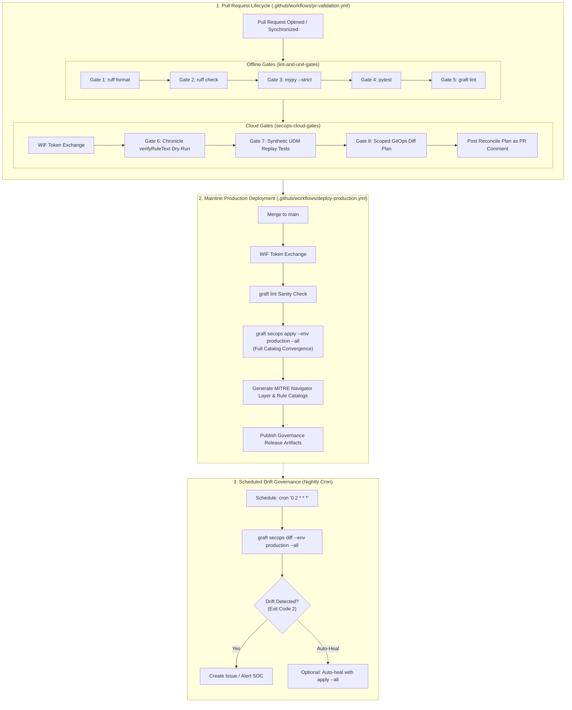

# CI/CD Automation & Infrastructure Guide

> **Automated Detection Delivery, Identity Federation, and Scheduled Drift Remediation**  
> **Target Audience:** Platform Engineers, SecOps Engineers, SREs  
> **CI/CD Platform:** GitHub Actions & Google Cloud Workload Identity Federation (WIF)

---

## 1. Pipeline Architecture & Execution Flow

Graft provides automated continuous integration and continuous deployment pipelines tailored for Detection-as-Code. The pipeline architecture is split into pre-merge pull request validation and post-merge production deployment, supplemented by scheduled drift detection.



---

## 2. Pull Request Validation (`pr-validation.yml`)

The PR validation workflow ensures that no invalid syntax, broken tests, schema non-compliances, or unverified detection logic reaches the `main` branch.

### 1. Offline Gates (`lint-and-unit-gates`)
Runs on standard `ubuntu-latest` without requiring cloud credentials:
- **Gate 1 (Formatting):** `uv run ruff format --check .` enforces uniform style.
- **Gate 2 (Linting):** `uv run ruff check .` verifies code health and catches unused imports or forbidden constructs.
- **Gate 3 (Static Typing):** `uv run mypy --strict src tests` guarantees 100% type safety with zero `Any` leakage.
- **Gate 4 (Unit & Engine Tests):** `uv run pytest` executes all isolated unit tests in sub-seconds.
- **Gate 5 (Rules & Schemas):** `uv run graft lint` validates custom rules and managed manifests against Draft 2020-12 schemas and verifies MITRE ATT&CK technique IDs.

### 2. Cloud Gates (`secops-cloud-gates`)
Requires WIF credentials and runs only on trusted internal branches:
- **Gate 6 (Compiler Dry-Run):** `uv run graft secops verify --env staging` invokes Chronicle's `:verifyRuleText` endpoint to ensure YARA-L logic compiles cleanly against the live tenant schema without saving or deploying anything.
- **Gate 7 (Synthetic Replay):** `uv run graft secops test` runs synthetic test fixtures against staging infrastructure (or non-alerting quarantine).
- **Gate 8 (Scoped Reconciliation Diff):** `uv run graft secops diff --env production` computes a Scoped diff of rules modified in the branch and posts the plan directly to the PR discussion.

---

## 3. Mainline Production Deployment (`deploy-production.yml`)

When a pull request is merged into `main`, the deployment workflow executes authoritative forward synchronization:

1. **Full History Checkout:** Checks out with `fetch-depth: 0` so that `src/graft/core/blame.py` can extract accurate Git lifecycle metrics (creation timestamp, last modified timestamp, commit count, and contributor count) to inject into generated catalog metadata.
2. **Offline Sanity Check:** Executes `uv run graft lint` to guarantee repository integrity before touching remote APIs.
3. **WIF Authentication:** Authenticates via GitHub OIDC and assumes the production deployer service account.
4. **Full Catalog Reconciliation:**
   ```bash
   uv run graft secops apply --env production --all
   ```
   Enforces full convergence across both custom detection rules and vendor-managed curated content, automatically healing any out-of-band console drift.
5. **Governance Artifact Generation:**
   ```bash
   mkdir -p exports layers
   uv run graft export matrix --format navigator --out layers/attack_navigator_layer.json
   uv run graft export catalog --format markdown --out exports/ruleset_catalog.md
   uv run graft export catalog --format csv --out exports/ruleset_catalog.csv
   ```
6. **Artifact Archival:** Uploads the generated MITRE ATT&CK Navigator layer and detection catalogs as build artifacts with 90-day retention for compliance auditing.

---

## 4. CI/CD Workflow Path Filtering

To optimize runner efficiency and prevent unnecessary cloud API calls, both workflows enforce strict path filtering:

```yaml
paths:
  - "src/**"
  - "rulesets/**"
  - "schemas/**"
  - "tests/**"
  - "pyproject.toml"
  - "uv.lock"
  - ".github/workflows/deploy-production.yml"
```

### Path Filtering Directives
- **Triggered:** Any commit modifying core platform code (`src/`), detection rules (`rulesets/`), validation schemas (`schemas/`), test fixtures (`tests/`), dependencies, or workflow definitions triggers full CI/CD execution.
- **Skipped:** Commits modifying exclusively documentation (`docs/`, `*.md`) or static visual assets (`assets/`) intentionally skip workflow execution.

---

## 5. Workload Identity Federation (WIF) Provisioning

Graft pipelines authenticate to Google Cloud without static service account keys. Follow these steps to provision WIF on Google Cloud:

### 1. Set Environment Variables
```bash
export PROJECT_ID="my-gcp-secops-project"
export POOL_NAME="github-actions-pool"
export PROVIDER_NAME="github-actions-provider"
export REPO_SLUG="org/graft"
export SA_NAME="graft-secops-deployer"
```

### 2. Create the Workload Identity Pool
```bash
gcloud iam workload-identity-pools create "${POOL_NAME}" \
  --project="${PROJECT_ID}" \
  --location="global" \
  --display-name="GitHub Actions Pool"
```

### 3. Create the Workload Identity Provider with Attribute Pinning
```bash
gcloud iam workload-identity-pools providers create-oidc "${PROVIDER_NAME}" \
  --project="${PROJECT_ID}" \
  --location="global" \
  --workload-identity-pool="${POOL_NAME}" \
  --display-name="GitHub Actions OIDC Provider" \
  --issuer-uri="https://token.actions.githubusercontent.com" \
  --attribute-mapping="google.subject=assertion.sub,attribute.actor=assertion.actor,attribute.repository=assertion.repository" \
  --attribute-condition="assertion.repository == '${REPO_SLUG}'"
```

> [!IMPORTANT]
> The `--attribute-condition` pins token exchange exclusively to your authoritative repository (`${REPO_SLUG}`). Unauthorized forks cannot assume your service account.

### 4. Create the Automation Service Account & Grant IAM Roles
```bash
# Create the service account
gcloud iam service-accounts create "${SA_NAME}" \
  --project="${PROJECT_ID}" \
  --display-name="Graft Detection CI/CD Deployer"

export SA_EMAIL="${SA_NAME}@${PROJECT_ID}.iam.gserviceaccount.com"

# Grant Chronicle Editor role for rule and curated content management
gcloud projects add-iam-policy-binding "${PROJECT_ID}" \
  --member="serviceAccount:${SA_EMAIL}" \
  --role="roles/chronicle.editor"

# Allow GitHub Actions WIF provider to impersonate the Service Account
export POOL_RESOURCE_ID=$(gcloud iam workload-identity-pools describe "${POOL_NAME}" \
  --project="${PROJECT_ID}" --location="global" --format="value(name)")

gcloud iam service-accounts add-iam-policy-binding "${SA_EMAIL}" \
  --project="${PROJECT_ID}" \
  --role="roles/iam.workloadIdentityUser" \
  --member="principalSet://iam.googleapis.com/${POOL_RESOURCE_ID}/attribute.repository/${REPO_SLUG}"
```

### 5. Configure GitHub Repository Secrets & Variables

In your GitHub repository (**Settings > Secrets and variables > Actions**):

- **Repository Secrets:**
  - `GRAFT_SECOPS_WIF_PROVIDER`: Full resource name of the WIF provider:
    `projects/<project-number>/locations/global/workloadIdentityPools/<pool-name>/providers/<provider-name>`
  - `GRAFT_SECOPS_PROD_SA_EMAIL`: `graft-secops-deployer@<project-id>.iam.gserviceaccount.com`
  - `GRAFT_SECOPS_STAGING_SA_EMAIL`: Service account email for staging replay tests (optional; falls back to prod SA if omitted).
- **Repository Variables:**
  - `GRAFT_SECOPS_PROD_PROJECT`: Google Cloud project ID for production.
  - `GRAFT_SECOPS_PROD_LOCATION`: Chronicle multi-region (e.g., `us`, `europe`).
  - `GRAFT_SECOPS_PROD_INSTANCE_ID`: Chronicle customer/instance GUID.
  - `GRAFT_SECOPS_STAGING_PROJECT`: Staging project ID (for replay tests).
  - `GRAFT_SECOPS_STAGING_LOCATION`: Staging location.
  - `GRAFT_SECOPS_STAGING_INSTANCE_ID`: Staging instance GUID.

---

## 6. Scheduled Drift Governance Workflow

To detect and remediate out-of-band modifications made directly in the SIEM web console, configure a scheduled workflow (e.g., `.github/workflows/drift-reconciliation.yml`):

```yaml
name: Scheduled Drift Governance & Healing

"on":
  schedule:
    # Run nightly at 02:00 UTC
    - cron: "0 2 * * *"
  workflow_dispatch:

permissions:
  contents: read
  id-token: write
  issues: write

jobs:
  detect-and-heal-drift:
    name: Detect & Heal SecOps Tenant Drift
    runs-on: ubuntu-latest
    if: github.repository == 'lopes/graft'
    steps:
      - name: Checkout repository (full history)
        uses: actions/checkout@v4
        with:
          fetch-depth: 0

      - name: Install uv
        uses: astral-sh/setup-uv@v5

      - name: Set up Python 3.13
        run: uv python install 3.13

      - name: Install dependencies
        run: uv sync

      - name: Authenticate via WIF
        id: auth
        uses: google-github-actions/auth@v2
        with:
          token_format: "access_token"
          workload_identity_provider: ${{ secrets.GRAFT_SECOPS_WIF_PROVIDER }}
          service_account: ${{ secrets.GRAFT_SECOPS_PROD_SA_EMAIL }}

      - name: Scan tenant for out-of-band drift
        id: drift_scan
        env:
          GRAFT_SECOPS_TOKEN: ${{ steps.auth.outputs.access_token }}
          GRAFT_SECOPS_PROD_PROJECT: ${{ vars.GRAFT_SECOPS_PROD_PROJECT }}
          GRAFT_SECOPS_PROD_LOCATION: ${{ vars.GRAFT_SECOPS_PROD_LOCATION }}
          GRAFT_SECOPS_PROD_INSTANCE_ID: ${{ vars.GRAFT_SECOPS_PROD_INSTANCE_ID }}
        run: |
          set +e
          DRIFT_LOG=$(uv run graft secops diff --env production --all 2>&1)
          DRIFT_STATUS=$?
          set -e
          echo "drift_status=${DRIFT_STATUS}" >> "$GITHUB_OUTPUT"
          
          if [ "${DRIFT_STATUS}" -eq 2 ]; then
            echo "::warning::Drift detected between Git and Production SecOps tenant!"
            echo "${DRIFT_LOG}"
          elif [ "${DRIFT_STATUS}" -ne 0 ]; then
            echo "::error::Failed to query tenant drift."
            exit 1
          fi

      - name: Authoritative Self-Healing (Optional)
        if: steps.drift_scan.outputs.drift_status == '2'
        env:
          GRAFT_SECOPS_TOKEN: ${{ steps.auth.outputs.access_token }}
          GRAFT_SECOPS_PROD_PROJECT: ${{ vars.GRAFT_SECOPS_PROD_PROJECT }}
          GRAFT_SECOPS_PROD_LOCATION: ${{ vars.GRAFT_SECOPS_PROD_LOCATION }}
          GRAFT_SECOPS_PROD_INSTANCE_ID: ${{ vars.GRAFT_SECOPS_PROD_INSTANCE_ID }}
        run: |
          echo "Overwriting out-of-band tenant modifications with Git authoritative state..."
          uv run graft secops apply --env production --all
```

---

## 7. Security Directives for Workflow Changes

- **GitHub OAuth Token Scope:** Modifying workflow files under `.github/workflows/` requires the `workflow` OAuth scope when using GitHub CLI (`gh auth refresh -s workflow`).
- **SSH Push Requirement:** If local GitHub CLI tokens lack workflow modification permissions, pushes modifying files under `.github/workflows/` must be executed via SSH (`git push origin <branch>`).
