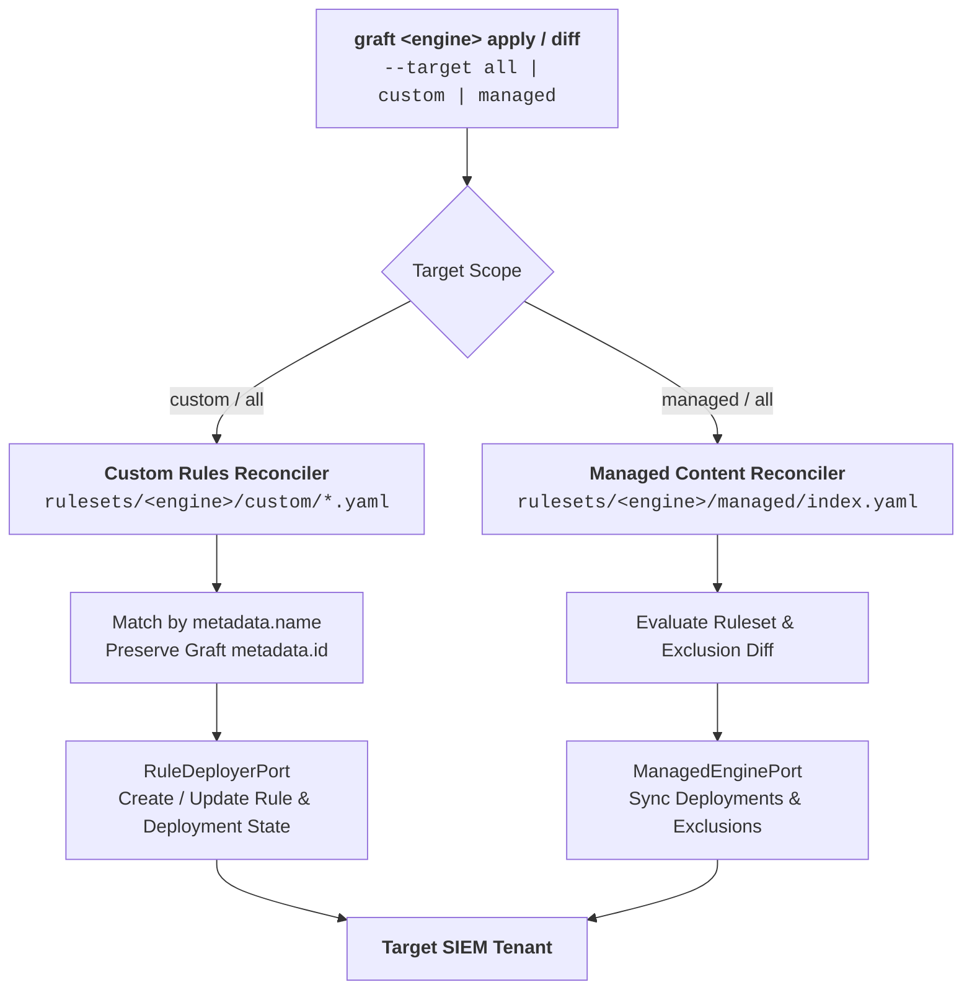
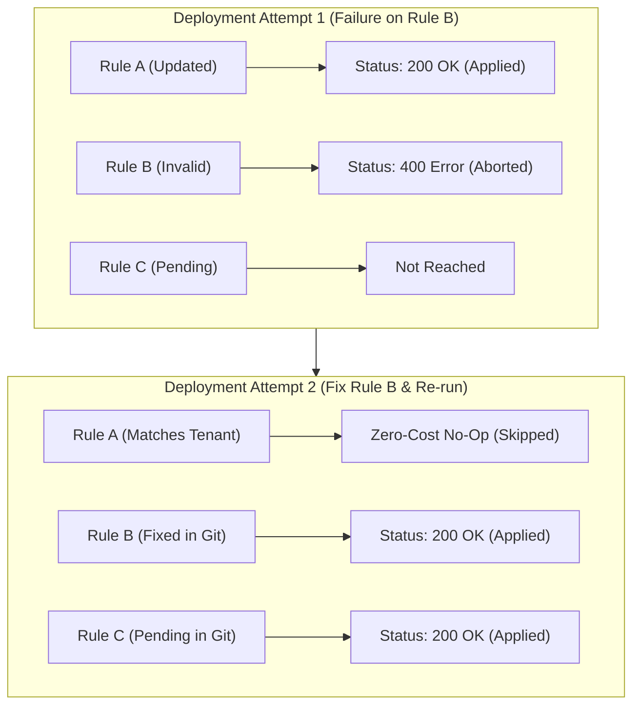

# GitOps Reconciliation & Detection Synchronization

Modern security operations centers rely on both custom organization-owned detections and vendor-managed content (such as Google Cloud Curated Rule Sets). Graft treats all detection artifacts as code under a strict, declarative GitOps reconciliation lifecycle.

---

## 1. Unified Multi-Target Synchronization Model

Graft provides unified synchronization commands for both custom rules and vendor-managed content through the `graft <engine> diff` and `graft <engine> apply` interfaces.



### Supported Scopes (`--target`)
- **`all` (Default):** Reconciles both custom detection rules (`rulesets/<engine>/custom/`) and vendor-managed content (`rulesets/<engine>/managed/index.yaml`).
- **`custom`:** Scopes reconciliation strictly to custom rules owned by your team.
- **`managed`:** Scopes reconciliation strictly to vendor-managed rule sets and exclusions.

---

## 2. Custom Rule Reconciliation Lifecycle

Custom detection rules are authored in 5-block envelope YAML files under `rulesets/<engine>/custom/`. During reconciliation via `GitOpsReconciler` and `RuleDeployerPort`:

1. **Identity Matching:** Local rules are mapped to tenant rules by `metadata.name`.
2. **Creations:** Rules declared in Git but absent from the tenant are compiled into the engine's native format (preserving Graft's `metadata.id`) and created via `RuleDeployerPort.create_rule()`, followed by applying deployment toggles (`enabled`, `alerting`).
3. **Updates:** For rules existing in both Git and the tenant:
   - Logic and metadata are compared using the engine adapter's semantic comparison (`EngineAdapter.are_rules_equal()`), evaluating equivalence and ensuring the remote rule's embedded ID matches Graft's `metadata.id`.
   - Deployment configuration (`enabled`, `alerting`, and engine-specific cadence) is compared against live tenant deployment state.
   - If changes are detected, `RuleDeployerPort.update_rule()` updates the rule in-place on the tenant and synchronizes deployment toggles.
   - **Example (Google SecOps):** Compiles YARA-L via `synthesize_yaral_rule`, compares semantic equivalence via `secops_rule_content_matches`, and resolves the Chronicle resource ID (`ru_<uuid>`) to target `PATCH rules/{resource_id}?update_mask=text` and `PATCH rules/{resource_id}/deployment`.
4. **Untracked Reporting:** Rules existing in the tenant that do not exist in Git are surfaced as `[?] Untracked custom rule on tenant: ...` for situational awareness without destructive auto-deletion.

---

## 3. Vendor-Managed Content Manifest (`rulesets/<engine>/managed/index.yaml`)

Vendor-managed content state is tracked in a single declarative manifest (`rulesets/<engine>/managed/index.yaml`) conforming to `src/graft/engines/<engine>/schemas/managed.schema.json` (while optional registered managed rule envelopes in `rulesets/<engine>/managed/<rule_name>.yaml` provide MITRE ATT&CK coverage and SOC runbooks).

**Example (`rulesets/secops/managed/index.yaml` — Google SecOps Curated Rule Sets):**
```yaml
categories:

  - name: "Cloud Threats"
    id: "dd01e72c-a66c-c11c-9a59-55b02f1b43b1"
    rulesets:
      - id: "ur_cloud_iam_privilege_escalation"
        name: "Cloud IAM Privilege Escalation"
        deployments:
          - type: PRECISE
            enabled: true
            alerting: true
          - type: BROAD
            enabled: false
            alerting: false

exclusions:
  - id: "ex-backup-service-account"
    description: "Prevents alerts from authorized overnight backup automation"
    ruleset_id: "ur_cloud_iam_privilege_escalation"
    expression: 'principal.user.userid = "backup-operator@corp-prod.iam.gserviceaccount.com"'
```

---

## 4. Reconciliation Modes: Scoped vs. Full Catalog

Graft provides two execution modes to balance rapid pull request evaluation with comprehensive tenant self-healing:

| Parameter | Scoped Reconciliation (Default) | Full Catalog Reconciliation (`--all` / `--full`) |
| :--- | :--- | :--- |
| **CLI Flag** | *(No flag, default)* | `--all` or `--full` |
| **Evaluation Scope** | Detection files modified in Git branch / working tree | Every detection rule and ruleset in the entire repository |
| **Use Case** | Local development, feature branches, PR validation gates | Mainline merge to `main`, scheduled cron drift detection |
| **Drift Behavior** | Ignores untouched drifted tenant rules | Identifies out-of-band console edits across entire catalog |
| **Convergence** | Reconciles only touched files | Overwrites console edits and restores Git desired state |

---

## 5. Command Reference & CLI Workflows

### 1. Unified Drift Detection (`graft secops diff`)

Compares repository detection state against the live SecOps tenant:

```bash
# Scoped Reconciliation: Compare only detection files modified in your branch
graft secops diff --env production

# Full Catalog Reconciliation: Scan entire tenant catalog for out-of-band console drift
graft secops diff --all --env production

# Target only custom rules
graft secops diff --target custom --env production

# Target only vendor-managed curated content
graft secops diff --target managed --env production
```

#### Exit Codes
- **`0` (Synchronized):** No drift detected. Git matches the live tenant.
- **`2` (Drift Detected):** Differences exist between Git and the tenant (additions, updates, or untracked rules).
- **`1` (Error):** Execution failed (authentication, network, or invalid configuration).

#### Example Drift Output:
```text
=== Google SecOps Managed Content Diff ===
~ Deployments to update (1):
  [~] Cloud IAM Privilege Escalation [ur_cloud_iam_privilege_escalation] (PRECISE): alerting False -> True
+ Exclusions to create (1):
  [+] ex-backup-service-account -> ur_cloud_iam_privilege_escalation

=== Google SecOps Custom Rules Diff ===
+ Custom rules to create (1):
  [+] gcp_storage_iam_public_access_granted (id=d8a19c42-7f10-4b22-9e55-0192837465ab)
~ Custom rules to update (1):
  [~] workspace_nrd_possible_phishing (id=b1d72370-5fa3-4cb8-a579-22a468d6f101)
? Untracked custom rules in tenant (1):
  [?] legacy_console_rule (id=89a74bc1-1111-2222-3333-444455556666)
```

### 2. Unified State Synchronization (`graft secops apply`)

Applies the desired repository state directly to the Google SecOps tenant:

```bash
# Scoped Reconciliation: Apply only detection files modified in your branch
graft secops apply --env production

# Full Catalog Reconciliation: Enforce full catalog convergence, healing all console drift
graft secops apply --all --env production

# Apply custom rules only
graft secops apply --target custom --env production

# Apply managed manifest only
graft secops apply --target managed --env production
```

#### Zero-Cost No-Op Guarantee
Graft computes an in-memory diff before issuing mutations. If an existing rule's logic and deployment toggles already match Git, Graft skips API write requests, preventing unnecessary rule revision churn in Chronicle.

### 3. Dedicated Managed Commands (`graft secops managed`)

Granular operations for vendor-curated rule sets and exclusions:

```bash
# Compare local managed/index.yaml against tenant Curated Rule Sets
graft secops managed diff --env production

# Apply managed/index.yaml deployments and exclusions to tenant
graft secops managed apply --env production

# Pull live Curated Rule Sets and exclusions into managed/index.yaml
graft secops managed pull --env production --out rulesets/secops/managed/index.yaml
```

### 4. Reverse Synchronization & Brownfield Ingestion (`graft secops pull`)

Extracts the live detection posture from the SIEM tenant into the local repository:

```bash
# Pull both custom rules and vendor-managed manifest from tenant
graft secops pull --env production

# Pull custom rules only into a custom directory
graft secops pull --target custom --env production --out-dir rulesets/secops/custom

# Overwrite existing rule files (default prompts for confirmation)
graft secops pull --target custom --env production --force
```

## 6. Fault Tolerance & Partial Failure Recovery (Idempotent Healing)

A common operational concern in GitOps pipelines is handling partial deployment failures. For example:
- A change modifies three detection rules (`Rule A`, `Rule B`, `Rule C`).
- During `graft secops apply`, `Rule A` successfully deploys to the tenant.
- `Rule B` encounters an unexpected API rejection (e.g., malformed syntax or schema error) and aborts the execution.
- `Rule C` is not reached.

```text
2026-09-29T10:15:30Z [INFO] Updating custom rule 'Rule A' (ru_11111111-1111-1111-1111-111111111111)
2026-09-29T10:15:31Z [INFO] Updating custom rule 'Rule B' (ru_22222222-2222-2222-2222-222222222222)
2026-09-29T10:15:31Z [ERROR] Failed updating custom rule 'Rule B' (ru_22222222-2222-2222-2222-222222222222): SecOps API Error 400 (INVALID_ARGUMENT) on PATCH rules/ru_22222222-2222-2222-2222-222222222222: parsing: error with token: "="
2026-09-29T10:15:31Z [ERROR] Custom rules reconciliation aborted: 1/3 applied ['Rule A'], 1 failed ['Rule B'], 1 pending ['Rule C']
```

Every failure log stream surfaces four diagnostic elements so operators can remediate without inspecting raw HTTP traces:
- **When:** ISO-8601 UTC timestamp (`YYYY-MM-DDTHH:MM:SSZ`) correlating with CI and SIEM audit logs.
- **What:** The specific rule or exclusion identifier (`Rule B`) and attempted operation (`updating custom rule`).
- **Where:** The HTTP status code (`400`), vendor error status (`INVALID_ARGUMENT`), HTTP method, and endpoint path (`PATCH rules/...`). If a two-stage mutation fails on the second step (`PATCH .../deployment`) after the rule or exclusion definition was already written, Graft also emits a `[WARNING]` indicating that the definition was updated on the tenant before the deployment state call failed.
- **Progress:** The abort summary stating what already mutated on the tenant (`1/3 applied ['Rule A']`), what broke (`1 failed ['Rule B']`), and what remains unapplied (`1 pending ['Rule C']`).



### Do Operators Need to Revert or Redo the Whole Batch?
**No. Operators never need to roll back succeeded rules or manually untangle partial deployments.**

Graft's reconciliation architecture is strictly **declarative and idempotent**:
- **Live State Evaluation:** On every run, `graft <engine> apply` queries the live tenant state (`port.list_rules()`, `port.fetch_managed_state()`).
- **Zero-Cost No-Op Skip:** Graft compares the live tenant state against the desired Git state. Because `Rule A` was already successfully applied in Attempt 1, Graft detects that the tenant is already in sync for `Rule A` and **skips it entirely** without issuing redundant API calls or generating audit noise.
- **Targeted Delta Convergence:** Graft identifies that only `Rule B` (now fixed) and `Rule C` (previously unreached) differ from the live tenant, and converges only those remaining delta items.

In production pipelines (`deploy-production.yml`), `graft secops apply --all` guarantees full catalog convergence, automatically self-healing partial deployment states once the blocking error is fixed in Git.

---

## 7. Next Steps & References

For the complete lifecycle guide covering Day 0 discovery, baseline enrichment, and declaring Git as the permanent Source of Truth, see **[Engine Adoption & Lifecycle Guide](adoption.md)**.


