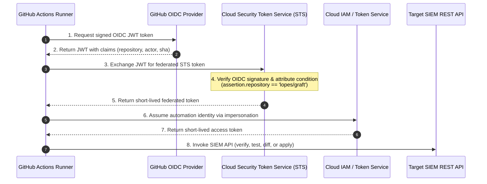
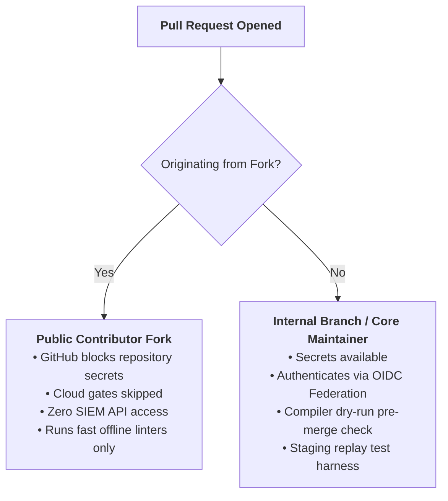
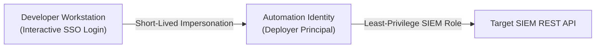

# Security Architecture & Best Practices

> **Operational Security Blueprint for Graft Detection-as-Code**  
> **Guiding Principle:** Zero Static Keys, Cryptographic Identity Federation, and Quarantined Evaluation

---

## 1. Overview & Security Tenets

Graft treats Detection-as-Code (DaC) automation as a privileged operational system. Because detection rules dictate alerts and SOC triage queues, the pipeline must enforce strict security controls:

- **Zero Static Credentials:** No long-lived static API keys or service account private key files (`.json`) are ever downloaded, stored on developer workstations, or uploaded to CI/CD secret stores.
- **Cryptographic Identity Federation:** Headless CI/CD runners authenticate via GitHub Actions OpenID Connect (OIDC) federated token exchange (e.g., Google Cloud Workload Identity Federation).
- **Least-Privilege Authorization:** Automation identities carry only the minimum IAM permissions required for rule verification and synchronization.
- **Quarantined Synthetic Replay:** Replay test fixtures run in dedicated staging infrastructure or under non-alerting quarantine to guarantee zero production triage pollution.
- **Tamper-Evident GitOps Audit Trail:** All dataset changes, rule modifications, status transitions, and vendor-managed exclusions are immutably recorded in Git commits and verified via cloud/SIEM audit logs.

---

## 2. Authentication Architecture: OIDC Identity Federation

Graft enforces short-lived **OpenID Connect (OIDC) Identity Federation** for automated CI/CD pipelines, eliminating long-lived static credentials.

### OIDC Token Exchange Flow



### Cryptographic Attribute Pinning
Cloud OIDC providers must be provisioned with strict attribute conditions pinning token exchange to the repository claim:

```text
assertion.repository == '<owner>/<repo>'
```

This ensures:
- Only workflows running inside the authoritative repository can exchange tokens.
- Even if an attacker learns your identity provider resource path, requests originating from forks or unauthorized repositories are rejected by the cloud Security Token Service at the cryptographic level.

---

## 3. Fork Security & Public Repository Isolation

When operating Graft as an open-source or public repository, external contributors will fork the codebase and open pull requests. Graft enforces strict boundary isolation:



### Built-in Defenses
1. **GitHub Secrets Masking:** Pull requests originating from forks do not have access to repository secrets.
2. **Workflow Guard:** The cloud verification job explicitly declares:
   ```yaml
   if: github.event.pull_request.head.repo.full_name == github.repository
   ```
   External PRs automatically skip cloud interactions and execute only offline quality gates (`ruff`, `mypy`, `pytest`, `graft lint`).
3. **Read-Only PR Gates:** Even on internal branches, PR gates perform only read-only syntax dry runs (`graft <engine> verify`), scoped diff plans (`graft <engine> diff`), or quarantined staging replay tests (`graft <engine> test`). Live production rule changes are applied exclusively upon merge to `main`.

---

## 4. Local Developer Identity & Impersonation

Local engineers never possess static private keys. Instead, engine adapters resolve short-lived tokens on demand by impersonating the automation identity via the platform CLI or accepting an ephemeral bearer token override (`GRAFT_<ENGINE>_TOKEN`):



For Google SecOps (`secops`) local `gcloud` impersonation setup and token fallback options, see **[Authentication Architecture in the Google SecOps Guide](../../src/graft/engines/secops/docs/README.md#6-authentication-architecture-github-actions-cicd-vs-local-workstation)**.

---

## 5. Least-Privilege IAM Model

Graft separates privileges across three distinct principal tiers:

| Principal Tier | Scope | Responsibility & Justification |
| :--- | :--- | :--- |
| **Automation Identity** | SIEM Tenant / Project level | Granted least-privilege editor permissions on the target SIEM (e.g., `roles/chronicle.editor` in Google SecOps) to verify rule syntax, synchronize datasets and custom rules, and manage vendor-curated deployments and exclusions. |
| **Local Developer** | Automation Identity level | Granted token-creator / impersonation rights on the automation identity (never direct SIEM admin rights on personal accounts), ensuring all actions are auditable and short-lived. |
| **CI/CD OIDC Principal** | Automation Identity level | Authorizes the repository-pinned OIDC federation principal to assume the automation identity during CI/CD runs. |

---

## 6. Secrets & Environment Isolation

Graft enforces strict separation between core settings, engine credentials, sensitive secrets, and non-sensitive variables:

- **Local Workstations (`.env` and `src/graft/engines/<engine>/.env`):**
  - Both root `.env` (core platform settings, templated in [`.env.example`](../../.env.example)) and engine-scoped `src/graft/engines/<engine>/.env` files (engine credentials, templated in `src/graft/engines/<engine>/.env.example`) are strictly listed in `.gitignore`.
  - At CLI startup, `load_env_file()` loads root `.env` and `src/graft/engines/*/.env` without overriding variables already exported in the process environment.
  - Graft's test suite includes an automated test fixture (`_isolate_local_env_file` in `tests/conftest.py`) guaranteeing developer `.env` files never contaminate offline unit test runs.
- **GitHub Repository Settings:**
  - **Secrets (`${{ secrets.* }}`):** Sensitive identifiers whose disclosure facilitates enumeration (federation provider paths, service account emails, or tokens).
  - **Variables (`${{ vars.* }}`):** Non-sensitive tenant routing coordinates (`GRAFT_<ENGINE>_PROD_*`, `GRAFT_<ENGINE>_STAGING_*`).

---

## 7. Audit Logging & Telemetry Monitoring

To detect unauthorized drift, compromised credentials, or anomalous deployments, monitor audit logs across both your cloud/SIEM provider and Graft's CLI output:

### Cloud & SIEM Audit Logs
Every OIDC token exchange, service account impersonation event, and SIEM API mutation (dataset updates, rule creations/updates, and managed exclusions) is recorded in your cloud provider's audit log stream. For ready-to-use Google Cloud Audit Logging queries covering Google SecOps, see **[Section 12 of the Google SecOps Guide](../../src/graft/engines/secops/docs/README.md#12-google-cloud-audit-logging--security-telemetry)**.

### Graft Platform Logging
Graft provides structured console and diagnostic logging:
- Configured via `GRAFT_LOG_LEVEL=DEBUG|INFO|WARNING|ERROR` (or `--verbose` for `DEBUG`).
- Emits UTC ISO-8601 timestamps (`YYYY-MM-DDTHH:MM:SSZ`) for direct correlation with SIEM and CI audit trails.
- CLI commands support `--json` output for automated piping into security telemetry pipelines.
- Replay test runs enforce a strict production tenant guard, refusing to inject synthetic events when staging coordinates are missing or match production.
