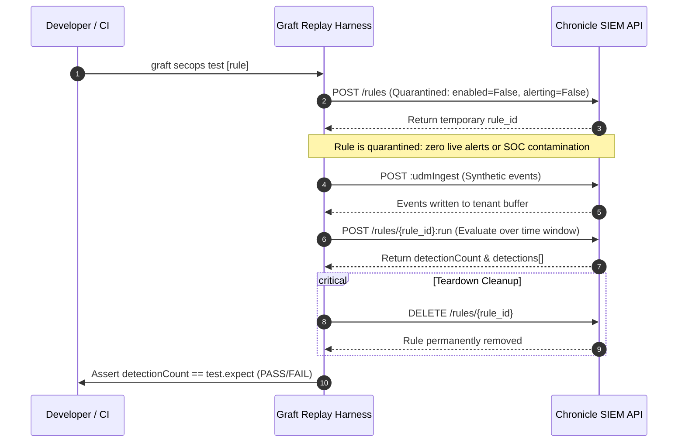

# Synthetic Replay Testing & Quarantine Harness

Static syntax linting validates YARA-L structure, but cannot verify whether complex regex expressions, multi-event time windows, or outcome calculations match true attack patterns. Graft solves this with an automated **Synthetic Replay Harness**.

---

## 1. The Replay Testing Lifecycle

When `graft secops test` is executed, the harness deploys a temporary quarantine rule, ingests synthetic UDM events, triggers an ad-hoc evaluation, asserts the detection count, and guarantees cleanup.



---

## 2. Quarantine Safeguards & Production Isolation

To prevent synthetic testing from contaminating production alert queues or skewing SOC metrics, the replay adapter applies three layers of protection:

1. **Explicit Quarantine Configuration:**
   - Temporary rule name: `graft_test_<test_id>_<uuid>`.
   - `alerting = False`: Rule matches never trigger notification pipelines, webhooks, or SOC incident creation.
   - `enabled = False`: Rule never runs continuously against live streaming event queues.
2. **Evaluation via `:run` Endpoint:**
   - Ad-hoc evaluation runs strictly over the bounding timestamp window defined by the synthetic test events.
3. **Guaranteed `finally` Cleanup:**
   - Rule deletion is wrapped in a Python `finally:` block. Even if the evaluation API returns an error or times out, the temporary rule is purged.

---

## 3. Environment Topologies: Staging vs. Single-Tenant Lab

### Multi-Tenant Enterprise Topology (Recommended)
Staging and Production point to two physically separate Google SecOps customer instances:
- `GRAFT_SECOPS_STAGING_*`: Used for replay testing and pre-merge compiler verification.
- `GRAFT_SECOPS_PROD_*`: Production operational environment.

### Single-Tenant Lab Mode
In personal research labs or sandbox environments where maintaining two separate SIEM instances is cost-prohibitive, Graft allows staging and production to share a single physical instance coordinates:

```bash
export GRAFT_SECOPS_PROJECT="my-lab-project"
export GRAFT_SECOPS_LOCATION="us"
export GRAFT_SECOPS_INSTANCE_ID="11111111-2222-3333-4444-555555555555"
```

When Graft detects that staging and production resolve to the same instance path, it emits an advisory notice and safely conducts tests using the quarantined non-alerting harness:

```text
[WARNING] Single-tenant mode: Replay tests running in shared instance 'projects/my-lab-project/locations/us/instances/...'. Rules will be executed in non-alerting quarantine mode.
```

---

## 4. Graceful Degradation in Local & CI Environments

Developers without Google Cloud credentials or working offline must not be blocked from running local test suites. Graft enforces a strict graceful degradation contract:

| Scenario | CLI Invocation | Exit Code | Output Behavior |
| :--- | :--- | :---: | :--- |
| **No tests defined** | `graft secops test` | `0` | Skipped silently. |
| **Tests defined, no staging creds** | `graft secops test` | `0` | `[WARNING] Skipping replay tests: Staging SecOps tenant is not configured.` |
| **Strict CI Gate** | `graft secops test --require-staging` | `1` | `[ERROR] Staging credentials missing under --require-staging.` |
| **All assertions match** | `graft secops test` | `0` | `[PASS] rule_name :: test_id: Passed` |
| **Detection count mismatch** | `graft secops test` | `1` | `[FAIL] rule_name :: test_id: Expected 1, got 0` |
