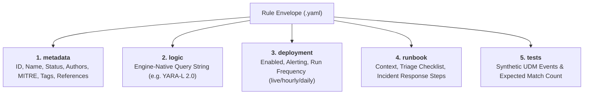

# Detection Rule Authoring Guide

Graft standardizes all custom detection engineering around a declarative **5-Block Envelope** YAML format. Every rule file combines detection logic with metadata, deployment settings, operational runbooks, and synthetic replay test vectors in a single reviewable unit.

---

## 1. The 5-Block Envelope Structure



### Block 1: `metadata`
Core identification, lifecycle status, and threat taxonomy mapping.

- `id` *(UUID string, required)*: Globally unique identifier (v4 UUID format).
- `name` *(string, required)*: Unique snake_case rule identifier (`^[a-z0-9_]+$`, max 64 chars).
- `description` *(string, required)*: Plain-text explanation of the detection objective (max 128 chars).
- `status` *(string, required)*: Lifecycle state (`testing`, `production`, `deprecated`).
- `authors` *(list of strings, optional)*: Rule authors and engineering teams.
- `mitre` *(mapping of tactic to techniques, optional)*: MITRE ATT&CK Enterprise taxonomy mapping. Must use valid lowercase tactic names (`initial_access`, `execution`, `persistence`, etc.) and real technique IDs (`T1566.002`, `T1098.001`). Validated against pre-indexed matrix during linting.
- `tags` *(list of strings, optional)*: Categorical labels (e.g., `google_workspace`, `gcp`, `phishing`).
- `references` *(list of strings, optional)*: Canonical URLs to threat research, documentation, or blog posts.

### Block 2: `logic`
Engine-native query logic. For Google SecOps, this contains YARA-L 2.0 sections (`events:`, `match:`, `outcome:`, `condition:`). Graft automatically synthesizes the `rule <name> { meta: ... }` wrapper when sending to Chronicle APIs.

### Block 3: `deployment`
Operational controls governing how the rule runs in the target engine.

- `enabled` *(boolean, required)*: Whether the rule is actively executing against telemetry.
- `alerting` *(boolean, required)*: Whether matches produce SOC alerts or silent detections.
- `run_frequency` *(string, required)*: Execution cadence (`live`, `hourly`, `daily`, `unspecified`).

### Block 4: `runbook`
Actionable documentation embedded directly alongside detection logic.

- `context` *(string, required)*: Background on the attack technique, adversary objectives, and false positive considerations.
- `triage` *(string, required)*: Step-by-step checklist for the SOC analyst to investigate alerts.
- `response` *(string, required)*: Remediation and containment procedures if malicious activity is confirmed.

### Block 5: `tests`
Synthetic replay test fixtures for automated validation.

- `id` *(string, required)*: Unique test vector identifier (`^[a-z0-9_]+$`).
- `description` *(string, required)*: Objective of this test case.
- `expect` *(integer, required)*: Expected number of detection matches (e.g., `1` for positive tests, `0` for negative tests).
- `events` *(list of objects, required)*: Synthetic event payloads with `timestamp` (ISO 8601) and engine-native event `payload` (e.g. UDM JSON).

---

## 2. Reference Rule Example (Google Workspace)

Below is an authentic reference rule implemented in [`rules/secops/custom/workspace_nrd_possible_phishing.yaml`](file:///usr/local/google/home/joelopes/Projects/graft/rules/secops/custom/workspace_nrd_possible_phishing.yaml):

```yaml
metadata:
  id: "b1d72370-5fa3-4cb8-a579-22a468d6f101"
  name: "workspace_nrd_possible_phishing"
  description: "Detects a user opening an email from a newly registered domain (created < 7 days ago), which may indicate a phishing attempt."
  status: "production"
  authors:
    - "Joe Lopes <lopes.id>"
    - "Detection Engineering"
  mitre:
    initial_access:
      - "T1566.002"
  tags:
    - "google_workspace"
    - "email"
    - "nrd"
    - "phishing"
    - "whois"
  references:
    - "https://lopes.id/log/high-fidelity-nrd-detections/"
    - "https://support.google.com/a/answer/12384955"
    - "https://attack.mitre.org/techniques/T1566/002/"

logic: |
  events:
    $mail.metadata.event_type = "EMAIL_TRANSACTION"
    $mail.metadata.product_event_type = "2"
    strings.extract_domain($mail.network.email.from) = $domain

    $whois.graph.entity.domain.name = $domain
    $whois.graph.metadata.entity_type = "DOMAIN_NAME"
    $whois.graph.metadata.vendor_name = "WHOIS"
    $whois.graph.metadata.product_name = "WHOISXMLAPI Simple Whois"
    $whois.graph.metadata.source_type = "GLOBAL_CONTEXT"
    $whois.graph.entity.domain.creation_time.seconds > 0

    // domain was created in the last 7 days: 7 * 24 * 60 * 60 = 604800 seconds
    604800 > timestamp.current_seconds() - $whois.graph.entity.domain.creation_time.seconds

  match:
    $domain over 1h

  outcome:
    $risk_score = 65
    $created_at = array_distinct(timestamp.get_date($whois.graph.entity.domain.creation_time.seconds))
    $sender = array_distinct($mail.network.email.from)
    $recipients = array_distinct($mail.network.email.to)
    $num_messages = count($mail.network.email.mail_id)

  condition:
    $mail and $whois

deployment:
  enabled: true
  alerting: true
  run_frequency: "live"

runbook:
  context: |
    Adversaries frequently register new domains and immediately weaponize them in
    spear-phishing campaigns before reputation feeds and web categorization tools
    index them. Correlating Google Workspace message open events with domain
    registration timestamps isolates zero-day phishing infrastructure.
  triage: |
    1. Identify recipient user account and workstation coordinates.
    2. Review email subject, sender domain WHOIS registrar, and message attachments.
    3. Check if recipient clicked any hyperlinks or submitted credentials.
    4. Search email transaction logs across the organization for other recipients of the same domain.
  response: |
    1. Quarantine the suspicious message across all Workspace inboxes.
    2. Add the sender domain to global perimeter and email blocklists.
    3. If credentials were provided or malicious payload downloaded, initiate host containment and session revocation.

tests:
  - id: "match_opened_nrd_email"
    description: "Triggers when a user opens an email originating from a newly registered domain"
    expect: 1
    events:
      - timestamp: "2026-09-17T14:00:00Z"
        payload:
          metadata:
            event_type: "EMAIL_TRANSACTION"
            product_event_type: "2"
          network:
            email:
              from: "security-update@login-verify-account.top"
              to:
                - "employee@corp.example.com"
              mail_id: "msg-workspace-98214"
      - timestamp: "2026-09-17T14:00:05Z"
        payload:
          graph:
            metadata:
              entity_type: "DOMAIN_NAME"
              vendor_name: "WHOIS"
              product_name: "WHOISXMLAPI Simple Whois"
              source_type: "GLOBAL_CONTEXT"
            entity:
              domain:
                name: "login-verify-account.top"
                creation_time:
                  seconds: 1773700000

  - id: "ignore_standard_unopened_email"
    description: "Verifies no alert triggers when email is received but not opened"
    expect: 0
    events:
      - timestamp: "2026-09-17T14:10:00Z"
        payload:
          metadata:
            event_type: "EMAIL_TRANSACTION"
            product_event_type: "1"
          network:
            email:
              from: "newsletter@trusted-vendor.com"
              to:
                - "employee@corp.example.com"
              mail_id: "msg-workspace-98215"
```

---

## 3. Scaffolding & Offline Validation

### Scaffolding a New Rule
Use `graft new rule` to generate an empty rule file conforming to the engine's schema:

```bash
graft new rule gcp_cloud_storage_public_bucket --engine secops
```

### Validating Rules Offline
Graft's linter validates JSON Schema constraints and verifies MITRE techniques against the bundled ATT&CK matrix in milliseconds without network calls:

```bash
# Lint specific rule
graft lint rules/secops/custom/workspace_nrd_possible_phishing.yaml

# Lint entire repository
graft lint

# Output structured JSON for CI
graft --json lint
```
