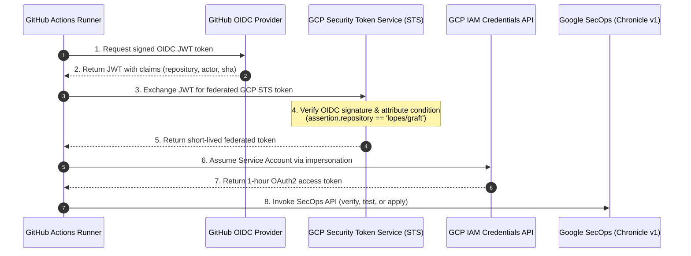
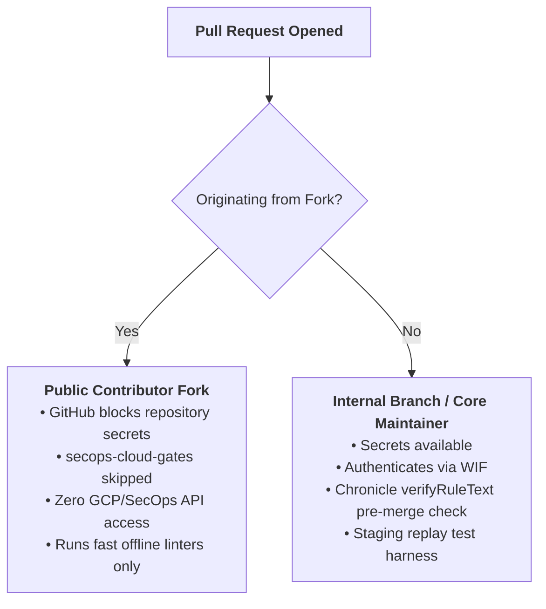
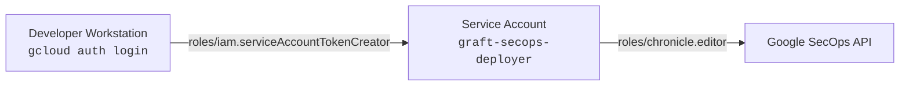

# Security Architecture & Best Practices

> **Operational Security Blueprint for Graft Detection-as-Code**  
> **Guiding Principle:** Zero Static Keys, Cryptographic Identity Federation, and Quarantined Evaluation

---

## 1. Overview & Security Tenets

Graft treats Detection-as-Code (DaC) automation as a privileged operational system. Because detection rules dictate alerts and SOC triage queues, the pipeline must enforce strict security controls:

- **Zero Static Credentials:** No Service Account private keys (`.json`) are ever downloaded, stored on developer workstations, or uploaded to CI/CD secret stores.
- **Cryptographic Identity Federation:** Headless CI/CD runners authenticate via GitHub Actions OpenID Connect (OIDC) and Google Cloud Workload Identity Federation (WIF).
- **Least-Privilege Authorization:** Automation identities carry only the minimum IAM permissions required for rule verification and synchronization.
- **Quarantined Synthetic Replay:** Replay test fixtures run in dedicated staging infrastructure or under non-alerting quarantine to guarantee zero production triage pollution.
- **Tamper-Evident GitOps Audit Trail:** All rule changes, status transitions, and vendor-managed exclusions are immutably recorded in Git commits and verified via Google Cloud Audit Logs.

---

## 2. Authentication Architecture: Workload Identity Federation (WIF)

Graft strictly implements **Google Cloud Workload Identity Federation** for automated CI/CD pipelines, eliminating long-lived static service account keys.

### OIDC Token Exchange Flow



### Cryptographic Attribute Pinning
Graft provisions the WIF provider with strict attribute conditions:

```bash
--attribute-condition="assertion.repository == '${REPO_SLUG}'"
```

This ensures:
- Only workflows running inside the authoritative repository (`lopes/graft`) can exchange tokens.
- Even if an attacker learns your WIF provider resource path, requests originating from forks or unauthorized repositories are rejected by Google Cloud STS at the cryptographic level.

---

## 3. Fork Security & Public Repository Isolation

When operating Graft as an open-source or public repository, external contributors will fork the codebase and open pull requests. Graft enforces strict boundary isolation:



### Built-in Defenses
1. **GitHub Secrets Masking:** Pull requests originating from forks do not have access to repository secrets (`GRAFT_SECOPS_WIF_PROVIDER`, `GRAFT_SECOPS_PROD_SA_EMAIL`).
2. **Workflow Guard:** The cloud verification job explicitly declares:
   ```yaml
   if: ${{ secrets.GRAFT_SECOPS_WIF_PROVIDER != '' }}
   ```
   External PRs automatically skip cloud interactions and execute only offline quality gates (`ruff`, `mypy`, `pytest`, `graft lint`).
3. **Read-Only PR Gates:** Even on internal branches, PR gates perform only read-only syntax dry runs (`verifyRuleText`) or ephemeral test quarantine. Live rule changes are applied exclusively upon merge to `main`.

---

## 4. Local Developer Identity & SA Impersonation

Local engineers never possess private keys. Authentication relies on Google Cloud SDK user impersonation:



### Local Setup
1. Developer logs in with their Google Cloud identity:
   ```bash
   gcloud auth login
   ```
2. The developer account is granted token creator permissions on the deployment service account:
   ```bash
   gcloud iam service-accounts add-iam-policy-binding "${SA_EMAIL}" \
     --project="${PROJECT_ID}" \
     --member="user:$(gcloud config get-value account)" \
     --role="roles/iam.serviceAccountTokenCreator"
   ```
3. When `graft` runs locally, `src/graft/engines/secops/auth.py` automatically invokes `gcloud auth print-access-token --impersonate-service-account=...` to generate short-lived credentials.

---

## 5. Least-Privilege IAM Roles

Graft restricts permissions to the minimum necessary scope:

| Identity | Granted IAM Role | Scope | Justification |
| :--- | :--- | :--- | :--- |
| **Automation SA** (`graft-secops-deployer`) | `roles/chronicle.editor` | Project level | Required to verify rule syntax, manage custom rules, and configure curated ruleset exclusions. |
| **Local Developer** | `roles/iam.serviceAccountTokenCreator` | Service Account level | Allows short-lived token generation without granting project-wide editor rights to the developer's personal account. |
| **GitHub Actions OIDC** | `roles/iam.workloadIdentityUser` | Service Account level | Authorizes the federated WIF principal to impersonate the automation SA. |

---

## 6. Secrets & Environment Isolation

Graft enforces strict separation between sensitive secrets, public variables, and local configurations:

- **Local Workstations (`.env`):**
  - Strictly listed in `.gitignore`.
  - Graft's test suite includes an automated test fixture (`_isolate_local_env_file` in `tests/conftest.py`) guaranteeing developer `.env` files never contaminate offline unit test runs.
- **GitHub Repository Settings:**
  - **Secrets (`${{ secrets.* }}`):** Sensitive identifiers whose disclosure facilitates enumeration (`GRAFT_SECOPS_WIF_PROVIDER`, `GRAFT_SECOPS_PROD_SA_EMAIL`).
  - **Variables (`${{ vars.* }}`):** Non-sensitive tenant coordinates (`GRAFT_SECOPS_PROD_PROJECT`, `GRAFT_SECOPS_PROD_LOCATION`, `GRAFT_SECOPS_PROD_INSTANCE_ID`).

---

## 7. Audit Logging & Telemetry Monitoring

To detect unauthorized drift, compromised credentials, or anomalous deployments, monitor audit logs across both Google Cloud and GitHub:

### Google Cloud Audit Logs
Every WIF token exchange and Chronicle API call generates an immutable Cloud Audit Log entry in Google Cloud Logging:

```text
# Query WIF token exchanges in Cloud Logging:
protoPayload.serviceName="iamcredentials.googleapis.com"
protoPayload.methodName="GenerateAccessToken"
protoPayload.authenticationInfo.principalEmail=~"graft-secops-deployer"
```

```text
# Query Chronicle rule modifications in Cloud Logging:
protoPayload.serviceName="chronicle.googleapis.com"
protoPayload.methodName=~"CreateRule|UpdateRule|DeleteRule|ApplyManaged"
```

### Graft Platform Logging
Graft provides structured console and file logging:
- Configured via `GRAFT_LOG_LEVEL=DEBUG|INFO|WARNING|ERROR`.
- CLI commands support `--json` output for automated piping into security telemetry pipelines.
- Replay test runs issue structured warnings whenever single-tenant shared environments are targeted, preventing unmonitored alert generation.
